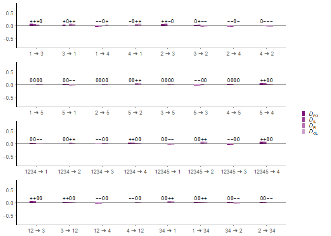
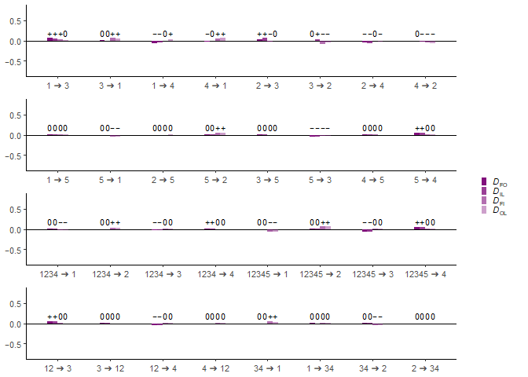

Running the $D$<sub>FOIL</sub>-statistics
================
Kalle Leppälä

## Computing the $D_\text{FOIL}$-statistics on the 1,000,000 pattern data set

Using the simulated created in [S_big.md](S_big.md) with 1,000,000
independent allelic patterns on 32 admixture scenarios in tree $S$, we
calculate a data frame of $D_\text{FOIL}$-statistics (Pease and Hahn
2015). Note that because they matter for the $\Delta$-statistics, we
exceptionally include the scenarios $1 \rightarrow 5$,
$2 \rightarrow 5$, $3 \rightarrow 5$ and $4 \rightarrow 5$ even though
they’re expected to produce a zero signal.

``` r
load(file = "S_big.RData")
event <- character(0)
statistic <- character(0)
value <- numeric(0)
zvalue <- numeric(0)
sign <- numeric(0)
ci <- numeric(0)

# 1 -> 3
table <- tables[[1]]
event <- c(event, rep("1 \u2794 3", 4))
statistic <- c(statistic, "DFO", "DIL", "DFI", "DOL")
value <- c(value, DFO(table)[[1]], DIL(table)[[1]], DFI(table)[[1]], DOL(table)[[1]])
zvalue <- c(zvalue, DFO(table)[[2]], DIL(table)[[2]], DFI(table)[[2]], DOL(table)[[2]])
sign <- c(sign, DFO(table)[[3]], DIL(table)[[3]], DFI(table)[[3]], DOL(table)[[3]])
ci <- c(ci, DFO(table)[[4]], DIL(table)[[4]], DFI(table)[[4]], DOL(table)[[4]])
# 3 -> 1
table <- tables[[2]]
event <- c(event, rep("3 \u2794 1", 4))
statistic <- c(statistic, "DFO", "DIL", "DFI", "DOL")
value <- c(value, DFO(table)[[1]], DIL(table)[[1]], DFI(table)[[1]], DOL(table)[[1]])
zvalue <- c(zvalue, DFO(table)[[2]], DIL(table)[[2]], DFI(table)[[2]], DOL(table)[[2]])
sign <- c(sign, DFO(table)[[3]], DIL(table)[[3]], DFI(table)[[3]], DOL(table)[[3]])
ci <- c(ci, DFO(table)[[4]], DIL(table)[[4]], DFI(table)[[4]], DOL(table)[[4]])
# 1 -> 4
table <- tables[[3]]
event <- c(event, rep("1 \u2794 4", 4))
statistic <- c(statistic, "DFO", "DIL", "DFI", "DOL")
value <- c(value, DFO(table)[[1]], DIL(table)[[1]], DFI(table)[[1]], DOL(table)[[1]])
zvalue <- c(zvalue, DFO(table)[[2]], DIL(table)[[2]], DFI(table)[[2]], DOL(table)[[2]])
sign <- c(sign, DFO(table)[[3]], DIL(table)[[3]], DFI(table)[[3]], DOL(table)[[3]])
ci <- c(ci, DFO(table)[[4]], DIL(table)[[4]], DFI(table)[[4]], DOL(table)[[4]])
# 4 -> 1
table <- tables[[4]]
event <- c(event, rep("4 \u2794 1", 4))
statistic <- c(statistic, "DFO", "DIL", "DFI", "DOL")
value <- c(value, DFO(table)[[1]], DIL(table)[[1]], DFI(table)[[1]], DOL(table)[[1]])
zvalue <- c(zvalue, DFO(table)[[2]], DIL(table)[[2]], DFI(table)[[2]], DOL(table)[[2]])
sign <- c(sign, DFO(table)[[3]], DIL(table)[[3]], DFI(table)[[3]], DOL(table)[[3]])
ci <- c(ci, DFO(table)[[4]], DIL(table)[[4]], DFI(table)[[4]], DOL(table)[[4]])
# 2 -> 3
table <- tables[[5]]
event <- c(event, rep("2 \u2794 3", 4))
statistic <- c(statistic, "DFO", "DIL", "DFI", "DOL")
value <- c(value, DFO(table)[[1]], DIL(table)[[1]], DFI(table)[[1]], DOL(table)[[1]])
zvalue <- c(zvalue, DFO(table)[[2]], DIL(table)[[2]], DFI(table)[[2]], DOL(table)[[2]])
sign <- c(sign, DFO(table)[[3]], DIL(table)[[3]], DFI(table)[[3]], DOL(table)[[3]])
ci <- c(ci, DFO(table)[[4]], DIL(table)[[4]], DFI(table)[[4]], DOL(table)[[4]])
# 3 -> 2
table <- tables[[6]]
event <- c(event, rep("3 \u2794 2", 4))
statistic <- c(statistic, "DFO", "DIL", "DFI", "DOL")
value <- c(value, DFO(table)[[1]], DIL(table)[[1]], DFI(table)[[1]], DOL(table)[[1]])
zvalue <- c(zvalue, DFO(table)[[2]], DIL(table)[[2]], DFI(table)[[2]], DOL(table)[[2]])
sign <- c(sign, DFO(table)[[3]], DIL(table)[[3]], DFI(table)[[3]], DOL(table)[[3]])
ci <- c(ci, DFO(table)[[4]], DIL(table)[[4]], DFI(table)[[4]], DOL(table)[[4]])
# 2 -> 4
table <- tables[[7]]
event <- c(event, rep("2 \u2794 4", 4))
statistic <- c(statistic, "DFO", "DIL", "DFI", "DOL")
value <- c(value, DFO(table)[[1]], DIL(table)[[1]], DFI(table)[[1]], DOL(table)[[1]])
zvalue <- c(zvalue, DFO(table)[[2]], DIL(table)[[2]], DFI(table)[[2]], DOL(table)[[2]])
sign <- c(sign, DFO(table)[[3]], DIL(table)[[3]], DFI(table)[[3]], DOL(table)[[3]])
ci <- c(ci, DFO(table)[[4]], DIL(table)[[4]], DFI(table)[[4]], DOL(table)[[4]])
# 4 -> 2
table <- tables[[8]]
event <- c(event, rep("4 \u2794 2", 4))
statistic <- c(statistic, "DFO", "DIL", "DFI", "DOL")
value <- c(value, DFO(table)[[1]], DIL(table)[[1]], DFI(table)[[1]], DOL(table)[[1]])
zvalue <- c(zvalue, DFO(table)[[2]], DIL(table)[[2]], DFI(table)[[2]], DOL(table)[[2]])
sign <- c(sign, DFO(table)[[3]], DIL(table)[[3]], DFI(table)[[3]], DOL(table)[[3]])
ci <- c(ci, DFO(table)[[4]], DIL(table)[[4]], DFI(table)[[4]], DOL(table)[[4]])
# 12 -> 3
table <- tables[[9]]
event <- c(event, rep("12 \u2794 3", 4))
statistic <- c(statistic, "DFO", "DIL", "DFI", "DOL")
value <- c(value, DFO(table)[[1]], DIL(table)[[1]], DFI(table)[[1]], DOL(table)[[1]])
zvalue <- c(zvalue, DFO(table)[[2]], DIL(table)[[2]], DFI(table)[[2]], DOL(table)[[2]])
sign <- c(sign, DFO(table)[[3]], DIL(table)[[3]], DFI(table)[[3]], DOL(table)[[3]])
ci <- c(ci, DFO(table)[[4]], DIL(table)[[4]], DFI(table)[[4]], DOL(table)[[4]])
# 3 -> 12
table <- tables[[10]]
event <- c(event, rep("3 \u2794 12", 4))
statistic <- c(statistic, "DFO", "DIL", "DFI", "DOL")
value <- c(value, DFO(table)[[1]], DIL(table)[[1]], DFI(table)[[1]], DOL(table)[[1]])
zvalue <- c(zvalue, DFO(table)[[2]], DIL(table)[[2]], DFI(table)[[2]], DOL(table)[[2]])
sign <- c(sign, DFO(table)[[3]], DIL(table)[[3]], DFI(table)[[3]], DOL(table)[[3]])
ci <- c(ci, DFO(table)[[4]], DIL(table)[[4]], DFI(table)[[4]], DOL(table)[[4]])
# 12 -> 4
table <- tables[[11]]
event <- c(event, rep("12 \u2794 4", 4))
statistic <- c(statistic, "DFO", "DIL", "DFI", "DOL")
value <- c(value, DFO(table)[[1]], DIL(table)[[1]], DFI(table)[[1]], DOL(table)[[1]])
zvalue <- c(zvalue, DFO(table)[[2]], DIL(table)[[2]], DFI(table)[[2]], DOL(table)[[2]])
sign <- c(sign, DFO(table)[[3]], DIL(table)[[3]], DFI(table)[[3]], DOL(table)[[3]])
ci <- c(ci, DFO(table)[[4]], DIL(table)[[4]], DFI(table)[[4]], DOL(table)[[4]])
# 4 -> 12
table <- tables[[12]]
event <- c(event, rep("4 \u2794 12", 4))
statistic <- c(statistic, "DFO", "DIL", "DFI", "DOL")
value <- c(value, DFO(table)[[1]], DIL(table)[[1]], DFI(table)[[1]], DOL(table)[[1]])
zvalue <- c(zvalue, DFO(table)[[2]], DIL(table)[[2]], DFI(table)[[2]], DOL(table)[[2]])
sign <- c(sign, DFO(table)[[3]], DIL(table)[[3]], DFI(table)[[3]], DOL(table)[[3]])
ci <- c(ci, DFO(table)[[4]], DIL(table)[[4]], DFI(table)[[4]], DOL(table)[[4]])
# 34 -> 1
table <- tables[[13]]
event <- c(event, rep("34 \u2794 1", 4))
statistic <- c(statistic, "DFO", "DIL", "DFI", "DOL")
value <- c(value, DFO(table)[[1]], DIL(table)[[1]], DFI(table)[[1]], DOL(table)[[1]])
zvalue <- c(zvalue, DFO(table)[[2]], DIL(table)[[2]], DFI(table)[[2]], DOL(table)[[2]])
sign <- c(sign, DFO(table)[[3]], DIL(table)[[3]], DFI(table)[[3]], DOL(table)[[3]])
ci <- c(ci, DFO(table)[[4]], DIL(table)[[4]], DFI(table)[[4]], DOL(table)[[4]])
# 1 -> 34
table <- tables[[14]]
event <- c(event, rep("1 \u2794 34", 4))
statistic <- c(statistic, "DFO", "DIL", "DFI", "DOL")
value <- c(value, DFO(table)[[1]], DIL(table)[[1]], DFI(table)[[1]], DOL(table)[[1]])
zvalue <- c(zvalue, DFO(table)[[2]], DIL(table)[[2]], DFI(table)[[2]], DOL(table)[[2]])
sign <- c(sign, DFO(table)[[3]], DIL(table)[[3]], DFI(table)[[3]], DOL(table)[[3]])
ci <- c(ci, DFO(table)[[4]], DIL(table)[[4]], DFI(table)[[4]], DOL(table)[[4]])
# 34 -> 2
table <- tables[[15]]
event <- c(event, rep("34 \u2794 2", 4))
statistic <- c(statistic, "DFO", "DIL", "DFI", "DOL")
value <- c(value, DFO(table)[[1]], DIL(table)[[1]], DFI(table)[[1]], DOL(table)[[1]])
zvalue <- c(zvalue, DFO(table)[[2]], DIL(table)[[2]], DFI(table)[[2]], DOL(table)[[2]])
sign <- c(sign, DFO(table)[[3]], DIL(table)[[3]], DFI(table)[[3]], DOL(table)[[3]])
ci <- c(ci, DFO(table)[[4]], DIL(table)[[4]], DFI(table)[[4]], DOL(table)[[4]])
# 2 -> 34
table <- tables[[16]]
event <- c(event, rep("2 \u2794 34", 4))
statistic <- c(statistic, "DFO", "DIL", "DFI", "DOL")
value <- c(value, DFO(table)[[1]], DIL(table)[[1]], DFI(table)[[1]], DOL(table)[[1]])
zvalue <- c(zvalue, DFO(table)[[2]], DIL(table)[[2]], DFI(table)[[2]], DOL(table)[[2]])
sign <- c(sign, DFO(table)[[3]], DIL(table)[[3]], DFI(table)[[3]], DOL(table)[[3]])
ci <- c(ci, DFO(table)[[4]], DIL(table)[[4]], DFI(table)[[4]], DOL(table)[[4]])
# 1 -> 5
table <- tables[[17]]
event <- c(event, rep("1 \u2794 5", 4))
statistic <- c(statistic, "DFO", "DIL", "DFI", "DOL")
value <- c(value, DFO(table)[[1]], DIL(table)[[1]], DFI(table)[[1]], DOL(table)[[1]])
zvalue <- c(zvalue, DFO(table)[[2]], DIL(table)[[2]], DFI(table)[[2]], DOL(table)[[2]])
sign <- c(sign, DFO(table)[[3]], DIL(table)[[3]], DFI(table)[[3]], DOL(table)[[3]])
ci <- c(ci, DFO(table)[[4]], DIL(table)[[4]], DFI(table)[[4]], DOL(table)[[4]])
# 5 -> 1
table <- tables[[18]]
event <- c(event, rep("5 \u2794 1", 4))
statistic <- c(statistic, "DFO", "DIL", "DFI", "DOL")
value <- c(value, DFO(table)[[1]], DIL(table)[[1]], DFI(table)[[1]], DOL(table)[[1]])
zvalue <- c(zvalue, DFO(table)[[2]], DIL(table)[[2]], DFI(table)[[2]], DOL(table)[[2]])
sign <- c(sign, DFO(table)[[3]], DIL(table)[[3]], DFI(table)[[3]], DOL(table)[[3]])
ci <- c(ci, DFO(table)[[4]], DIL(table)[[4]], DFI(table)[[4]], DOL(table)[[4]])
# 2 -> 5
table <- tables[[19]]
event <- c(event, rep("2 \u2794 5", 4))
statistic <- c(statistic, "DFO", "DIL", "DFI", "DOL")
value <- c(value, DFO(table)[[1]], DIL(table)[[1]], DFI(table)[[1]], DOL(table)[[1]])
zvalue <- c(zvalue, DFO(table)[[2]], DIL(table)[[2]], DFI(table)[[2]], DOL(table)[[2]])
sign <- c(sign, DFO(table)[[3]], DIL(table)[[3]], DFI(table)[[3]], DOL(table)[[3]])
ci <- c(ci, DFO(table)[[4]], DIL(table)[[4]], DFI(table)[[4]], DOL(table)[[4]])
# 5 -> 2
table <- tables[[20]]
event <- c(event, rep("5 \u2794 2", 4))
statistic <- c(statistic, "DFO", "DIL", "DFI", "DOL")
value <- c(value, DFO(table)[[1]], DIL(table)[[1]], DFI(table)[[1]], DOL(table)[[1]])
zvalue <- c(zvalue, DFO(table)[[2]], DIL(table)[[2]], DFI(table)[[2]], DOL(table)[[2]])
sign <- c(sign, DFO(table)[[3]], DIL(table)[[3]], DFI(table)[[3]], DOL(table)[[3]])
ci <- c(ci, DFO(table)[[4]], DIL(table)[[4]], DFI(table)[[4]], DOL(table)[[4]])
# 3 -> 5
table <- tables[[21]]
event <- c(event, rep("3 \u2794 5", 4))
statistic <- c(statistic, "DFO", "DIL", "DFI", "DOL")
value <- c(value, DFO(table)[[1]], DIL(table)[[1]], DFI(table)[[1]], DOL(table)[[1]])
zvalue <- c(zvalue, DFO(table)[[2]], DIL(table)[[2]], DFI(table)[[2]], DOL(table)[[2]])
sign <- c(sign, DFO(table)[[3]], DIL(table)[[3]], DFI(table)[[3]], DOL(table)[[3]])
ci <- c(ci, DFO(table)[[4]], DIL(table)[[4]], DFI(table)[[4]], DOL(table)[[4]])
# 5 -> 3
table <- tables[[22]]
event <- c(event, rep("5 \u2794 3", 4))
statistic <- c(statistic, "DFO", "DIL", "DFI", "DOL")
value <- c(value, DFO(table)[[1]], DIL(table)[[1]], DFI(table)[[1]], DOL(table)[[1]])
zvalue <- c(zvalue, DFO(table)[[2]], DIL(table)[[2]], DFI(table)[[2]], DOL(table)[[2]])
sign <- c(sign, DFO(table)[[3]], DIL(table)[[3]], DFI(table)[[3]], DOL(table)[[3]])
ci <- c(ci, DFO(table)[[4]], DIL(table)[[4]], DFI(table)[[4]], DOL(table)[[4]])
# 4 -> 5
table <- tables[[23]]
event <- c(event, rep("4 \u2794 5", 4))
statistic <- c(statistic, "DFO", "DIL", "DFI", "DOL")
value <- c(value, DFO(table)[[1]], DIL(table)[[1]], DFI(table)[[1]], DOL(table)[[1]])
zvalue <- c(zvalue, DFO(table)[[2]], DIL(table)[[2]], DFI(table)[[2]], DOL(table)[[2]])
sign <- c(sign, DFO(table)[[3]], DIL(table)[[3]], DFI(table)[[3]], DOL(table)[[3]])
ci <- c(ci, DFO(table)[[4]], DIL(table)[[4]], DFI(table)[[4]], DOL(table)[[4]])
# 5 -> 4
table <- tables[[24]]
event <- c(event, rep("5 \u2794 4", 4))
statistic <- c(statistic, "DFO", "DIL", "DFI", "DOL")
value <- c(value, DFO(table)[[1]], DIL(table)[[1]], DFI(table)[[1]], DOL(table)[[1]])
zvalue <- c(zvalue, DFO(table)[[2]], DIL(table)[[2]], DFI(table)[[2]], DOL(table)[[2]])
sign <- c(sign, DFO(table)[[3]], DIL(table)[[3]], DFI(table)[[3]], DOL(table)[[3]])
ci <- c(ci, DFO(table)[[4]], DIL(table)[[4]], DFI(table)[[4]], DOL(table)[[4]])
# 12345 -> 1
table <- tables[[25]]
event <- c(event, rep("12345 \u2794 1", 4))
statistic <- c(statistic, "DFO", "DIL", "DFI", "DOL")
value <- c(value, DFO(table)[[1]], DIL(table)[[1]], DFI(table)[[1]], DOL(table)[[1]])
zvalue <- c(zvalue, DFO(table)[[2]], DIL(table)[[2]], DFI(table)[[2]], DOL(table)[[2]])
sign <- c(sign, DFO(table)[[3]], DIL(table)[[3]], DFI(table)[[3]], DOL(table)[[3]])
ci <- c(ci, DFO(table)[[4]], DIL(table)[[4]], DFI(table)[[4]], DOL(table)[[4]])
# 12345 -> 2
table <- tables[[26]]
event <- c(event, rep("12345 \u2794 2", 4))
statistic <- c(statistic, "DFO", "DIL", "DFI", "DOL")
value <- c(value, DFO(table)[[1]], DIL(table)[[1]], DFI(table)[[1]], DOL(table)[[1]])
zvalue <- c(zvalue, DFO(table)[[2]], DIL(table)[[2]], DFI(table)[[2]], DOL(table)[[2]])
sign <- c(sign, DFO(table)[[3]], DIL(table)[[3]], DFI(table)[[3]], DOL(table)[[3]])
ci <- c(ci, DFO(table)[[4]], DIL(table)[[4]], DFI(table)[[4]], DOL(table)[[4]])
# 12345 -> 3
table <- tables[[27]]
event <- c(event, rep("12345 \u2794 3", 4))
statistic <- c(statistic, "DFO", "DIL", "DFI", "DOL")
value <- c(value, DFO(table)[[1]], DIL(table)[[1]], DFI(table)[[1]], DOL(table)[[1]])
zvalue <- c(zvalue, DFO(table)[[2]], DIL(table)[[2]], DFI(table)[[2]], DOL(table)[[2]])
sign <- c(sign, DFO(table)[[3]], DIL(table)[[3]], DFI(table)[[3]], DOL(table)[[3]])
ci <- c(ci, DFO(table)[[4]], DIL(table)[[4]], DFI(table)[[4]], DOL(table)[[4]])
# 12345 -> 4
table <- tables[[28]]
event <- c(event, rep("12345 \u2794 4", 4))
statistic <- c(statistic, "DFO", "DIL", "DFI", "DOL")
value <- c(value, DFO(table)[[1]], DIL(table)[[1]], DFI(table)[[1]], DOL(table)[[1]])
zvalue <- c(zvalue, DFO(table)[[2]], DIL(table)[[2]], DFI(table)[[2]], DOL(table)[[2]])
sign <- c(sign, DFO(table)[[3]], DIL(table)[[3]], DFI(table)[[3]], DOL(table)[[3]])
ci <- c(ci, DFO(table)[[4]], DIL(table)[[4]], DFI(table)[[4]], DOL(table)[[4]])
# 1234 -> 1
table <- tables[[29]]
event <- c(event, rep("1234 \u2794 1", 4))
statistic <- c(statistic, "DFO", "DIL", "DFI", "DOL")
value <- c(value, DFO(table)[[1]], DIL(table)[[1]], DFI(table)[[1]], DOL(table)[[1]])
zvalue <- c(zvalue, DFO(table)[[2]], DIL(table)[[2]], DFI(table)[[2]], DOL(table)[[2]])
sign <- c(sign, DFO(table)[[3]], DIL(table)[[3]], DFI(table)[[3]], DOL(table)[[3]])
ci <- c(ci, DFO(table)[[4]], DIL(table)[[4]], DFI(table)[[4]], DOL(table)[[4]])
# 1234 -> 2
table <- tables[[30]]
event <- c(event, rep("1234 \u2794 2", 4))
statistic <- c(statistic, "DFO", "DIL", "DFI", "DOL")
value <- c(value, DFO(table)[[1]], DIL(table)[[1]], DFI(table)[[1]], DOL(table)[[1]])
zvalue <- c(zvalue, DFO(table)[[2]], DIL(table)[[2]], DFI(table)[[2]], DOL(table)[[2]])
sign <- c(sign, DFO(table)[[3]], DIL(table)[[3]], DFI(table)[[3]], DOL(table)[[3]])
ci <- c(ci, DFO(table)[[4]], DIL(table)[[4]], DFI(table)[[4]], DOL(table)[[4]])
# 1234 -> 3
table <- tables[[31]]
event <- c(event, rep("1234 \u2794 3", 4))
statistic <- c(statistic, "DFO", "DIL", "DFI", "DOL")
value <- c(value, DFO(table)[[1]], DIL(table)[[1]], DFI(table)[[1]], DOL(table)[[1]])
zvalue <- c(zvalue, DFO(table)[[2]], DIL(table)[[2]], DFI(table)[[2]], DOL(table)[[2]])
sign <- c(sign, DFO(table)[[3]], DIL(table)[[3]], DFI(table)[[3]], DOL(table)[[3]])
ci <- c(ci, DFO(table)[[4]], DIL(table)[[4]], DFI(table)[[4]], DOL(table)[[4]])
# 1234 -> 4
table <- tables[[32]]
event <- c(event, rep("1234 \u2794 4", 4))
statistic <- c(statistic, "DFO", "DIL", "DFI", "DOL")
value <- c(value, DFO(table)[[1]], DIL(table)[[1]], DFI(table)[[1]], DOL(table)[[1]])
zvalue <- c(zvalue, DFO(table)[[2]], DIL(table)[[2]], DFI(table)[[2]], DOL(table)[[2]])
sign <- c(sign, DFO(table)[[3]], DIL(table)[[3]], DFI(table)[[3]], DOL(table)[[3]])
ci <- c(ci, DFO(table)[[4]], DIL(table)[[4]], DFI(table)[[4]], DOL(table)[[4]])

DFOIL <- data.frame(event = event, statistic = statistic, value = value, zvalue = zvalue, sign = sign, ci = ci)
DFOIL$statistic <- factor(DFOIL$statistic, levels <- c("DFO", "DIL", "DFI", "DOL"))
DFOIL$sign <- sub("-", "\u2212", DFOIL$sign) # A hyphen is not a minus sign.
save(DFOIL, file = "DFOIL_big_stats.RData")
```

## Plotting the results

``` r
load(file = "DFOIL_big_stats.RData")
purples <- c(alpha("#810F7C", 1),
             alpha("#810F7C", 0.8),
             alpha("#810F7C", 0.6),
             alpha("#810F7C", 0.4))
labels <- c(expression(paste(italic(D)[FO])),
            expression(paste(italic(D)[IL])),
            expression(paste(italic(D)[FI])),
            expression(paste(italic(D)[OL])))

events <- c("1 \u2794 3", "3 \u2794 1", "1 \u2794 4", "4 \u2794 1",
            "2 \u2794 3", "3 \u2794 2", "2 \u2794 4", "4 \u2794 2")
temp <- DFOIL[DFOIL$event %in% events, ]
temp$event <- factor(temp$event, levels <- events)
plot1 <- ggplot(temp, aes(fill = statistic, y = value, x = event)) +
  theme_classic(base_size = 10) +
  theme(axis.title.x = element_blank(), axis.title.y = element_blank()) + 
  theme(legend.text.align = 0, legend.key.size = unit(0.22, 'cm')) +
  scale_y_continuous(limits = c(-0.8, 0.8), breaks = c(-0.5, 0, 0.5), labels = c("\u22120.5", "0.0", "0.5")) +
  scale_fill_manual(values = purples, name = "", labels = labels) +
  geom_hline(yintercept = 0) +
    geom_bar(width = 0.4, position = position_dodge(0.4), stat = "identity") +
    geom_text(position = position_dodge(0.4), aes(y = 0.2, label = sign, hjust = 0.5), size = 2.8)
```

    ## Warning: The `legend.text.align` argument of `theme()` is deprecated as of ggplot2
    ## 3.5.0.
    ## ℹ Please use theme(legend.text = element_text(hjust)) instead.
    ## This warning is displayed once every 8 hours.
    ## Call `lifecycle::last_lifecycle_warnings()` to see where this warning was
    ## generated.

``` r
leg <- as_ggplot(get_legend(plot1))
plot1 <- plot1 + theme(legend.position = "none")

events <- c("1 \u2794 5", "5 \u2794 1", "2 \u2794 5", "5 \u2794 2",
            "3 \u2794 5", "5 \u2794 3", "4 \u2794 5", "5 \u2794 4")
temp <- DFOIL[DFOIL$event %in% events, ]
temp$event <- factor(temp$event, levels <- events)
plot2 <- ggplot(temp, aes(fill = statistic, y = value, x = event)) +
  theme_classic(base_size = 10) +
  theme(axis.title.x = element_blank(), axis.title.y = element_blank()) +
  theme(legend.position = "none") +
  scale_y_continuous(limits = c(-0.8, 0.8), breaks = c(-0.5, 0, 0.5), labels = c("\u22120.5", "0.0", "0.5")) +
  scale_fill_manual(values = purples, name = "", labels = labels) +
  geom_hline(yintercept = 0) +
    geom_bar(width = 0.4, position = position_dodge(0.4), stat = "identity") +
    geom_text(position = position_dodge(0.4), aes(y = 0.2, label = sign, hjust = 0.5), size = 2.8)

events <- c("1234 \u2794 1", "1234 \u2794 2", "1234 \u2794 3", "1234 \u2794 4",
            "12345 \u2794 1", "12345 \u2794 2", "12345 \u2794 3", "12345 \u2794 4")
temp <- DFOIL[DFOIL$event %in% events, ]
temp$event <- factor(temp$event, levels <- events)
plot3 <- ggplot(temp, aes(fill = statistic, y = value, x = event)) +
  theme_classic(base_size = 10) +
  theme(axis.title.x = element_blank(), axis.title.y = element_blank()) +
  theme(legend.position = "none") +
  scale_y_continuous(limits = c(-0.8, 0.8), breaks = c(-0.5, 0, 0.5), labels = c("\u22120.5", "0.0", "0.5")) +
  scale_fill_manual(values = purples, name = "", labels = labels) +
  geom_hline(yintercept = 0) +
    geom_bar(width = 0.4, position = position_dodge(0.4), stat = "identity") +
    geom_text(position = position_dodge(0.4), aes(y = 0.2, label = sign, hjust = 0.5), size = 2.8)

events <- c("12 \u2794 3", "3 \u2794 12", "12 \u2794 4", "4 \u2794 12",
            "34 \u2794 1", "1 \u2794 34", "34 \u2794 2", "2 \u2794 34")
temp <- DFOIL[DFOIL$event %in% events, ]
temp$event <- factor(temp$event, levels <- events)
plot4 <- ggplot(temp, aes(fill = statistic, y = value, x = event)) +
  theme_classic(base_size = 10) +
  theme(axis.title.x = element_blank(), axis.title.y = element_blank()) +
  theme(legend.position = "none") +
  scale_y_continuous(limits = c(-0.8, 0.8), breaks = c(-0.5, 0, 0.5), labels = c("\u22120.5", "0.0", "0.5")) +
  scale_fill_manual(values = purples, name = "", labels = labels) +
  geom_hline(yintercept = 0) +
    geom_bar(width = 0.4, position = position_dodge(0.4), stat = "identity") +
    geom_text(position = position_dodge(0.4), aes(y = 0.2, label = sign, hjust = 0.5), size = 2.8)

figure <- ggarrange(plot1, plot2, plot3, plot4, nrow = 4, ncol = 1)
figure <- ggarrange(figure, leg, nrow = 1, ncol = 2, widths = c(7, 1))
ggsave("DFOIL_big.png", plot = figure, width = 160, height = 80, units = "mm")
print(figure)
```

<!-- -->

## Computing the $D_\text{FOIL}$-statistics on the 100,000 pattern data set

Now using the simulated created in [S_medium.md](S_medium.md) with
100,000 independent allelic patterns on 32 admixture scenarios in tree
$S$.

``` r
load(file = "S_medium.RData")
event <- character(0)
statistic <- character(0)
value <- numeric(0)
zvalue <- numeric(0)
sign <- numeric(0)
ci <- numeric(0)

# 1 -> 3
table <- tables[[1]]
event <- c(event, rep("1 \u2794 3", 4))
statistic <- c(statistic, "DFO", "DIL", "DFI", "DOL")
value <- c(value, DFO(table)[[1]], DIL(table)[[1]], DFI(table)[[1]], DOL(table)[[1]])
zvalue <- c(zvalue, DFO(table)[[2]], DIL(table)[[2]], DFI(table)[[2]], DOL(table)[[2]])
sign <- c(sign, DFO(table)[[3]], DIL(table)[[3]], DFI(table)[[3]], DOL(table)[[3]])
ci <- c(ci, DFO(table)[[4]], DIL(table)[[4]], DFI(table)[[4]], DOL(table)[[4]])
# 3 -> 1
table <- tables[[2]]
event <- c(event, rep("3 \u2794 1", 4))
statistic <- c(statistic, "DFO", "DIL", "DFI", "DOL")
value <- c(value, DFO(table)[[1]], DIL(table)[[1]], DFI(table)[[1]], DOL(table)[[1]])
zvalue <- c(zvalue, DFO(table)[[2]], DIL(table)[[2]], DFI(table)[[2]], DOL(table)[[2]])
sign <- c(sign, DFO(table)[[3]], DIL(table)[[3]], DFI(table)[[3]], DOL(table)[[3]])
ci <- c(ci, DFO(table)[[4]], DIL(table)[[4]], DFI(table)[[4]], DOL(table)[[4]])
# 1 -> 4
table <- tables[[3]]
event <- c(event, rep("1 \u2794 4", 4))
statistic <- c(statistic, "DFO", "DIL", "DFI", "DOL")
value <- c(value, DFO(table)[[1]], DIL(table)[[1]], DFI(table)[[1]], DOL(table)[[1]])
zvalue <- c(zvalue, DFO(table)[[2]], DIL(table)[[2]], DFI(table)[[2]], DOL(table)[[2]])
sign <- c(sign, DFO(table)[[3]], DIL(table)[[3]], DFI(table)[[3]], DOL(table)[[3]])
ci <- c(ci, DFO(table)[[4]], DIL(table)[[4]], DFI(table)[[4]], DOL(table)[[4]])
# 4 -> 1
table <- tables[[4]]
event <- c(event, rep("4 \u2794 1", 4))
statistic <- c(statistic, "DFO", "DIL", "DFI", "DOL")
value <- c(value, DFO(table)[[1]], DIL(table)[[1]], DFI(table)[[1]], DOL(table)[[1]])
zvalue <- c(zvalue, DFO(table)[[2]], DIL(table)[[2]], DFI(table)[[2]], DOL(table)[[2]])
sign <- c(sign, DFO(table)[[3]], DIL(table)[[3]], DFI(table)[[3]], DOL(table)[[3]])
ci <- c(ci, DFO(table)[[4]], DIL(table)[[4]], DFI(table)[[4]], DOL(table)[[4]])
# 2 -> 3
table <- tables[[5]]
event <- c(event, rep("2 \u2794 3", 4))
statistic <- c(statistic, "DFO", "DIL", "DFI", "DOL")
value <- c(value, DFO(table)[[1]], DIL(table)[[1]], DFI(table)[[1]], DOL(table)[[1]])
zvalue <- c(zvalue, DFO(table)[[2]], DIL(table)[[2]], DFI(table)[[2]], DOL(table)[[2]])
sign <- c(sign, DFO(table)[[3]], DIL(table)[[3]], DFI(table)[[3]], DOL(table)[[3]])
ci <- c(ci, DFO(table)[[4]], DIL(table)[[4]], DFI(table)[[4]], DOL(table)[[4]])
# 3 -> 2
table <- tables[[6]]
event <- c(event, rep("3 \u2794 2", 4))
statistic <- c(statistic, "DFO", "DIL", "DFI", "DOL")
value <- c(value, DFO(table)[[1]], DIL(table)[[1]], DFI(table)[[1]], DOL(table)[[1]])
zvalue <- c(zvalue, DFO(table)[[2]], DIL(table)[[2]], DFI(table)[[2]], DOL(table)[[2]])
sign <- c(sign, DFO(table)[[3]], DIL(table)[[3]], DFI(table)[[3]], DOL(table)[[3]])
ci <- c(ci, DFO(table)[[4]], DIL(table)[[4]], DFI(table)[[4]], DOL(table)[[4]])
# 2 -> 4
table <- tables[[7]]
event <- c(event, rep("2 \u2794 4", 4))
statistic <- c(statistic, "DFO", "DIL", "DFI", "DOL")
value <- c(value, DFO(table)[[1]], DIL(table)[[1]], DFI(table)[[1]], DOL(table)[[1]])
zvalue <- c(zvalue, DFO(table)[[2]], DIL(table)[[2]], DFI(table)[[2]], DOL(table)[[2]])
sign <- c(sign, DFO(table)[[3]], DIL(table)[[3]], DFI(table)[[3]], DOL(table)[[3]])
ci <- c(ci, DFO(table)[[4]], DIL(table)[[4]], DFI(table)[[4]], DOL(table)[[4]])
# 4 -> 2
table <- tables[[8]]
event <- c(event, rep("4 \u2794 2", 4))
statistic <- c(statistic, "DFO", "DIL", "DFI", "DOL")
value <- c(value, DFO(table)[[1]], DIL(table)[[1]], DFI(table)[[1]], DOL(table)[[1]])
zvalue <- c(zvalue, DFO(table)[[2]], DIL(table)[[2]], DFI(table)[[2]], DOL(table)[[2]])
sign <- c(sign, DFO(table)[[3]], DIL(table)[[3]], DFI(table)[[3]], DOL(table)[[3]])
ci <- c(ci, DFO(table)[[4]], DIL(table)[[4]], DFI(table)[[4]], DOL(table)[[4]])
# 12 -> 3
table <- tables[[9]]
event <- c(event, rep("12 \u2794 3", 4))
statistic <- c(statistic, "DFO", "DIL", "DFI", "DOL")
value <- c(value, DFO(table)[[1]], DIL(table)[[1]], DFI(table)[[1]], DOL(table)[[1]])
zvalue <- c(zvalue, DFO(table)[[2]], DIL(table)[[2]], DFI(table)[[2]], DOL(table)[[2]])
sign <- c(sign, DFO(table)[[3]], DIL(table)[[3]], DFI(table)[[3]], DOL(table)[[3]])
ci <- c(ci, DFO(table)[[4]], DIL(table)[[4]], DFI(table)[[4]], DOL(table)[[4]])
# 3 -> 12
table <- tables[[10]]
event <- c(event, rep("3 \u2794 12", 4))
statistic <- c(statistic, "DFO", "DIL", "DFI", "DOL")
value <- c(value, DFO(table)[[1]], DIL(table)[[1]], DFI(table)[[1]], DOL(table)[[1]])
zvalue <- c(zvalue, DFO(table)[[2]], DIL(table)[[2]], DFI(table)[[2]], DOL(table)[[2]])
sign <- c(sign, DFO(table)[[3]], DIL(table)[[3]], DFI(table)[[3]], DOL(table)[[3]])
ci <- c(ci, DFO(table)[[4]], DIL(table)[[4]], DFI(table)[[4]], DOL(table)[[4]])
# 12 -> 4
table <- tables[[11]]
event <- c(event, rep("12 \u2794 4", 4))
statistic <- c(statistic, "DFO", "DIL", "DFI", "DOL")
value <- c(value, DFO(table)[[1]], DIL(table)[[1]], DFI(table)[[1]], DOL(table)[[1]])
zvalue <- c(zvalue, DFO(table)[[2]], DIL(table)[[2]], DFI(table)[[2]], DOL(table)[[2]])
sign <- c(sign, DFO(table)[[3]], DIL(table)[[3]], DFI(table)[[3]], DOL(table)[[3]])
ci <- c(ci, DFO(table)[[4]], DIL(table)[[4]], DFI(table)[[4]], DOL(table)[[4]])
# 4 -> 12
table <- tables[[12]]
event <- c(event, rep("4 \u2794 12", 4))
statistic <- c(statistic, "DFO", "DIL", "DFI", "DOL")
value <- c(value, DFO(table)[[1]], DIL(table)[[1]], DFI(table)[[1]], DOL(table)[[1]])
zvalue <- c(zvalue, DFO(table)[[2]], DIL(table)[[2]], DFI(table)[[2]], DOL(table)[[2]])
sign <- c(sign, DFO(table)[[3]], DIL(table)[[3]], DFI(table)[[3]], DOL(table)[[3]])
ci <- c(ci, DFO(table)[[4]], DIL(table)[[4]], DFI(table)[[4]], DOL(table)[[4]])
# 34 -> 1
table <- tables[[13]]
event <- c(event, rep("34 \u2794 1", 4))
statistic <- c(statistic, "DFO", "DIL", "DFI", "DOL")
value <- c(value, DFO(table)[[1]], DIL(table)[[1]], DFI(table)[[1]], DOL(table)[[1]])
zvalue <- c(zvalue, DFO(table)[[2]], DIL(table)[[2]], DFI(table)[[2]], DOL(table)[[2]])
sign <- c(sign, DFO(table)[[3]], DIL(table)[[3]], DFI(table)[[3]], DOL(table)[[3]])
ci <- c(ci, DFO(table)[[4]], DIL(table)[[4]], DFI(table)[[4]], DOL(table)[[4]])
# 1 -> 34
table <- tables[[14]]
event <- c(event, rep("1 \u2794 34", 4))
statistic <- c(statistic, "DFO", "DIL", "DFI", "DOL")
value <- c(value, DFO(table)[[1]], DIL(table)[[1]], DFI(table)[[1]], DOL(table)[[1]])
zvalue <- c(zvalue, DFO(table)[[2]], DIL(table)[[2]], DFI(table)[[2]], DOL(table)[[2]])
sign <- c(sign, DFO(table)[[3]], DIL(table)[[3]], DFI(table)[[3]], DOL(table)[[3]])
ci <- c(ci, DFO(table)[[4]], DIL(table)[[4]], DFI(table)[[4]], DOL(table)[[4]])
# 34 -> 2
table <- tables[[15]]
event <- c(event, rep("34 \u2794 2", 4))
statistic <- c(statistic, "DFO", "DIL", "DFI", "DOL")
value <- c(value, DFO(table)[[1]], DIL(table)[[1]], DFI(table)[[1]], DOL(table)[[1]])
zvalue <- c(zvalue, DFO(table)[[2]], DIL(table)[[2]], DFI(table)[[2]], DOL(table)[[2]])
sign <- c(sign, DFO(table)[[3]], DIL(table)[[3]], DFI(table)[[3]], DOL(table)[[3]])
ci <- c(ci, DFO(table)[[4]], DIL(table)[[4]], DFI(table)[[4]], DOL(table)[[4]])
# 2 -> 34
table <- tables[[16]]
event <- c(event, rep("2 \u2794 34", 4))
statistic <- c(statistic, "DFO", "DIL", "DFI", "DOL")
value <- c(value, DFO(table)[[1]], DIL(table)[[1]], DFI(table)[[1]], DOL(table)[[1]])
zvalue <- c(zvalue, DFO(table)[[2]], DIL(table)[[2]], DFI(table)[[2]], DOL(table)[[2]])
sign <- c(sign, DFO(table)[[3]], DIL(table)[[3]], DFI(table)[[3]], DOL(table)[[3]])
ci <- c(ci, DFO(table)[[4]], DIL(table)[[4]], DFI(table)[[4]], DOL(table)[[4]])
# 1 -> 5
table <- tables[[17]]
event <- c(event, rep("1 \u2794 5", 4))
statistic <- c(statistic, "DFO", "DIL", "DFI", "DOL")
value <- c(value, DFO(table)[[1]], DIL(table)[[1]], DFI(table)[[1]], DOL(table)[[1]])
zvalue <- c(zvalue, DFO(table)[[2]], DIL(table)[[2]], DFI(table)[[2]], DOL(table)[[2]])
sign <- c(sign, DFO(table)[[3]], DIL(table)[[3]], DFI(table)[[3]], DOL(table)[[3]])
ci <- c(ci, DFO(table)[[4]], DIL(table)[[4]], DFI(table)[[4]], DOL(table)[[4]])
# 5 -> 1
table <- tables[[18]]
event <- c(event, rep("5 \u2794 1", 4))
statistic <- c(statistic, "DFO", "DIL", "DFI", "DOL")
value <- c(value, DFO(table)[[1]], DIL(table)[[1]], DFI(table)[[1]], DOL(table)[[1]])
zvalue <- c(zvalue, DFO(table)[[2]], DIL(table)[[2]], DFI(table)[[2]], DOL(table)[[2]])
sign <- c(sign, DFO(table)[[3]], DIL(table)[[3]], DFI(table)[[3]], DOL(table)[[3]])
ci <- c(ci, DFO(table)[[4]], DIL(table)[[4]], DFI(table)[[4]], DOL(table)[[4]])
# 2 -> 5
table <- tables[[19]]
event <- c(event, rep("2 \u2794 5", 4))
statistic <- c(statistic, "DFO", "DIL", "DFI", "DOL")
value <- c(value, DFO(table)[[1]], DIL(table)[[1]], DFI(table)[[1]], DOL(table)[[1]])
zvalue <- c(zvalue, DFO(table)[[2]], DIL(table)[[2]], DFI(table)[[2]], DOL(table)[[2]])
sign <- c(sign, DFO(table)[[3]], DIL(table)[[3]], DFI(table)[[3]], DOL(table)[[3]])
ci <- c(ci, DFO(table)[[4]], DIL(table)[[4]], DFI(table)[[4]], DOL(table)[[4]])
# 5 -> 2
table <- tables[[20]]
event <- c(event, rep("5 \u2794 2", 4))
statistic <- c(statistic, "DFO", "DIL", "DFI", "DOL")
value <- c(value, DFO(table)[[1]], DIL(table)[[1]], DFI(table)[[1]], DOL(table)[[1]])
zvalue <- c(zvalue, DFO(table)[[2]], DIL(table)[[2]], DFI(table)[[2]], DOL(table)[[2]])
sign <- c(sign, DFO(table)[[3]], DIL(table)[[3]], DFI(table)[[3]], DOL(table)[[3]])
ci <- c(ci, DFO(table)[[4]], DIL(table)[[4]], DFI(table)[[4]], DOL(table)[[4]])
# 3 -> 5
table <- tables[[21]]
event <- c(event, rep("3 \u2794 5", 4))
statistic <- c(statistic, "DFO", "DIL", "DFI", "DOL")
value <- c(value, DFO(table)[[1]], DIL(table)[[1]], DFI(table)[[1]], DOL(table)[[1]])
zvalue <- c(zvalue, DFO(table)[[2]], DIL(table)[[2]], DFI(table)[[2]], DOL(table)[[2]])
sign <- c(sign, DFO(table)[[3]], DIL(table)[[3]], DFI(table)[[3]], DOL(table)[[3]])
ci <- c(ci, DFO(table)[[4]], DIL(table)[[4]], DFI(table)[[4]], DOL(table)[[4]])
# 5 -> 3
table <- tables[[22]]
event <- c(event, rep("5 \u2794 3", 4))
statistic <- c(statistic, "DFO", "DIL", "DFI", "DOL")
value <- c(value, DFO(table)[[1]], DIL(table)[[1]], DFI(table)[[1]], DOL(table)[[1]])
zvalue <- c(zvalue, DFO(table)[[2]], DIL(table)[[2]], DFI(table)[[2]], DOL(table)[[2]])
sign <- c(sign, DFO(table)[[3]], DIL(table)[[3]], DFI(table)[[3]], DOL(table)[[3]])
ci <- c(ci, DFO(table)[[4]], DIL(table)[[4]], DFI(table)[[4]], DOL(table)[[4]])
# 4 -> 5
table <- tables[[23]]
event <- c(event, rep("4 \u2794 5", 4))
statistic <- c(statistic, "DFO", "DIL", "DFI", "DOL")
value <- c(value, DFO(table)[[1]], DIL(table)[[1]], DFI(table)[[1]], DOL(table)[[1]])
zvalue <- c(zvalue, DFO(table)[[2]], DIL(table)[[2]], DFI(table)[[2]], DOL(table)[[2]])
sign <- c(sign, DFO(table)[[3]], DIL(table)[[3]], DFI(table)[[3]], DOL(table)[[3]])
ci <- c(ci, DFO(table)[[4]], DIL(table)[[4]], DFI(table)[[4]], DOL(table)[[4]])
# 5 -> 4
table <- tables[[24]]
event <- c(event, rep("5 \u2794 4", 4))
statistic <- c(statistic, "DFO", "DIL", "DFI", "DOL")
value <- c(value, DFO(table)[[1]], DIL(table)[[1]], DFI(table)[[1]], DOL(table)[[1]])
zvalue <- c(zvalue, DFO(table)[[2]], DIL(table)[[2]], DFI(table)[[2]], DOL(table)[[2]])
sign <- c(sign, DFO(table)[[3]], DIL(table)[[3]], DFI(table)[[3]], DOL(table)[[3]])
ci <- c(ci, DFO(table)[[4]], DIL(table)[[4]], DFI(table)[[4]], DOL(table)[[4]])
# 12345 -> 1
table <- tables[[25]]
event <- c(event, rep("12345 \u2794 1", 4))
statistic <- c(statistic, "DFO", "DIL", "DFI", "DOL")
value <- c(value, DFO(table)[[1]], DIL(table)[[1]], DFI(table)[[1]], DOL(table)[[1]])
zvalue <- c(zvalue, DFO(table)[[2]], DIL(table)[[2]], DFI(table)[[2]], DOL(table)[[2]])
sign <- c(sign, DFO(table)[[3]], DIL(table)[[3]], DFI(table)[[3]], DOL(table)[[3]])
ci <- c(ci, DFO(table)[[4]], DIL(table)[[4]], DFI(table)[[4]], DOL(table)[[4]])
# 12345 -> 2
table <- tables[[26]]
event <- c(event, rep("12345 \u2794 2", 4))
statistic <- c(statistic, "DFO", "DIL", "DFI", "DOL")
value <- c(value, DFO(table)[[1]], DIL(table)[[1]], DFI(table)[[1]], DOL(table)[[1]])
zvalue <- c(zvalue, DFO(table)[[2]], DIL(table)[[2]], DFI(table)[[2]], DOL(table)[[2]])
sign <- c(sign, DFO(table)[[3]], DIL(table)[[3]], DFI(table)[[3]], DOL(table)[[3]])
ci <- c(ci, DFO(table)[[4]], DIL(table)[[4]], DFI(table)[[4]], DOL(table)[[4]])
# 12345 -> 3
table <- tables[[27]]
event <- c(event, rep("12345 \u2794 3", 4))
statistic <- c(statistic, "DFO", "DIL", "DFI", "DOL")
value <- c(value, DFO(table)[[1]], DIL(table)[[1]], DFI(table)[[1]], DOL(table)[[1]])
zvalue <- c(zvalue, DFO(table)[[2]], DIL(table)[[2]], DFI(table)[[2]], DOL(table)[[2]])
sign <- c(sign, DFO(table)[[3]], DIL(table)[[3]], DFI(table)[[3]], DOL(table)[[3]])
ci <- c(ci, DFO(table)[[4]], DIL(table)[[4]], DFI(table)[[4]], DOL(table)[[4]])
# 12345 -> 4
table <- tables[[28]]
event <- c(event, rep("12345 \u2794 4", 4))
statistic <- c(statistic, "DFO", "DIL", "DFI", "DOL")
value <- c(value, DFO(table)[[1]], DIL(table)[[1]], DFI(table)[[1]], DOL(table)[[1]])
zvalue <- c(zvalue, DFO(table)[[2]], DIL(table)[[2]], DFI(table)[[2]], DOL(table)[[2]])
sign <- c(sign, DFO(table)[[3]], DIL(table)[[3]], DFI(table)[[3]], DOL(table)[[3]])
ci <- c(ci, DFO(table)[[4]], DIL(table)[[4]], DFI(table)[[4]], DOL(table)[[4]])
# 1234 -> 1
table <- tables[[29]]
event <- c(event, rep("1234 \u2794 1", 4))
statistic <- c(statistic, "DFO", "DIL", "DFI", "DOL")
value <- c(value, DFO(table)[[1]], DIL(table)[[1]], DFI(table)[[1]], DOL(table)[[1]])
zvalue <- c(zvalue, DFO(table)[[2]], DIL(table)[[2]], DFI(table)[[2]], DOL(table)[[2]])
sign <- c(sign, DFO(table)[[3]], DIL(table)[[3]], DFI(table)[[3]], DOL(table)[[3]])
ci <- c(ci, DFO(table)[[4]], DIL(table)[[4]], DFI(table)[[4]], DOL(table)[[4]])
# 1234 -> 2
table <- tables[[30]]
event <- c(event, rep("1234 \u2794 2", 4))
statistic <- c(statistic, "DFO", "DIL", "DFI", "DOL")
value <- c(value, DFO(table)[[1]], DIL(table)[[1]], DFI(table)[[1]], DOL(table)[[1]])
zvalue <- c(zvalue, DFO(table)[[2]], DIL(table)[[2]], DFI(table)[[2]], DOL(table)[[2]])
sign <- c(sign, DFO(table)[[3]], DIL(table)[[3]], DFI(table)[[3]], DOL(table)[[3]])
ci <- c(ci, DFO(table)[[4]], DIL(table)[[4]], DFI(table)[[4]], DOL(table)[[4]])
# 1234 -> 3
table <- tables[[31]]
event <- c(event, rep("1234 \u2794 3", 4))
statistic <- c(statistic, "DFO", "DIL", "DFI", "DOL")
value <- c(value, DFO(table)[[1]], DIL(table)[[1]], DFI(table)[[1]], DOL(table)[[1]])
zvalue <- c(zvalue, DFO(table)[[2]], DIL(table)[[2]], DFI(table)[[2]], DOL(table)[[2]])
sign <- c(sign, DFO(table)[[3]], DIL(table)[[3]], DFI(table)[[3]], DOL(table)[[3]])
ci <- c(ci, DFO(table)[[4]], DIL(table)[[4]], DFI(table)[[4]], DOL(table)[[4]])
# 1234 -> 4
table <- tables[[32]]
event <- c(event, rep("1234 \u2794 4", 4))
statistic <- c(statistic, "DFO", "DIL", "DFI", "DOL")
value <- c(value, DFO(table)[[1]], DIL(table)[[1]], DFI(table)[[1]], DOL(table)[[1]])
zvalue <- c(zvalue, DFO(table)[[2]], DIL(table)[[2]], DFI(table)[[2]], DOL(table)[[2]])
sign <- c(sign, DFO(table)[[3]], DIL(table)[[3]], DFI(table)[[3]], DOL(table)[[3]])
ci <- c(ci, DFO(table)[[4]], DIL(table)[[4]], DFI(table)[[4]], DOL(table)[[4]])

DFOIL <- data.frame(event = event, statistic = statistic, value = value, zvalue = zvalue, sign = sign, ci = ci)
DFOIL$statistic <- factor(DFOIL$statistic, levels <- c("DFO", "DIL", "DFI", "DOL"))
DFOIL$sign <- sub("-", "\u2212", DFOIL$sign) # A hyphen is not a minus sign.
save(DFOIL, file = "DFOIL_medium_stats.RData")
```

## Plotting the results

``` r
load(file = "DFOIL_medium_stats.RData")
purples <- c(alpha("#810F7C", 1),
             alpha("#810F7C", 0.8),
             alpha("#810F7C", 0.6),
             alpha("#810F7C", 0.4))
labels <- c(expression(paste(italic(D)[FO])),
            expression(paste(italic(D)[IL])),
            expression(paste(italic(D)[FI])),
            expression(paste(italic(D)[OL])))

events <- c("1 \u2794 3", "3 \u2794 1", "1 \u2794 4", "4 \u2794 1",
            "2 \u2794 3", "3 \u2794 2", "2 \u2794 4", "4 \u2794 2")
temp <- DFOIL[DFOIL$event %in% events, ]
temp$event <- factor(temp$event, levels <- events)
plot1 <- ggplot(temp, aes(fill = statistic, y = value, x = event)) +
  theme_classic(base_size = 10) +
  theme(axis.title.x = element_blank(), axis.title.y = element_blank()) + 
  theme(legend.text.align = 0, legend.key.size = unit(0.22, 'cm')) +
  scale_y_continuous(limits = c(-0.8, 0.8), breaks = c(-0.5, 0, 0.5), labels = c("\u22120.5", "0.0", "0.5")) +
  scale_fill_manual(values = purples, name = "", labels = labels) +
  geom_hline(yintercept = 0) +
    geom_bar(width = 0.4, position = position_dodge(0.4), stat = "identity") +
    geom_text(position = position_dodge(0.4), aes(y = 0.2, label = sign, hjust = 0.5), size = 2.8)
leg <- as_ggplot(get_legend(plot1))
plot1 <- plot1 + theme(legend.position = "none")

events <- c("1 \u2794 5", "5 \u2794 1", "2 \u2794 5", "5 \u2794 2",
            "3 \u2794 5", "5 \u2794 3", "4 \u2794 5", "5 \u2794 4")
temp <- DFOIL[DFOIL$event %in% events, ]
temp$event <- factor(temp$event, levels <- events)
plot2 <- ggplot(temp, aes(fill = statistic, y = value, x = event)) +
  theme_classic(base_size = 10) +
  theme(axis.title.x = element_blank(), axis.title.y = element_blank()) +
  theme(legend.position = "none") +
  scale_y_continuous(limits = c(-0.8, 0.8), breaks = c(-0.5, 0, 0.5), labels = c("\u22120.5", "0.0", "0.5")) +
  scale_fill_manual(values = purples, name = "", labels = labels) +
  geom_hline(yintercept = 0) +
    geom_bar(width = 0.4, position = position_dodge(0.4), stat = "identity") +
    geom_text(position = position_dodge(0.4), aes(y = 0.2, label = sign, hjust = 0.5), size = 2.8)

events <- c("1234 \u2794 1", "1234 \u2794 2", "1234 \u2794 3", "1234 \u2794 4",
            "12345 \u2794 1", "12345 \u2794 2", "12345 \u2794 3", "12345 \u2794 4")
temp <- DFOIL[DFOIL$event %in% events, ]
temp$event <- factor(temp$event, levels <- events)
plot3 <- ggplot(temp, aes(fill = statistic, y = value, x = event)) +
  theme_classic(base_size = 10) +
  theme(axis.title.x = element_blank(), axis.title.y = element_blank()) +
  theme(legend.position = "none") +
  scale_y_continuous(limits = c(-0.8, 0.8), breaks = c(-0.5, 0, 0.5), labels = c("\u22120.5", "0.0", "0.5")) +
  scale_fill_manual(values = purples, name = "", labels = labels) +
  geom_hline(yintercept = 0) +
    geom_bar(width = 0.4, position = position_dodge(0.4), stat = "identity") +
    geom_text(position = position_dodge(0.4), aes(y = 0.2, label = sign, hjust = 0.5), size = 2.8)

events <- c("12 \u2794 3", "3 \u2794 12", "12 \u2794 4", "4 \u2794 12",
            "34 \u2794 1", "1 \u2794 34", "34 \u2794 2", "2 \u2794 34")
temp <- DFOIL[DFOIL$event %in% events, ]
temp$event <- factor(temp$event, levels <- events)
plot4 <- ggplot(temp, aes(fill = statistic, y = value, x = event)) +
  theme_classic(base_size = 10) +
  theme(axis.title.x = element_blank(), axis.title.y = element_blank()) +
  theme(legend.position = "none") +
  scale_y_continuous(limits = c(-0.8, 0.8), breaks = c(-0.5, 0, 0.5), labels = c("\u22120.5", "0.0", "0.5")) +
  scale_fill_manual(values = purples, name = "", labels = labels) +
  geom_hline(yintercept = 0) +
    geom_bar(width = 0.4, position = position_dodge(0.4), stat = "identity") +
    geom_text(position = position_dodge(0.4), aes(y = 0.2, label = sign, hjust = 0.5), size = 2.8)

figure <- ggarrange(plot1, plot2, plot3, plot4, nrow = 4, ncol = 1)
figure <- ggarrange(figure, leg, nrow = 1, ncol = 2, widths = c(7, 1))
ggsave("DFOIL_medium.png", plot = figure, width = 160, height = 80, units = "mm")
print(figure)
```

<!-- -->

## Computing the $D_\text{FOIL}$-statistics on the 10,000 pattern data set

Now using the simulated created in [S_small.md](S_small.md) with 10,000
independent allelic patterns on 32 admixture scenarios in tree $S$.

``` r
load(file = "S_small.RData")
event <- character(0)
statistic <- character(0)
value <- numeric(0)
zvalue <- numeric(0)
sign <- numeric(0)
ci <- numeric(0)

# 1 -> 3
table <- tables[[1]]
event <- c(event, rep("1 \u2794 3", 4))
statistic <- c(statistic, "DFO", "DIL", "DFI", "DOL")
value <- c(value, DFO(table)[[1]], DIL(table)[[1]], DFI(table)[[1]], DOL(table)[[1]])
zvalue <- c(zvalue, DFO(table)[[2]], DIL(table)[[2]], DFI(table)[[2]], DOL(table)[[2]])
sign <- c(sign, DFO(table)[[3]], DIL(table)[[3]], DFI(table)[[3]], DOL(table)[[3]])
ci <- c(ci, DFO(table)[[4]], DIL(table)[[4]], DFI(table)[[4]], DOL(table)[[4]])
# 3 -> 1
table <- tables[[2]]
event <- c(event, rep("3 \u2794 1", 4))
statistic <- c(statistic, "DFO", "DIL", "DFI", "DOL")
value <- c(value, DFO(table)[[1]], DIL(table)[[1]], DFI(table)[[1]], DOL(table)[[1]])
zvalue <- c(zvalue, DFO(table)[[2]], DIL(table)[[2]], DFI(table)[[2]], DOL(table)[[2]])
sign <- c(sign, DFO(table)[[3]], DIL(table)[[3]], DFI(table)[[3]], DOL(table)[[3]])
ci <- c(ci, DFO(table)[[4]], DIL(table)[[4]], DFI(table)[[4]], DOL(table)[[4]])
# 1 -> 4
table <- tables[[3]]
event <- c(event, rep("1 \u2794 4", 4))
statistic <- c(statistic, "DFO", "DIL", "DFI", "DOL")
value <- c(value, DFO(table)[[1]], DIL(table)[[1]], DFI(table)[[1]], DOL(table)[[1]])
zvalue <- c(zvalue, DFO(table)[[2]], DIL(table)[[2]], DFI(table)[[2]], DOL(table)[[2]])
sign <- c(sign, DFO(table)[[3]], DIL(table)[[3]], DFI(table)[[3]], DOL(table)[[3]])
ci <- c(ci, DFO(table)[[4]], DIL(table)[[4]], DFI(table)[[4]], DOL(table)[[4]])
# 4 -> 1
table <- tables[[4]]
event <- c(event, rep("4 \u2794 1", 4))
statistic <- c(statistic, "DFO", "DIL", "DFI", "DOL")
value <- c(value, DFO(table)[[1]], DIL(table)[[1]], DFI(table)[[1]], DOL(table)[[1]])
zvalue <- c(zvalue, DFO(table)[[2]], DIL(table)[[2]], DFI(table)[[2]], DOL(table)[[2]])
sign <- c(sign, DFO(table)[[3]], DIL(table)[[3]], DFI(table)[[3]], DOL(table)[[3]])
ci <- c(ci, DFO(table)[[4]], DIL(table)[[4]], DFI(table)[[4]], DOL(table)[[4]])
# 2 -> 3
table <- tables[[5]]
event <- c(event, rep("2 \u2794 3", 4))
statistic <- c(statistic, "DFO", "DIL", "DFI", "DOL")
value <- c(value, DFO(table)[[1]], DIL(table)[[1]], DFI(table)[[1]], DOL(table)[[1]])
zvalue <- c(zvalue, DFO(table)[[2]], DIL(table)[[2]], DFI(table)[[2]], DOL(table)[[2]])
sign <- c(sign, DFO(table)[[3]], DIL(table)[[3]], DFI(table)[[3]], DOL(table)[[3]])
ci <- c(ci, DFO(table)[[4]], DIL(table)[[4]], DFI(table)[[4]], DOL(table)[[4]])
# 3 -> 2
table <- tables[[6]]
event <- c(event, rep("3 \u2794 2", 4))
statistic <- c(statistic, "DFO", "DIL", "DFI", "DOL")
value <- c(value, DFO(table)[[1]], DIL(table)[[1]], DFI(table)[[1]], DOL(table)[[1]])
zvalue <- c(zvalue, DFO(table)[[2]], DIL(table)[[2]], DFI(table)[[2]], DOL(table)[[2]])
sign <- c(sign, DFO(table)[[3]], DIL(table)[[3]], DFI(table)[[3]], DOL(table)[[3]])
ci <- c(ci, DFO(table)[[4]], DIL(table)[[4]], DFI(table)[[4]], DOL(table)[[4]])
# 2 -> 4
table <- tables[[7]]
event <- c(event, rep("2 \u2794 4", 4))
statistic <- c(statistic, "DFO", "DIL", "DFI", "DOL")
value <- c(value, DFO(table)[[1]], DIL(table)[[1]], DFI(table)[[1]], DOL(table)[[1]])
zvalue <- c(zvalue, DFO(table)[[2]], DIL(table)[[2]], DFI(table)[[2]], DOL(table)[[2]])
sign <- c(sign, DFO(table)[[3]], DIL(table)[[3]], DFI(table)[[3]], DOL(table)[[3]])
ci <- c(ci, DFO(table)[[4]], DIL(table)[[4]], DFI(table)[[4]], DOL(table)[[4]])
# 4 -> 2
table <- tables[[8]]
event <- c(event, rep("4 \u2794 2", 4))
statistic <- c(statistic, "DFO", "DIL", "DFI", "DOL")
value <- c(value, DFO(table)[[1]], DIL(table)[[1]], DFI(table)[[1]], DOL(table)[[1]])
zvalue <- c(zvalue, DFO(table)[[2]], DIL(table)[[2]], DFI(table)[[2]], DOL(table)[[2]])
sign <- c(sign, DFO(table)[[3]], DIL(table)[[3]], DFI(table)[[3]], DOL(table)[[3]])
ci <- c(ci, DFO(table)[[4]], DIL(table)[[4]], DFI(table)[[4]], DOL(table)[[4]])
# 12 -> 3
table <- tables[[9]]
event <- c(event, rep("12 \u2794 3", 4))
statistic <- c(statistic, "DFO", "DIL", "DFI", "DOL")
value <- c(value, DFO(table)[[1]], DIL(table)[[1]], DFI(table)[[1]], DOL(table)[[1]])
zvalue <- c(zvalue, DFO(table)[[2]], DIL(table)[[2]], DFI(table)[[2]], DOL(table)[[2]])
sign <- c(sign, DFO(table)[[3]], DIL(table)[[3]], DFI(table)[[3]], DOL(table)[[3]])
ci <- c(ci, DFO(table)[[4]], DIL(table)[[4]], DFI(table)[[4]], DOL(table)[[4]])
# 3 -> 12
table <- tables[[10]]
event <- c(event, rep("3 \u2794 12", 4))
statistic <- c(statistic, "DFO", "DIL", "DFI", "DOL")
value <- c(value, DFO(table)[[1]], DIL(table)[[1]], DFI(table)[[1]], DOL(table)[[1]])
zvalue <- c(zvalue, DFO(table)[[2]], DIL(table)[[2]], DFI(table)[[2]], DOL(table)[[2]])
sign <- c(sign, DFO(table)[[3]], DIL(table)[[3]], DFI(table)[[3]], DOL(table)[[3]])
ci <- c(ci, DFO(table)[[4]], DIL(table)[[4]], DFI(table)[[4]], DOL(table)[[4]])
# 12 -> 4
table <- tables[[11]]
event <- c(event, rep("12 \u2794 4", 4))
statistic <- c(statistic, "DFO", "DIL", "DFI", "DOL")
value <- c(value, DFO(table)[[1]], DIL(table)[[1]], DFI(table)[[1]], DOL(table)[[1]])
zvalue <- c(zvalue, DFO(table)[[2]], DIL(table)[[2]], DFI(table)[[2]], DOL(table)[[2]])
sign <- c(sign, DFO(table)[[3]], DIL(table)[[3]], DFI(table)[[3]], DOL(table)[[3]])
ci <- c(ci, DFO(table)[[4]], DIL(table)[[4]], DFI(table)[[4]], DOL(table)[[4]])
# 4 -> 12
table <- tables[[12]]
event <- c(event, rep("4 \u2794 12", 4))
statistic <- c(statistic, "DFO", "DIL", "DFI", "DOL")
value <- c(value, DFO(table)[[1]], DIL(table)[[1]], DFI(table)[[1]], DOL(table)[[1]])
zvalue <- c(zvalue, DFO(table)[[2]], DIL(table)[[2]], DFI(table)[[2]], DOL(table)[[2]])
sign <- c(sign, DFO(table)[[3]], DIL(table)[[3]], DFI(table)[[3]], DOL(table)[[3]])
ci <- c(ci, DFO(table)[[4]], DIL(table)[[4]], DFI(table)[[4]], DOL(table)[[4]])
# 34 -> 1
table <- tables[[13]]
event <- c(event, rep("34 \u2794 1", 4))
statistic <- c(statistic, "DFO", "DIL", "DFI", "DOL")
value <- c(value, DFO(table)[[1]], DIL(table)[[1]], DFI(table)[[1]], DOL(table)[[1]])
zvalue <- c(zvalue, DFO(table)[[2]], DIL(table)[[2]], DFI(table)[[2]], DOL(table)[[2]])
sign <- c(sign, DFO(table)[[3]], DIL(table)[[3]], DFI(table)[[3]], DOL(table)[[3]])
ci <- c(ci, DFO(table)[[4]], DIL(table)[[4]], DFI(table)[[4]], DOL(table)[[4]])
# 1 -> 34
table <- tables[[14]]
event <- c(event, rep("1 \u2794 34", 4))
statistic <- c(statistic, "DFO", "DIL", "DFI", "DOL")
value <- c(value, DFO(table)[[1]], DIL(table)[[1]], DFI(table)[[1]], DOL(table)[[1]])
zvalue <- c(zvalue, DFO(table)[[2]], DIL(table)[[2]], DFI(table)[[2]], DOL(table)[[2]])
sign <- c(sign, DFO(table)[[3]], DIL(table)[[3]], DFI(table)[[3]], DOL(table)[[3]])
ci <- c(ci, DFO(table)[[4]], DIL(table)[[4]], DFI(table)[[4]], DOL(table)[[4]])
# 34 -> 2
table <- tables[[15]]
event <- c(event, rep("34 \u2794 2", 4))
statistic <- c(statistic, "DFO", "DIL", "DFI", "DOL")
value <- c(value, DFO(table)[[1]], DIL(table)[[1]], DFI(table)[[1]], DOL(table)[[1]])
zvalue <- c(zvalue, DFO(table)[[2]], DIL(table)[[2]], DFI(table)[[2]], DOL(table)[[2]])
sign <- c(sign, DFO(table)[[3]], DIL(table)[[3]], DFI(table)[[3]], DOL(table)[[3]])
ci <- c(ci, DFO(table)[[4]], DIL(table)[[4]], DFI(table)[[4]], DOL(table)[[4]])
# 2 -> 34
table <- tables[[16]]
event <- c(event, rep("2 \u2794 34", 4))
statistic <- c(statistic, "DFO", "DIL", "DFI", "DOL")
value <- c(value, DFO(table)[[1]], DIL(table)[[1]], DFI(table)[[1]], DOL(table)[[1]])
zvalue <- c(zvalue, DFO(table)[[2]], DIL(table)[[2]], DFI(table)[[2]], DOL(table)[[2]])
sign <- c(sign, DFO(table)[[3]], DIL(table)[[3]], DFI(table)[[3]], DOL(table)[[3]])
ci <- c(ci, DFO(table)[[4]], DIL(table)[[4]], DFI(table)[[4]], DOL(table)[[4]])
# 1 -> 5
table <- tables[[17]]
event <- c(event, rep("1 \u2794 5", 4))
statistic <- c(statistic, "DFO", "DIL", "DFI", "DOL")
value <- c(value, DFO(table)[[1]], DIL(table)[[1]], DFI(table)[[1]], DOL(table)[[1]])
zvalue <- c(zvalue, DFO(table)[[2]], DIL(table)[[2]], DFI(table)[[2]], DOL(table)[[2]])
sign <- c(sign, DFO(table)[[3]], DIL(table)[[3]], DFI(table)[[3]], DOL(table)[[3]])
ci <- c(ci, DFO(table)[[4]], DIL(table)[[4]], DFI(table)[[4]], DOL(table)[[4]])
# 5 -> 1
table <- tables[[18]]
event <- c(event, rep("5 \u2794 1", 4))
statistic <- c(statistic, "DFO", "DIL", "DFI", "DOL")
value <- c(value, DFO(table)[[1]], DIL(table)[[1]], DFI(table)[[1]], DOL(table)[[1]])
zvalue <- c(zvalue, DFO(table)[[2]], DIL(table)[[2]], DFI(table)[[2]], DOL(table)[[2]])
sign <- c(sign, DFO(table)[[3]], DIL(table)[[3]], DFI(table)[[3]], DOL(table)[[3]])
ci <- c(ci, DFO(table)[[4]], DIL(table)[[4]], DFI(table)[[4]], DOL(table)[[4]])
# 2 -> 5
table <- tables[[19]]
event <- c(event, rep("2 \u2794 5", 4))
statistic <- c(statistic, "DFO", "DIL", "DFI", "DOL")
value <- c(value, DFO(table)[[1]], DIL(table)[[1]], DFI(table)[[1]], DOL(table)[[1]])
zvalue <- c(zvalue, DFO(table)[[2]], DIL(table)[[2]], DFI(table)[[2]], DOL(table)[[2]])
sign <- c(sign, DFO(table)[[3]], DIL(table)[[3]], DFI(table)[[3]], DOL(table)[[3]])
ci <- c(ci, DFO(table)[[4]], DIL(table)[[4]], DFI(table)[[4]], DOL(table)[[4]])
# 5 -> 2
table <- tables[[20]]
event <- c(event, rep("5 \u2794 2", 4))
statistic <- c(statistic, "DFO", "DIL", "DFI", "DOL")
value <- c(value, DFO(table)[[1]], DIL(table)[[1]], DFI(table)[[1]], DOL(table)[[1]])
zvalue <- c(zvalue, DFO(table)[[2]], DIL(table)[[2]], DFI(table)[[2]], DOL(table)[[2]])
sign <- c(sign, DFO(table)[[3]], DIL(table)[[3]], DFI(table)[[3]], DOL(table)[[3]])
ci <- c(ci, DFO(table)[[4]], DIL(table)[[4]], DFI(table)[[4]], DOL(table)[[4]])
# 3 -> 5
table <- tables[[21]]
event <- c(event, rep("3 \u2794 5", 4))
statistic <- c(statistic, "DFO", "DIL", "DFI", "DOL")
value <- c(value, DFO(table)[[1]], DIL(table)[[1]], DFI(table)[[1]], DOL(table)[[1]])
zvalue <- c(zvalue, DFO(table)[[2]], DIL(table)[[2]], DFI(table)[[2]], DOL(table)[[2]])
sign <- c(sign, DFO(table)[[3]], DIL(table)[[3]], DFI(table)[[3]], DOL(table)[[3]])
ci <- c(ci, DFO(table)[[4]], DIL(table)[[4]], DFI(table)[[4]], DOL(table)[[4]])
# 5 -> 3
table <- tables[[22]]
event <- c(event, rep("5 \u2794 3", 4))
statistic <- c(statistic, "DFO", "DIL", "DFI", "DOL")
value <- c(value, DFO(table)[[1]], DIL(table)[[1]], DFI(table)[[1]], DOL(table)[[1]])
zvalue <- c(zvalue, DFO(table)[[2]], DIL(table)[[2]], DFI(table)[[2]], DOL(table)[[2]])
sign <- c(sign, DFO(table)[[3]], DIL(table)[[3]], DFI(table)[[3]], DOL(table)[[3]])
ci <- c(ci, DFO(table)[[4]], DIL(table)[[4]], DFI(table)[[4]], DOL(table)[[4]])
# 4 -> 5
table <- tables[[23]]
event <- c(event, rep("4 \u2794 5", 4))
statistic <- c(statistic, "DFO", "DIL", "DFI", "DOL")
value <- c(value, DFO(table)[[1]], DIL(table)[[1]], DFI(table)[[1]], DOL(table)[[1]])
zvalue <- c(zvalue, DFO(table)[[2]], DIL(table)[[2]], DFI(table)[[2]], DOL(table)[[2]])
sign <- c(sign, DFO(table)[[3]], DIL(table)[[3]], DFI(table)[[3]], DOL(table)[[3]])
ci <- c(ci, DFO(table)[[4]], DIL(table)[[4]], DFI(table)[[4]], DOL(table)[[4]])
# 5 -> 4
table <- tables[[24]]
event <- c(event, rep("5 \u2794 4", 4))
statistic <- c(statistic, "DFO", "DIL", "DFI", "DOL")
value <- c(value, DFO(table)[[1]], DIL(table)[[1]], DFI(table)[[1]], DOL(table)[[1]])
zvalue <- c(zvalue, DFO(table)[[2]], DIL(table)[[2]], DFI(table)[[2]], DOL(table)[[2]])
sign <- c(sign, DFO(table)[[3]], DIL(table)[[3]], DFI(table)[[3]], DOL(table)[[3]])
ci <- c(ci, DFO(table)[[4]], DIL(table)[[4]], DFI(table)[[4]], DOL(table)[[4]])
# 12345 -> 1
table <- tables[[25]]
event <- c(event, rep("12345 \u2794 1", 4))
statistic <- c(statistic, "DFO", "DIL", "DFI", "DOL")
value <- c(value, DFO(table)[[1]], DIL(table)[[1]], DFI(table)[[1]], DOL(table)[[1]])
zvalue <- c(zvalue, DFO(table)[[2]], DIL(table)[[2]], DFI(table)[[2]], DOL(table)[[2]])
sign <- c(sign, DFO(table)[[3]], DIL(table)[[3]], DFI(table)[[3]], DOL(table)[[3]])
ci <- c(ci, DFO(table)[[4]], DIL(table)[[4]], DFI(table)[[4]], DOL(table)[[4]])
# 12345 -> 2
table <- tables[[26]]
event <- c(event, rep("12345 \u2794 2", 4))
statistic <- c(statistic, "DFO", "DIL", "DFI", "DOL")
value <- c(value, DFO(table)[[1]], DIL(table)[[1]], DFI(table)[[1]], DOL(table)[[1]])
zvalue <- c(zvalue, DFO(table)[[2]], DIL(table)[[2]], DFI(table)[[2]], DOL(table)[[2]])
sign <- c(sign, DFO(table)[[3]], DIL(table)[[3]], DFI(table)[[3]], DOL(table)[[3]])
ci <- c(ci, DFO(table)[[4]], DIL(table)[[4]], DFI(table)[[4]], DOL(table)[[4]])
# 12345 -> 3
table <- tables[[27]]
event <- c(event, rep("12345 \u2794 3", 4))
statistic <- c(statistic, "DFO", "DIL", "DFI", "DOL")
value <- c(value, DFO(table)[[1]], DIL(table)[[1]], DFI(table)[[1]], DOL(table)[[1]])
zvalue <- c(zvalue, DFO(table)[[2]], DIL(table)[[2]], DFI(table)[[2]], DOL(table)[[2]])
sign <- c(sign, DFO(table)[[3]], DIL(table)[[3]], DFI(table)[[3]], DOL(table)[[3]])
ci <- c(ci, DFO(table)[[4]], DIL(table)[[4]], DFI(table)[[4]], DOL(table)[[4]])
# 12345 -> 4
table <- tables[[28]]
event <- c(event, rep("12345 \u2794 4", 4))
statistic <- c(statistic, "DFO", "DIL", "DFI", "DOL")
value <- c(value, DFO(table)[[1]], DIL(table)[[1]], DFI(table)[[1]], DOL(table)[[1]])
zvalue <- c(zvalue, DFO(table)[[2]], DIL(table)[[2]], DFI(table)[[2]], DOL(table)[[2]])
sign <- c(sign, DFO(table)[[3]], DIL(table)[[3]], DFI(table)[[3]], DOL(table)[[3]])
ci <- c(ci, DFO(table)[[4]], DIL(table)[[4]], DFI(table)[[4]], DOL(table)[[4]])
# 1234 -> 1
table <- tables[[29]]
event <- c(event, rep("1234 \u2794 1", 4))
statistic <- c(statistic, "DFO", "DIL", "DFI", "DOL")
value <- c(value, DFO(table)[[1]], DIL(table)[[1]], DFI(table)[[1]], DOL(table)[[1]])
zvalue <- c(zvalue, DFO(table)[[2]], DIL(table)[[2]], DFI(table)[[2]], DOL(table)[[2]])
sign <- c(sign, DFO(table)[[3]], DIL(table)[[3]], DFI(table)[[3]], DOL(table)[[3]])
ci <- c(ci, DFO(table)[[4]], DIL(table)[[4]], DFI(table)[[4]], DOL(table)[[4]])
# 1234 -> 2
table <- tables[[30]]
event <- c(event, rep("1234 \u2794 2", 4))
statistic <- c(statistic, "DFO", "DIL", "DFI", "DOL")
value <- c(value, DFO(table)[[1]], DIL(table)[[1]], DFI(table)[[1]], DOL(table)[[1]])
zvalue <- c(zvalue, DFO(table)[[2]], DIL(table)[[2]], DFI(table)[[2]], DOL(table)[[2]])
sign <- c(sign, DFO(table)[[3]], DIL(table)[[3]], DFI(table)[[3]], DOL(table)[[3]])
ci <- c(ci, DFO(table)[[4]], DIL(table)[[4]], DFI(table)[[4]], DOL(table)[[4]])
# 1234 -> 3
table <- tables[[31]]
event <- c(event, rep("1234 \u2794 3", 4))
statistic <- c(statistic, "DFO", "DIL", "DFI", "DOL")
value <- c(value, DFO(table)[[1]], DIL(table)[[1]], DFI(table)[[1]], DOL(table)[[1]])
zvalue <- c(zvalue, DFO(table)[[2]], DIL(table)[[2]], DFI(table)[[2]], DOL(table)[[2]])
sign <- c(sign, DFO(table)[[3]], DIL(table)[[3]], DFI(table)[[3]], DOL(table)[[3]])
ci <- c(ci, DFO(table)[[4]], DIL(table)[[4]], DFI(table)[[4]], DOL(table)[[4]])
# 1234 -> 4
table <- tables[[32]]
event <- c(event, rep("1234 \u2794 4", 4))
statistic <- c(statistic, "DFO", "DIL", "DFI", "DOL")
value <- c(value, DFO(table)[[1]], DIL(table)[[1]], DFI(table)[[1]], DOL(table)[[1]])
zvalue <- c(zvalue, DFO(table)[[2]], DIL(table)[[2]], DFI(table)[[2]], DOL(table)[[2]])
sign <- c(sign, DFO(table)[[3]], DIL(table)[[3]], DFI(table)[[3]], DOL(table)[[3]])
ci <- c(ci, DFO(table)[[4]], DIL(table)[[4]], DFI(table)[[4]], DOL(table)[[4]])

DFOIL <- data.frame(event = event, statistic = statistic, value = value, zvalue = zvalue, sign = sign, ci = ci)
DFOIL$statistic <- factor(DFOIL$statistic, levels <- c("DFO", "DIL", "DFI", "DOL"))
DFOIL$sign <- sub("-", "\u2212", DFOIL$sign) # A hyphen is not a minus sign.
save(DFOIL, file = "DFOIL_small_stats.RData")
```

## Plotting the results

``` r
load(file = "DFOIL_small_stats.RData")
purples <- c(alpha("#810F7C", 1),
             alpha("#810F7C", 0.8),
             alpha("#810F7C", 0.6),
             alpha("#810F7C", 0.4))
labels <- c(expression(paste(italic(D)[FO])),
            expression(paste(italic(D)[IL])),
            expression(paste(italic(D)[FI])),
            expression(paste(italic(D)[OL])))

events <- c("1 \u2794 3", "3 \u2794 1", "1 \u2794 4", "4 \u2794 1",
            "2 \u2794 3", "3 \u2794 2", "2 \u2794 4", "4 \u2794 2")
temp <- DFOIL[DFOIL$event %in% events, ]
temp$event <- factor(temp$event, levels <- events)
plot1 <- ggplot(temp, aes(fill = statistic, y = value, x = event)) +
  theme_classic(base_size = 10) +
  theme(axis.title.x = element_blank(), axis.title.y = element_blank()) + 
  theme(legend.text.align = 0, legend.key.size = unit(0.22, 'cm')) +
  scale_y_continuous(limits = c(-0.8, 0.8), breaks = c(-0.5, 0, 0.5), labels = c("\u22120.5", "0.0", "0.5")) +
  scale_fill_manual(values = purples, name = "", labels = labels) +
  geom_hline(yintercept = 0) +
    geom_bar(width = 0.4, position = position_dodge(0.4), stat = "identity") +
    geom_text(position = position_dodge(0.4), aes(y = 0.2, label = sign, hjust = 0.5), size = 2.8)
leg <- as_ggplot(get_legend(plot1))
plot1 <- plot1 + theme(legend.position = "none")

events <- c("1 \u2794 5", "5 \u2794 1", "2 \u2794 5", "5 \u2794 2",
            "3 \u2794 5", "5 \u2794 3", "4 \u2794 5", "5 \u2794 4")
temp <- DFOIL[DFOIL$event %in% events, ]
temp$event <- factor(temp$event, levels <- events)
plot2 <- ggplot(temp, aes(fill = statistic, y = value, x = event)) +
  theme_classic(base_size = 10) +
  theme(axis.title.x = element_blank(), axis.title.y = element_blank()) +
  theme(legend.position = "none") +
  scale_y_continuous(limits = c(-0.8, 0.8), breaks = c(-0.5, 0, 0.5), labels = c("\u22120.5", "0.0", "0.5")) +
  scale_fill_manual(values = purples, name = "", labels = labels) +
  geom_hline(yintercept = 0) +
    geom_bar(width = 0.4, position = position_dodge(0.4), stat = "identity") +
    geom_text(position = position_dodge(0.4), aes(y = 0.2, label = sign, hjust = 0.5), size = 2.8)

events <- c("1234 \u2794 1", "1234 \u2794 2", "1234 \u2794 3", "1234 \u2794 4",
            "12345 \u2794 1", "12345 \u2794 2", "12345 \u2794 3", "12345 \u2794 4")
temp <- DFOIL[DFOIL$event %in% events, ]
temp$event <- factor(temp$event, levels <- events)
plot3 <- ggplot(temp, aes(fill = statistic, y = value, x = event)) +
  theme_classic(base_size = 10) +
  theme(axis.title.x = element_blank(), axis.title.y = element_blank()) +
  theme(legend.position = "none") +
  scale_y_continuous(limits = c(-0.8, 0.8), breaks = c(-0.5, 0, 0.5), labels = c("\u22120.5", "0.0", "0.5")) +
  scale_fill_manual(values = purples, name = "", labels = labels) +
  geom_hline(yintercept = 0) +
    geom_bar(width = 0.4, position = position_dodge(0.4), stat = "identity") +
    geom_text(position = position_dodge(0.4), aes(y = 0.2, label = sign, hjust = 0.5), size = 2.8)

events <- c("12 \u2794 3", "3 \u2794 12", "12 \u2794 4", "4 \u2794 12",
            "34 \u2794 1", "1 \u2794 34", "34 \u2794 2", "2 \u2794 34")
temp <- DFOIL[DFOIL$event %in% events, ]
temp$event <- factor(temp$event, levels <- events)
plot4 <- ggplot(temp, aes(fill = statistic, y = value, x = event)) +
  theme_classic(base_size = 10) +
  theme(axis.title.x = element_blank(), axis.title.y = element_blank()) +
  theme(legend.position = "none") +
  scale_y_continuous(limits = c(-0.8, 0.8), breaks = c(-0.5, 0, 0.5), labels = c("\u22120.5", "0.0", "0.5")) +
  scale_fill_manual(values = purples, name = "", labels = labels) +
  geom_hline(yintercept = 0) +
    geom_bar(width = 0.4, position = position_dodge(0.4), stat = "identity") +
    geom_text(position = position_dodge(0.4), aes(y = 0.2, label = sign, hjust = 0.5), size = 2.8)

figure <- ggarrange(plot1, plot2, plot3, plot4, nrow = 4, ncol = 1)
figure <- ggarrange(figure, leg, nrow = 1, ncol = 2, widths = c(7, 1))
ggsave("DFOIL_small.png", plot = figure, width = 160, height = 80, units = "mm")
print(figure)
```

<!-- -->

## References

<div id="refs" class="references csl-bib-body hanging-indent"
entry-spacing="0">

<div id="ref-pease2015detection" class="csl-entry">

Pease, James B, and Matthew W Hahn. 2015. “Detection and Polarization of
Introgression in a Five-Taxon Phylogeny.” *Systematic Biology* 64 (4):
651–62.

</div>

</div>
