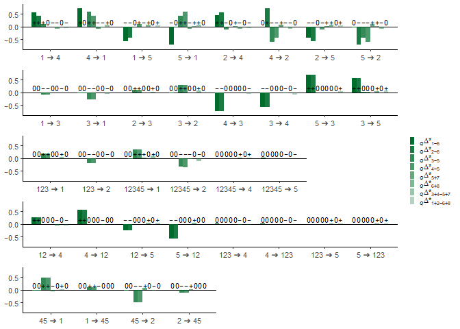

Simulation in the quasisymmetric tree $Q$
================
Kalle Leppälä

## Simulating the 34 admixture scenarios in the quasisymmetric tree $Q$

We simulate 1,000,000 independent allelic patterns in 34 admixture
graphs, see [tools.md](tools.md). The simulation uses the same
parameters used in the symmetric tree $S$ simulation made in
[S_big.md](S_big.md).

The underlying species tree is $Q = (((1,2),3),(4,5))$, where
populations 1 and 2 merge at time point 0.75, populations 12 and 3 merge
at time point 1.5, populations 4 and 5 merge at time point 2.25, and
populations 123 and 45 merge at time point 3. Gene flow between terminal
branches (16 scenarios as we are not able to detect gene flow between 1
and 2 or between 4 and 5) is modelled as an instantaneous event where a
lineage has a chance of being transferred to another population at time
point 0.375. Gene flow from 123 to branches 1 or 2 (2 scenarios)
obviously cannot be instantaneous and is mediated with a ghost
population instead. The ghost population splits from the terminal branch
at time point 0.375 and merges to population 123 at time point 2.25.
Similarly, gene flow fromr 12345 to one of the branches 1, 2, 4 or 5 (4
scenarios) is mediated with a ghost population instead that splits from
the terminal branch at time point 0.375 and merges to population 12345
at time point 3.5. Admixture of any direction between 12 or 123 and 4 or
5 (8 scenarios) is modelled with instantaneous events at time points
1.125 and 1.875. Finally we have gene flow between 45 and 1 or 2 (4
scenarios). In the underlying tree described above, gene flow from 45 to
1 could be mediated with a ghost population, but gene flow from 1 to 45
is impossible. Hence, the underlying tree was changed so that 4 and 5
merge first, then 1 and 2, 12 and 3 and finally 123 and 45. The gene
flow event was instantaneus at time point 1.125. The same goes for gene
flow between 45 and 2.

``` r
tables <- list()
lambda <- 1
mu <- 0.0001
N <- 1000000

# 1 -> 4
LLL <- list(lambda = lambda, mu = mu, inhabitants = character(0), samples = list(P1 = 0), switches = list(LLR = c(0.75, 1)))
LLR <- list(lambda = lambda, mu = mu, inhabitants = character(0), samples = list(P2 = 0), switches = list(LR = c(1.5, 1)))
LR  <- list(lambda = lambda, mu = mu, inhabitants = character(0), samples = list(P3 = 0), switches = list(RR = c(3, 1)))
RL  <- list(lambda = lambda, mu = mu, inhabitants = character(0), samples = list(P4 = 0), switches = list(RR = c(2.25, 1), LLL = c(0.375, 0.1)))
RR  <- list(lambda = lambda, mu = mu, inhabitants = character(0), samples = list(P5 = 0), switches = list())
graph <- list(LLL = LLL, LLR = LLR, LR = LR, RL = RL, RR = RR)
abbababa <- character(0)
for (k in seq(1, N)) {
  abbababa[k] <- pattern(solve_tree(graph), Tmax = 0.0055)
    while (is.na(abbababa[k]) == TRUE) {abbababa[k] <- pattern(solve_tree(graph), Tmax = 0.0055)}
}
table <- table(abbababa)
tables[[length(tables) + 1]] <- table
# 4 -> 1
LLL <- list(lambda = lambda, mu = mu, inhabitants = character(0), samples = list(P1 = 0), switches = list(LLR = c(0.75, 1), RL = c(0.375, 0.1)))
LLR <- list(lambda = lambda, mu = mu, inhabitants = character(0), samples = list(P2 = 0), switches = list(LR = c(1.5, 1)))
LR  <- list(lambda = lambda, mu = mu, inhabitants = character(0), samples = list(P3 = 0), switches = list(RR = c(3, 1)))
RL  <- list(lambda = lambda, mu = mu, inhabitants = character(0), samples = list(P4 = 0), switches = list(RR = c(2.25, 1)))
RR  <- list(lambda = lambda, mu = mu, inhabitants = character(0), samples = list(P5 = 0), switches = list())
graph <- list(LLL = LLL, LLR = LLR, LR = LR, RL = RL, RR = RR)
abbababa <- character(0)
for (k in seq(1, N)) {
  abbababa[k] <- pattern(solve_tree(graph), Tmax = 0.0055)
    while (is.na(abbababa[k]) == TRUE) {abbababa[k] <- pattern(solve_tree(graph), Tmax = 0.0055)}
}
table <- table(abbababa)
tables[[length(tables) + 1]] <- table
# 1 -> 5
LLL <- list(lambda = lambda, mu = mu, inhabitants = character(0), samples = list(P1 = 0), switches = list(LLR = c(0.75, 1)))
LLR <- list(lambda = lambda, mu = mu, inhabitants = character(0), samples = list(P2 = 0), switches = list(LR = c(1.5, 1)))
LR  <- list(lambda = lambda, mu = mu, inhabitants = character(0), samples = list(P3 = 0), switches = list(RR = c(3, 1)))
RL  <- list(lambda = lambda, mu = mu, inhabitants = character(0), samples = list(P4 = 0), switches = list(RR = c(2.25, 1)))
RR  <- list(lambda = lambda, mu = mu, inhabitants = character(0), samples = list(P5 = 0), switches = list(LLL = c(0.375, 0.1)))
graph <- list(LLL = LLL, LLR = LLR, LR = LR, RL = RL, RR = RR)
abbababa <- character(0)
for (k in seq(1, N)) {
  abbababa[k] <- pattern(solve_tree(graph), Tmax = 0.0055)
    while (is.na(abbababa[k]) == TRUE) {abbababa[k] <- pattern(solve_tree(graph), Tmax = 0.0055)}
}
table <- table(abbababa)
tables[[length(tables) + 1]] <- table
# 5 -> 1
LLL <- list(lambda = lambda, mu = mu, inhabitants = character(0), samples = list(P1 = 0), switches = list(LLR = c(0.75, 1), RR = c(0.375, 0.1)))
LLR <- list(lambda = lambda, mu = mu, inhabitants = character(0), samples = list(P2 = 0), switches = list(LR = c(1.5, 1)))
LR  <- list(lambda = lambda, mu = mu, inhabitants = character(0), samples = list(P3 = 0), switches = list(RR = c(3, 1)))
RL  <- list(lambda = lambda, mu = mu, inhabitants = character(0), samples = list(P4 = 0), switches = list(RR = c(2.25, 1)))
RR  <- list(lambda = lambda, mu = mu, inhabitants = character(0), samples = list(P5 = 0), switches = list())
graph <- list(LLL = LLL, LLR = LLR, LR = LR, RL = RL, RR = RR)
abbababa <- character(0)
for (k in seq(1, N)) {
  abbababa[k] <- pattern(solve_tree(graph), Tmax = 0.0055)
    while (is.na(abbababa[k]) == TRUE) {abbababa[k] <- pattern(solve_tree(graph), Tmax = 0.0055)}
}
table <- table(abbababa)
tables[[length(tables) + 1]] <- table
# 2 -> 4
LLL <- list(lambda = lambda, mu = mu, inhabitants = character(0), samples = list(P1 = 0), switches = list(LLR = c(0.75, 1)))
LLR <- list(lambda = lambda, mu = mu, inhabitants = character(0), samples = list(P2 = 0), switches = list(LR = c(1.5, 1)))
LR  <- list(lambda = lambda, mu = mu, inhabitants = character(0), samples = list(P3 = 0), switches = list(RR = c(3, 1)))
RL  <- list(lambda = lambda, mu = mu, inhabitants = character(0), samples = list(P4 = 0), switches = list(RR = c(2.25, 1), LLR = c(0.375, 0.1)))
RR  <- list(lambda = lambda, mu = mu, inhabitants = character(0), samples = list(P5 = 0), switches = list())
graph <- list(LLL = LLL, LLR = LLR, LR = LR, RL = RL, RR = RR)
abbababa <- character(0)
for (k in seq(1, N)) {
  abbababa[k] <- pattern(solve_tree(graph), Tmax = 0.0055)
    while (is.na(abbababa[k]) == TRUE) {abbababa[k] <- pattern(solve_tree(graph), Tmax = 0.0055)}
}
table <- table(abbababa)
tables[[length(tables) + 1]] <- table
# 4 -> 2
LLL <- list(lambda = lambda, mu = mu, inhabitants = character(0), samples = list(P1 = 0), switches = list(LLR = c(0.75, 1)))
LLR <- list(lambda = lambda, mu = mu, inhabitants = character(0), samples = list(P2 = 0), switches = list(LR = c(1.5, 1), RL = c(0.375, 0.1)))
LR  <- list(lambda = lambda, mu = mu, inhabitants = character(0), samples = list(P3 = 0), switches = list(RR = c(3, 1)))
RL  <- list(lambda = lambda, mu = mu, inhabitants = character(0), samples = list(P4 = 0), switches = list(RR = c(2.25, 1)))
RR  <- list(lambda = lambda, mu = mu, inhabitants = character(0), samples = list(P5 = 0), switches = list())
graph <- list(LLL = LLL, LLR = LLR, LR = LR, RL = RL, RR = RR)
abbababa <- character(0)
for (k in seq(1, N)) {
  abbababa[k] <- pattern(solve_tree(graph), Tmax = 0.0055)
    while (is.na(abbababa[k]) == TRUE) {abbababa[k] <- pattern(solve_tree(graph), Tmax = 0.0055)}
}
table <- table(abbababa)
tables[[length(tables) + 1]] <- table
# 2 -> 5
LLL <- list(lambda = lambda, mu = mu, inhabitants = character(0), samples = list(P1 = 0), switches = list(LLR = c(0.75, 1)))
LLR <- list(lambda = lambda, mu = mu, inhabitants = character(0), samples = list(P2 = 0), switches = list(LR = c(1.5, 1)))
LR  <- list(lambda = lambda, mu = mu, inhabitants = character(0), samples = list(P3 = 0), switches = list(RR = c(3, 1)))
RL  <- list(lambda = lambda, mu = mu, inhabitants = character(0), samples = list(P4 = 0), switches = list(RR = c(2.25, 1)))
RR  <- list(lambda = lambda, mu = mu, inhabitants = character(0), samples = list(P5 = 0), switches = list(LLR = c(0.375, 0.1)))
graph <- list(LLL = LLL, LLR = LLR, LR = LR, RL = RL, RR = RR)
abbababa <- character(0)
for (k in seq(1, N)) {
  abbababa[k] <- pattern(solve_tree(graph), Tmax = 0.0055)
    while (is.na(abbababa[k]) == TRUE) {abbababa[k] <- pattern(solve_tree(graph), Tmax = 0.0055)}
}
table <- table(abbababa)
tables[[length(tables) + 1]] <- table
# 5 -> 2
LLL <- list(lambda = lambda, mu = mu, inhabitants = character(0), samples = list(P1 = 0), switches = list(LLR = c(0.75, 1)))
LLR <- list(lambda = lambda, mu = mu, inhabitants = character(0), samples = list(P2 = 0), switches = list(LR = c(1.5, 1), RR = c(0.375, 0.1)))
LR  <- list(lambda = lambda, mu = mu, inhabitants = character(0), samples = list(P3 = 0), switches = list(RR = c(3, 1)))
RL  <- list(lambda = lambda, mu = mu, inhabitants = character(0), samples = list(P4 = 0), switches = list(RR = c(2.25, 1)))
RR  <- list(lambda = lambda, mu = mu, inhabitants = character(0), samples = list(P5 = 0), switches = list())
graph <- list(LLL = LLL, LLR = LLR, LR = LR, RL = RL, RR = RR)
abbababa <- character(0)
for (k in seq(1, N)) {
  abbababa[k] <- pattern(solve_tree(graph), Tmax = 0.0055)
    while (is.na(abbababa[k]) == TRUE) {abbababa[k] <- pattern(solve_tree(graph), Tmax = 0.0055)}
}
table <- table(abbababa)
tables[[length(tables) + 1]] <- table
# 1 -> 3
LLL <- list(lambda = lambda, mu = mu, inhabitants = character(0), samples = list(P1 = 0), switches = list(LLR = c(0.75, 1)))
LLR <- list(lambda = lambda, mu = mu, inhabitants = character(0), samples = list(P2 = 0), switches = list(LR = c(1.5, 1)))
LR  <- list(lambda = lambda, mu = mu, inhabitants = character(0), samples = list(P3 = 0), switches = list(RR = c(3, 1), LLL = c(0.375, 0.1)))
RL  <- list(lambda = lambda, mu = mu, inhabitants = character(0), samples = list(P4 = 0), switches = list(RR = c(2.25, 1)))
RR  <- list(lambda = lambda, mu = mu, inhabitants = character(0), samples = list(P5 = 0), switches = list())
graph <- list(LLL = LLL, LLR = LLR, LR = LR, RL = RL, RR = RR)
abbababa <- character(0)
for (k in seq(1, N)) {
  abbababa[k] <- pattern(solve_tree(graph), Tmax = 0.0055)
    while (is.na(abbababa[k]) == TRUE) {abbababa[k] <- pattern(solve_tree(graph), Tmax = 0.0055)}
}
table <- table(abbababa)
tables[[length(tables) + 1]] <- table
# 3 -> 1
LLL <- list(lambda = lambda, mu = mu, inhabitants = character(0), samples = list(P1 = 0), switches = list(LLR = c(0.75, 1), LR = c(0.375, 0.1)))
LLR <- list(lambda = lambda, mu = mu, inhabitants = character(0), samples = list(P2 = 0), switches = list(LR = c(1.5, 1)))
LR  <- list(lambda = lambda, mu = mu, inhabitants = character(0), samples = list(P3 = 0), switches = list(RR = c(3, 1)))
RL  <- list(lambda = lambda, mu = mu, inhabitants = character(0), samples = list(P4 = 0), switches = list(RR = c(2.25, 1)))
RR  <- list(lambda = lambda, mu = mu, inhabitants = character(0), samples = list(P5 = 0), switches = list())
graph <- list(LLL = LLL, LLR = LLR, LR = LR, RL = RL, RR = RR)
abbababa <- character(0)
for (k in seq(1, N)) {
  abbababa[k] <- pattern(solve_tree(graph), Tmax = 0.0055)
    while (is.na(abbababa[k]) == TRUE) {abbababa[k] <- pattern(solve_tree(graph), Tmax = 0.0055)}
}
table <- table(abbababa)
tables[[length(tables) + 1]] <- table
# 2 -> 3
LLL <- list(lambda = lambda, mu = mu, inhabitants = character(0), samples = list(P1 = 0), switches = list(LLR = c(0.75, 1)))
LLR <- list(lambda = lambda, mu = mu, inhabitants = character(0), samples = list(P2 = 0), switches = list(LR = c(1.5, 1)))
LR  <- list(lambda = lambda, mu = mu, inhabitants = character(0), samples = list(P3 = 0), switches = list(RR = c(3, 1), LLR = c(0.375, 0.1)))
RL  <- list(lambda = lambda, mu = mu, inhabitants = character(0), samples = list(P4 = 0), switches = list(RR = c(2.25, 1)))
RR  <- list(lambda = lambda, mu = mu, inhabitants = character(0), samples = list(P5 = 0), switches = list())
graph <- list(LLL = LLL, LLR = LLR, LR = LR, RL = RL, RR = RR)
abbababa <- character(0)
for (k in seq(1, N)) {
  abbababa[k] <- pattern(solve_tree(graph), Tmax = 0.0055)
    while (is.na(abbababa[k]) == TRUE) {abbababa[k] <- pattern(solve_tree(graph), Tmax = 0.0055)}
}
table <- table(abbababa)
tables[[length(tables) + 1]] <- table
# 3 -> 2
LLL <- list(lambda = lambda, mu = mu, inhabitants = character(0), samples = list(P1 = 0), switches = list(LR = c(1.5, 1)))
LLR <- list(lambda = lambda, mu = mu, inhabitants = character(0), samples = list(P2 = 0), switches = list(LLL = c(0.75, 1), LR = c(0.375, 0.1)))
LR  <- list(lambda = lambda, mu = mu, inhabitants = character(0), samples = list(P3 = 0), switches = list(RR = c(3, 1)))
RL  <- list(lambda = lambda, mu = mu, inhabitants = character(0), samples = list(P4 = 0), switches = list(RR = c(2.25, 1)))
RR  <- list(lambda = lambda, mu = mu, inhabitants = character(0), samples = list(P5 = 0), switches = list())
graph <- list(LLL = LLL, LLR = LLR, LR = LR, RL = RL, RR = RR)
abbababa <- character(0)
for (k in seq(1, N)) {
  abbababa[k] <- pattern(solve_tree(graph), Tmax = 0.0055)
    while (is.na(abbababa[k]) == TRUE) {abbababa[k] <- pattern(solve_tree(graph), Tmax = 0.0055)}
}
table <- table(abbababa)
tables[[length(tables) + 1]] <- table
# 4 -> 3
LLL <- list(lambda = lambda, mu = mu, inhabitants = character(0), samples = list(P1 = 0), switches = list(LLR = c(0.75, 1)))
LLR <- list(lambda = lambda, mu = mu, inhabitants = character(0), samples = list(P2 = 0), switches = list(LR = c(1.5, 1)))
LR  <- list(lambda = lambda, mu = mu, inhabitants = character(0), samples = list(P3 = 0), switches = list(RR = c(3, 1), RL = c(0.375, 0.1)))
RL  <- list(lambda = lambda, mu = mu, inhabitants = character(0), samples = list(P4 = 0), switches = list(RR = c(2.25, 1)))
RR  <- list(lambda = lambda, mu = mu, inhabitants = character(0), samples = list(P5 = 0), switches = list())
graph <- list(LLL = LLL, LLR = LLR, LR = LR, RL = RL, RR = RR)
abbababa <- character(0)
for (k in seq(1, N)) {
  abbababa[k] <- pattern(solve_tree(graph), Tmax = 0.0055)
    while (is.na(abbababa[k]) == TRUE) {abbababa[k] <- pattern(solve_tree(graph), Tmax = 0.0055)}
}
table <- table(abbababa)
tables[[length(tables) + 1]] <- table
# 3 -> 4
LLL <- list(lambda = lambda, mu = mu, inhabitants = character(0), samples = list(P1 = 0), switches = list(LLR = c(0.75, 1)))
LLR <- list(lambda = lambda, mu = mu, inhabitants = character(0), samples = list(P2 = 0), switches = list(LR = c(1.5, 1)))
LR  <- list(lambda = lambda, mu = mu, inhabitants = character(0), samples = list(P3 = 0), switches = list(RR = c(3, 1)))
RL  <- list(lambda = lambda, mu = mu, inhabitants = character(0), samples = list(P4 = 0), switches = list(RR = c(2.25, 1), LR = c(0.375, 0.1)))
RR  <- list(lambda = lambda, mu = mu, inhabitants = character(0), samples = list(P5 = 0), switches = list())
graph <- list(LLL = LLL, LLR = LLR, LR = LR, RL = RL, RR = RR)
abbababa <- character(0)
for (k in seq(1, N)) {
  abbababa[k] <- pattern(solve_tree(graph), Tmax = 0.0055)
    while (is.na(abbababa[k]) == TRUE) {abbababa[k] <- pattern(solve_tree(graph), Tmax = 0.0055)}
}
table <- table(abbababa)
tables[[length(tables) + 1]] <- table
# 5 -> 3
LLL <- list(lambda = lambda, mu = mu, inhabitants = character(0), samples = list(P1 = 0), switches = list(LLR = c(0.75, 1)))
LLR <- list(lambda = lambda, mu = mu, inhabitants = character(0), samples = list(P2 = 0), switches = list(LR = c(1.5, 1)))
LR  <- list(lambda = lambda, mu = mu, inhabitants = character(0), samples = list(P3 = 0), switches = list(RL = c(3, 1), RR = c(0.375, 0.1)))
RL  <- list(lambda = lambda, mu = mu, inhabitants = character(0), samples = list(P4 = 0), switches = list())
RR  <- list(lambda = lambda, mu = mu, inhabitants = character(0), samples = list(P5 = 0), switches = list(RL = c(2.25, 1)))
graph <- list(LLL = LLL, LLR = LLR, LR = LR, RL = RL, RR = RR)
abbababa <- character(0)
for (k in seq(1, N)) {
  abbababa[k] <- pattern(solve_tree(graph), Tmax = 0.0055)
    while (is.na(abbababa[k]) == TRUE) {abbababa[k] <- pattern(solve_tree(graph), Tmax = 0.0055)}
}
table <- table(abbababa)
tables[[length(tables) + 1]] <- table
# 3 -> 5
LLL <- list(lambda = lambda, mu = mu, inhabitants = character(0), samples = list(P1 = 0), switches = list(LLR = c(0.75, 1)))
LLR <- list(lambda = lambda, mu = mu, inhabitants = character(0), samples = list(P2 = 0), switches = list(LR = c(1.5, 1)))
LR  <- list(lambda = lambda, mu = mu, inhabitants = character(0), samples = list(P3 = 0), switches = list(RR = c(3, 1)))
RL  <- list(lambda = lambda, mu = mu, inhabitants = character(0), samples = list(P4 = 0), switches = list(RR = c(2.25, 1)))
RR  <- list(lambda = lambda, mu = mu, inhabitants = character(0), samples = list(P5 = 0), switches = list(LR = c(0.375, 0.1)))
graph <- list(LLL = LLL, LLR = LLR, LR = LR, RL = RL, RR = RR)
abbababa <- character(0)
for (k in seq(1, N)) {
  abbababa[k] <- pattern(solve_tree(graph), Tmax = 0.0055)
    while (is.na(abbababa[k]) == TRUE) {abbababa[k] <- pattern(solve_tree(graph), Tmax = 0.0055)}
}
table <- table(abbababa)
tables[[length(tables) + 1]] <- table
# 12 -> 4
LLL <- list(lambda = lambda, mu = mu, inhabitants = character(0), samples = list(P1 = 0), switches = list(LLR = c(0.75, 1)))
LLR <- list(lambda = lambda, mu = mu, inhabitants = character(0), samples = list(P2 = 0), switches = list(LR = c(1.5, 1)))
LR  <- list(lambda = lambda, mu = mu, inhabitants = character(0), samples = list(P3 = 0), switches = list(RR = c(3, 1)))
RL  <- list(lambda = lambda, mu = mu, inhabitants = character(0), samples = list(P4 = 0), switches = list(RR = c(2.25, 1), LLR = c(1.125, 0.1)))
RR  <- list(lambda = lambda, mu = mu, inhabitants = character(0), samples = list(P5 = 0), switches = list())
graph <- list(LLL = LLL, LLR = LLR, LR = LR, RL = RL, RR = RR)
abbababa <- character(0)
for (k in seq(1, N)) {
  abbababa[k] <- pattern(solve_tree(graph), Tmax = 0.0055)
    while (is.na(abbababa[k]) == TRUE) {abbababa[k] <- pattern(solve_tree(graph), Tmax = 0.0055)}
}
table <- table(abbababa)
tables[[length(tables) + 1]] <- table
# 4 -> 12
LLL <- list(lambda = lambda, mu = mu, inhabitants = character(0), samples = list(P1 = 0), switches = list(LLR = c(0.75, 1)))
LLR <- list(lambda = lambda, mu = mu, inhabitants = character(0), samples = list(P2 = 0), switches = list(LR = c(1.5, 1), RL = c(1.125, 0.1)))
LR  <- list(lambda = lambda, mu = mu, inhabitants = character(0), samples = list(P3 = 0), switches = list(RR = c(3, 1)))
RL  <- list(lambda = lambda, mu = mu, inhabitants = character(0), samples = list(P4 = 0), switches = list(RR = c(2.25, 1)))
RR  <- list(lambda = lambda, mu = mu, inhabitants = character(0), samples = list(P5 = 0), switches = list())
graph <- list(LLL = LLL, LLR = LLR, LR = LR, RL = RL, RR = RR)
abbababa <- character(0)
for (k in seq(1, N)) {
  abbababa[k] <- pattern(solve_tree(graph), Tmax = 0.0055)
    while (is.na(abbababa[k]) == TRUE) {abbababa[k] <- pattern(solve_tree(graph), Tmax = 0.0055)}
}
table <- table(abbababa)
tables[[length(tables) + 1]] <- table
# 12 -> 5
LLL <- list(lambda = lambda, mu = mu, inhabitants = character(0), samples = list(P1 = 0), switches = list(LLR = c(0.75, 1)))
LLR <- list(lambda = lambda, mu = mu, inhabitants = character(0), samples = list(P2 = 0), switches = list(LR = c(1.5, 1)))
LR  <- list(lambda = lambda, mu = mu, inhabitants = character(0), samples = list(P3 = 0), switches = list(RR = c(3, 1)))
RL  <- list(lambda = lambda, mu = mu, inhabitants = character(0), samples = list(P4 = 0), switches = list(RR = c(2.25, 1)))
RR  <- list(lambda = lambda, mu = mu, inhabitants = character(0), samples = list(P5 = 0), switches = list(LLR = c(1.125, 0.1)))
graph <- list(LLL = LLL, LLR = LLR, LR = LR, RL = RL, RR = RR)
abbababa <- character(0)
for (k in seq(1, N)) {
  abbababa[k] <- pattern(solve_tree(graph), Tmax = 0.0055)
    while (is.na(abbababa[k]) == TRUE) {abbababa[k] <- pattern(solve_tree(graph), Tmax = 0.0055)}
}
table <- table(abbababa)
tables[[length(tables) + 1]] <- table
# 5 -> 12
LLL <- list(lambda = lambda, mu = mu, inhabitants = character(0), samples = list(P1 = 0), switches = list(LLR = c(0.75, 1)))
LLR <- list(lambda = lambda, mu = mu, inhabitants = character(0), samples = list(P2 = 0), switches = list(LR = c(1.5, 1), RR = c(1.125, 0.1)))
LR  <- list(lambda = lambda, mu = mu, inhabitants = character(0), samples = list(P3 = 0), switches = list(RR = c(3, 1)))
RL  <- list(lambda = lambda, mu = mu, inhabitants = character(0), samples = list(P4 = 0), switches = list(RR = c(2.25, 1)))
RR  <- list(lambda = lambda, mu = mu, inhabitants = character(0), samples = list(P5 = 0), switches = list())
graph <- list(LLL = LLL, LLR = LLR, LR = LR, RL = RL, RR = RR)
abbababa <- character(0)
for (k in seq(1, N)) {
  abbababa[k] <- pattern(solve_tree(graph), Tmax = 0.0055)
    while (is.na(abbababa[k]) == TRUE) {abbababa[k] <- pattern(solve_tree(graph), Tmax = 0.0055)}
}
table <- table(abbababa)
tables[[length(tables) + 1]] <- table
# 123 -> 4
LLL <- list(lambda = lambda, mu = mu, inhabitants = character(0), samples = list(P1 = 0), switches = list(LLR = c(0.75, 1)))
LLR <- list(lambda = lambda, mu = mu, inhabitants = character(0), samples = list(P2 = 0), switches = list(LR = c(1.5, 1)))
LR  <- list(lambda = lambda, mu = mu, inhabitants = character(0), samples = list(P3 = 0), switches = list(RR = c(3, 1)))
RL  <- list(lambda = lambda, mu = mu, inhabitants = character(0), samples = list(P4 = 0), switches = list(RR = c(2.25, 1), LR = c(1.875, 0.1)))
RR  <- list(lambda = lambda, mu = mu, inhabitants = character(0), samples = list(P5 = 0), switches = list())
graph <- list(LLL = LLL, LLR = LLR, LR = LR, RL = RL, RR = RR)
abbababa <- character(0)
for (k in seq(1, N)) {
  abbababa[k] <- pattern(solve_tree(graph), Tmax = 0.0055)
    while (is.na(abbababa[k]) == TRUE) {abbababa[k] <- pattern(solve_tree(graph), Tmax = 0.0055)}
}
table <- table(abbababa)
tables[[length(tables) + 1]] <- table
# 4 -> 123
LLL <- list(lambda = lambda, mu = mu, inhabitants = character(0), samples = list(P1 = 0), switches = list(LLR = c(0.75, 1)))
LLR <- list(lambda = lambda, mu = mu, inhabitants = character(0), samples = list(P2 = 0), switches = list(LR = c(1.5, 1)))
LR  <- list(lambda = lambda, mu = mu, inhabitants = character(0), samples = list(P3 = 0), switches = list(RR = c(3, 1), RL = c(1.875, 0.1)))
RL  <- list(lambda = lambda, mu = mu, inhabitants = character(0), samples = list(P4 = 0), switches = list(RR = c(2.25, 1)))
RR  <- list(lambda = lambda, mu = mu, inhabitants = character(0), samples = list(P5 = 0), switches = list())
graph <- list(LLL = LLL, LLR = LLR, LR = LR, RL = RL, RR = RR)
abbababa <- character(0)
for (k in seq(1, N)) {
  abbababa[k] <- pattern(solve_tree(graph), Tmax = 0.0055)
    while (is.na(abbababa[k]) == TRUE) {abbababa[k] <- pattern(solve_tree(graph), Tmax = 0.0055)}
}
table <- table(abbababa)
tables[[length(tables) + 1]] <- table
# 123 -> 5
LLL <- list(lambda = lambda, mu = mu, inhabitants = character(0), samples = list(P1 = 0), switches = list(LLR = c(0.75, 1)))
LLR <- list(lambda = lambda, mu = mu, inhabitants = character(0), samples = list(P2 = 0), switches = list(LR = c(1.5, 1)))
LR  <- list(lambda = lambda, mu = mu, inhabitants = character(0), samples = list(P3 = 0), switches = list(RR = c(3, 1)))
RL  <- list(lambda = lambda, mu = mu, inhabitants = character(0), samples = list(P4 = 0), switches = list(RR = c(2.25, 1)))
RR  <- list(lambda = lambda, mu = mu, inhabitants = character(0), samples = list(P5 = 0), switches = list(LR = c(1.875, 0.1)))
graph <- list(LLL = LLL, LLR = LLR, LR = LR, RL = RL, RR = RR)
abbababa <- character(0)
for (k in seq(1, N)) {
  abbababa[k] <- pattern(solve_tree(graph), Tmax = 0.0055)
    while (is.na(abbababa[k]) == TRUE) {abbababa[k] <- pattern(solve_tree(graph), Tmax = 0.0055)}
}
table <- table(abbababa)
tables[[length(tables) + 1]] <- table
# 5 -> 123
LLL <- list(lambda = lambda, mu = mu, inhabitants = character(0), samples = list(P1 = 0), switches = list(LLR = c(0.75, 1)))
LLR <- list(lambda = lambda, mu = mu, inhabitants = character(0), samples = list(P2 = 0), switches = list(LR = c(1.5, 1)))
LR  <- list(lambda = lambda, mu = mu, inhabitants = character(0), samples = list(P3 = 0), switches = list(RL = c(3, 1), RR = c(1.875, 0.1)))
RL  <- list(lambda = lambda, mu = mu, inhabitants = character(0), samples = list(P4 = 0), switches = list())
RR  <- list(lambda = lambda, mu = mu, inhabitants = character(0), samples = list(P5 = 0), switches = list(RL = c(2.25, 1)))
graph <- list(LLL = LLL, LLR = LLR, LR = LR, RL = RL, RR = RR)
abbababa <- character(0)
for (k in seq(1, N)) {
  abbababa[k] <- pattern(solve_tree(graph), Tmax = 0.0055)
    while (is.na(abbababa[k]) == TRUE) {abbababa[k] <- pattern(solve_tree(graph), Tmax = 0.0055)}
}
table <- table(abbababa)
tables[[length(tables) + 1]] <- table
# 1 -> 45
LLL <- list(lambda = lambda, mu = mu, inhabitants = character(0), samples = list(P1 = 0), switches = list(LLR = c(1.5, 1)))
LLR <- list(lambda = lambda, mu = mu, inhabitants = character(0), samples = list(P2 = 0), switches = list(LR = c(2.25, 1)))
LR  <- list(lambda = lambda, mu = mu, inhabitants = character(0), samples = list(P3 = 0), switches = list(RR = c(3, 1)))
RL  <- list(lambda = lambda, mu = mu, inhabitants = character(0), samples = list(P4 = 0), switches = list(RR = c(0.75, 1)))
RR  <- list(lambda = lambda, mu = mu, inhabitants = character(0), samples = list(P5 = 0), switches = list(LLL = c(1.125, 0.1)))
graph <- list(LLL = LLL, LLR = LLR, LR = LR, RL = RL, RR = RR)
abbababa <- character(0)
for (k in seq(1, N)) {
  abbababa[k] <- pattern(solve_tree(graph), Tmax = 0.0055)
    while (is.na(abbababa[k]) == TRUE) {abbababa[k] <- pattern(solve_tree(graph), Tmax = 0.0055)}
}
table <- table(abbababa)
tables[[length(tables) + 1]] <- table
# 45 -> 1
LLL <- list(lambda = lambda, mu = mu, inhabitants = character(0), samples = list(P1 = 0), switches = list(LLR = c(1.5, 1), RR = c(1.125, 0.1)))
LLR <- list(lambda = lambda, mu = mu, inhabitants = character(0), samples = list(P2 = 0), switches = list(LR = c(2.25, 1)))
LR  <- list(lambda = lambda, mu = mu, inhabitants = character(0), samples = list(P3 = 0), switches = list(RR = c(3, 1)))
RL  <- list(lambda = lambda, mu = mu, inhabitants = character(0), samples = list(P4 = 0), switches = list(RR = c(0.75, 1)))
RR  <- list(lambda = lambda, mu = mu, inhabitants = character(0), samples = list(P5 = 0), switches = list())
graph <- list(LLL = LLL, LLR = LLR, LR = LR, RL = RL, RR = RR)
abbababa <- character(0)
for (k in seq(1, N)) {
  abbababa[k] <- pattern(solve_tree(graph), Tmax = 0.0055)
    while (is.na(abbababa[k]) == TRUE) {abbababa[k] <- pattern(solve_tree(graph), Tmax = 0.0055)}
}
table <- table(abbababa)
tables[[length(tables) + 1]] <- table
# 2 -> 45
LLL <- list(lambda = lambda, mu = mu, inhabitants = character(0), samples = list(P1 = 0), switches = list(LLR = c(1.5, 1)))
LLR <- list(lambda = lambda, mu = mu, inhabitants = character(0), samples = list(P2 = 0), switches = list(LR = c(2.25, 1)))
LR  <- list(lambda = lambda, mu = mu, inhabitants = character(0), samples = list(P3 = 0), switches = list(RR = c(3, 1)))
RL  <- list(lambda = lambda, mu = mu, inhabitants = character(0), samples = list(P4 = 0), switches = list(RR = c(0.75, 1)))
RR  <- list(lambda = lambda, mu = mu, inhabitants = character(0), samples = list(P5 = 0), switches = list(LLR = c(1.125, 0.1)))
graph <- list(LLL = LLL, LLR = LLR, LR = LR, RL = RL, RR = RR)
abbababa <- character(0)
for (k in seq(1, N)) {
  abbababa[k] <- pattern(solve_tree(graph), Tmax = 0.0055)
    while (is.na(abbababa[k]) == TRUE) {abbababa[k] <- pattern(solve_tree(graph), Tmax = 0.0055)}
}
table <- table(abbababa)
tables[[length(tables) + 1]] <- table
# 45 -> 2
LLL <- list(lambda = lambda, mu = mu, inhabitants = character(0), samples = list(P1 = 0), switches = list(LLR = c(1.5, 1)))
LLR <- list(lambda = lambda, mu = mu, inhabitants = character(0), samples = list(P2 = 0), switches = list(LR = c(2.25, 1), RR = c(1.125, 0.1)))
LR  <- list(lambda = lambda, mu = mu, inhabitants = character(0), samples = list(P3 = 0), switches = list(RR = c(3, 1)))
RL  <- list(lambda = lambda, mu = mu, inhabitants = character(0), samples = list(P4 = 0), switches = list(RR = c(0.75, 1)))
RR  <- list(lambda = lambda, mu = mu, inhabitants = character(0), samples = list(P5 = 0), switches = list())
graph <- list(LLL = LLL, LLR = LLR, LR = LR, RL = RL, RR = RR)
abbababa <- character(0)
for (k in seq(1, N)) {
  abbababa[k] <- pattern(solve_tree(graph), Tmax = 0.0055)
    while (is.na(abbababa[k]) == TRUE) {abbababa[k] <- pattern(solve_tree(graph), Tmax = 0.0055)}
}
table <- table(abbababa)
tables[[length(tables) + 1]] <- table
# 123 -> 1
LLL <- list(lambda = lambda, mu = mu, inhabitants = character(0), samples = list(P1 = 0), switches = list(LLR = c(0.75, 1), GH = c(0.375, 0.1)))
LLR <- list(lambda = lambda, mu = mu, inhabitants = character(0), samples = list(P2 = 0), switches = list(LR = c(1.5, 1)))
LR  <- list(lambda = lambda, mu = mu, inhabitants = character(0), samples = list(P3 = 0), switches = list(RR = c(3, 1)))
RL  <- list(lambda = lambda, mu = mu, inhabitants = character(0), samples = list(P4 = 0), switches = list(RR = c(2.25, 1)))
RR  <- list(lambda = lambda, mu = mu, inhabitants = character(0), samples = list(P5 = 0), switches = list())
GH  <- list(lambda = lambda, mu = mu, inhabitants = character(0), samples = list(), switches = list(LR = c(2.25, 1)))
graph <- list(LLL = LLL, LLR = LLR, LR = LR, RL = RL, RR = RR, GH = GH)
abbababa <- character(0)
for (k in seq(1, N)) {
  abbababa[k] <- pattern(solve_tree(graph), Tmax = 0.0055)
    while (is.na(abbababa[k]) == TRUE) {abbababa[k] <- pattern(solve_tree(graph), Tmax = 0.0055)}
}
table <- table(abbababa)
tables[[length(tables) + 1]] <- table
# 123 -> 2
LLL <- list(lambda = lambda, mu = mu, inhabitants = character(0), samples = list(P1 = 0), switches = list(LLR = c(0.75, 1)))
LLR <- list(lambda = lambda, mu = mu, inhabitants = character(0), samples = list(P2 = 0), switches = list(LR = c(1.5, 1), GH = c(0.375, 0.1)))
LR  <- list(lambda = lambda, mu = mu, inhabitants = character(0), samples = list(P3 = 0), switches = list(RR = c(3, 1)))
RL  <- list(lambda = lambda, mu = mu, inhabitants = character(0), samples = list(P4 = 0), switches = list(RR = c(2.25, 1)))
RR  <- list(lambda = lambda, mu = mu, inhabitants = character(0), samples = list(P5 = 0), switches = list())
GH  <- list(lambda = lambda, mu = mu, inhabitants = character(0), samples = list(), switches = list(LR = c(2.25, 1)))
graph <- list(LLL = LLL, LLR = LLR, LR = LR, RL = RL, RR = RR, GH = GH)
abbababa <- character(0)
for (k in seq(1, N)) {
  abbababa[k] <- pattern(solve_tree(graph), Tmax = 0.0055)
    while (is.na(abbababa[k]) == TRUE) {abbababa[k] <- pattern(solve_tree(graph), Tmax = 0.0055)}
}
table <- table(abbababa)
tables[[length(tables) + 1]] <- table
# 12345 -> 1
LLL <- list(lambda = lambda, mu = mu, inhabitants = character(0), samples = list(P1 = 0), switches = list(LLR = c(0.75, 1), GH = c(0.375, 0.1)))
LLR <- list(lambda = lambda, mu = mu, inhabitants = character(0), samples = list(P2 = 0), switches = list(LR = c(1.5, 1)))
LR  <- list(lambda = lambda, mu = mu, inhabitants = character(0), samples = list(P3 = 0), switches = list(RR = c(3, 1)))
RL  <- list(lambda = lambda, mu = mu, inhabitants = character(0), samples = list(P4 = 0), switches = list(RR = c(2.25, 1)))
RR  <- list(lambda = lambda, mu = mu, inhabitants = character(0), samples = list(P5 = 0), switches = list())
GH  <- list(lambda = lambda, mu = mu, inhabitants = character(0), samples = list(), switches = list(RR = c(3.5, 1)))
graph <- list(LLL = LLL, LLR = LLR, LR = LR, RL = RL, RR = RR, GH = GH)
abbababa <- character(0)
for (k in seq(1, N)) {
  abbababa[k] <- pattern(solve_tree(graph), Tmax = 0.0055)
    while (is.na(abbababa[k]) == TRUE) {abbababa[k] <- pattern(solve_tree(graph), Tmax = 0.0055)}
}
table <- table(abbababa)
tables[[length(tables) + 1]] <- table
# 12345 -> 2
LLL <- list(lambda = lambda, mu = mu, inhabitants = character(0), samples = list(P1 = 0), switches = list(LLR = c(0.75, 1)))
LLR <- list(lambda = lambda, mu = mu, inhabitants = character(0), samples = list(P2 = 0), switches = list(LR = c(1.5, 1), GH = c(0.375, 0.1)))
LR  <- list(lambda = lambda, mu = mu, inhabitants = character(0), samples = list(P3 = 0), switches = list(RR = c(3, 1)))
RL  <- list(lambda = lambda, mu = mu, inhabitants = character(0), samples = list(P4 = 0), switches = list(RR = c(2.25, 1)))
RR  <- list(lambda = lambda, mu = mu, inhabitants = character(0), samples = list(P5 = 0), switches = list())
GH  <- list(lambda = lambda, mu = mu, inhabitants = character(0), samples = list(), switches = list(RR = c(3.5, 1)))
graph <- list(LLL = LLL, LLR = LLR, LR = LR, RL = RL, RR = RR, GH = GH)
abbababa <- character(0)
for (k in seq(1, N)) {
  abbababa[k] <- pattern(solve_tree(graph), Tmax = 0.0055)
    while (is.na(abbababa[k]) == TRUE) {abbababa[k] <- pattern(solve_tree(graph), Tmax = 0.0055)}
}
table <- table(abbababa)
tables[[length(tables) + 1]] <- table
# 12345 -> 4
LLL <- list(lambda = lambda, mu = mu, inhabitants = character(0), samples = list(P1 = 0), switches = list(LLR = c(0.75, 1)))
LLR <- list(lambda = lambda, mu = mu, inhabitants = character(0), samples = list(P2 = 0), switches = list(LR = c(1.5, 1)))
LR  <- list(lambda = lambda, mu = mu, inhabitants = character(0), samples = list(P3 = 0), switches = list(RR = c(3, 1)))
RL  <- list(lambda = lambda, mu = mu, inhabitants = character(0), samples = list(P4 = 0), switches = list(RR = c(2.25, 1), GH = c(0.375, 0.1)))
RR  <- list(lambda = lambda, mu = mu, inhabitants = character(0), samples = list(P5 = 0), switches = list())
GH  <- list(lambda = lambda, mu = mu, inhabitants = character(0), samples = list(), switches = list(RR = c(3.5, 1)))
graph <- list(LLL = LLL, LLR = LLR, LR = LR, RL = RL, RR = RR, GH = GH)
abbababa <- character(0)
for (k in seq(1, N)) {
  abbababa[k] <- pattern(solve_tree(graph), Tmax = 0.0055)
    while (is.na(abbababa[k]) == TRUE) {abbababa[k] <- pattern(solve_tree(graph), Tmax = 0.0055)}
}
table <- table(abbababa)
tables[[length(tables) + 1]] <- table
# 12345 -> 5
LLL <- list(lambda = lambda, mu = mu, inhabitants = character(0), samples = list(P1 = 0), switches = list(LLR = c(0.75, 1)))
LLR <- list(lambda = lambda, mu = mu, inhabitants = character(0), samples = list(P2 = 0), switches = list(LR = c(1.5, 1)))
LR  <- list(lambda = lambda, mu = mu, inhabitants = character(0), samples = list(P3 = 0), switches = list(RR = c(3, 1)))
RL  <- list(lambda = lambda, mu = mu, inhabitants = character(0), samples = list(P4 = 0), switches = list(RR = c(2.25, 1)))
RR  <- list(lambda = lambda, mu = mu, inhabitants = character(0), samples = list(P5 = 0), switches = list(GH = c(0.375, 0.1)))
GH  <- list(lambda = lambda, mu = mu, inhabitants = character(0), samples = list(), switches = list(RR = c(3.5, 1)))
graph <- list(LLL = LLL, LLR = LLR, LR = LR, RL = RL, RR = RR, GH = GH)
abbababa <- character(0)
for (k in seq(1, N)) {
  abbababa[k] <- pattern(solve_tree(graph), Tmax = 0.0055)
    while (is.na(abbababa[k]) == TRUE) {abbababa[k] <- pattern(solve_tree(graph), Tmax = 0.0055)}
}
table <- table(abbababa)
tables[[length(tables) + 1]] <- table

save(tables, file = "Q_big.RData")
```

## Computing the $\Delta$-statistics

From the simulated tables of allelic patterns we calculate a data frame
of the eight preferred $\Delta$-statistics on tree $Q$ under the 34
admixture scenarios.

``` r
load(file = "Q_big.RData")
event <- character(0)
statistic <- character(0)
value <- numeric(0)
zvalue <- numeric(0)
sign <- numeric(0)

# 1 -> 4
table <- tables[[1]]
event <- c(event, rep("1 \u2794 4", 8))
statistic <- c(statistic, "DQ16", "DQ26", "DQ35", "DQ45", "DQ57", "DQ68", "DQ3457", "DQ1268")
value <- c(value, DQ16(table)[[1]], DQ26(table)[[1]], DQ35(table)[[1]], DQ45(table)[[1]],
                    DQ57(table)[[1]], DQ68(table)[[1]], DQ3457(table)[[1]], DQ1268(table)[[1]])
zvalue <- c(zvalue, DQ16(table)[[2]], DQ26(table)[[2]], DQ35(table)[[2]], DQ45(table)[[2]],
                    DQ57(table)[[2]], DQ68(table)[[2]], DQ3457(table)[[2]], DQ1268(table)[[2]])
sign <- c(sign, DQ16(table)[[3]], DQ26(table)[[3]], DQ35(table)[[3]], DQ45(table)[[3]],
                  DQ57(table)[[3]], DQ68(table)[[3]], DQ3457(table)[[3]], DQ1268(table)[[3]])
# 4 -> 1
table <- tables[[2]]
event <- c(event, rep("4 \u2794 1", 8))
statistic <- c(statistic, "DQ16", "DQ26", "DQ35", "DQ45", "DQ57", "DQ68", "DQ3457", "DQ1268")
value <- c(value, DQ16(table)[[1]], DQ26(table)[[1]], DQ35(table)[[1]], DQ45(table)[[1]],
                    DQ57(table)[[1]], DQ68(table)[[1]], DQ3457(table)[[1]], DQ1268(table)[[1]])
zvalue <- c(zvalue, DQ16(table)[[2]], DQ26(table)[[2]], DQ35(table)[[2]], DQ45(table)[[2]],
                    DQ57(table)[[2]], DQ68(table)[[2]], DQ3457(table)[[2]], DQ1268(table)[[2]])
sign <- c(sign, DQ16(table)[[3]], DQ26(table)[[3]], DQ35(table)[[3]], DQ45(table)[[3]],
                  DQ57(table)[[3]], DQ68(table)[[3]], DQ3457(table)[[3]], DQ1268(table)[[3]])
# 1 -> 5
table <- tables[[3]]
event <- c(event, rep("1 \u2794 5", 8))
statistic <- c(statistic, "DQ16", "DQ26", "DQ35", "DQ45", "DQ57", "DQ68", "DQ3457", "DQ1268")
value <- c(value, DQ16(table)[[1]], DQ26(table)[[1]], DQ35(table)[[1]], DQ45(table)[[1]],
                    DQ57(table)[[1]], DQ68(table)[[1]], DQ3457(table)[[1]], DQ1268(table)[[1]])
zvalue <- c(zvalue, DQ16(table)[[2]], DQ26(table)[[2]], DQ35(table)[[2]], DQ45(table)[[2]],
                    DQ57(table)[[2]], DQ68(table)[[2]], DQ3457(table)[[2]], DQ1268(table)[[2]])
sign <- c(sign, DQ16(table)[[3]], DQ26(table)[[3]], DQ35(table)[[3]], DQ45(table)[[3]],
                  DQ57(table)[[3]], DQ68(table)[[3]], DQ3457(table)[[3]], DQ1268(table)[[3]])
# 5 -> 1
table <- tables[[4]]
event <- c(event, rep("5 \u2794 1", 8))
statistic <- c(statistic, "DQ16", "DQ26", "DQ35", "DQ45", "DQ57", "DQ68", "DQ3457", "DQ1268")
value <- c(value, DQ16(table)[[1]], DQ26(table)[[1]], DQ35(table)[[1]], DQ45(table)[[1]],
                    DQ57(table)[[1]], DQ68(table)[[1]], DQ3457(table)[[1]], DQ1268(table)[[1]])
zvalue <- c(zvalue, DQ16(table)[[2]], DQ26(table)[[2]], DQ35(table)[[2]], DQ45(table)[[2]],
                    DQ57(table)[[2]], DQ68(table)[[2]], DQ3457(table)[[2]], DQ1268(table)[[2]])
sign <- c(sign, DQ16(table)[[3]], DQ26(table)[[3]], DQ35(table)[[3]], DQ45(table)[[3]],
                  DQ57(table)[[3]], DQ68(table)[[3]], DQ3457(table)[[3]], DQ1268(table)[[3]])
# 2 -> 4
table <- tables[[5]]
event <- c(event, rep("2 \u2794 4", 8))
statistic <- c(statistic, "DQ16", "DQ26", "DQ35", "DQ45", "DQ57", "DQ68", "DQ3457", "DQ1268")
value <- c(value, DQ16(table)[[1]], DQ26(table)[[1]], DQ35(table)[[1]], DQ45(table)[[1]],
                    DQ57(table)[[1]], DQ68(table)[[1]], DQ3457(table)[[1]], DQ1268(table)[[1]])
zvalue <- c(zvalue, DQ16(table)[[2]], DQ26(table)[[2]], DQ35(table)[[2]], DQ45(table)[[2]],
                    DQ57(table)[[2]], DQ68(table)[[2]], DQ3457(table)[[2]], DQ1268(table)[[2]])
sign <- c(sign, DQ16(table)[[3]], DQ26(table)[[3]], DQ35(table)[[3]], DQ45(table)[[3]],
                  DQ57(table)[[3]], DQ68(table)[[3]], DQ3457(table)[[3]], DQ1268(table)[[3]])
# 4 -> 2
table <- tables[[6]]
event <- c(event, rep("4 \u2794 2", 8))
statistic <- c(statistic, "DQ16", "DQ26", "DQ35", "DQ45", "DQ57", "DQ68", "DQ3457", "DQ1268")
value <- c(value, DQ16(table)[[1]], DQ26(table)[[1]], DQ35(table)[[1]], DQ45(table)[[1]],
                    DQ57(table)[[1]], DQ68(table)[[1]], DQ3457(table)[[1]], DQ1268(table)[[1]])
zvalue <- c(zvalue, DQ16(table)[[2]], DQ26(table)[[2]], DQ35(table)[[2]], DQ45(table)[[2]],
                    DQ57(table)[[2]], DQ68(table)[[2]], DQ3457(table)[[2]], DQ1268(table)[[2]])
sign <- c(sign, DQ16(table)[[3]], DQ26(table)[[3]], DQ35(table)[[3]], DQ45(table)[[3]],
                  DQ57(table)[[3]], DQ68(table)[[3]], DQ3457(table)[[3]], DQ1268(table)[[3]])
# 2 -> 5
table <- tables[[7]]
event <- c(event, rep("2 \u2794 5", 8))
statistic <- c(statistic, "DQ16", "DQ26", "DQ35", "DQ45", "DQ57", "DQ68", "DQ3457", "DQ1268")
value <- c(value, DQ16(table)[[1]], DQ26(table)[[1]], DQ35(table)[[1]], DQ45(table)[[1]],
                    DQ57(table)[[1]], DQ68(table)[[1]], DQ3457(table)[[1]], DQ1268(table)[[1]])
zvalue <- c(zvalue, DQ16(table)[[2]], DQ26(table)[[2]], DQ35(table)[[2]], DQ45(table)[[2]],
                    DQ57(table)[[2]], DQ68(table)[[2]], DQ3457(table)[[2]], DQ1268(table)[[2]])
sign <- c(sign, DQ16(table)[[3]], DQ26(table)[[3]], DQ35(table)[[3]], DQ45(table)[[3]],
                  DQ57(table)[[3]], DQ68(table)[[3]], DQ3457(table)[[3]], DQ1268(table)[[3]])
# 5 -> 2
table <- tables[[8]]
event <- c(event, rep("5 \u2794 2", 8))
statistic <- c(statistic, "DQ16", "DQ26", "DQ35", "DQ45", "DQ57", "DQ68", "DQ3457", "DQ1268")
value <- c(value, DQ16(table)[[1]], DQ26(table)[[1]], DQ35(table)[[1]], DQ45(table)[[1]],
                    DQ57(table)[[1]], DQ68(table)[[1]], DQ3457(table)[[1]], DQ1268(table)[[1]])
zvalue <- c(zvalue, DQ16(table)[[2]], DQ26(table)[[2]], DQ35(table)[[2]], DQ45(table)[[2]],
                    DQ57(table)[[2]], DQ68(table)[[2]], DQ3457(table)[[2]], DQ1268(table)[[2]])
sign <- c(sign, DQ16(table)[[3]], DQ26(table)[[3]], DQ35(table)[[3]], DQ45(table)[[3]],
                  DQ57(table)[[3]], DQ68(table)[[3]], DQ3457(table)[[3]], DQ1268(table)[[3]])
# 1 -> 3
table <- tables[[9]]
event <- c(event, rep("1 \u2794 3", 8))
statistic <- c(statistic, "DQ16", "DQ26", "DQ35", "DQ45", "DQ57", "DQ68", "DQ3457", "DQ1268")
value <- c(value, DQ16(table)[[1]], DQ26(table)[[1]], DQ35(table)[[1]], DQ45(table)[[1]],
                    DQ57(table)[[1]], DQ68(table)[[1]], DQ3457(table)[[1]], DQ1268(table)[[1]])
zvalue <- c(zvalue, DQ16(table)[[2]], DQ26(table)[[2]], DQ35(table)[[2]], DQ45(table)[[2]],
                    DQ57(table)[[2]], DQ68(table)[[2]], DQ3457(table)[[2]], DQ1268(table)[[2]])
sign <- c(sign, DQ16(table)[[3]], DQ26(table)[[3]], DQ35(table)[[3]], DQ45(table)[[3]],
                  DQ57(table)[[3]], DQ68(table)[[3]], DQ3457(table)[[3]], DQ1268(table)[[3]])
# 3 -> 1
table <- tables[[10]]
event <- c(event, rep("3 \u2794 1", 8))
statistic <- c(statistic, "DQ16", "DQ26", "DQ35", "DQ45", "DQ57", "DQ68", "DQ3457", "DQ1268")
value <- c(value, DQ16(table)[[1]], DQ26(table)[[1]], DQ35(table)[[1]], DQ45(table)[[1]],
                    DQ57(table)[[1]], DQ68(table)[[1]], DQ3457(table)[[1]], DQ1268(table)[[1]])
zvalue <- c(zvalue, DQ16(table)[[2]], DQ26(table)[[2]], DQ35(table)[[2]], DQ45(table)[[2]],
                    DQ57(table)[[2]], DQ68(table)[[2]], DQ3457(table)[[2]], DQ1268(table)[[2]])
sign <- c(sign, DQ16(table)[[3]], DQ26(table)[[3]], DQ35(table)[[3]], DQ45(table)[[3]],
                  DQ57(table)[[3]], DQ68(table)[[3]], DQ3457(table)[[3]], DQ1268(table)[[3]])
# 2 -> 3
table <- tables[[11]]
event <- c(event, rep("2 \u2794 3", 8))
statistic <- c(statistic, "DQ16", "DQ26", "DQ35", "DQ45", "DQ57", "DQ68", "DQ3457", "DQ1268")
value <- c(value, DQ16(table)[[1]], DQ26(table)[[1]], DQ35(table)[[1]], DQ45(table)[[1]],
                    DQ57(table)[[1]], DQ68(table)[[1]], DQ3457(table)[[1]], DQ1268(table)[[1]])
zvalue <- c(zvalue, DQ16(table)[[2]], DQ26(table)[[2]], DQ35(table)[[2]], DQ45(table)[[2]],
                    DQ57(table)[[2]], DQ68(table)[[2]], DQ3457(table)[[2]], DQ1268(table)[[2]])
sign <- c(sign, DQ16(table)[[3]], DQ26(table)[[3]], DQ35(table)[[3]], DQ45(table)[[3]],
                  DQ57(table)[[3]], DQ68(table)[[3]], DQ3457(table)[[3]], DQ1268(table)[[3]])
# 3 -> 2
table <- tables[[12]]
event <- c(event, rep("3 \u2794 2", 8))
statistic <- c(statistic, "DQ16", "DQ26", "DQ35", "DQ45", "DQ57", "DQ68", "DQ3457", "DQ1268")
value <- c(value, DQ16(table)[[1]], DQ26(table)[[1]], DQ35(table)[[1]], DQ45(table)[[1]],
                    DQ57(table)[[1]], DQ68(table)[[1]], DQ3457(table)[[1]], DQ1268(table)[[1]])
zvalue <- c(zvalue, DQ16(table)[[2]], DQ26(table)[[2]], DQ35(table)[[2]], DQ45(table)[[2]],
                    DQ57(table)[[2]], DQ68(table)[[2]], DQ3457(table)[[2]], DQ1268(table)[[2]])
sign <- c(sign, DQ16(table)[[3]], DQ26(table)[[3]], DQ35(table)[[3]], DQ45(table)[[3]],
                  DQ57(table)[[3]], DQ68(table)[[3]], DQ3457(table)[[3]], DQ1268(table)[[3]])
# 4 -> 3
table <- tables[[13]]
event <- c(event, rep("4 \u2794 3", 8))
statistic <- c(statistic, "DQ16", "DQ26", "DQ35", "DQ45", "DQ57", "DQ68", "DQ3457", "DQ1268")
value <- c(value, DQ16(table)[[1]], DQ26(table)[[1]], DQ35(table)[[1]], DQ45(table)[[1]],
                    DQ57(table)[[1]], DQ68(table)[[1]], DQ3457(table)[[1]], DQ1268(table)[[1]])
zvalue <- c(zvalue, DQ16(table)[[2]], DQ26(table)[[2]], DQ35(table)[[2]], DQ45(table)[[2]],
                    DQ57(table)[[2]], DQ68(table)[[2]], DQ3457(table)[[2]], DQ1268(table)[[2]])
sign <- c(sign, DQ16(table)[[3]], DQ26(table)[[3]], DQ35(table)[[3]], DQ45(table)[[3]],
                  DQ57(table)[[3]], DQ68(table)[[3]], DQ3457(table)[[3]], DQ1268(table)[[3]])
# 3 -> 4
table <- tables[[14]]
event <- c(event, rep("3 \u2794 4", 8))
statistic <- c(statistic, "DQ16", "DQ26", "DQ35", "DQ45", "DQ57", "DQ68", "DQ3457", "DQ1268")
value <- c(value, DQ16(table)[[1]], DQ26(table)[[1]], DQ35(table)[[1]], DQ45(table)[[1]],
                    DQ57(table)[[1]], DQ68(table)[[1]], DQ3457(table)[[1]], DQ1268(table)[[1]])
zvalue <- c(zvalue, DQ16(table)[[2]], DQ26(table)[[2]], DQ35(table)[[2]], DQ45(table)[[2]],
                    DQ57(table)[[2]], DQ68(table)[[2]], DQ3457(table)[[2]], DQ1268(table)[[2]])
sign <- c(sign, DQ16(table)[[3]], DQ26(table)[[3]], DQ35(table)[[3]], DQ45(table)[[3]],
                  DQ57(table)[[3]], DQ68(table)[[3]], DQ3457(table)[[3]], DQ1268(table)[[3]])
# 5 -> 3
table <- tables[[15]]
event <- c(event, rep("5 \u2794 3", 8))
statistic <- c(statistic, "DQ16", "DQ26", "DQ35", "DQ45", "DQ57", "DQ68", "DQ3457", "DQ1268")
value <- c(value, DQ16(table)[[1]], DQ26(table)[[1]], DQ35(table)[[1]], DQ45(table)[[1]],
                    DQ57(table)[[1]], DQ68(table)[[1]], DQ3457(table)[[1]], DQ1268(table)[[1]])
zvalue <- c(zvalue, DQ16(table)[[2]], DQ26(table)[[2]], DQ35(table)[[2]], DQ45(table)[[2]],
                    DQ57(table)[[2]], DQ68(table)[[2]], DQ3457(table)[[2]], DQ1268(table)[[2]])
sign <- c(sign, DQ16(table)[[3]], DQ26(table)[[3]], DQ35(table)[[3]], DQ45(table)[[3]],
                  DQ57(table)[[3]], DQ68(table)[[3]], DQ3457(table)[[3]], DQ1268(table)[[3]])
# 3 -> 5
table <- tables[[16]]
event <- c(event, rep("3 \u2794 5", 8))
statistic <- c(statistic, "DQ16", "DQ26", "DQ35", "DQ45", "DQ57", "DQ68", "DQ3457", "DQ1268")
value <- c(value, DQ16(table)[[1]], DQ26(table)[[1]], DQ35(table)[[1]], DQ45(table)[[1]],
                    DQ57(table)[[1]], DQ68(table)[[1]], DQ3457(table)[[1]], DQ1268(table)[[1]])
zvalue <- c(zvalue, DQ16(table)[[2]], DQ26(table)[[2]], DQ35(table)[[2]], DQ45(table)[[2]],
                    DQ57(table)[[2]], DQ68(table)[[2]], DQ3457(table)[[2]], DQ1268(table)[[2]])
sign <- c(sign, DQ16(table)[[3]], DQ26(table)[[3]], DQ35(table)[[3]], DQ45(table)[[3]],
                  DQ57(table)[[3]], DQ68(table)[[3]], DQ3457(table)[[3]], DQ1268(table)[[3]])
# 12 -> 4
table <- tables[[17]]
event <- c(event, rep("12 \u2794 4", 8))
statistic <- c(statistic, "DQ16", "DQ26", "DQ35", "DQ45", "DQ57", "DQ68", "DQ3457", "DQ1268")
value <- c(value, DQ16(table)[[1]], DQ26(table)[[1]], DQ35(table)[[1]], DQ45(table)[[1]],
                    DQ57(table)[[1]], DQ68(table)[[1]], DQ3457(table)[[1]], DQ1268(table)[[1]])
zvalue <- c(zvalue, DQ16(table)[[2]], DQ26(table)[[2]], DQ35(table)[[2]], DQ45(table)[[2]],
                    DQ57(table)[[2]], DQ68(table)[[2]], DQ3457(table)[[2]], DQ1268(table)[[2]])
sign <- c(sign, DQ16(table)[[3]], DQ26(table)[[3]], DQ35(table)[[3]], DQ45(table)[[3]],
                  DQ57(table)[[3]], DQ68(table)[[3]], DQ3457(table)[[3]], DQ1268(table)[[3]])
# 4 -> 12
table <- tables[[18]]
event <- c(event, rep("4 \u2794 12", 8))
statistic <- c(statistic, "DQ16", "DQ26", "DQ35", "DQ45", "DQ57", "DQ68", "DQ3457", "DQ1268")
value <- c(value, DQ16(table)[[1]], DQ26(table)[[1]], DQ35(table)[[1]], DQ45(table)[[1]],
                    DQ57(table)[[1]], DQ68(table)[[1]], DQ3457(table)[[1]], DQ1268(table)[[1]])
zvalue <- c(zvalue, DQ16(table)[[2]], DQ26(table)[[2]], DQ35(table)[[2]], DQ45(table)[[2]],
                    DQ57(table)[[2]], DQ68(table)[[2]], DQ3457(table)[[2]], DQ1268(table)[[2]])
sign <- c(sign, DQ16(table)[[3]], DQ26(table)[[3]], DQ35(table)[[3]], DQ45(table)[[3]],
                  DQ57(table)[[3]], DQ68(table)[[3]], DQ3457(table)[[3]], DQ1268(table)[[3]])
# 12 -> 5
table <- tables[[19]]
event <- c(event, rep("12 \u2794 5", 8))
statistic <- c(statistic, "DQ16", "DQ26", "DQ35", "DQ45", "DQ57", "DQ68", "DQ3457", "DQ1268")
value <- c(value, DQ16(table)[[1]], DQ26(table)[[1]], DQ35(table)[[1]], DQ45(table)[[1]],
                    DQ57(table)[[1]], DQ68(table)[[1]], DQ3457(table)[[1]], DQ1268(table)[[1]])
zvalue <- c(zvalue, DQ16(table)[[2]], DQ26(table)[[2]], DQ35(table)[[2]], DQ45(table)[[2]],
                    DQ57(table)[[2]], DQ68(table)[[2]], DQ3457(table)[[2]], DQ1268(table)[[2]])
sign <- c(sign, DQ16(table)[[3]], DQ26(table)[[3]], DQ35(table)[[3]], DQ45(table)[[3]],
                  DQ57(table)[[3]], DQ68(table)[[3]], DQ3457(table)[[3]], DQ1268(table)[[3]])
# 5 -> 12
table <- tables[[20]]
event <- c(event, rep("5 \u2794 12", 8))
statistic <- c(statistic, "DQ16", "DQ26", "DQ35", "DQ45", "DQ57", "DQ68", "DQ3457", "DQ1268")
value <- c(value, DQ16(table)[[1]], DQ26(table)[[1]], DQ35(table)[[1]], DQ45(table)[[1]],
                    DQ57(table)[[1]], DQ68(table)[[1]], DQ3457(table)[[1]], DQ1268(table)[[1]])
zvalue <- c(zvalue, DQ16(table)[[2]], DQ26(table)[[2]], DQ35(table)[[2]], DQ45(table)[[2]],
                    DQ57(table)[[2]], DQ68(table)[[2]], DQ3457(table)[[2]], DQ1268(table)[[2]])
sign <- c(sign, DQ16(table)[[3]], DQ26(table)[[3]], DQ35(table)[[3]], DQ45(table)[[3]],
                  DQ57(table)[[3]], DQ68(table)[[3]], DQ3457(table)[[3]], DQ1268(table)[[3]])
# 123 -> 4
table <- tables[[21]]
event <- c(event, rep("123 \u2794 4", 8))
statistic <- c(statistic, "DQ16", "DQ26", "DQ35", "DQ45", "DQ57", "DQ68", "DQ3457", "DQ1268")
value <- c(value, DQ16(table)[[1]], DQ26(table)[[1]], DQ35(table)[[1]], DQ45(table)[[1]],
                    DQ57(table)[[1]], DQ68(table)[[1]], DQ3457(table)[[1]], DQ1268(table)[[1]])
zvalue <- c(zvalue, DQ16(table)[[2]], DQ26(table)[[2]], DQ35(table)[[2]], DQ45(table)[[2]],
                    DQ57(table)[[2]], DQ68(table)[[2]], DQ3457(table)[[2]], DQ1268(table)[[2]])
sign <- c(sign, DQ16(table)[[3]], DQ26(table)[[3]], DQ35(table)[[3]], DQ45(table)[[3]],
                  DQ57(table)[[3]], DQ68(table)[[3]], DQ3457(table)[[3]], DQ1268(table)[[3]])
# 4 -> 123
table <- tables[[22]]
event <- c(event, rep("4 \u2794 123", 8))
statistic <- c(statistic, "DQ16", "DQ26", "DQ35", "DQ45", "DQ57", "DQ68", "DQ3457", "DQ1268")
value <- c(value, DQ16(table)[[1]], DQ26(table)[[1]], DQ35(table)[[1]], DQ45(table)[[1]],
                    DQ57(table)[[1]], DQ68(table)[[1]], DQ3457(table)[[1]], DQ1268(table)[[1]])
zvalue <- c(zvalue, DQ16(table)[[2]], DQ26(table)[[2]], DQ35(table)[[2]], DQ45(table)[[2]],
                    DQ57(table)[[2]], DQ68(table)[[2]], DQ3457(table)[[2]], DQ1268(table)[[2]])
sign <- c(sign, DQ16(table)[[3]], DQ26(table)[[3]], DQ35(table)[[3]], DQ45(table)[[3]],
                  DQ57(table)[[3]], DQ68(table)[[3]], DQ3457(table)[[3]], DQ1268(table)[[3]])
# 123 -> 5
table <- tables[[23]]
event <- c(event, rep("123 \u2794 5", 8))
statistic <- c(statistic, "DQ16", "DQ26", "DQ35", "DQ45", "DQ57", "DQ68", "DQ3457", "DQ1268")
value <- c(value, DQ16(table)[[1]], DQ26(table)[[1]], DQ35(table)[[1]], DQ45(table)[[1]],
                    DQ57(table)[[1]], DQ68(table)[[1]], DQ3457(table)[[1]], DQ1268(table)[[1]])
zvalue <- c(zvalue, DQ16(table)[[2]], DQ26(table)[[2]], DQ35(table)[[2]], DQ45(table)[[2]],
                    DQ57(table)[[2]], DQ68(table)[[2]], DQ3457(table)[[2]], DQ1268(table)[[2]])
sign <- c(sign, DQ16(table)[[3]], DQ26(table)[[3]], DQ35(table)[[3]], DQ45(table)[[3]],
                  DQ57(table)[[3]], DQ68(table)[[3]], DQ3457(table)[[3]], DQ1268(table)[[3]])
# 5 -> 123
table <- tables[[24]]
event <- c(event, rep("5 \u2794 123", 8))
statistic <- c(statistic, "DQ16", "DQ26", "DQ35", "DQ45", "DQ57", "DQ68", "DQ3457", "DQ1268")
value <- c(value, DQ16(table)[[1]], DQ26(table)[[1]], DQ35(table)[[1]], DQ45(table)[[1]],
                    DQ57(table)[[1]], DQ68(table)[[1]], DQ3457(table)[[1]], DQ1268(table)[[1]])
zvalue <- c(zvalue, DQ16(table)[[2]], DQ26(table)[[2]], DQ35(table)[[2]], DQ45(table)[[2]],
                    DQ57(table)[[2]], DQ68(table)[[2]], DQ3457(table)[[2]], DQ1268(table)[[2]])
sign <- c(sign, DQ16(table)[[3]], DQ26(table)[[3]], DQ35(table)[[3]], DQ45(table)[[3]],
                  DQ57(table)[[3]], DQ68(table)[[3]], DQ3457(table)[[3]], DQ1268(table)[[3]])
# 1 -> 45
table <- tables[[25]]
event <- c(event, rep("1 \u2794 45", 8))
statistic <- c(statistic, "DQ16", "DQ26", "DQ35", "DQ45", "DQ57", "DQ68", "DQ3457", "DQ1268")
value <- c(value, DQ16(table)[[1]], DQ26(table)[[1]], DQ35(table)[[1]], DQ45(table)[[1]],
                    DQ57(table)[[1]], DQ68(table)[[1]], DQ3457(table)[[1]], DQ1268(table)[[1]])
zvalue <- c(zvalue, DQ16(table)[[2]], DQ26(table)[[2]], DQ35(table)[[2]], DQ45(table)[[2]],
                    DQ57(table)[[2]], DQ68(table)[[2]], DQ3457(table)[[2]], DQ1268(table)[[2]])
sign <- c(sign, DQ16(table)[[3]], DQ26(table)[[3]], DQ35(table)[[3]], DQ45(table)[[3]],
                  DQ57(table)[[3]], DQ68(table)[[3]], DQ3457(table)[[3]], DQ1268(table)[[3]])
# 45 -> 1
table <- tables[[26]]
event <- c(event, rep("45 \u2794 1", 8))
statistic <- c(statistic, "DQ16", "DQ26", "DQ35", "DQ45", "DQ57", "DQ68", "DQ3457", "DQ1268")
value <- c(value, DQ16(table)[[1]], DQ26(table)[[1]], DQ35(table)[[1]], DQ45(table)[[1]],
                    DQ57(table)[[1]], DQ68(table)[[1]], DQ3457(table)[[1]], DQ1268(table)[[1]])
zvalue <- c(zvalue, DQ16(table)[[2]], DQ26(table)[[2]], DQ35(table)[[2]], DQ45(table)[[2]],
                    DQ57(table)[[2]], DQ68(table)[[2]], DQ3457(table)[[2]], DQ1268(table)[[2]])
sign <- c(sign, DQ16(table)[[3]], DQ26(table)[[3]], DQ35(table)[[3]], DQ45(table)[[3]],
                  DQ57(table)[[3]], DQ68(table)[[3]], DQ3457(table)[[3]], DQ1268(table)[[3]])
# 2 -> 45
table <- tables[[27]]
event <- c(event, rep("2 \u2794 45", 8))
statistic <- c(statistic, "DQ16", "DQ26", "DQ35", "DQ45", "DQ57", "DQ68", "DQ3457", "DQ1268")
value <- c(value, DQ16(table)[[1]], DQ26(table)[[1]], DQ35(table)[[1]], DQ45(table)[[1]],
                    DQ57(table)[[1]], DQ68(table)[[1]], DQ3457(table)[[1]], DQ1268(table)[[1]])
zvalue <- c(zvalue, DQ16(table)[[2]], DQ26(table)[[2]], DQ35(table)[[2]], DQ45(table)[[2]],
                    DQ57(table)[[2]], DQ68(table)[[2]], DQ3457(table)[[2]], DQ1268(table)[[2]])
sign <- c(sign, DQ16(table)[[3]], DQ26(table)[[3]], DQ35(table)[[3]], DQ45(table)[[3]],
                  DQ57(table)[[3]], DQ68(table)[[3]], DQ3457(table)[[3]], DQ1268(table)[[3]])
# 45 -> 2
table <- tables[[28]]
event <- c(event, rep("45 \u2794 2", 8))
statistic <- c(statistic, "DQ16", "DQ26", "DQ35", "DQ45", "DQ57", "DQ68", "DQ3457", "DQ1268")
value <- c(value, DQ16(table)[[1]], DQ26(table)[[1]], DQ35(table)[[1]], DQ45(table)[[1]],
                    DQ57(table)[[1]], DQ68(table)[[1]], DQ3457(table)[[1]], DQ1268(table)[[1]])
zvalue <- c(zvalue, DQ16(table)[[2]], DQ26(table)[[2]], DQ35(table)[[2]], DQ45(table)[[2]],
                    DQ57(table)[[2]], DQ68(table)[[2]], DQ3457(table)[[2]], DQ1268(table)[[2]])
sign <- c(sign, DQ16(table)[[3]], DQ26(table)[[3]], DQ35(table)[[3]], DQ45(table)[[3]],
                  DQ57(table)[[3]], DQ68(table)[[3]], DQ3457(table)[[3]], DQ1268(table)[[3]])
# 123 -> 1
table <- tables[[29]]
event <- c(event, rep("123 \u2794 1", 8))
statistic <- c(statistic, "DQ16", "DQ26", "DQ35", "DQ45", "DQ57", "DQ68", "DQ3457", "DQ1268")
value <- c(value, DQ16(table)[[1]], DQ26(table)[[1]], DQ35(table)[[1]], DQ45(table)[[1]],
                    DQ57(table)[[1]], DQ68(table)[[1]], DQ3457(table)[[1]], DQ1268(table)[[1]])
zvalue <- c(zvalue, DQ16(table)[[2]], DQ26(table)[[2]], DQ35(table)[[2]], DQ45(table)[[2]],
                    DQ57(table)[[2]], DQ68(table)[[2]], DQ3457(table)[[2]], DQ1268(table)[[2]])
sign <- c(sign, DQ16(table)[[3]], DQ26(table)[[3]], DQ35(table)[[3]], DQ45(table)[[3]],
                  DQ57(table)[[3]], DQ68(table)[[3]], DQ3457(table)[[3]], DQ1268(table)[[3]])
# 123 -> 2
table <- tables[[30]]
event <- c(event, rep("123 \u2794 2", 8))
statistic <- c(statistic, "DQ16", "DQ26", "DQ35", "DQ45", "DQ57", "DQ68", "DQ3457", "DQ1268")
value <- c(value, DQ16(table)[[1]], DQ26(table)[[1]], DQ35(table)[[1]], DQ45(table)[[1]],
                    DQ57(table)[[1]], DQ68(table)[[1]], DQ3457(table)[[1]], DQ1268(table)[[1]])
zvalue <- c(zvalue, DQ16(table)[[2]], DQ26(table)[[2]], DQ35(table)[[2]], DQ45(table)[[2]],
                    DQ57(table)[[2]], DQ68(table)[[2]], DQ3457(table)[[2]], DQ1268(table)[[2]])
sign <- c(sign, DQ16(table)[[3]], DQ26(table)[[3]], DQ35(table)[[3]], DQ45(table)[[3]],
                  DQ57(table)[[3]], DQ68(table)[[3]], DQ3457(table)[[3]], DQ1268(table)[[3]])
# 12345 -> 1
table <- tables[[31]]
event <- c(event, rep("12345 \u2794 1", 8))
statistic <- c(statistic, "DQ16", "DQ26", "DQ35", "DQ45", "DQ57", "DQ68", "DQ3457", "DQ1268")
value <- c(value, DQ16(table)[[1]], DQ26(table)[[1]], DQ35(table)[[1]], DQ45(table)[[1]],
                    DQ57(table)[[1]], DQ68(table)[[1]], DQ3457(table)[[1]], DQ1268(table)[[1]])
zvalue <- c(zvalue, DQ16(table)[[2]], DQ26(table)[[2]], DQ35(table)[[2]], DQ45(table)[[2]],
                    DQ57(table)[[2]], DQ68(table)[[2]], DQ3457(table)[[2]], DQ1268(table)[[2]])
sign <- c(sign, DQ16(table)[[3]], DQ26(table)[[3]], DQ35(table)[[3]], DQ45(table)[[3]],
                  DQ57(table)[[3]], DQ68(table)[[3]], DQ3457(table)[[3]], DQ1268(table)[[3]])
# 12345 -> 2
table <- tables[[32]]
event <- c(event, rep("12345 \u2794 2", 8))
statistic <- c(statistic, "DQ16", "DQ26", "DQ35", "DQ45", "DQ57", "DQ68", "DQ3457", "DQ1268")
value <- c(value, DQ16(table)[[1]], DQ26(table)[[1]], DQ35(table)[[1]], DQ45(table)[[1]],
                    DQ57(table)[[1]], DQ68(table)[[1]], DQ3457(table)[[1]], DQ1268(table)[[1]])
zvalue <- c(zvalue, DQ16(table)[[2]], DQ26(table)[[2]], DQ35(table)[[2]], DQ45(table)[[2]],
                    DQ57(table)[[2]], DQ68(table)[[2]], DQ3457(table)[[2]], DQ1268(table)[[2]])
sign <- c(sign, DQ16(table)[[3]], DQ26(table)[[3]], DQ35(table)[[3]], DQ45(table)[[3]],
                  DQ57(table)[[3]], DQ68(table)[[3]], DQ3457(table)[[3]], DQ1268(table)[[3]])
# 12345 -> 4
table <- tables[[33]]
event <- c(event, rep("12345 \u2794 4", 8))
statistic <- c(statistic, "DQ16", "DQ26", "DQ35", "DQ45", "DQ57", "DQ68", "DQ3457", "DQ1268")
value <- c(value, DQ16(table)[[1]], DQ26(table)[[1]], DQ35(table)[[1]], DQ45(table)[[1]],
                    DQ57(table)[[1]], DQ68(table)[[1]], DQ3457(table)[[1]], DQ1268(table)[[1]])
zvalue <- c(zvalue, DQ16(table)[[2]], DQ26(table)[[2]], DQ35(table)[[2]], DQ45(table)[[2]],
                    DQ57(table)[[2]], DQ68(table)[[2]], DQ3457(table)[[2]], DQ1268(table)[[2]])
sign <- c(sign, DQ16(table)[[3]], DQ26(table)[[3]], DQ35(table)[[3]], DQ45(table)[[3]],
                  DQ57(table)[[3]], DQ68(table)[[3]], DQ3457(table)[[3]], DQ1268(table)[[3]])
# 12345 -> 5
table <- tables[[34]]
event <- c(event, rep("12345 \u2794 5", 8))
statistic <- c(statistic, "DQ16", "DQ26", "DQ35", "DQ45", "DQ57", "DQ68", "DQ3457", "DQ1268")
value <- c(value, DQ16(table)[[1]], DQ26(table)[[1]], DQ35(table)[[1]], DQ45(table)[[1]],
                    DQ57(table)[[1]], DQ68(table)[[1]], DQ3457(table)[[1]], DQ1268(table)[[1]])
zvalue <- c(zvalue, DQ16(table)[[2]], DQ26(table)[[2]], DQ35(table)[[2]], DQ45(table)[[2]],
                    DQ57(table)[[2]], DQ68(table)[[2]], DQ3457(table)[[2]], DQ1268(table)[[2]])
sign <- c(sign, DQ16(table)[[3]], DQ26(table)[[3]], DQ35(table)[[3]], DQ45(table)[[3]],
                  DQ57(table)[[3]], DQ68(table)[[3]], DQ3457(table)[[3]], DQ1268(table)[[3]])


quasisymmetric <- data.frame(event = event, statistic = statistic, value = value, zvalue = zvalue, sign = sign)
quasisymmetric$statistic <- factor(quasisymmetric$statistic, levels <- c("DQ16", "DQ26", "DQ35", "DQ45", "DQ57", "DQ68", "DQ3457", "DQ1268"))
quasisymmetric$sign <- sub("-", "\u2212", quasisymmetric$sign) # A hyphen is not a minus sign.
save(quasisymmetric, file = "Q_big_stats.RData")
```

## Plotting the results

Here we plot the figure.

``` r
load(file = "Q_big_stats.RData")
greens <- c(alpha("#006D2C", 1),
            alpha("#006D2C", 0.9),
            alpha("#006D2C", 0.8),
            alpha("#006D2C", 0.7),
            alpha("#006D2C", 0.6),
            alpha("#006D2C", 0.5),
            alpha("#006D2C", 0.4),
            alpha("#006D2C", 0.3))
labels <- c(expression(paste(""[italic(Q)],Delta,"*"[1-6])),
            expression(paste(""[italic(Q)],Delta,"*"[2-6])),
            expression(paste(""[italic(Q)],Delta,"*"[3-5])),
            expression(paste(""[italic(Q)],Delta,"*"[4-5])),
            expression(paste(""[italic(Q)],Delta,"*"[5+7])),
            expression(paste(""[italic(Q)],Delta,"*"[6+8])),
            expression(paste(""[italic(Q)],Delta,"*"[3+4-5+7])),
            expression(paste(""[italic(Q)],Delta,"*"[1+2-6+8])))

events <- c("1 \u2794 4", "4 \u2794 1", "1 \u2794 5", "5 \u2794 1",
            "2 \u2794 4", "4 \u2794 2", "2 \u2794 5", "5 \u2794 2")
temp <- quasisymmetric[quasisymmetric$event %in% events, ]
temp$event <- factor(temp$event, levels <- events)
plot1 <- ggplot(temp, aes(fill = statistic, y = value, x = event)) +
  theme_classic(base_size = 10) +
  theme(axis.title.x = element_blank(), axis.title.y = element_blank()) + 
  theme(legend.text.align = 0, legend.key.size = unit(0.22, 'cm')) +
  scale_y_continuous(limits = c(-0.8, 0.8), breaks = c(-0.5, 0, 0.5), labels = c("\u22120.5", "0.0", "0.5")) +
  scale_fill_manual(values = greens, name = "", labels = labels) +
  geom_hline(yintercept = 0) +
    geom_bar(width = 0.8, position = position_dodge(0.8), stat = "identity") +
    geom_text(position = position_dodge(0.8), aes(y = 0.2, label = sign, hjust = 0.5), size = 2.8)
leg <- as_ggplot(get_legend(plot1))
plot1 <- plot1 + theme(legend.position = "none")

events <- c("1 \u2794 3", "3 \u2794 1", "2 \u2794 3", "3 \u2794 2",
            "4 \u2794 3", "3 \u2794 4", "5 \u2794 3", "3 \u2794 5")
temp <- quasisymmetric[quasisymmetric$event %in% events, ]
temp$event <- factor(temp$event, levels <- events)
plot2 <- ggplot(temp, aes(fill = statistic, y = value, x = event)) +
  theme_classic(base_size = 10) +
  theme(axis.title.x = element_blank(), axis.title.y = element_blank()) +
  theme(legend.position = "none") +
  scale_y_continuous(limits = c(-0.8, 0.8), breaks = c(-0.5, 0, 0.5), labels = c("\u22120.5", "0.0", "0.5")) +
  scale_fill_manual(values = greens, name = "", labels = labels) +
  geom_hline(yintercept = 0) +
    geom_bar(width = 0.8, position = position_dodge(0.8), stat = "identity") +
    geom_text(position = position_dodge(0.8), aes(y = 0.2, label = sign, hjust = 0.5), size = 2.8)

events <- c("123 \u2794 1", "123 \u2794 2",
            "12345 \u2794 1", "12345 \u2794 2", "12345 \u2794 4", "12345 \u2794 5")
temp <- quasisymmetric[quasisymmetric$event %in% events, ]
temp$event <- factor(temp$event, levels <- events)
plot3 <- ggplot(temp, aes(fill = statistic, y = value, x = event)) +
  theme_classic(base_size = 10) +
  theme(axis.title.x = element_blank(), axis.title.y = element_blank()) +
  theme(legend.position = "none") +
  scale_y_continuous(limits = c(-0.8, 0.8), breaks = c(-0.5, 0, 0.5), labels = c("\u22120.5", "0.0", "0.5")) +
  scale_fill_manual(values = greens, name = "", labels = labels) +
  geom_hline(yintercept = 0) +
    geom_bar(width = 0.8, position = position_dodge(0.8), stat = "identity") +
    geom_text(position = position_dodge(0.8), aes(y = 0.2, label = sign, hjust = 0.5), size = 2.8)

events <- c("12 \u2794 4", "4 \u2794 12", "12 \u2794 5", "5 \u2794 12",
            "123 \u2794 4", "4 \u2794 123", "123 \u2794 5", "5 \u2794 123")
temp <- quasisymmetric[quasisymmetric$event %in% events, ]
temp$event <- factor(temp$event, levels <- events)
plot4 <- ggplot(temp, aes(fill = statistic, y = value, x = event)) +
  theme_classic(base_size = 10) +
  theme(axis.title.x = element_blank(), axis.title.y = element_blank()) +
  theme(legend.position = "none") +
  scale_y_continuous(limits = c(-0.8, 0.8), breaks = c(-0.5, 0, 0.5), labels = c("\u22120.5", "0.0", "0.5")) +
  scale_fill_manual(values = greens, name = "", labels = labels) +
  geom_hline(yintercept = 0) +
    geom_bar(width = 0.8, position = position_dodge(0.8), stat = "identity") +
    geom_text(position = position_dodge(0.8), aes(y = 0.2, label = sign, hjust = 0.5), size = 2.8)

events <- c("45 \u2794 1", "1 \u2794 45", "45 \u2794 2", "2 \u2794 45")
temp <- quasisymmetric[quasisymmetric$event %in% events, ]
temp$event <- factor(temp$event, levels <- events)
plot5 <- ggplot(temp, aes(fill = statistic, y = value, x = event)) +
  theme_classic(base_size = 10) +
  theme(axis.title.x = element_blank(), axis.title.y = element_blank()) +
  theme(legend.position = "none") +
  scale_y_continuous(limits = c(-0.8, 0.8), breaks = c(-0.5, 0, 0.5), labels = c("\u22120.5", "0.0", "0.5")) +
  scale_fill_manual(values = greens, name = "", labels = labels) +
  geom_hline(yintercept = 0) +
    geom_bar(width = 0.8, position = position_dodge(0.8), stat = "identity") +
    geom_text(position = position_dodge(0.8), aes(y = 0.2, label = sign, hjust = 0.5), size = 2.8)

left_plot3 <- ggarrange(plot3, "", nrow = 1, ncol = 2, widths = c(3.42, 1))
```

    ## Warning in as_grob.default(plot): Cannot convert object of class character into
    ## a grob.

``` r
left_plot5 <- ggarrange(plot5, "", nrow = 1, ncol = 2, widths = c(1.22, 1))
```

    ## Warning in as_grob.default(plot): Cannot convert object of class character into
    ## a grob.

``` r
figure <- ggarrange(plot1, plot2, left_plot3, plot4, left_plot5, nrow = 5, ncol = 1)
figure <- ggarrange(figure, leg, nrow = 1, ncol = 2, widths = c(7, 1))
ggsave("Q_big.png", plot = figure, width = 160, height = 100, units = "mm")
print(figure)
```

<!-- -->
