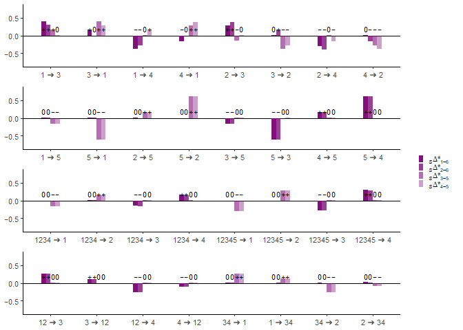
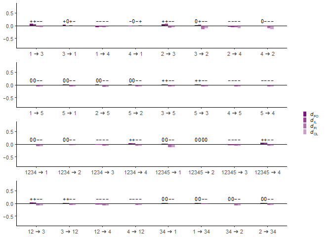
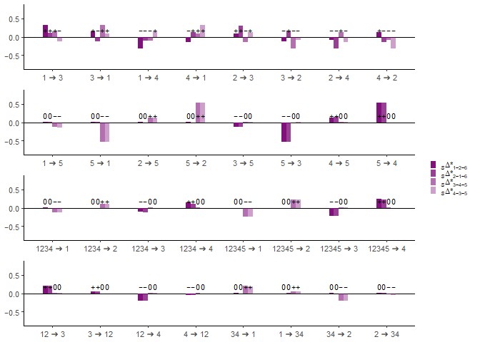
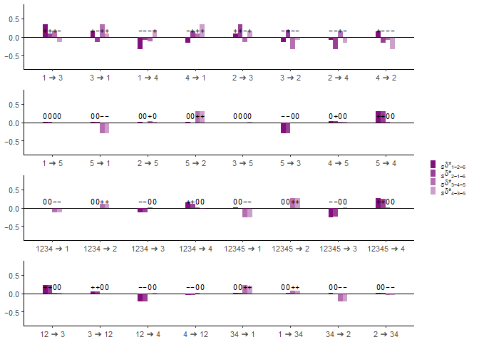

Dependence on the synchronization assumption (2)
================
Kalle Leppälä

## Simulating conditions that could justify the synchronization assumption (2) with ancient data

We simulate 1,000,000 independent allelic patterns in 7 phylogenetic
trees, see [tools.md](tools.md). The default tree is
$S = (((1,2),(3,4)),5)$ with the gene flow event $4 \rightarrow 5$,
defined using the same parameters as earlier [S_big.md](S_big.md) except
that sample 2 is ancient data from time point 0.25. We expect the
singleton patterns to cause less problems when mutations tend to be old
(if all the mutations happened after the root the sychronization
assumption (2) would in fact be valid). Coalescence events still need to
happen before the root, or all statistics tend towards zero. To achieve
both ends, we simulate collapsing populations where the coalescence rate
slows down with time. Five variations of the default have the effective
population size scaled by factor $\alpha$ in the time interval
$[3, \infty]$ and by the factor $1/\alpha$ in the time interval
$[0, 2]$, where $\alpha \in \{1, 10, 100, 1000, 10000\}$. For the
resampling parameter $T_\text{max}$ we used similar back-of-the-envelope
bounds by a hypoexponential quantile as was calculated in
[S_big.md](S_big.md).

The statistics tested were:

- $D_\text{FI}$ to demonstrate how $D_\text{FOIL}$ is not generally
  compatible with ancient data. Note that the $D_\text{FOIL}$-statistics
  are blind to the event $4 \rightarrow 5$, so sign should be zero
  unless the ancient sample causes problems.

- ${}_S \Delta_{5+7}$ to demonstrate how theose $\Delta$-statistics that
  contain the binomial statistics ${}_S \Delta_7$ are also sensitive to
  2 being an ancient sample. The sign should be zero according to Table
  2 in the main paper.

- ${}_S \Delta_{3-5}$ to show how to fix the issue using only the
  $\Delta$-statistics that don’t rely on the synchronization assumption
  (2). Recall that ${}_S \Delta_{3-5}$ corresponds to $D_\text{FI}$ so
  the sign should be zero.

- ${}_S \Delta_{1-6}$ as a control. According to Table 2 in the main
  paper, $4 \rightarrow 5$ should produce the sign $+$ but slowing
  coalescence rates carry the risk that all statistics lose power.

``` r
tables <- list()
N <- 1000000
mu <- 0.0001

# Constant size
LL <- list(lambda = 1, mu = mu, inhabitants = character(0), samples = list(P1 = 0), switches = list(LR = c(1, 1)))
LR <- list(lambda = 1, mu = mu, inhabitants = character(0), samples = list(P2 = 0.25), switches = list(PO = c(2, 1)))
RL <- list(lambda = 1, mu = mu, inhabitants = character(0), samples = list(P3 = 0), switches = list(RR = c(1, 1)))
RR <- list(lambda = 1, mu = mu, inhabitants = character(0), samples = list(P4 = 0), switches = list(PO = c(2, 1)))
PO <- list(lambda = 1, mu = mu, inhabitants = character(0), samples = list(), switches = list(OG = c(3, 1)))
OG <- list(lambda = 1, mu = mu, inhabitants = character(0), samples = list(P5 = 0), switches = list(RR = c(0.5, 0.1)))
graph <- list(LL = LL, LR = LR, RL = RL, RR = RR, PO = PO, OG = OG)
abbababa <- character(0)
for (k in seq(1, N)) {
  abbababa[k] <- pattern(solve_tree(graph), Tmax = 0.0055)
    while (is.na(abbababa[k]) == TRUE) {abbababa[k] <- pattern(solve_tree(graph), Tmax = 0.0055)}
}
table <- table(abbababa)
tables[[length(tables) + 1]] <- table
# Shrinking
LL <- list(lambda = 10, mu = mu, inhabitants = character(0), samples = list(P1 = 0), switches = list(LR = c(1, 1)))
LR <- list(lambda = 10, mu = mu, inhabitants = character(0), samples = list(P2 = 0.25), switches = list(PO = c(2, 1)))
RL <- list(lambda = 10, mu = mu, inhabitants = character(0), samples = list(P3 = 0), switches = list(RR = c(1, 1)))
RR <- list(lambda = 10, mu = mu, inhabitants = character(0), samples = list(P4 = 0), switches = list(PO = c(2, 1)))
PO <- list(lambda = 1, mu = mu, inhabitants = character(0), samples = list(), switches = list(OG = c(3, 1)))
OG <- list(lambda = 0.1, mu = mu, inhabitants = character(0), samples = list(P5 = 0), switches = list(RR = c(0.5, 0.1)))
graph <- list(LL = LL, LR = LR, RL = RL, RR = RR, PO = PO, OG = OG)
abbababa <- character(0)
for (k in seq(1, N)) {
  abbababa[k] <- pattern(solve_tree(graph), Tmax = 0.042)
    while (is.na(abbababa[k]) == TRUE) {abbababa[k] <- pattern(solve_tree(graph), Tmax = 0.042)}
}
table <- table(abbababa)
tables[[length(tables) + 1]] <- table
# Shrinking lots
LL <- list(lambda = 100, mu = mu, inhabitants = character(0), samples = list(P1 = 0), switches = list(LR = c(1, 1)))
LR <- list(lambda = 100, mu = mu, inhabitants = character(0), samples = list(P2 = 0.25), switches = list(PO = c(2, 1)))
RL <- list(lambda = 100, mu = mu, inhabitants = character(0), samples = list(P3 = 0), switches = list(RR = c(1, 1)))
RR <- list(lambda = 100, mu = mu, inhabitants = character(0), samples = list(P4 = 0), switches = list(PO = c(2, 1)))
PO <- list(lambda = 1, mu = mu, inhabitants = character(0), samples = list(), switches = list(OG = c(3, 1)))
OG <- list(lambda = 0.01, mu = mu, inhabitants = character(0), samples = list(P5 = 0), switches = list(RR = c(0.5, 0.1)))
graph <- list(LL = LL, LR = LR, RL = RL, RR = RR, PO = PO, OG = OG)
abbababa <- character(0)
for (k in seq(1, N)) {
  abbababa[k] <- pattern(solve_tree(graph), Tmax = 0.40)
    while (is.na(abbababa[k]) == TRUE) {abbababa[k] <- pattern(solve_tree(graph), Tmax = 0.40)}
}
table <- table(abbababa)
tables[[length(tables) + 1]] <- table
# Shrinking lots and lots
LL <- list(lambda = 1000, mu = mu, inhabitants = character(0), samples = list(P1 = 0), switches = list(LR = c(1, 1)))
LR <- list(lambda = 1000, mu = mu, inhabitants = character(0), samples = list(P2 = 0.25), switches = list(PO = c(2, 1)))
RL <- list(lambda = 1000, mu = mu, inhabitants = character(0), samples = list(P3 = 0), switches = list(RR = c(1, 1)))
RR <- list(lambda = 1000, mu = mu, inhabitants = character(0), samples = list(P4 = 0), switches = list(PO = c(2, 1)))
PO <- list(lambda = 1, mu = mu, inhabitants = character(0), samples = list(), switches = list(OG = c(3, 1)))
OG <- list(lambda = 0.001, mu = mu, inhabitants = character(0), samples = list(P5 = 0), switches = list(RR = c(0.5, 0.1)))
graph <- list(LL = LL, LR = LR, RL = RL, RR = RR, PO = PO, OG = OG)
abbababa <- character(0)
for (k in seq(1, N)) {
  abbababa[k] <- pattern(solve_tree(graph), Tmax = 3.97)
    while (is.na(abbababa[k]) == TRUE) {abbababa[k] <- pattern(solve_tree(graph), Tmax = 3.97)}
}
table <- table(abbababa)
tables[[length(tables) + 1]] <- table

# Shrinking lots and lots and lots
LL <- list(lambda = 10000, mu = mu, inhabitants = character(0), samples = list(P1 = 0), switches = list(LR = c(1, 1)))
LR <- list(lambda = 10000, mu = mu, inhabitants = character(0), samples = list(P2 = 0.25), switches = list(PO = c(2, 1)))
RL <- list(lambda = 10000, mu = mu, inhabitants = character(0), samples = list(P3 = 0), switches = list(RR = c(1, 1)))
RR <- list(lambda = 10000, mu = mu, inhabitants = character(0), samples = list(P4 = 0), switches = list(PO = c(2, 1)))
PO <- list(lambda = 1, mu = mu, inhabitants = character(0), samples = list(), switches = list(OG = c(3, 1)))
OG <- list(lambda = 0.0001, mu = mu, inhabitants = character(0), samples = list(P5 = 0), switches = list(RR = c(0.5, 0.1)))
graph <- list(LL = LL, LR = LR, RL = RL, RR = RR, PO = PO, OG = OG)
abbababa <- character(0)
for (k in seq(1, N)) {
  abbababa[k] <- pattern(solve_tree(graph), Tmax = 39.62)
    while (is.na(abbababa[k]) == TRUE) {abbababa[k] <- pattern(solve_tree(graph), Tmax = 39.62)}
}
table <- table(abbababa)
tables[[length(tables) + 1]] <- table

event <- character(0)
statistic <- character(0)
value <- numeric(0)
zvalue <- numeric(0)
sign <- numeric(0)

# Constant size
table <- tables[[1]]
event <- c(event, rep("neutral", 4))
statistic <- c(statistic, "DFI", "DS57", "DS35", "DS16")
value <- c(value, DFI(table)[[1]], DS57(table)[[1]], DS35(table)[[1]], DS16(table)[[1]])
zvalue <- c(zvalue, DFI(table)[[2]], DS57(table)[[2]], DS35(table)[[2]], DS16(table)[[2]])
sign <- c(sign, DFI(table)[[3]], DS57(table)[[3]], DS35(table)[[3]], DS16(table)[[3]])
# Shrinking
table <- tables[[2]]
event <- c(event, rep("shrinking", 4))
statistic <- c(statistic, "DFI", "DS57", "DS35", "DS16")
value <- c(value, DFI(table)[[1]], DS57(table)[[1]], DS35(table)[[1]], DS16(table)[[1]])
zvalue <- c(zvalue, DFI(table)[[2]], DS57(table)[[2]], DS35(table)[[2]], DS16(table)[[2]])
sign <- c(sign, DFI(table)[[3]], DS57(table)[[3]], DS35(table)[[3]], DS16(table)[[3]])
# Shrinking lots
table <- tables[[3]]
event <- c(event, rep("shrinking lots", 4))
statistic <- c(statistic, "DFI", "DS57", "DS35", "DS16")
value <- c(value, DFI(table)[[1]], DS57(table)[[1]], DS35(table)[[1]], DS16(table)[[1]])
zvalue <- c(zvalue, DFI(table)[[2]], DS57(table)[[2]], DS35(table)[[2]], DS16(table)[[2]])
sign <- c(sign, DFI(table)[[3]], DS57(table)[[3]], DS35(table)[[3]], DS16(table)[[3]])
# Shrinking lots and lots
table <- tables[[4]]
event <- c(event, rep("shrinking lots and lots", 4))
statistic <- c(statistic, "DFI", "DS57", "DS35", "DS16")
value <- c(value, DFI(table)[[1]], DS57(table)[[1]], DS35(table)[[1]], DS16(table)[[1]])
zvalue <- c(zvalue, DFI(table)[[2]], DS57(table)[[2]], DS35(table)[[2]], DS16(table)[[2]])
sign <- c(sign, DFI(table)[[3]], DS57(table)[[3]], DS35(table)[[3]], DS16(table)[[3]])
# Shrinking lots and lots
table <- tables[[5]]
event <- c(event, rep("shrinking lots and lots and lots", 4))
statistic <- c(statistic, "DFI", "DS57", "DS35", "DS16")
value <- c(value, DFI(table)[[1]], DS57(table)[[1]], DS35(table)[[1]], DS16(table)[[1]])
zvalue <- c(zvalue, DFI(table)[[2]], DS57(table)[[2]], DS35(table)[[2]], DS16(table)[[2]])
sign <- c(sign, DFI(table)[[3]], DS57(table)[[3]], DS35(table)[[3]], DS16(table)[[3]])

dependence_table <- data.frame(event = event, statistic = statistic, value = value, zvalue = zvalue, sign = sign)
save(dependence_table, file = "dependence_table.RData")
print(dependence_table)
```

    ##                               event statistic        value      zvalue sign
    ## 1                           neutral       DFI -0.063486205 -32.7146825    -
    ## 2                           neutral      DS57  0.065310534  33.2423560    +
    ## 3                           neutral      DS35  0.002997492   0.3832455    0
    ## 4                           neutral      DS16  0.162807048  24.5601326    +
    ## 5                         shrinking       DFI -0.123712706 -30.4036402    -
    ## 6                         shrinking      DS57  0.123737290  30.4066610    +
    ## 7                         shrinking      DS35  0.032258065   0.4016097    0
    ## 8                         shrinking      DS16  0.894798364  37.0126505    +
    ## 9                    shrinking lots       DFI -0.136085818 -12.1848113    -
    ## 10                   shrinking lots      DS57  0.135978044  12.1744022    +
    ## 11                   shrinking lots      DS35  0.103448276   1.2456822    0
    ## 12                   shrinking lots      DS16  0.600000000  11.7728501    +
    ## 13          shrinking lots and lots       DFI -0.142857143  -4.7358813    -
    ## 14          shrinking lots and lots      DS57  0.142857143   4.7358813    +
    ## 15          shrinking lots and lots      DS35 -0.015625000  -0.1767767    0
    ## 16          shrinking lots and lots      DS16  0.157894737   2.1764288    0
    ## 17 shrinking lots and lots and lots       DFI -0.128440367  -2.6819136    -
    ## 18 shrinking lots and lots and lots      DS57  0.128440367   2.6819136    +
    ## 19 shrinking lots and lots and lots      DS35 -0.172932331  -1.9943529    0
    ## 20 shrinking lots and lots and lots      DS16  0.071770335   1.0375717    0

## Simulating the 32 admixture scenarios with an ancient sample in the symmetric tree $S$

We repeat the gene tree described in [S_big.md](S_big.md) but with
lineage 2 only existing from time point 0.25 onward.

``` r
tables <- list()
lambda <- 1
mu <- 0.0001
N <- 1000000

# 1 -> 3
LL <- list(lambda = lambda, mu = mu, inhabitants = character(0), samples = list(P1 = 0), switches = list(LR = c(1, 1)))
LR <- list(lambda = lambda, mu = mu, inhabitants = character(0), samples = list(P2 = 0.25), switches = list(RR = c(2, 1)))
RL <- list(lambda = lambda, mu = mu, inhabitants = character(0), samples = list(P3 = 0), switches = list(RR = c(1, 1), LL = c(0.5, 0.1)))
RR <- list(lambda = lambda, mu = mu, inhabitants = character(0), samples = list(P4 = 0), switches = list(OG = c(3, 1)))
OG <- list(lambda = lambda, mu = mu, inhabitants = character(0), samples = list(P5 = 0), switches = list())
graph <- list(LL = LL, LR = LR, RL = RL, RR = RR, OG = OG)
abbababa <- character(0)
for (k in seq(1, N)) {
  abbababa[k] <- pattern(solve_tree(graph), Tmax = 0.0055)
    while (is.na(abbababa[k]) == TRUE) {abbababa[k] <- pattern(solve_tree(graph), Tmax = 0.0055)}
}
table <- table(abbababa)
tables[[length(tables) + 1]] <- table
# 3 -> 1
LL <- list(lambda = lambda, mu = mu, inhabitants = character(0), samples = list(P1 = 0), switches = list(LR = c(1, 1), RL = c(0.5, 0.1)))
LR <- list(lambda = lambda, mu = mu, inhabitants = character(0), samples = list(P2 = 0.25), switches = list(RR = c(2, 1)))
RL <- list(lambda = lambda, mu = mu, inhabitants = character(0), samples = list(P3 = 0), switches = list(RR = c(1, 1)))
RR <- list(lambda = lambda, mu = mu, inhabitants = character(0), samples = list(P4 = 0), switches = list(OG = c(3, 1)))
OG <- list(lambda = lambda, mu = mu, inhabitants = character(0), samples = list(P5 = 0), switches = list())
graph <- list(LL = LL, LR = LR, RL = RL, RR = RR, OG = OG)
abbababa <- character(0)
for (k in seq(1, N)) {
  abbababa[k] <- pattern(solve_tree(graph), Tmax = 0.0055)
    while (is.na(abbababa[k]) == TRUE) {abbababa[k] <- pattern(solve_tree(graph), Tmax = 0.0055)}
}
table <- table(abbababa)
tables[[length(tables) + 1]] <- table
# 1 -> 4
LL <- list(lambda = lambda, mu = mu, inhabitants = character(0), samples = list(P1 = 0), switches = list(LR = c(1, 1)))
LR <- list(lambda = lambda, mu = mu, inhabitants = character(0), samples = list(P2 = 0.25), switches = list(RR = c(2, 1)))
RL <- list(lambda = lambda, mu = mu, inhabitants = character(0), samples = list(P3 = 0), switches = list(RR = c(1, 1)))
RR <- list(lambda = lambda, mu = mu, inhabitants = character(0), samples = list(P4 = 0), switches = list(OG = c(3, 1), LL = c(0.5, 0.1)))
OG <- list(lambda = lambda, mu = mu, inhabitants = character(0), samples = list(P5 = 0), switches = list())
graph <- list(LL = LL, LR = LR, RL = RL, RR = RR, OG = OG)
abbababa <- character(0)
for (k in seq(1, N)) {
  abbababa[k] <- pattern(solve_tree(graph), Tmax = 0.0055)
    while (is.na(abbababa[k]) == TRUE) {abbababa[k] <- pattern(solve_tree(graph), Tmax = 0.0055)}
}
table <- table(abbababa)
tables[[length(tables) + 1]] <- table
# 4 -> 1
LL <- list(lambda = lambda, mu = mu, inhabitants = character(0), samples = list(P1 = 0), switches = list(LR = c(1, 1), RR = c(0.5, 0.1)))
LR <- list(lambda = lambda, mu = mu, inhabitants = character(0), samples = list(P2 = 0.25), switches = list(RR = c(2, 1)))
RL <- list(lambda = lambda, mu = mu, inhabitants = character(0), samples = list(P3 = 0), switches = list(RR = c(1, 1)))
RR <- list(lambda = lambda, mu = mu, inhabitants = character(0), samples = list(P4 = 0), switches = list(OG = c(3, 1)))
OG <- list(lambda = lambda, mu = mu, inhabitants = character(0), samples = list(P5 = 0), switches = list())
graph <- list(LL = LL, LR = LR, RL = RL, RR = RR, OG = OG)
abbababa <- character(0)
for (k in seq(1, N)) {
  abbababa[k] <- pattern(solve_tree(graph), Tmax = 0.0055)
    while (is.na(abbababa[k]) == TRUE) {abbababa[k] <- pattern(solve_tree(graph), Tmax = 0.0055)}
}
table <- table(abbababa)
tables[[length(tables) + 1]] <- table
# 2 -> 3
LL <- list(lambda = lambda, mu = mu, inhabitants = character(0), samples = list(P1 = 0), switches = list(LR = c(1, 1)))
LR <- list(lambda = lambda, mu = mu, inhabitants = character(0), samples = list(P2 = 0.25), switches = list(RR = c(2, 1)))
RL <- list(lambda = lambda, mu = mu, inhabitants = character(0), samples = list(P3 = 0), switches = list(RR = c(1, 1), LR = c(0.5, 0.1)))
RR <- list(lambda = lambda, mu = mu, inhabitants = character(0), samples = list(P4 = 0), switches = list(OG = c(3, 1)))
OG <- list(lambda = lambda, mu = mu, inhabitants = character(0), samples = list(P5 = 0), switches = list())
graph <- list(LL = LL, LR = LR, RL = RL, RR = RR, OG = OG)
abbababa <- character(0)
for (k in seq(1, N)) {
  abbababa[k] <- pattern(solve_tree(graph), Tmax = 0.0055)
    while (is.na(abbababa[k]) == TRUE) {abbababa[k] <- pattern(solve_tree(graph), Tmax = 0.0055)}
}
table <- table(abbababa)
tables[[length(tables) + 1]] <- table
# 3 -> 2
LL <- list(lambda = lambda, mu = mu, inhabitants = character(0), samples = list(P1 = 0), switches = list(LR = c(1, 1)))
LR <- list(lambda = lambda, mu = mu, inhabitants = character(0), samples = list(P2 = 0.25), switches = list(RR = c(2, 1), RL = c(0.5, 0.1)))
RL <- list(lambda = lambda, mu = mu, inhabitants = character(0), samples = list(P3 = 0), switches = list(RR = c(1, 1)))
RR <- list(lambda = lambda, mu = mu, inhabitants = character(0), samples = list(P4 = 0), switches = list(OG = c(3, 1)))
OG <- list(lambda = lambda, mu = mu, inhabitants = character(0), samples = list(P5 = 0), switches = list())
graph <- list(LL = LL, LR = LR, RL = RL, RR = RR, OG = OG)
abbababa <- character(0)
for (k in seq(1, N)) {
  abbababa[k] <- pattern(solve_tree(graph), Tmax = 0.0055)
    while (is.na(abbababa[k]) == TRUE) {abbababa[k] <- pattern(solve_tree(graph), Tmax = 0.0055)}
}
table <- table(abbababa)
tables[[length(tables) + 1]] <- table
# 2 -> 4
LL <- list(lambda = lambda, mu = mu, inhabitants = character(0), samples = list(P1 = 0), switches = list(LR = c(1, 1)))
LR <- list(lambda = lambda, mu = mu, inhabitants = character(0), samples = list(P2 = 0.25), switches = list(RR = c(2, 1)))
RL <- list(lambda = lambda, mu = mu, inhabitants = character(0), samples = list(P3 = 0), switches = list(RR = c(1, 1)))
RR <- list(lambda = lambda, mu = mu, inhabitants = character(0), samples = list(P4 = 0), switches = list(OG = c(3, 1), LR = c(0.5, 0.1)))
OG <- list(lambda = lambda, mu = mu, inhabitants = character(0), samples = list(P5 = 0), switches = list())
graph <- list(LL = LL, LR = LR, RL = RL, RR = RR, OG = OG)
abbababa <- character(0)
for (k in seq(1, N)) {
  abbababa[k] <- pattern(solve_tree(graph), Tmax = 0.0055)
    while (is.na(abbababa[k]) == TRUE) {abbababa[k] <- pattern(solve_tree(graph), Tmax = 0.0055)}
}
table <- table(abbababa)
tables[[length(tables) + 1]] <- table
# 4 -> 2
LL <- list(lambda = lambda, mu = mu, inhabitants = character(0), samples = list(P1 = 0), switches = list(LR = c(1, 1)))
LR <- list(lambda = lambda, mu = mu, inhabitants = character(0), samples = list(P2 = 0.25), switches = list(RL = c(2, 1), RR = c(0.5, 0.1)))
RL <- list(lambda = lambda, mu = mu, inhabitants = character(0), samples = list(P3 = 0), switches = list(OG = c(3, 1)))
RR <- list(lambda = lambda, mu = mu, inhabitants = character(0), samples = list(P4 = 0), switches = list(RL = c(1, 1)))
OG <- list(lambda = lambda, mu = mu, inhabitants = character(0), samples = list(P5 = 0), switches = list())
graph <- list(LL = LL, LR = LR, RL = RL, RR = RR, OG = OG)
abbababa <- character(0)
for (k in seq(1, N)) {
  abbababa[k] <- pattern(solve_tree(graph), Tmax = 0.0055)
    while (is.na(abbababa[k]) == TRUE) {abbababa[k] <- pattern(solve_tree(graph), Tmax = 0.0055)}
}
table <- table(abbababa)
tables[[length(tables) + 1]] <- table
# 12 -> 3
LL <- list(lambda = lambda, mu = mu, inhabitants = character(0), samples = list(P1 = 0), switches = list(LR = c(0.75, 1)))
LR <- list(lambda = lambda, mu = mu, inhabitants = character(0), samples = list(P2 = 0.25), switches = list(RR = c(2.25, 1)))
RL <- list(lambda = lambda, mu = mu, inhabitants = character(0), samples = list(P3 = 0), switches = list(RR = c(1.5, 1), LR = c(1.125, 0.1)))
RR <- list(lambda = lambda, mu = mu, inhabitants = character(0), samples = list(P4 = 0), switches = list(OG = c(3, 1)))
OG <- list(lambda = lambda, mu = mu, inhabitants = character(0), samples = list(P5 = 0), switches = list())
graph <- list(LL = LL, LR = LR, RL = RL, RR = RR, OG = OG)
abbababa <- character(0)
for (k in seq(1, N)) {
  abbababa[k] <- pattern(solve_tree(graph), Tmax = 0.0055)
    while (is.na(abbababa[k]) == TRUE) {abbababa[k] <- pattern(solve_tree(graph), Tmax = 0.0055)}
}
table <- table(abbababa)
tables[[length(tables) + 1]] <- table
# 3 -> 12
LL <- list(lambda = lambda, mu = mu, inhabitants = character(0), samples = list(P1 = 0), switches = list(LR = c(0.75, 1)))
LR <- list(lambda = lambda, mu = mu, inhabitants = character(0), samples = list(P2 = 0.25), switches = list(RR = c(2.25, 1), RL = c(1.125, 0.1)))
RL <- list(lambda = lambda, mu = mu, inhabitants = character(0), samples = list(P3 = 0), switches = list(RR = c(1.5, 1)))
RR <- list(lambda = lambda, mu = mu, inhabitants = character(0), samples = list(P4 = 0), switches = list(OG = c(3, 1)))
OG <- list(lambda = lambda, mu = mu, inhabitants = character(0), samples = list(P5 = 0), switches = list())
graph <- list(LL = LL, LR = LR, RL = RL, RR = RR, OG = OG)
abbababa <- character(0)
for (k in seq(1, N)) {
  abbababa[k] <- pattern(solve_tree(graph), Tmax = 0.0055)
    while (is.na(abbababa[k]) == TRUE) {abbababa[k] <- pattern(solve_tree(graph), Tmax = 0.0055)}
}
table <- table(abbababa)
tables[[length(tables) + 1]] <- table
# 12 -> 4
LL <- list(lambda = lambda, mu = mu, inhabitants = character(0), samples = list(P1 = 0), switches = list(LR = c(0.75, 1)))
LR <- list(lambda = lambda, mu = mu, inhabitants = character(0), samples = list(P2 = 0.25), switches = list(RR = c(2.25, 1)))
RL <- list(lambda = lambda, mu = mu, inhabitants = character(0), samples = list(P3 = 0), switches = list(RR = c(1.5, 1)))
RR <- list(lambda = lambda, mu = mu, inhabitants = character(0), samples = list(P4 = 0), switches = list(OG = c(3, 1), LR = c(1.125, 0.1)))
OG <- list(lambda = lambda, mu = mu, inhabitants = character(0), samples = list(P5 = 0), switches = list())
graph <- list(LL = LL, LR = LR, RL = RL, RR = RR, OG = OG)
abbababa <- character(0)
for (k in seq(1, N)) {
  abbababa[k] <- pattern(solve_tree(graph), Tmax = 0.0055)
    while (is.na(abbababa[k]) == TRUE) {abbababa[k] <- pattern(solve_tree(graph), Tmax = 0.0055)}
}
table <- table(abbababa)
tables[[length(tables) + 1]] <- table
# 4 -> 12
LL <- list(lambda = lambda, mu = mu, inhabitants = character(0), samples = list(P1 = 0), switches = list(LR = c(0.75, 1)))
LR <- list(lambda = lambda, mu = mu, inhabitants = character(0), samples = list(P2 = 0.25), switches = list(RL = c(2.25, 1), RR = c(1.125, 0.1)))
RL <- list(lambda = lambda, mu = mu, inhabitants = character(0), samples = list(P3 = 0), switches = list(OG = c(3, 1)))
RR <- list(lambda = lambda, mu = mu, inhabitants = character(0), samples = list(P4 = 0), switches = list(RL = c(1.5, 1)))
OG <- list(lambda = lambda, mu = mu, inhabitants = character(0), samples = list(P5 = 0), switches = list())
graph <- list(LL = LL, LR = LR, RL = RL, RR = RR, OG = OG)
abbababa <- character(0)
for (k in seq(1, N)) {
  abbababa[k] <- pattern(solve_tree(graph), Tmax = 0.0055)
    while (is.na(abbababa[k]) == TRUE) {abbababa[k] <- pattern(solve_tree(graph), Tmax = 0.0055)}
}
table <- table(abbababa)
tables[[length(tables) + 1]] <- table
# 34 -> 1
LL <- list(lambda = lambda, mu = mu, inhabitants = character(0), samples = list(P1 = 0), switches = list(LR = c(1.5, 1), RR = c(1.125, 0.1)))
LR <- list(lambda = lambda, mu = mu, inhabitants = character(0), samples = list(P2 = 0.25), switches = list(RR = c(2.25, 1)))
RL <- list(lambda = lambda, mu = mu, inhabitants = character(0), samples = list(P3 = 0), switches = list(RR = c(0.75, 1)))
RR <- list(lambda = lambda, mu = mu, inhabitants = character(0), samples = list(P4 = 0), switches = list(OG = c(3, 1)))
OG <- list(lambda = lambda, mu = mu, inhabitants = character(0), samples = list(P5 = 0), switches = list())
graph <- list(LL = LL, LR = LR, RL = RL, RR = RR, OG = OG)
abbababa <- character(0)
for (k in seq(1, N)) {
  abbababa[k] <- pattern(solve_tree(graph), Tmax = 0.0055)
    while (is.na(abbababa[k]) == TRUE) {abbababa[k] <- pattern(solve_tree(graph), Tmax = 0.0055)}
}
table <- table(abbababa)
tables[[length(tables) + 1]] <- table
# 1 -> 34
LL <- list(lambda = lambda, mu = mu, inhabitants = character(0), samples = list(P1 = 0), switches = list(LR = c(1.5, 1)))
LR <- list(lambda = lambda, mu = mu, inhabitants = character(0), samples = list(P2 = 0.25), switches = list(RR = c(2.25, 1)))
RL <- list(lambda = lambda, mu = mu, inhabitants = character(0), samples = list(P3 = 0), switches = list(RR = c(0.75, 1)))
RR <- list(lambda = lambda, mu = mu, inhabitants = character(0), samples = list(P4 = 0), switches = list(OG = c(3, 1), LL = c(1.125, 0.1)))
OG <- list(lambda = lambda, mu = mu, inhabitants = character(0), samples = list(P5 = 0), switches = list())
graph <- list(LL = LL, LR = LR, RL = RL, RR = RR, OG = OG)
abbababa <- character(0)
for (k in seq(1, N)) {
  abbababa[k] <- pattern(solve_tree(graph), Tmax = 0.0055)
    while (is.na(abbababa[k]) == TRUE) {abbababa[k] <- pattern(solve_tree(graph), Tmax = 0.0055)}
}
table <- table(abbababa)
tables[[length(tables) + 1]] <- table
# 34 -> 2
LL <- list(lambda = lambda, mu = mu, inhabitants = character(0), samples = list(P1 = 0), switches = list(RR = c(2.25, 1)))
LR <- list(lambda = lambda, mu = mu, inhabitants = character(0), samples = list(P2 = 0.25), switches = list(LL = c(1.5, 1), RR = c(1.125, 0.1)))
RL <- list(lambda = lambda, mu = mu, inhabitants = character(0), samples = list(P3 = 0), switches = list(RR = c(0.75, 1)))
RR <- list(lambda = lambda, mu = mu, inhabitants = character(0), samples = list(P4 = 0), switches = list(OG = c(3, 1)))
OG <- list(lambda = lambda, mu = mu, inhabitants = character(0), samples = list(P5 = 0), switches = list())
graph <- list(LL = LL, LR = LR, RL = RL, RR = RR, OG = OG)
abbababa <- character(0)
for (k in seq(1, N)) {
  abbababa[k] <- pattern(solve_tree(graph), Tmax = 0.0055)
    while (is.na(abbababa[k]) == TRUE) {abbababa[k] <- pattern(solve_tree(graph), Tmax = 0.0055)}
}
table <- table(abbababa)
tables[[length(tables) + 1]] <- table
# 2 -> 34
LL <- list(lambda = lambda, mu = mu, inhabitants = character(0), samples = list(P1 = 0), switches = list(LR = c(1.5, 1)))
LR <- list(lambda = lambda, mu = mu, inhabitants = character(0), samples = list(P2 = 0.25), switches = list(RR = c(2.25, 1)))
RL <- list(lambda = lambda, mu = mu, inhabitants = character(0), samples = list(P3 = 0), switches = list(RR = c(0.75, 1)))
RR <- list(lambda = lambda, mu = mu, inhabitants = character(0), samples = list(P4 = 0), switches = list(OG = c(3, 1), LR = c(1.125, 0.1)))
OG <- list(lambda = lambda, mu = mu, inhabitants = character(0), samples = list(P5 = 0), switches = list())
graph <- list(LL = LL, LR = LR, RL = RL, RR = RR, OG = OG)
abbababa <- character(0)
for (k in seq(1, N)) {
  abbababa[k] <- pattern(solve_tree(graph), Tmax = 0.0055)
    while (is.na(abbababa[k]) == TRUE) {abbababa[k] <- pattern(solve_tree(graph), Tmax = 0.0055)}
}
table <- table(abbababa)
tables[[length(tables) + 1]] <- table
# 1 -> 5
LL <- list(lambda = lambda, mu = mu, inhabitants = character(0), samples = list(P1 = 0), switches = list(LR = c(1, 1)))
LR <- list(lambda = lambda, mu = mu, inhabitants = character(0), samples = list(P2 = 0.25), switches = list(RR = c(2, 1)))
RL <- list(lambda = lambda, mu = mu, inhabitants = character(0), samples = list(P3 = 0), switches = list(RR = c(1, 1)))
RR <- list(lambda = lambda, mu = mu, inhabitants = character(0), samples = list(P4 = 0), switches = list(OG = c(3, 1)))
OG <- list(lambda = lambda, mu = mu, inhabitants = character(0), samples = list(P5 = 0), switches = list(LL = c(0.5, 0.1)))
graph <- list(LL = LL, LR = LR, RL = RL, RR = RR, OG = OG)
abbababa <- character(0)
for (k in seq(1, N)) {
  abbababa[k] <- pattern(solve_tree(graph), Tmax = 0.0055)
    while (is.na(abbababa[k]) == TRUE) {abbababa[k] <- pattern(solve_tree(graph), Tmax = 0.0055)}
}
table <- table(abbababa)
tables[[length(tables) + 1]] <- table
# 5 -> 1
LL <- list(lambda = lambda, mu = mu, inhabitants = character(0), samples = list(P1 = 0), switches = list(LR = c(1, 1), OG = c(0.5, 0.1)))
LR <- list(lambda = lambda, mu = mu, inhabitants = character(0), samples = list(P2 = 0.25), switches = list(RR = c(2, 1)))
RL <- list(lambda = lambda, mu = mu, inhabitants = character(0), samples = list(P3 = 0), switches = list(RR = c(1, 1)))
RR <- list(lambda = lambda, mu = mu, inhabitants = character(0), samples = list(P4 = 0), switches = list(OG = c(3, 1)))
OG <- list(lambda = lambda, mu = mu, inhabitants = character(0), samples = list(P5 = 0), switches = list())
graph <- list(LL = LL, LR = LR, RL = RL, RR = RR, OG = OG)
abbababa <- character(0)
for (k in seq(1, N)) {
  abbababa[k] <- pattern(solve_tree(graph), Tmax = 0.0055)
    while (is.na(abbababa[k]) == TRUE) {abbababa[k] <- pattern(solve_tree(graph), Tmax = 0.0055)}
}
table <- table(abbababa)
tables[[length(tables) + 1]] <- table
# 2 -> 5
LL <- list(lambda = lambda, mu = mu, inhabitants = character(0), samples = list(P1 = 0), switches = list(LR = c(1, 1)))
LR <- list(lambda = lambda, mu = mu, inhabitants = character(0), samples = list(P2 = 0.25), switches = list(RR = c(2, 1)))
RL <- list(lambda = lambda, mu = mu, inhabitants = character(0), samples = list(P3 = 0), switches = list(RR = c(1, 1)))
RR <- list(lambda = lambda, mu = mu, inhabitants = character(0), samples = list(P4 = 0), switches = list(OG = c(3, 1)))
OG <- list(lambda = lambda, mu = mu, inhabitants = character(0), samples = list(P5 = 0), switches = list(LR = c(0.5, 0.1)))
graph <- list(LL = LL, LR = LR, RL = RL, RR = RR, OG = OG)
abbababa <- character(0)
for (k in seq(1, N)) {
  abbababa[k] <- pattern(solve_tree(graph), Tmax = 0.0055)
    while (is.na(abbababa[k]) == TRUE) {abbababa[k] <- pattern(solve_tree(graph), Tmax = 0.0055)}
}
table <- table(abbababa)
tables[[length(tables) + 1]] <- table
# 5 -> 2
LL <- list(lambda = lambda, mu = mu, inhabitants = character(0), samples = list(P1 = 0), switches = list(LR = c(1, 1)))
LR <- list(lambda = lambda, mu = mu, inhabitants = character(0), samples = list(P2 = 0.25), switches = list(RR = c(2, 1), OG = c(0.5, 0.1)))
RL <- list(lambda = lambda, mu = mu, inhabitants = character(0), samples = list(P3 = 0), switches = list(RR = c(1, 1)))
RR <- list(lambda = lambda, mu = mu, inhabitants = character(0), samples = list(P4 = 0), switches = list(OG = c(3, 1)))
OG <- list(lambda = lambda, mu = mu, inhabitants = character(0), samples = list(P5 = 0), switches = list())
graph <- list(LL = LL, LR = LR, RL = RL, RR = RR, OG = OG)
abbababa <- character(0)
for (k in seq(1, N)) {
  abbababa[k] <- pattern(solve_tree(graph), Tmax = 0.0055)
    while (is.na(abbababa[k]) == TRUE) {abbababa[k] <- pattern(solve_tree(graph), Tmax = 0.0055)}
}
table <- table(abbababa)
tables[[length(tables) + 1]] <- table
# 3 -> 5
LL <- list(lambda = lambda, mu = mu, inhabitants = character(0), samples = list(P1 = 0), switches = list(LR = c(1, 1)))
LR <- list(lambda = lambda, mu = mu, inhabitants = character(0), samples = list(P2 = 0.25), switches = list(RR = c(2, 1)))
RL <- list(lambda = lambda, mu = mu, inhabitants = character(0), samples = list(P3 = 0), switches = list(RR = c(1, 1)))
RR <- list(lambda = lambda, mu = mu, inhabitants = character(0), samples = list(P4 = 0), switches = list(OG = c(3, 1)))
OG <- list(lambda = lambda, mu = mu, inhabitants = character(0), samples = list(P5 = 0), switches = list(RL = c(0.5, 0.1)))
graph <- list(LL = LL, LR = LR, RL = RL, RR = RR, OG = OG)
abbababa <- character(0)
for (k in seq(1, N)) {
  abbababa[k] <- pattern(solve_tree(graph), Tmax = 0.0055)
    while (is.na(abbababa[k]) == TRUE) {abbababa[k] <- pattern(solve_tree(graph), Tmax = 0.0055)}
}
table <- table(abbababa)
tables[[length(tables) + 1]] <- table
# 5 -> 3
LL <- list(lambda = lambda, mu = mu, inhabitants = character(0), samples = list(P1 = 0), switches = list(LR = c(1, 1)))
LR <- list(lambda = lambda, mu = mu, inhabitants = character(0), samples = list(P2 = 0.25), switches = list(RR = c(2, 1)))
RL <- list(lambda = lambda, mu = mu, inhabitants = character(0), samples = list(P3 = 0), switches = list(RR = c(1, 1), OG = c(0.5, 0.1)))
RR <- list(lambda = lambda, mu = mu, inhabitants = character(0), samples = list(P4 = 0), switches = list(OG = c(3, 1)))
OG <- list(lambda = lambda, mu = mu, inhabitants = character(0), samples = list(P5 = 0), switches = list())
graph <- list(LL = LL, LR = LR, RL = RL, RR = RR, OG = OG)
abbababa <- character(0)
for (k in seq(1, N)) {
  abbababa[k] <- pattern(solve_tree(graph), Tmax = 0.0055)
    while (is.na(abbababa[k]) == TRUE) {abbababa[k] <- pattern(solve_tree(graph), Tmax = 0.0055)}
}
table <- table(abbababa)
tables[[length(tables) + 1]] <- table
# 4 -> 5
LL <- list(lambda = lambda, mu = mu, inhabitants = character(0), samples = list(P1 = 0), switches = list(LR = c(1, 1)))
LR <- list(lambda = lambda, mu = mu, inhabitants = character(0), samples = list(P2 = 0.25), switches = list(RR = c(2, 1)))
RL <- list(lambda = lambda, mu = mu, inhabitants = character(0), samples = list(P3 = 0), switches = list(RR = c(1, 1)))
RR <- list(lambda = lambda, mu = mu, inhabitants = character(0), samples = list(P4 = 0), switches = list(OG = c(3, 1)))
OG <- list(lambda = lambda, mu = mu, inhabitants = character(0), samples = list(P5 = 0), switches = list(RR = c(0.5, 0.1)))
graph <- list(LL = LL, LR = LR, RL = RL, RR = RR, OG = OG)
abbababa <- character(0)
for (k in seq(1, N)) {
  abbababa[k] <- pattern(solve_tree(graph), Tmax = 0.0055)
    while (is.na(abbababa[k]) == TRUE) {abbababa[k] <- pattern(solve_tree(graph), Tmax = 0.0055)}
}
table <- table(abbababa)
tables[[length(tables) + 1]] <- table
# 5 -> 4
LL <- list(lambda = lambda, mu = mu, inhabitants = character(0), samples = list(P1 = 0), switches = list(LR = c(1, 1)))
LR <- list(lambda = lambda, mu = mu, inhabitants = character(0), samples = list(P2 = 0.25), switches = list(RL = c(2, 1)))
RL <- list(lambda = lambda, mu = mu, inhabitants = character(0), samples = list(P3 = 0), switches = list(OG = c(3, 1)))
RR <- list(lambda = lambda, mu = mu, inhabitants = character(0), samples = list(P4 = 0), switches = list(RL = c(1, 1), OG = c(0.5, 0.1)))
OG <- list(lambda = lambda, mu = mu, inhabitants = character(0), samples = list(P5 = 0), switches = list())
graph <- list(LL = LL, LR = LR, RL = RL, RR = RR, OG = OG)
abbababa <- character(0)
for (k in seq(1, N)) {
  abbababa[k] <- pattern(solve_tree(graph), Tmax = 0.0055)
    while (is.na(abbababa[k]) == TRUE) {abbababa[k] <- pattern(solve_tree(graph), Tmax = 0.0055)}
}
table <- table(abbababa)
tables[[length(tables) + 1]] <- table
# 12345 -> 1
LL <- list(lambda = lambda, mu = mu, inhabitants = character(0), samples = list(P1 = 0), switches = list(LR = c(1, 1), GH = c(0.5, 0.1)))
LR <- list(lambda = lambda, mu = mu, inhabitants = character(0), samples = list(P2 = 0.25), switches = list(RR = c(2, 1)))
RL <- list(lambda = lambda, mu = mu, inhabitants = character(0), samples = list(P3 = 0), switches = list(RR = c(1, 1)))
RR <- list(lambda = lambda, mu = mu, inhabitants = character(0), samples = list(P4 = 0), switches = list(OG = c(3, 1)))
OG <- list(lambda = lambda, mu = mu, inhabitants = character(0), samples = list(P5 = 0), switches = list())
GH <- list(lambda = lambda, mu = mu, inhabitants = character(0), samples = list(), switches = list(OG = c(3.5, 1)))
graph <- list(LL = LL, LR = LR, RL = RL, RR = RR, OG = OG, GH = GH)
abbababa <- character(0)
for (k in seq(1, N)) {
  abbababa[k] <- pattern(solve_tree(graph), Tmax = 0.0055)
    while (is.na(abbababa[k]) == TRUE) {abbababa[k] <- pattern(solve_tree(graph), Tmax = 0.0055)}
}
table <- table(abbababa)
tables[[length(tables) + 1]] <- table
# 12345 -> 2
LL <- list(lambda = lambda, mu = mu, inhabitants = character(0), samples = list(P1 = 0), switches = list(LR = c(1, 1)))
LR <- list(lambda = lambda, mu = mu, inhabitants = character(0), samples = list(P2 = 0.25), switches = list(RR = c(2, 1), GH = c(0.5, 0.1)))
RL <- list(lambda = lambda, mu = mu, inhabitants = character(0), samples = list(P3 = 0), switches = list(RR = c(1, 1)))
RR <- list(lambda = lambda, mu = mu, inhabitants = character(0), samples = list(P4 = 0), switches = list(OG = c(3, 1)))
OG <- list(lambda = lambda, mu = mu, inhabitants = character(0), samples = list(P5 = 0), switches = list())
GH <- list(lambda = lambda, mu = mu, inhabitants = character(0), samples = list(), switches = list(OG = c(3.5, 1)))
graph <- list(LL = LL, LR = LR, RL = RL, RR = RR, OG = OG, GH = GH)
abbababa <- character(0)
for (k in seq(1, N)) {
  abbababa[k] <- pattern(solve_tree(graph), Tmax = 0.0055)
    while (is.na(abbababa[k]) == TRUE) {abbababa[k] <- pattern(solve_tree(graph), Tmax = 0.0055)}
}
table <- table(abbababa)
tables[[length(tables) + 1]] <- table
# 12345 -> 3
LL <- list(lambda = lambda, mu = mu, inhabitants = character(0), samples = list(P1 = 0), switches = list(LR = c(1, 1)))
LR <- list(lambda = lambda, mu = mu, inhabitants = character(0), samples = list(P2 = 0.25), switches = list(RR = c(2, 1)))
RL <- list(lambda = lambda, mu = mu, inhabitants = character(0), samples = list(P3 = 0), switches = list(RR = c(1, 1), GH = c(0.5, 0.1)))
RR <- list(lambda = lambda, mu = mu, inhabitants = character(0), samples = list(P4 = 0), switches = list(OG = c(3, 1)))
OG <- list(lambda = lambda, mu = mu, inhabitants = character(0), samples = list(P5 = 0), switches = list())
GH <- list(lambda = lambda, mu = mu, inhabitants = character(0), samples = list(), switches = list(OG = c(3.5, 1)))
graph <- list(LL = LL, LR = LR, RL = RL, RR = RR, OG = OG, GH = GH)
abbababa <- character(0)
for (k in seq(1, N)) {
  abbababa[k] <- pattern(solve_tree(graph), Tmax = 0.0055)
    while (is.na(abbababa[k]) == TRUE) {abbababa[k] <- pattern(solve_tree(graph), Tmax = 0.0055)}
}
table <- table(abbababa)
tables[[length(tables) + 1]] <- table
# 12345 -> 4
LL <- list(lambda = lambda, mu = mu, inhabitants = character(0), samples = list(P1 = 0), switches = list(LR = c(1, 1)))
LR <- list(lambda = lambda, mu = mu, inhabitants = character(0), samples = list(P2 = 0.25), switches = list(RR = c(2, 1)))
RL <- list(lambda = lambda, mu = mu, inhabitants = character(0), samples = list(P3 = 0), switches = list(RR = c(1, 1)))
RR <- list(lambda = lambda, mu = mu, inhabitants = character(0), samples = list(P4 = 0), switches = list(OG = c(3, 1), GH = c(0.5, 0.1)))
OG <- list(lambda = lambda, mu = mu, inhabitants = character(0), samples = list(P5 = 0), switches = list())
GH <- list(lambda = lambda, mu = mu, inhabitants = character(0), samples = list(), switches = list(OG = c(3.5, 1)))
graph <- list(LL = LL, LR = LR, RL = RL, RR = RR, OG = OG, GH = GH)
abbababa <- character(0)
for (k in seq(1, N)) {
  abbababa[k] <- pattern(solve_tree(graph), Tmax = 0.0055)
    while (is.na(abbababa[k]) == TRUE) {abbababa[k] <- pattern(solve_tree(graph), Tmax = 0.0055)}
}
table <- table(abbababa)
tables[[length(tables) + 1]] <- table
# 1234 -> 1
LL <- list(lambda = lambda, mu = mu, inhabitants = character(0), samples = list(P1 = 0), switches = list(LR = c(1, 1), GH = c(0.5, 0.1)))
LR <- list(lambda = lambda, mu = mu, inhabitants = character(0), samples = list(P2 = 0.25), switches = list(RR = c(2, 1)))
RL <- list(lambda = lambda, mu = mu, inhabitants = character(0), samples = list(P3 = 0), switches = list(RR = c(1, 1)))
RR <- list(lambda = lambda, mu = mu, inhabitants = character(0), samples = list(P4 = 0), switches = list(OG = c(3, 1)))
OG <- list(lambda = lambda, mu = mu, inhabitants = character(0), samples = list(P5 = 0), switches = list())
GH <- list(lambda = lambda, mu = mu, inhabitants = character(0), samples = list(), switches = list(RR = c(2.5, 1)))
graph <- list(LL = LL, LR = LR, RL = RL, RR = RR, OG = OG, GH = GH)
abbababa <- character(0)
for (k in seq(1, N)) {
  abbababa[k] <- pattern(solve_tree(graph), Tmax = 0.0055)
    while (is.na(abbababa[k]) == TRUE) {abbababa[k] <- pattern(solve_tree(graph), Tmax = 0.0055)}
}
table <- table(abbababa)
tables[[length(tables) + 1]] <- table
# 1234 -> 2
LL <- list(lambda = lambda, mu = mu, inhabitants = character(0), samples = list(P1 = 0), switches = list(LR = c(1, 1)))
LR <- list(lambda = lambda, mu = mu, inhabitants = character(0), samples = list(P2 = 0.25), switches = list(RR = c(2, 1), GH = c(0.5, 0.1)))
RL <- list(lambda = lambda, mu = mu, inhabitants = character(0), samples = list(P3 = 0), switches = list(RR = c(1, 1)))
RR <- list(lambda = lambda, mu = mu, inhabitants = character(0), samples = list(P4 = 0), switches = list(OG = c(3, 1)))
OG <- list(lambda = lambda, mu = mu, inhabitants = character(0), samples = list(P5 = 0), switches = list())
GH <- list(lambda = lambda, mu = mu, inhabitants = character(0), samples = list(), switches = list(RR = c(2.5, 1)))
graph <- list(LL = LL, LR = LR, RL = RL, RR = RR, OG = OG, GH = GH)
abbababa <- character(0)
for (k in seq(1, N)) {
  abbababa[k] <- pattern(solve_tree(graph), Tmax = 0.0055)
    while (is.na(abbababa[k]) == TRUE) {abbababa[k] <- pattern(solve_tree(graph), Tmax = 0.0055)}
}
table <- table(abbababa)
tables[[length(tables) + 1]] <- table
# 1234 -> 3
LL <- list(lambda = lambda, mu = mu, inhabitants = character(0), samples = list(P1 = 0), switches = list(LR = c(1, 1)))
LR <- list(lambda = lambda, mu = mu, inhabitants = character(0), samples = list(P2 = 0.25), switches = list(RR = c(2, 1)))
RL <- list(lambda = lambda, mu = mu, inhabitants = character(0), samples = list(P3 = 0), switches = list(RR = c(1, 1), GH = c(0.5, 0.1)))
RR <- list(lambda = lambda, mu = mu, inhabitants = character(0), samples = list(P4 = 0), switches = list(OG = c(3, 1)))
OG <- list(lambda = lambda, mu = mu, inhabitants = character(0), samples = list(P5 = 0), switches = list())
GH <- list(lambda = lambda, mu = mu, inhabitants = character(0), samples = list(), switches = list(RR = c(2.5, 1)))
graph <- list(LL = LL, LR = LR, RL = RL, RR = RR, OG = OG, GH = GH)
abbababa <- character(0)
for (k in seq(1, N)) {
  abbababa[k] <- pattern(solve_tree(graph), Tmax = 0.0055)
    while (is.na(abbababa[k]) == TRUE) {abbababa[k] <- pattern(solve_tree(graph), Tmax = 0.0055)}
}
table <- table(abbababa)
tables[[length(tables) + 1]] <- table
# 1234 -> 4
LL <- list(lambda = lambda, mu = mu, inhabitants = character(0), samples = list(P1 = 0), switches = list(LR = c(1, 1)))
LR <- list(lambda = lambda, mu = mu, inhabitants = character(0), samples = list(P2 = 0.25), switches = list(RR = c(2, 1)))
RL <- list(lambda = lambda, mu = mu, inhabitants = character(0), samples = list(P3 = 0), switches = list(RR = c(1, 1)))
RR <- list(lambda = lambda, mu = mu, inhabitants = character(0), samples = list(P4 = 0), switches = list(OG = c(3, 1), GH = c(0.5, 0.1)))
OG <- list(lambda = lambda, mu = mu, inhabitants = character(0), samples = list(P5 = 0), switches = list())
GH <- list(lambda = lambda, mu = mu, inhabitants = character(0), samples = list(), switches = list(RR = c(2.5, 1)))
graph <- list(LL = LL, LR = LR, RL = RL, RR = RR, OG = OG, GH = GH)
abbababa <- character(0)
for (k in seq(1, N)) {
  abbababa[k] <- pattern(solve_tree(graph), Tmax = 0.0055)
    while (is.na(abbababa[k]) == TRUE) {abbababa[k] <- pattern(solve_tree(graph), Tmax = 0.0055)}
}
table <- table(abbababa)
tables[[length(tables) + 1]] <- table

save(tables, file = "dependence.RData")
```

## Computing the $D_\text{FOIL}$- and $\Delta$-statistics

From the simulated tables of allelic patterns we calculate a data frame
of both the $D_\text{FOIL}$-statistics and the first four
$\Delta$-statistics on tree $S$ with an ancient sample under the 32
admixture scenarios.

``` r
load(file = "dependence.RData")
event <- character(0)
statistic <- character(0)
value <- numeric(0)
zvalue <- numeric(0)
sign <- numeric(0)
ci <- numeric(0)

# 1 -> 3
table <- tables[[1]]
event <- c(event, rep("1 \u2794 3", 8))
statistic <- c(statistic, "DFO", "DIL", "DFI", "DOL", "DS16", "DS26", "DS35", "DS45")
value <- c(value, DFO(table)[[1]], DIL(table)[[1]], DFI(table)[[1]], DOL(table)[[1]],
                  DS16(table)[[1]], DS26(table)[[1]], DS35(table)[[1]], DS45(table)[[1]])
zvalue <- c(zvalue, DFO(table)[[2]], DIL(table)[[2]], DFI(table)[[2]], DOL(table)[[2]],
                    DS16(table)[[2]], DS26(table)[[2]], DS35(table)[[2]], DS45(table)[[2]])
sign <- c(sign, DFO(table)[[3]], DIL(table)[[3]], DFI(table)[[3]], DOL(table)[[3]],
                DS16(table)[[3]], DS26(table)[[3]], DS35(table)[[3]], DS45(table)[[3]])
ci <- c(ci, DFO(table)[[4]], DIL(table)[[4]], DFI(table)[[4]], DOL(table)[[4]],
            DS16(table)[[4]], DS26(table)[[4]], DS35(table)[[4]], DS45(table)[[4]])
# 3 -> 1
table <- tables[[2]]
event <- c(event, rep("3 \u2794 1", 8))
statistic <- c(statistic, "DFO", "DIL", "DFI", "DOL", "DS16", "DS26", "DS35", "DS45")
value <- c(value, DFO(table)[[1]], DIL(table)[[1]], DFI(table)[[1]], DOL(table)[[1]],
                  DS16(table)[[1]], DS26(table)[[1]], DS35(table)[[1]], DS45(table)[[1]])
zvalue <- c(zvalue, DFO(table)[[2]], DIL(table)[[2]], DFI(table)[[2]], DOL(table)[[2]],
                    DS16(table)[[2]], DS26(table)[[2]], DS35(table)[[2]], DS45(table)[[2]])
sign <- c(sign, DFO(table)[[3]], DIL(table)[[3]], DFI(table)[[3]], DOL(table)[[3]],
                DS16(table)[[3]], DS26(table)[[3]], DS35(table)[[3]], DS45(table)[[3]])
ci <- c(ci, DFO(table)[[4]], DIL(table)[[4]], DFI(table)[[4]], DOL(table)[[4]],
            DS16(table)[[4]], DS26(table)[[4]], DS35(table)[[4]], DS45(table)[[4]])
# 1 -> 4
table <- tables[[3]]
event <- c(event, rep("1 \u2794 4", 8))
statistic <- c(statistic, "DFO", "DIL", "DFI", "DOL", "DS16", "DS26", "DS35", "DS45")
value <- c(value, DFO(table)[[1]], DIL(table)[[1]], DFI(table)[[1]], DOL(table)[[1]],
                  DS16(table)[[1]], DS26(table)[[1]], DS35(table)[[1]], DS45(table)[[1]])
zvalue <- c(zvalue, DFO(table)[[2]], DIL(table)[[2]], DFI(table)[[2]], DOL(table)[[2]],
                    DS16(table)[[2]], DS26(table)[[2]], DS35(table)[[2]], DS45(table)[[2]])
sign <- c(sign, DFO(table)[[3]], DIL(table)[[3]], DFI(table)[[3]], DOL(table)[[3]],
                DS16(table)[[3]], DS26(table)[[3]], DS35(table)[[3]], DS45(table)[[3]])
ci <- c(ci, DFO(table)[[4]], DIL(table)[[4]], DFI(table)[[4]], DOL(table)[[4]],
            DS16(table)[[4]], DS26(table)[[4]], DS35(table)[[4]], DS45(table)[[4]])
# 4 -> 1
table <- tables[[4]]
event <- c(event, rep("4 \u2794 1", 8))
statistic <- c(statistic, "DFO", "DIL", "DFI", "DOL", "DS16", "DS26", "DS35", "DS45")
value <- c(value, DFO(table)[[1]], DIL(table)[[1]], DFI(table)[[1]], DOL(table)[[1]],
                  DS16(table)[[1]], DS26(table)[[1]], DS35(table)[[1]], DS45(table)[[1]])
zvalue <- c(zvalue, DFO(table)[[2]], DIL(table)[[2]], DFI(table)[[2]], DOL(table)[[2]],
                    DS16(table)[[2]], DS26(table)[[2]], DS35(table)[[2]], DS45(table)[[2]])
sign <- c(sign, DFO(table)[[3]], DIL(table)[[3]], DFI(table)[[3]], DOL(table)[[3]],
                DS16(table)[[3]], DS26(table)[[3]], DS35(table)[[3]], DS45(table)[[3]])
ci <- c(ci, DFO(table)[[4]], DIL(table)[[4]], DFI(table)[[4]], DOL(table)[[4]],
            DS16(table)[[4]], DS26(table)[[4]], DS35(table)[[4]], DS45(table)[[4]])
# 2 -> 3
table <- tables[[5]]
event <- c(event, rep("2 \u2794 3", 8))
statistic <- c(statistic, "DFO", "DIL", "DFI", "DOL", "DS16", "DS26", "DS35", "DS45")
value <- c(value, DFO(table)[[1]], DIL(table)[[1]], DFI(table)[[1]], DOL(table)[[1]],
                  DS16(table)[[1]], DS26(table)[[1]], DS35(table)[[1]], DS45(table)[[1]])
zvalue <- c(zvalue, DFO(table)[[2]], DIL(table)[[2]], DFI(table)[[2]], DOL(table)[[2]],
                    DS16(table)[[2]], DS26(table)[[2]], DS35(table)[[2]], DS45(table)[[2]])
sign <- c(sign, DFO(table)[[3]], DIL(table)[[3]], DFI(table)[[3]], DOL(table)[[3]],
                DS16(table)[[3]], DS26(table)[[3]], DS35(table)[[3]], DS45(table)[[3]])
ci <- c(ci, DFO(table)[[4]], DIL(table)[[4]], DFI(table)[[4]], DOL(table)[[4]],
            DS16(table)[[4]], DS26(table)[[4]], DS35(table)[[4]], DS45(table)[[4]])
# 3 -> 2
table <- tables[[6]]
event <- c(event, rep("3 \u2794 2", 8))
statistic <- c(statistic, "DFO", "DIL", "DFI", "DOL", "DS16", "DS26", "DS35", "DS45")
value <- c(value, DFO(table)[[1]], DIL(table)[[1]], DFI(table)[[1]], DOL(table)[[1]],
                  DS16(table)[[1]], DS26(table)[[1]], DS35(table)[[1]], DS45(table)[[1]])
zvalue <- c(zvalue, DFO(table)[[2]], DIL(table)[[2]], DFI(table)[[2]], DOL(table)[[2]],
                    DS16(table)[[2]], DS26(table)[[2]], DS35(table)[[2]], DS45(table)[[2]])
sign <- c(sign, DFO(table)[[3]], DIL(table)[[3]], DFI(table)[[3]], DOL(table)[[3]],
                DS16(table)[[3]], DS26(table)[[3]], DS35(table)[[3]], DS45(table)[[3]])
ci <- c(ci, DFO(table)[[4]], DIL(table)[[4]], DFI(table)[[4]], DOL(table)[[4]],
            DS16(table)[[4]], DS26(table)[[4]], DS35(table)[[4]], DS45(table)[[4]])
# 2 -> 4
table <- tables[[7]]
event <- c(event, rep("2 \u2794 4", 8))
statistic <- c(statistic, "DFO", "DIL", "DFI", "DOL", "DS16", "DS26", "DS35", "DS45")
value <- c(value, DFO(table)[[1]], DIL(table)[[1]], DFI(table)[[1]], DOL(table)[[1]],
                  DS16(table)[[1]], DS26(table)[[1]], DS35(table)[[1]], DS45(table)[[1]])
zvalue <- c(zvalue, DFO(table)[[2]], DIL(table)[[2]], DFI(table)[[2]], DOL(table)[[2]],
                    DS16(table)[[2]], DS26(table)[[2]], DS35(table)[[2]], DS45(table)[[2]])
sign <- c(sign, DFO(table)[[3]], DIL(table)[[3]], DFI(table)[[3]], DOL(table)[[3]],
                DS16(table)[[3]], DS26(table)[[3]], DS35(table)[[3]], DS45(table)[[3]])
ci <- c(ci, DFO(table)[[4]], DIL(table)[[4]], DFI(table)[[4]], DOL(table)[[4]],
            DS16(table)[[4]], DS26(table)[[4]], DS35(table)[[4]], DS45(table)[[4]])
# 4 -> 2
table <- tables[[8]]
event <- c(event, rep("4 \u2794 2", 8))
statistic <- c(statistic, "DFO", "DIL", "DFI", "DOL", "DS16", "DS26", "DS35", "DS45")
value <- c(value, DFO(table)[[1]], DIL(table)[[1]], DFI(table)[[1]], DOL(table)[[1]],
                  DS16(table)[[1]], DS26(table)[[1]], DS35(table)[[1]], DS45(table)[[1]])
zvalue <- c(zvalue, DFO(table)[[2]], DIL(table)[[2]], DFI(table)[[2]], DOL(table)[[2]],
                    DS16(table)[[2]], DS26(table)[[2]], DS35(table)[[2]], DS45(table)[[2]])
sign <- c(sign, DFO(table)[[3]], DIL(table)[[3]], DFI(table)[[3]], DOL(table)[[3]],
                DS16(table)[[3]], DS26(table)[[3]], DS35(table)[[3]], DS45(table)[[3]])
ci <- c(ci, DFO(table)[[4]], DIL(table)[[4]], DFI(table)[[4]], DOL(table)[[4]],
            DS16(table)[[4]], DS26(table)[[4]], DS35(table)[[4]], DS45(table)[[4]])
# 12 -> 3
table <- tables[[9]]
event <- c(event, rep("12 \u2794 3", 8))
statistic <- c(statistic, "DFO", "DIL", "DFI", "DOL", "DS16", "DS26", "DS35", "DS45")
value <- c(value, DFO(table)[[1]], DIL(table)[[1]], DFI(table)[[1]], DOL(table)[[1]],
                  DS16(table)[[1]], DS26(table)[[1]], DS35(table)[[1]], DS45(table)[[1]])
zvalue <- c(zvalue, DFO(table)[[2]], DIL(table)[[2]], DFI(table)[[2]], DOL(table)[[2]],
                    DS16(table)[[2]], DS26(table)[[2]], DS35(table)[[2]], DS45(table)[[2]])
sign <- c(sign, DFO(table)[[3]], DIL(table)[[3]], DFI(table)[[3]], DOL(table)[[3]],
                DS16(table)[[3]], DS26(table)[[3]], DS35(table)[[3]], DS45(table)[[3]])
ci <- c(ci, DFO(table)[[4]], DIL(table)[[4]], DFI(table)[[4]], DOL(table)[[4]],
            DS16(table)[[4]], DS26(table)[[4]], DS35(table)[[4]], DS45(table)[[4]])
# 3 -> 12
table <- tables[[10]]
event <- c(event, rep("3 \u2794 12", 8))
statistic <- c(statistic, "DFO", "DIL", "DFI", "DOL", "DS16", "DS26", "DS35", "DS45")
value <- c(value, DFO(table)[[1]], DIL(table)[[1]], DFI(table)[[1]], DOL(table)[[1]],
                  DS16(table)[[1]], DS26(table)[[1]], DS35(table)[[1]], DS45(table)[[1]])
zvalue <- c(zvalue, DFO(table)[[2]], DIL(table)[[2]], DFI(table)[[2]], DOL(table)[[2]],
                    DS16(table)[[2]], DS26(table)[[2]], DS35(table)[[2]], DS45(table)[[2]])
sign <- c(sign, DFO(table)[[3]], DIL(table)[[3]], DFI(table)[[3]], DOL(table)[[3]],
                DS16(table)[[3]], DS26(table)[[3]], DS35(table)[[3]], DS45(table)[[3]])
ci <- c(ci, DFO(table)[[4]], DIL(table)[[4]], DFI(table)[[4]], DOL(table)[[4]],
            DS16(table)[[4]], DS26(table)[[4]], DS35(table)[[4]], DS45(table)[[4]])
# 12 -> 4
table <- tables[[11]]
event <- c(event, rep("12 \u2794 4", 8))
statistic <- c(statistic, "DFO", "DIL", "DFI", "DOL", "DS16", "DS26", "DS35", "DS45")
value <- c(value, DFO(table)[[1]], DIL(table)[[1]], DFI(table)[[1]], DOL(table)[[1]],
                  DS16(table)[[1]], DS26(table)[[1]], DS35(table)[[1]], DS45(table)[[1]])
zvalue <- c(zvalue, DFO(table)[[2]], DIL(table)[[2]], DFI(table)[[2]], DOL(table)[[2]],
                    DS16(table)[[2]], DS26(table)[[2]], DS35(table)[[2]], DS45(table)[[2]])
sign <- c(sign, DFO(table)[[3]], DIL(table)[[3]], DFI(table)[[3]], DOL(table)[[3]],
                DS16(table)[[3]], DS26(table)[[3]], DS35(table)[[3]], DS45(table)[[3]])
ci <- c(ci, DFO(table)[[4]], DIL(table)[[4]], DFI(table)[[4]], DOL(table)[[4]],
            DS16(table)[[4]], DS26(table)[[4]], DS35(table)[[4]], DS45(table)[[4]])
# 4 -> 12
table <- tables[[12]]
event <- c(event, rep("4 \u2794 12", 8))
statistic <- c(statistic, "DFO", "DIL", "DFI", "DOL", "DS16", "DS26", "DS35", "DS45")
value <- c(value, DFO(table)[[1]], DIL(table)[[1]], DFI(table)[[1]], DOL(table)[[1]],
                  DS16(table)[[1]], DS26(table)[[1]], DS35(table)[[1]], DS45(table)[[1]])
zvalue <- c(zvalue, DFO(table)[[2]], DIL(table)[[2]], DFI(table)[[2]], DOL(table)[[2]],
                    DS16(table)[[2]], DS26(table)[[2]], DS35(table)[[2]], DS45(table)[[2]])
sign <- c(sign, DFO(table)[[3]], DIL(table)[[3]], DFI(table)[[3]], DOL(table)[[3]],
                DS16(table)[[3]], DS26(table)[[3]], DS35(table)[[3]], DS45(table)[[3]])
ci <- c(ci, DFO(table)[[4]], DIL(table)[[4]], DFI(table)[[4]], DOL(table)[[4]],
            DS16(table)[[4]], DS26(table)[[4]], DS35(table)[[4]], DS45(table)[[4]])
# 34 -> 1
table <- tables[[13]]
event <- c(event, rep("34 \u2794 1", 8))
statistic <- c(statistic, "DFO", "DIL", "DFI", "DOL", "DS16", "DS26", "DS35", "DS45")
value <- c(value, DFO(table)[[1]], DIL(table)[[1]], DFI(table)[[1]], DOL(table)[[1]],
                  DS16(table)[[1]], DS26(table)[[1]], DS35(table)[[1]], DS45(table)[[1]])
zvalue <- c(zvalue, DFO(table)[[2]], DIL(table)[[2]], DFI(table)[[2]], DOL(table)[[2]],
                    DS16(table)[[2]], DS26(table)[[2]], DS35(table)[[2]], DS45(table)[[2]])
sign <- c(sign, DFO(table)[[3]], DIL(table)[[3]], DFI(table)[[3]], DOL(table)[[3]],
                DS16(table)[[3]], DS26(table)[[3]], DS35(table)[[3]], DS45(table)[[3]])
ci <- c(ci, DFO(table)[[4]], DIL(table)[[4]], DFI(table)[[4]], DOL(table)[[4]],
            DS16(table)[[4]], DS26(table)[[4]], DS35(table)[[4]], DS45(table)[[4]])
# 1 -> 34
table <- tables[[14]]
event <- c(event, rep("1 \u2794 34", 8))
statistic <- c(statistic, "DFO", "DIL", "DFI", "DOL", "DS16", "DS26", "DS35", "DS45")
value <- c(value, DFO(table)[[1]], DIL(table)[[1]], DFI(table)[[1]], DOL(table)[[1]],
                  DS16(table)[[1]], DS26(table)[[1]], DS35(table)[[1]], DS45(table)[[1]])
zvalue <- c(zvalue, DFO(table)[[2]], DIL(table)[[2]], DFI(table)[[2]], DOL(table)[[2]],
                    DS16(table)[[2]], DS26(table)[[2]], DS35(table)[[2]], DS45(table)[[2]])
sign <- c(sign, DFO(table)[[3]], DIL(table)[[3]], DFI(table)[[3]], DOL(table)[[3]],
                DS16(table)[[3]], DS26(table)[[3]], DS35(table)[[3]], DS45(table)[[3]])
ci <- c(ci, DFO(table)[[4]], DIL(table)[[4]], DFI(table)[[4]], DOL(table)[[4]],
            DS16(table)[[4]], DS26(table)[[4]], DS35(table)[[4]], DS45(table)[[4]])
# 34 -> 2
table <- tables[[15]]
event <- c(event, rep("34 \u2794 2", 8))
statistic <- c(statistic, "DFO", "DIL", "DFI", "DOL", "DS16", "DS26", "DS35", "DS45")
value <- c(value, DFO(table)[[1]], DIL(table)[[1]], DFI(table)[[1]], DOL(table)[[1]],
                  DS16(table)[[1]], DS26(table)[[1]], DS35(table)[[1]], DS45(table)[[1]])
zvalue <- c(zvalue, DFO(table)[[2]], DIL(table)[[2]], DFI(table)[[2]], DOL(table)[[2]],
                    DS16(table)[[2]], DS26(table)[[2]], DS35(table)[[2]], DS45(table)[[2]])
sign <- c(sign, DFO(table)[[3]], DIL(table)[[3]], DFI(table)[[3]], DOL(table)[[3]],
                DS16(table)[[3]], DS26(table)[[3]], DS35(table)[[3]], DS45(table)[[3]])
ci <- c(ci, DFO(table)[[4]], DIL(table)[[4]], DFI(table)[[4]], DOL(table)[[4]],
            DS16(table)[[4]], DS26(table)[[4]], DS35(table)[[4]], DS45(table)[[4]])
# 2 -> 34
table <- tables[[16]]
event <- c(event, rep("2 \u2794 34", 8))
statistic <- c(statistic, "DFO", "DIL", "DFI", "DOL", "DS16", "DS26", "DS35", "DS45")
value <- c(value, DFO(table)[[1]], DIL(table)[[1]], DFI(table)[[1]], DOL(table)[[1]],
                  DS16(table)[[1]], DS26(table)[[1]], DS35(table)[[1]], DS45(table)[[1]])
zvalue <- c(zvalue, DFO(table)[[2]], DIL(table)[[2]], DFI(table)[[2]], DOL(table)[[2]],
                    DS16(table)[[2]], DS26(table)[[2]], DS35(table)[[2]], DS45(table)[[2]])
sign <- c(sign, DFO(table)[[3]], DIL(table)[[3]], DFI(table)[[3]], DOL(table)[[3]],
                DS16(table)[[3]], DS26(table)[[3]], DS35(table)[[3]], DS45(table)[[3]])
ci <- c(ci, DFO(table)[[4]], DIL(table)[[4]], DFI(table)[[4]], DOL(table)[[4]],
            DS16(table)[[4]], DS26(table)[[4]], DS35(table)[[4]], DS45(table)[[4]])
# 1 -> 5
table <- tables[[17]]
event <- c(event, rep("1 \u2794 5", 8))
statistic <- c(statistic, "DFO", "DIL", "DFI", "DOL", "DS16", "DS26", "DS35", "DS45")
value <- c(value, DFO(table)[[1]], DIL(table)[[1]], DFI(table)[[1]], DOL(table)[[1]],
                  DS16(table)[[1]], DS26(table)[[1]], DS35(table)[[1]], DS45(table)[[1]])
zvalue <- c(zvalue, DFO(table)[[2]], DIL(table)[[2]], DFI(table)[[2]], DOL(table)[[2]],
                    DS16(table)[[2]], DS26(table)[[2]], DS35(table)[[2]], DS45(table)[[2]])
sign <- c(sign, DFO(table)[[3]], DIL(table)[[3]], DFI(table)[[3]], DOL(table)[[3]],
                DS16(table)[[3]], DS26(table)[[3]], DS35(table)[[3]], DS45(table)[[3]])
ci <- c(ci, DFO(table)[[4]], DIL(table)[[4]], DFI(table)[[4]], DOL(table)[[4]],
            DS16(table)[[4]], DS26(table)[[4]], DS35(table)[[4]], DS45(table)[[4]])
# 5 -> 1
table <- tables[[18]]
event <- c(event, rep("5 \u2794 1", 8))
statistic <- c(statistic, "DFO", "DIL", "DFI", "DOL", "DS16", "DS26", "DS35", "DS45")
value <- c(value, DFO(table)[[1]], DIL(table)[[1]], DFI(table)[[1]], DOL(table)[[1]],
                  DS16(table)[[1]], DS26(table)[[1]], DS35(table)[[1]], DS45(table)[[1]])
zvalue <- c(zvalue, DFO(table)[[2]], DIL(table)[[2]], DFI(table)[[2]], DOL(table)[[2]],
                    DS16(table)[[2]], DS26(table)[[2]], DS35(table)[[2]], DS45(table)[[2]])
sign <- c(sign, DFO(table)[[3]], DIL(table)[[3]], DFI(table)[[3]], DOL(table)[[3]],
                DS16(table)[[3]], DS26(table)[[3]], DS35(table)[[3]], DS45(table)[[3]])
ci <- c(ci, DFO(table)[[4]], DIL(table)[[4]], DFI(table)[[4]], DOL(table)[[4]],
            DS16(table)[[4]], DS26(table)[[4]], DS35(table)[[4]], DS45(table)[[4]])
# 2 -> 5
table <- tables[[19]]
event <- c(event, rep("2 \u2794 5", 8))
statistic <- c(statistic, "DFO", "DIL", "DFI", "DOL", "DS16", "DS26", "DS35", "DS45")
value <- c(value, DFO(table)[[1]], DIL(table)[[1]], DFI(table)[[1]], DOL(table)[[1]],
                  DS16(table)[[1]], DS26(table)[[1]], DS35(table)[[1]], DS45(table)[[1]])
zvalue <- c(zvalue, DFO(table)[[2]], DIL(table)[[2]], DFI(table)[[2]], DOL(table)[[2]],
                    DS16(table)[[2]], DS26(table)[[2]], DS35(table)[[2]], DS45(table)[[2]])
sign <- c(sign, DFO(table)[[3]], DIL(table)[[3]], DFI(table)[[3]], DOL(table)[[3]],
                DS16(table)[[3]], DS26(table)[[3]], DS35(table)[[3]], DS45(table)[[3]])
ci <- c(ci, DFO(table)[[4]], DIL(table)[[4]], DFI(table)[[4]], DOL(table)[[4]],
            DS16(table)[[4]], DS26(table)[[4]], DS35(table)[[4]], DS45(table)[[4]])
# 5 -> 2
table <- tables[[20]]
event <- c(event, rep("5 \u2794 2", 8))
statistic <- c(statistic, "DFO", "DIL", "DFI", "DOL", "DS16", "DS26", "DS35", "DS45")
value <- c(value, DFO(table)[[1]], DIL(table)[[1]], DFI(table)[[1]], DOL(table)[[1]],
                  DS16(table)[[1]], DS26(table)[[1]], DS35(table)[[1]], DS45(table)[[1]])
zvalue <- c(zvalue, DFO(table)[[2]], DIL(table)[[2]], DFI(table)[[2]], DOL(table)[[2]],
                    DS16(table)[[2]], DS26(table)[[2]], DS35(table)[[2]], DS45(table)[[2]])
sign <- c(sign, DFO(table)[[3]], DIL(table)[[3]], DFI(table)[[3]], DOL(table)[[3]],
                DS16(table)[[3]], DS26(table)[[3]], DS35(table)[[3]], DS45(table)[[3]])
ci <- c(ci, DFO(table)[[4]], DIL(table)[[4]], DFI(table)[[4]], DOL(table)[[4]],
            DS16(table)[[4]], DS26(table)[[4]], DS35(table)[[4]], DS45(table)[[4]])
# 3 -> 5
table <- tables[[21]]
event <- c(event, rep("3 \u2794 5", 8))
statistic <- c(statistic, "DFO", "DIL", "DFI", "DOL", "DS16", "DS26", "DS35", "DS45")
value <- c(value, DFO(table)[[1]], DIL(table)[[1]], DFI(table)[[1]], DOL(table)[[1]],
                  DS16(table)[[1]], DS26(table)[[1]], DS35(table)[[1]], DS45(table)[[1]])
zvalue <- c(zvalue, DFO(table)[[2]], DIL(table)[[2]], DFI(table)[[2]], DOL(table)[[2]],
                    DS16(table)[[2]], DS26(table)[[2]], DS35(table)[[2]], DS45(table)[[2]])
sign <- c(sign, DFO(table)[[3]], DIL(table)[[3]], DFI(table)[[3]], DOL(table)[[3]],
                DS16(table)[[3]], DS26(table)[[3]], DS35(table)[[3]], DS45(table)[[3]])
ci <- c(ci, DFO(table)[[4]], DIL(table)[[4]], DFI(table)[[4]], DOL(table)[[4]],
            DS16(table)[[4]], DS26(table)[[4]], DS35(table)[[4]], DS45(table)[[4]])
# 5 -> 3
table <- tables[[22]]
event <- c(event, rep("5 \u2794 3", 8))
statistic <- c(statistic, "DFO", "DIL", "DFI", "DOL", "DS16", "DS26", "DS35", "DS45")
value <- c(value, DFO(table)[[1]], DIL(table)[[1]], DFI(table)[[1]], DOL(table)[[1]],
                  DS16(table)[[1]], DS26(table)[[1]], DS35(table)[[1]], DS45(table)[[1]])
zvalue <- c(zvalue, DFO(table)[[2]], DIL(table)[[2]], DFI(table)[[2]], DOL(table)[[2]],
                    DS16(table)[[2]], DS26(table)[[2]], DS35(table)[[2]], DS45(table)[[2]])
sign <- c(sign, DFO(table)[[3]], DIL(table)[[3]], DFI(table)[[3]], DOL(table)[[3]],
                DS16(table)[[3]], DS26(table)[[3]], DS35(table)[[3]], DS45(table)[[3]])
ci <- c(ci, DFO(table)[[4]], DIL(table)[[4]], DFI(table)[[4]], DOL(table)[[4]],
            DS16(table)[[4]], DS26(table)[[4]], DS35(table)[[4]], DS45(table)[[4]])
# 4 -> 5
table <- tables[[23]]
event <- c(event, rep("4 \u2794 5", 8))
statistic <- c(statistic, "DFO", "DIL", "DFI", "DOL", "DS16", "DS26", "DS35", "DS45")
value <- c(value, DFO(table)[[1]], DIL(table)[[1]], DFI(table)[[1]], DOL(table)[[1]],
                  DS16(table)[[1]], DS26(table)[[1]], DS35(table)[[1]], DS45(table)[[1]])
zvalue <- c(zvalue, DFO(table)[[2]], DIL(table)[[2]], DFI(table)[[2]], DOL(table)[[2]],
                    DS16(table)[[2]], DS26(table)[[2]], DS35(table)[[2]], DS45(table)[[2]])
sign <- c(sign, DFO(table)[[3]], DIL(table)[[3]], DFI(table)[[3]], DOL(table)[[3]],
                DS16(table)[[3]], DS26(table)[[3]], DS35(table)[[3]], DS45(table)[[3]])
ci <- c(ci, DFO(table)[[4]], DIL(table)[[4]], DFI(table)[[4]], DOL(table)[[4]],
            DS16(table)[[4]], DS26(table)[[4]], DS35(table)[[4]], DS45(table)[[4]])
# 5 -> 4
table <- tables[[24]]
event <- c(event, rep("5 \u2794 4", 8))
statistic <- c(statistic, "DFO", "DIL", "DFI", "DOL", "DS16", "DS26", "DS35", "DS45")
value <- c(value, DFO(table)[[1]], DIL(table)[[1]], DFI(table)[[1]], DOL(table)[[1]],
                  DS16(table)[[1]], DS26(table)[[1]], DS35(table)[[1]], DS45(table)[[1]])
zvalue <- c(zvalue, DFO(table)[[2]], DIL(table)[[2]], DFI(table)[[2]], DOL(table)[[2]],
                    DS16(table)[[2]], DS26(table)[[2]], DS35(table)[[2]], DS45(table)[[2]])
sign <- c(sign, DFO(table)[[3]], DIL(table)[[3]], DFI(table)[[3]], DOL(table)[[3]],
                DS16(table)[[3]], DS26(table)[[3]], DS35(table)[[3]], DS45(table)[[3]])
ci <- c(ci, DFO(table)[[4]], DIL(table)[[4]], DFI(table)[[4]], DOL(table)[[4]],
            DS16(table)[[4]], DS26(table)[[4]], DS35(table)[[4]], DS45(table)[[4]])
# 12345 -> 1
table <- tables[[25]]
event <- c(event, rep("12345 \u2794 1", 8))
statistic <- c(statistic, "DFO", "DIL", "DFI", "DOL", "DS16", "DS26", "DS35", "DS45")
value <- c(value, DFO(table)[[1]], DIL(table)[[1]], DFI(table)[[1]], DOL(table)[[1]],
                  DS16(table)[[1]], DS26(table)[[1]], DS35(table)[[1]], DS45(table)[[1]])
zvalue <- c(zvalue, DFO(table)[[2]], DIL(table)[[2]], DFI(table)[[2]], DOL(table)[[2]],
                    DS16(table)[[2]], DS26(table)[[2]], DS35(table)[[2]], DS45(table)[[2]])
sign <- c(sign, DFO(table)[[3]], DIL(table)[[3]], DFI(table)[[3]], DOL(table)[[3]],
                DS16(table)[[3]], DS26(table)[[3]], DS35(table)[[3]], DS45(table)[[3]])
ci <- c(ci, DFO(table)[[4]], DIL(table)[[4]], DFI(table)[[4]], DOL(table)[[4]],
            DS16(table)[[4]], DS26(table)[[4]], DS35(table)[[4]], DS45(table)[[4]])
# 12345 -> 2
table <- tables[[26]]
event <- c(event, rep("12345 \u2794 2", 8))
statistic <- c(statistic, "DFO", "DIL", "DFI", "DOL", "DS16", "DS26", "DS35", "DS45")
value <- c(value, DFO(table)[[1]], DIL(table)[[1]], DFI(table)[[1]], DOL(table)[[1]],
                  DS16(table)[[1]], DS26(table)[[1]], DS35(table)[[1]], DS45(table)[[1]])
zvalue <- c(zvalue, DFO(table)[[2]], DIL(table)[[2]], DFI(table)[[2]], DOL(table)[[2]],
                    DS16(table)[[2]], DS26(table)[[2]], DS35(table)[[2]], DS45(table)[[2]])
sign <- c(sign, DFO(table)[[3]], DIL(table)[[3]], DFI(table)[[3]], DOL(table)[[3]],
                DS16(table)[[3]], DS26(table)[[3]], DS35(table)[[3]], DS45(table)[[3]])
ci <- c(ci, DFO(table)[[4]], DIL(table)[[4]], DFI(table)[[4]], DOL(table)[[4]],
            DS16(table)[[4]], DS26(table)[[4]], DS35(table)[[4]], DS45(table)[[4]])
# 12345 -> 3
table <- tables[[27]]
event <- c(event, rep("12345 \u2794 3", 8))
statistic <- c(statistic, "DFO", "DIL", "DFI", "DOL", "DS16", "DS26", "DS35", "DS45")
value <- c(value, DFO(table)[[1]], DIL(table)[[1]], DFI(table)[[1]], DOL(table)[[1]],
                  DS16(table)[[1]], DS26(table)[[1]], DS35(table)[[1]], DS45(table)[[1]])
zvalue <- c(zvalue, DFO(table)[[2]], DIL(table)[[2]], DFI(table)[[2]], DOL(table)[[2]],
                    DS16(table)[[2]], DS26(table)[[2]], DS35(table)[[2]], DS45(table)[[2]])
sign <- c(sign, DFO(table)[[3]], DIL(table)[[3]], DFI(table)[[3]], DOL(table)[[3]],
                DS16(table)[[3]], DS26(table)[[3]], DS35(table)[[3]], DS45(table)[[3]])
ci <- c(ci, DFO(table)[[4]], DIL(table)[[4]], DFI(table)[[4]], DOL(table)[[4]],
            DS16(table)[[4]], DS26(table)[[4]], DS35(table)[[4]], DS45(table)[[4]])
# 12345 -> 4
table <- tables[[28]]
event <- c(event, rep("12345 \u2794 4", 8))
statistic <- c(statistic, "DFO", "DIL", "DFI", "DOL", "DS16", "DS26", "DS35", "DS45")
value <- c(value, DFO(table)[[1]], DIL(table)[[1]], DFI(table)[[1]], DOL(table)[[1]],
                  DS16(table)[[1]], DS26(table)[[1]], DS35(table)[[1]], DS45(table)[[1]])
zvalue <- c(zvalue, DFO(table)[[2]], DIL(table)[[2]], DFI(table)[[2]], DOL(table)[[2]],
                    DS16(table)[[2]], DS26(table)[[2]], DS35(table)[[2]], DS45(table)[[2]])
sign <- c(sign, DFO(table)[[3]], DIL(table)[[3]], DFI(table)[[3]], DOL(table)[[3]],
                DS16(table)[[3]], DS26(table)[[3]], DS35(table)[[3]], DS45(table)[[3]])
ci <- c(ci, DFO(table)[[4]], DIL(table)[[4]], DFI(table)[[4]], DOL(table)[[4]],
            DS16(table)[[4]], DS26(table)[[4]], DS35(table)[[4]], DS45(table)[[4]])
# 1234 -> 1
table <- tables[[29]]
event <- c(event, rep("1234 \u2794 1", 8))
statistic <- c(statistic, "DFO", "DIL", "DFI", "DOL", "DS16", "DS26", "DS35", "DS45")
value <- c(value, DFO(table)[[1]], DIL(table)[[1]], DFI(table)[[1]], DOL(table)[[1]],
                  DS16(table)[[1]], DS26(table)[[1]], DS35(table)[[1]], DS45(table)[[1]])
zvalue <- c(zvalue, DFO(table)[[2]], DIL(table)[[2]], DFI(table)[[2]], DOL(table)[[2]],
                    DS16(table)[[2]], DS26(table)[[2]], DS35(table)[[2]], DS45(table)[[2]])
sign <- c(sign, DFO(table)[[3]], DIL(table)[[3]], DFI(table)[[3]], DOL(table)[[3]],
                DS16(table)[[3]], DS26(table)[[3]], DS35(table)[[3]], DS45(table)[[3]])
ci <- c(ci, DFO(table)[[4]], DIL(table)[[4]], DFI(table)[[4]], DOL(table)[[4]],
            DS16(table)[[4]], DS26(table)[[4]], DS35(table)[[4]], DS45(table)[[4]])
# 1234 -> 2
table <- tables[[30]]
event <- c(event, rep("1234 \u2794 2", 8))
statistic <- c(statistic, "DFO", "DIL", "DFI", "DOL", "DS16", "DS26", "DS35", "DS45")
value <- c(value, DFO(table)[[1]], DIL(table)[[1]], DFI(table)[[1]], DOL(table)[[1]],
                  DS16(table)[[1]], DS26(table)[[1]], DS35(table)[[1]], DS45(table)[[1]])
zvalue <- c(zvalue, DFO(table)[[2]], DIL(table)[[2]], DFI(table)[[2]], DOL(table)[[2]],
                    DS16(table)[[2]], DS26(table)[[2]], DS35(table)[[2]], DS45(table)[[2]])
sign <- c(sign, DFO(table)[[3]], DIL(table)[[3]], DFI(table)[[3]], DOL(table)[[3]],
                DS16(table)[[3]], DS26(table)[[3]], DS35(table)[[3]], DS45(table)[[3]])
ci <- c(ci, DFO(table)[[4]], DIL(table)[[4]], DFI(table)[[4]], DOL(table)[[4]],
            DS16(table)[[4]], DS26(table)[[4]], DS35(table)[[4]], DS45(table)[[4]])
# 1234 -> 3
table <- tables[[31]]
event <- c(event, rep("1234 \u2794 3", 8))
statistic <- c(statistic, "DFO", "DIL", "DFI", "DOL", "DS16", "DS26", "DS35", "DS45")
value <- c(value, DFO(table)[[1]], DIL(table)[[1]], DFI(table)[[1]], DOL(table)[[1]],
                  DS16(table)[[1]], DS26(table)[[1]], DS35(table)[[1]], DS45(table)[[1]])
zvalue <- c(zvalue, DFO(table)[[2]], DIL(table)[[2]], DFI(table)[[2]], DOL(table)[[2]],
                    DS16(table)[[2]], DS26(table)[[2]], DS35(table)[[2]], DS45(table)[[2]])
sign <- c(sign, DFO(table)[[3]], DIL(table)[[3]], DFI(table)[[3]], DOL(table)[[3]],
                DS16(table)[[3]], DS26(table)[[3]], DS35(table)[[3]], DS45(table)[[3]])
ci <- c(ci, DFO(table)[[4]], DIL(table)[[4]], DFI(table)[[4]], DOL(table)[[4]],
            DS16(table)[[4]], DS26(table)[[4]], DS35(table)[[4]], DS45(table)[[4]])
# 1234 -> 4
table <- tables[[32]]
event <- c(event, rep("1234 \u2794 4", 8))
statistic <- c(statistic, "DFO", "DIL", "DFI", "DOL", "DS16", "DS26", "DS35", "DS45")
value <- c(value, DFO(table)[[1]], DIL(table)[[1]], DFI(table)[[1]], DOL(table)[[1]],
                  DS16(table)[[1]], DS26(table)[[1]], DS35(table)[[1]], DS45(table)[[1]])
zvalue <- c(zvalue, DFO(table)[[2]], DIL(table)[[2]], DFI(table)[[2]], DOL(table)[[2]],
                    DS16(table)[[2]], DS26(table)[[2]], DS35(table)[[2]], DS45(table)[[2]])
sign <- c(sign, DFO(table)[[3]], DIL(table)[[3]], DFI(table)[[3]], DOL(table)[[3]],
                DS16(table)[[3]], DS26(table)[[3]], DS35(table)[[3]], DS45(table)[[3]])
ci <- c(ci, DFO(table)[[4]], DIL(table)[[4]], DFI(table)[[4]], DOL(table)[[4]],
            DS16(table)[[4]], DS26(table)[[4]], DS35(table)[[4]], DS45(table)[[4]])

dependence <- data.frame(event = event, statistic = statistic, value = value, zvalue = zvalue, sign = sign, ci = ci)
dependence$statistic <- factor(dependence$statistic, levels <- c("DFO", "DIL", "DFI", "DOL", "DS16", "DS26", "DS35", "DS45"))
dependence$sign <- sub("-", "\u2212", dependence$sign) # A hyphen is not a minus sign.
save(dependence, file = "dependence_stats.RData")
```

## Plotting the results

Here we plot the figures, one for $D_\text{FOIL}$ and one for the first
four $\Delta$-statistics.

``` r
load(file = "dependence_stats.RData")
purples <- c(alpha("#810F7C", 1),
             alpha("#810F7C", 0.8),
             alpha("#810F7C", 0.6),
             alpha("#810F7C", 0.4))
labels <- c(expression(paste(italic(D)[FO])),
            expression(paste(italic(D)[IL])),
            expression(paste(italic(D)[FI])),
            expression(paste(italic(D)[OL])))

events <- c("1 \u2794 3", "3 \u2794 1", "1 \u2794 4", "4 \u2794 1",
            "2 \u2794 3", "3 \u2794 2", "2 \u2794 4", "4 \u2794 2")
temp <- dependence[dependence$event %in% events, ]
temp$event <- factor(temp$event, levels <- events)
temp <- temp[temp$statistic %in% c("DFO", "DIL", "DFI", "DOL"), ]
plot1 <- ggplot(temp, aes(fill = statistic, y = value, x = event)) +
  theme_classic(base_size = 10) +
  theme(axis.title.x = element_blank(), axis.title.y = element_blank()) + 
  theme(legend.text.align = 0, legend.key.size = unit(0.22, 'cm')) +
  scale_y_continuous(limits = c(-0.8, 0.8), breaks = c(-0.5, 0, 0.5), labels = c("\u22120.5", "0.0", "0.5")) +
  scale_fill_manual(values = purples, name = "", labels = labels) +
  geom_hline(yintercept = 0) +
    geom_bar(width = 0.4, position = position_dodge(0.4), stat = "identity") +
    geom_text(position = position_dodge(0.4), aes(y = 0.2, label = sign, hjust = 0.5), size = 2.8)
```

    ## Warning: The `legend.text.align` argument of `theme()` is deprecated as of ggplot2
    ## 3.5.0.
    ## ℹ Please use theme(legend.text = element_text(hjust)) instead.
    ## This warning is displayed once every 8 hours.
    ## Call `lifecycle::last_lifecycle_warnings()` to see where this warning was
    ## generated.

``` r
leg <- as_ggplot(get_legend(plot1))
plot1 <- plot1 + theme(legend.position = "none")

events <- c("1 \u2794 5", "5 \u2794 1", "2 \u2794 5", "5 \u2794 2",
            "3 \u2794 5", "5 \u2794 3", "4 \u2794 5", "5 \u2794 4")
temp <- dependence[dependence$event %in% events, ]
temp$event <- factor(temp$event, levels <- events)
temp <- temp[temp$statistic %in% c("DFO", "DIL", "DFI", "DOL"), ]
plot2 <- ggplot(temp, aes(fill = statistic, y = value, x = event)) +
  theme_classic(base_size = 10) +
  theme(axis.title.x = element_blank(), axis.title.y = element_blank()) +
  theme(legend.position = "none") +
  scale_y_continuous(limits = c(-0.8, 0.8), breaks = c(-0.5, 0, 0.5), labels = c("\u22120.5", "0.0", "0.5")) +
  scale_fill_manual(values = purples, name = "", labels = labels) +
  geom_hline(yintercept = 0) +
    geom_bar(width = 0.4, position = position_dodge(0.4), stat = "identity") +
    geom_text(position = position_dodge(0.4), aes(y = 0.2, label = sign, hjust = 0.5), size = 2.8)

events <- c("1234 \u2794 1", "1234 \u2794 2", "1234 \u2794 3", "1234 \u2794 4",
            "12345 \u2794 1", "12345 \u2794 2", "12345 \u2794 3", "12345 \u2794 4")
temp <- dependence[dependence$event %in% events, ]
temp$event <- factor(temp$event, levels <- events)
temp <- temp[temp$statistic %in% c("DFO", "DIL", "DFI", "DOL"), ]
plot3 <- ggplot(temp, aes(fill = statistic, y = value, x = event)) +
  theme_classic(base_size = 10) +
  theme(axis.title.x = element_blank(), axis.title.y = element_blank()) +
  theme(legend.position = "none") +
  scale_y_continuous(limits = c(-0.8, 0.8), breaks = c(-0.5, 0, 0.5), labels = c("\u22120.5", "0.0", "0.5")) +
  scale_fill_manual(values = purples, name = "", labels = labels) +
  geom_hline(yintercept = 0) +
    geom_bar(width = 0.4, position = position_dodge(0.4), stat = "identity") +
    geom_text(position = position_dodge(0.4), aes(y = 0.2, label = sign, hjust = 0.5), size = 2.8)

events <- c("12 \u2794 3", "3 \u2794 12", "12 \u2794 4", "4 \u2794 12",
            "34 \u2794 1", "1 \u2794 34", "34 \u2794 2", "2 \u2794 34")
temp <- dependence[dependence$event %in% events, ]
temp$event <- factor(temp$event, levels <- events)
temp <- temp[temp$statistic %in% c("DFO", "DIL", "DFI", "DOL"), ]
plot4 <- ggplot(temp, aes(fill = statistic, y = value, x = event)) +
  theme_classic(base_size = 10) +
  theme(axis.title.x = element_blank(), axis.title.y = element_blank()) +
  theme(legend.position = "none") +
  scale_y_continuous(limits = c(-0.8, 0.8), breaks = c(-0.5, 0, 0.5), labels = c("\u22120.5", "0.0", "0.5")) +
  scale_fill_manual(values = purples, name = "", labels = labels) +
  geom_hline(yintercept = 0) +
    geom_bar(width = 0.4, position = position_dodge(0.4), stat = "identity") +
    geom_text(position = position_dodge(0.4), aes(y = 0.2, label = sign, hjust = 0.5), size = 2.8)

figure <- ggarrange(plot1, plot2, plot3, plot4, nrow = 4, ncol = 1)
figure <- ggarrange(figure, leg, nrow = 1, ncol = 2, widths = c(7, 1))
ggsave("dependence_DFOIL.png", plot = figure, width = 160, height = 80, units = "mm")
print(figure)
```

<!-- -->

``` r
load(file = "dependence_stats.RData")
purples <- c(alpha("#810F7C", 1),
             alpha("#810F7C", 0.8),
             alpha("#810F7C", 0.6),
             alpha("#810F7C", 0.4))
labels <- c(expression(paste(""[italic(S)],Delta,"*"[1-6])),
            expression(paste(""[italic(S)],Delta,"*"[2-6])),
            expression(paste(""[italic(S)],Delta,"*"[3-5])),
            expression(paste(""[italic(S)],Delta,"*"[4-5])))

events <- c("1 \u2794 3", "3 \u2794 1", "1 \u2794 4", "4 \u2794 1",
            "2 \u2794 3", "3 \u2794 2", "2 \u2794 4", "4 \u2794 2")
temp <- dependence[dependence$event %in% events, ]
temp$event <- factor(temp$event, levels <- events)
temp <- temp[temp$statistic %in% c("DS16", "DS26", "DS35", "DS45"), ]
plot1 <- ggplot(temp, aes(fill = statistic, y = value, x = event)) +
  theme_classic(base_size = 10) +
  theme(axis.title.x = element_blank(), axis.title.y = element_blank()) + 
  theme(legend.text.align = 0, legend.key.size = unit(0.22, 'cm')) +
  scale_y_continuous(limits = c(-0.8, 0.8), breaks = c(-0.5, 0, 0.5), labels = c("\u22120.5", "0.0", "0.5")) +
  scale_fill_manual(values = purples, name = "", labels = labels) +
  geom_hline(yintercept = 0) +
    geom_bar(width = 0.4, position = position_dodge(0.4), stat = "identity") +
    geom_text(position = position_dodge(0.4), aes(y = 0.2, label = sign, hjust = 0.5), size = 2.8)
leg <- as_ggplot(get_legend(plot1))
plot1 <- plot1 + theme(legend.position = "none")

events <- c("1 \u2794 5", "5 \u2794 1", "2 \u2794 5", "5 \u2794 2",
            "3 \u2794 5", "5 \u2794 3", "4 \u2794 5", "5 \u2794 4")
temp <- dependence[dependence$event %in% events, ]
temp$event <- factor(temp$event, levels <- events)
temp <- temp[temp$statistic %in% c("DS16", "DS26", "DS35", "DS45"), ]
plot2 <- ggplot(temp, aes(fill = statistic, y = value, x = event)) +
  theme_classic(base_size = 10) +
  theme(axis.title.x = element_blank(), axis.title.y = element_blank()) +
  theme(legend.position = "none") +
  scale_y_continuous(limits = c(-0.8, 0.8), breaks = c(-0.5, 0, 0.5), labels = c("\u22120.5", "0.0", "0.5")) +
  scale_fill_manual(values = purples, name = "", labels = labels) +
  geom_hline(yintercept = 0) +
    geom_bar(width = 0.4, position = position_dodge(0.4), stat = "identity") +
    geom_text(position = position_dodge(0.4), aes(y = 0.2, label = sign, hjust = 0.5), size = 2.8)

events <- c("1234 \u2794 1", "1234 \u2794 2", "1234 \u2794 3", "1234 \u2794 4",
            "12345 \u2794 1", "12345 \u2794 2", "12345 \u2794 3", "12345 \u2794 4")
temp <- dependence[dependence$event %in% events, ]
temp$event <- factor(temp$event, levels <- events)
temp <- temp[temp$statistic %in% c("DS16", "DS26", "DS35", "DS45"), ]
plot3 <- ggplot(temp, aes(fill = statistic, y = value, x = event)) +
  theme_classic(base_size = 10) +
  theme(axis.title.x = element_blank(), axis.title.y = element_blank()) +
  theme(legend.position = "none") +
  scale_y_continuous(limits = c(-0.8, 0.8), breaks = c(-0.5, 0, 0.5), labels = c("\u22120.5", "0.0", "0.5")) +
  scale_fill_manual(values = purples, name = "", labels = labels) +
  geom_hline(yintercept = 0) +
    geom_bar(width = 0.4, position = position_dodge(0.4), stat = "identity") +
    geom_text(position = position_dodge(0.4), aes(y = 0.2, label = sign, hjust = 0.5), size = 2.8)

events <- c("12 \u2794 3", "3 \u2794 12", "12 \u2794 4", "4 \u2794 12",
            "34 \u2794 1", "1 \u2794 34", "34 \u2794 2", "2 \u2794 34")
temp <- dependence[dependence$event %in% events, ]
temp$event <- factor(temp$event, levels <- events)
temp <- temp[temp$statistic %in% c("DS16", "DS26", "DS35", "DS45"), ]
plot4 <- ggplot(temp, aes(fill = statistic, y = value, x = event)) +
  theme_classic(base_size = 10) +
  theme(axis.title.x = element_blank(), axis.title.y = element_blank()) +
  theme(legend.position = "none") +
  scale_y_continuous(limits = c(-0.8, 0.8), breaks = c(-0.5, 0, 0.5), labels = c("\u22120.5", "0.0", "0.5")) +
  scale_fill_manual(values = purples, name = "", labels = labels) +
  geom_hline(yintercept = 0) +
    geom_bar(width = 0.4, position = position_dodge(0.4), stat = "identity") +
    geom_text(position = position_dodge(0.4), aes(y = 0.2, label = sign, hjust = 0.5), size = 2.8)

figure <- ggarrange(plot1, plot2, plot3, plot4, nrow = 4, ncol = 1)
figure <- ggarrange(figure, leg, nrow = 1, ncol = 2, widths = c(7, 1))
ggsave("dependence_Delta.png", plot = figure, width = 160, height = 80, units = "mm")
print(figure)
```

<!-- -->

## Defining new functions for the three futile attempts

There appears to be a misconception that making sure 5 carries the
acestral allele is somehow guarding against violations of the
synchronization assumption (2). Functions indexed with 2 are for showing
it isn’t so. The original $D_\text{FOIL}$ article suggested that one
could simply remove singleton patterns to fix problems with the
synchronization assumption (2). While it’s true that the singletons
cause the problems, general combinations of binomial statistics will not
be consistent under all gene flow events, so that idea won’t work as
shown with functions indexed with 3. For completeness’ sake, functions
indexed with 4 are for demonstrating that the combination of these two
attempts is also not good.

``` r
DFO2 <- function(X, alpha = 0.01) {
    L <- n(X, "BABAA") + n(X, "BBBAA") + n(X, "ABABA") + n(X, "AAABA")
    R <- n(X, "BAABA") + n(X, "BBABA") + n(X, "ABBAA") + n(X, "AABAA")
    value <- as.numeric((L - R)/(L + R))
    zvalue <- (L - R)/sqrt(L + R)
    ci <- qnorm(1 - 0.5*alpha)*sqrt(4*L*R/(L + R)**3)
    pvalue <- 2*as.numeric(1 - pnorm(abs(zvalue)))
    if (is.numeric(pvalue) == TRUE && is.nan(pvalue) == FALSE) {
        if (pvalue > alpha) {
            sign <- "0"
        } else {
        if (value > 0) {sign <- "+"}
        if (value < 0) {sign <- "-"}            
        }
    } else {sign <- "?"}
    return(list(value, zvalue, sign, ci))
}

DIL2 <- function(X, alpha = 0.01) {
    L <- n(X, "ABBAA") + n(X, "BBBAA") + n(X, "BAABA") + n(X, "AAABA")
    R <- n(X, "ABABA") + n(X, "BBABA") + n(X, "BABAA") + n(X, "AABAA")
    value <- as.numeric((L - R)/(L + R))
    zvalue <- (L - R)/sqrt(L + R)
    ci <- qnorm(1 - 0.5*alpha)*sqrt(4*L*R/(L + R)**3)
    pvalue <- 2*as.numeric(1 - pnorm(abs(zvalue)))
    if (is.numeric(pvalue) == TRUE && is.nan(pvalue) == FALSE) {
        if (pvalue > alpha) {
            sign <- "0"
        } else {
        if (value > 0) {sign <- "+"}
        if (value < 0) {sign <- "-"}            
        }
    } else {sign <- "?"}
    return(list(value, zvalue, sign, ci))
}

DFI2 <- function(X, alpha = 0.01) {
    L <- n(X, "BABAA") + n(X, "BABBA") + n(X, "ABABA") + n(X, "ABAAA")
    R <- n(X, "ABBAA") + n(X, "ABBBA") + n(X, "BAABA") + n(X, "BAAAA")
    value <- as.numeric((L - R)/(L + R))
    zvalue <- (L - R)/sqrt(L + R)
    ci <- qnorm(1 - 0.5*alpha)*sqrt(4*L*R/(L + R)**3)
    pvalue <- 2*as.numeric(1 - pnorm(abs(zvalue)))
    if (is.numeric(pvalue) == TRUE && is.nan(pvalue) == FALSE) {
        if (pvalue > alpha) {
            sign <- "0"
        } else {
        if (value > 0) {sign <- "+"}
        if (value < 0) {sign <- "-"}            
        }
    } else {sign <- "?"}
    return(list(value, zvalue, sign, ci))
}

DOL2 <- function(X, alpha = 0.01) {
    L <- n(X, "BAABA") + n(X, "BABBA") + n(X, "ABBAA") + n(X, "ABAAA")
    R <- n(X, "ABABA") + n(X, "ABBBA") + n(X, "BABAA") + n(X, "BAAAA")
    value <- as.numeric((L - R)/(L + R))
    zvalue <- (L - R)/sqrt(L + R)
    ci <- qnorm(1 - 0.5*alpha)*sqrt(4*L*R/(L + R)**3)
    pvalue <- 2*as.numeric(1 - pnorm(abs(zvalue)))
    if (is.numeric(pvalue) == TRUE && is.nan(pvalue) == FALSE) {
        if (pvalue > alpha) {
            sign <- "0"
        } else {
        if (value > 0) {sign <- "+"}
        if (value < 0) {sign <- "-"}            
        }
    } else {sign <- "?"}
    return(list(value, zvalue, sign, ci))
}

DFO3 <- function(X, alpha = 0.01) {
    L <- n(X, "BABAA") + n(X, "ABABB") + n(X, "BBBAA") + n(X, "AAABB") + n(X, "ABABA") + n(X, "BABAB")
    R <- n(X, "BAABA") + n(X, "ABBAB") + n(X, "BBABA") + n(X, "AABAB") + n(X, "ABBAA") + n(X, "BAABB")
    value <- as.numeric((L - R)/(L + R))
    zvalue <- (L - R)/sqrt(L + R)
    ci <- qnorm(1 - 0.5*alpha)*sqrt(4*L*R/(L + R)**3)
    pvalue <- 2*as.numeric(1 - pnorm(abs(zvalue)))
    if (is.numeric(pvalue) == TRUE && is.nan(pvalue) == FALSE) {
        if (pvalue > alpha) {
            sign <- "0"
        } else {
        if (value > 0) {sign <- "+"}
        if (value < 0) {sign <- "-"}            
        }
    } else {sign <- "?"}
    return(list(value, zvalue, sign, ci))
}

DIL3 <- function(X, alpha = 0.01) {
    L <- n(X, "ABBAA") + n(X, "BAABB") + n(X, "BBBAA") + n(X, "AAABB") + n(X, "BAABA") + n(X, "ABBAB")
    R <- n(X, "ABABA") + n(X, "BABAB") + n(X, "BBABA") + n(X, "AABAB") + n(X, "BABAA") + n(X, "ABABB")
    value <- as.numeric((L - R)/(L + R))
    zvalue <- (L - R)/sqrt(L + R)
    ci <- qnorm(1 - 0.5*alpha)*sqrt(4*L*R/(L + R)**3)
    pvalue <- 2*as.numeric(1 - pnorm(abs(zvalue)))
    if (is.numeric(pvalue) == TRUE && is.nan(pvalue) == FALSE) {
        if (pvalue > alpha) {
            sign <- "0"
        } else {
        if (value > 0) {sign <- "+"}
        if (value < 0) {sign <- "-"}            
        }
    } else {sign <- "?"}
    return(list(value, zvalue, sign, ci))
}

DFI3 <- function(X, alpha = 0.01) {
    L <- n(X, "BABAA") + n(X, "ABABB") + n(X, "BABBA") + n(X, "ABAAB") + n(X, "ABABA") + n(X, "BABAB")
    R <- n(X, "ABBAA") + n(X, "BAABB") + n(X, "ABBBA") + n(X, "BAAAB") + n(X, "BAABA") + n(X, "ABBAB")
    value <- as.numeric((L - R)/(L + R))
    zvalue <- (L - R)/sqrt(L + R)
    ci <- qnorm(1 - 0.5*alpha)*sqrt(4*L*R/(L + R)**3)
    pvalue <- 2*as.numeric(1 - pnorm(abs(zvalue)))
    if (is.numeric(pvalue) == TRUE && is.nan(pvalue) == FALSE) {
        if (pvalue > alpha) {
            sign <- "0"
        } else {
        if (value > 0) {sign <- "+"}
        if (value < 0) {sign <- "-"}            
        }
    } else {sign <- "?"}
    return(list(value, zvalue, sign, ci))
}

DOL3 <- function(X, alpha = 0.01) {
    L <- n(X, "BAABA") + n(X, "ABBAB") + n(X, "BABBA") + n(X, "ABAAB") + n(X, "ABBAA") + n(X, "BAABB")
    R <- n(X, "ABABA") + n(X, "BABAB") + n(X, "ABBBA") + n(X, "BAAAB") + n(X, "BABAA") + n(X, "ABABB")
    value <- as.numeric((L - R)/(L + R))
    zvalue <- (L - R)/sqrt(L + R)
    ci <- qnorm(1 - 0.5*alpha)*sqrt(4*L*R/(L + R)**3)
    pvalue <- 2*as.numeric(1 - pnorm(abs(zvalue)))
    if (is.numeric(pvalue) == TRUE && is.nan(pvalue) == FALSE) {
        if (pvalue > alpha) {
            sign <- "0"
        } else {
        if (value > 0) {sign <- "+"}
        if (value < 0) {sign <- "-"}            
        }
    } else {sign <- "?"}
    return(list(value, zvalue, sign, ci))
}

DFO4 <- function(X, alpha = 0.01) {
    L <- n(X, "BABAA") + n(X, "BBBAA") + n(X, "ABABA")
    R <- n(X, "BAABA") + n(X, "BBABA") + n(X, "ABBAA")
    value <- as.numeric((L - R)/(L + R))
    zvalue <- (L - R)/sqrt(L + R)
    ci <- qnorm(1 - 0.5*alpha)*sqrt(4*L*R/(L + R)**3)
    pvalue <- 2*as.numeric(1 - pnorm(abs(zvalue)))
    if (is.numeric(pvalue) == TRUE && is.nan(pvalue) == FALSE) {
        if (pvalue > alpha) {
            sign <- "0"
        } else {
        if (value > 0) {sign <- "+"}
        if (value < 0) {sign <- "-"}            
        }
    } else {sign <- "?"}
    return(list(value, zvalue, sign, ci))
}

DIL4 <- function(X, alpha = 0.01) {
    L <- n(X, "ABBAA") + n(X, "BBBAA") + n(X, "BAABA")
    R <- n(X, "ABABA") + n(X, "BBABA") + n(X, "BABAA")
    value <- as.numeric((L - R)/(L + R))
    zvalue <- (L - R)/sqrt(L + R)
    ci <- qnorm(1 - 0.5*alpha)*sqrt(4*L*R/(L + R)**3)
    pvalue <- 2*as.numeric(1 - pnorm(abs(zvalue)))
    if (is.numeric(pvalue) == TRUE && is.nan(pvalue) == FALSE) {
        if (pvalue > alpha) {
            sign <- "0"
        } else {
        if (value > 0) {sign <- "+"}
        if (value < 0) {sign <- "-"}            
        }
    } else {sign <- "?"}
    return(list(value, zvalue, sign, ci))
}

DFI4 <- function(X, alpha = 0.01) {
    L <- n(X, "BABAA") + n(X, "BABBA") + n(X, "ABABA")
    R <- n(X, "ABBAA") + n(X, "ABBBA") + n(X, "BAABA")
    value <- as.numeric((L - R)/(L + R))
    zvalue <- (L - R)/sqrt(L + R)
    ci <- qnorm(1 - 0.5*alpha)*sqrt(4*L*R/(L + R)**3)
    pvalue <- 2*as.numeric(1 - pnorm(abs(zvalue)))
    if (is.numeric(pvalue) == TRUE && is.nan(pvalue) == FALSE) {
        if (pvalue > alpha) {
            sign <- "0"
        } else {
        if (value > 0) {sign <- "+"}
        if (value < 0) {sign <- "-"}            
        }
    } else {sign <- "?"}
    return(list(value, zvalue, sign, ci))
}

DOL4 <- function(X, alpha = 0.01) {
    L <- n(X, "BAABA") + n(X, "BABBA") + n(X, "ABBAA")
    R <- n(X, "ABABA") + n(X, "ABBBA") + n(X, "BABAA")
    value <- as.numeric((L - R)/(L + R))
    zvalue <- (L - R)/sqrt(L + R)
    ci <- qnorm(1 - 0.5*alpha)*sqrt(4*L*R/(L + R)**3)
    pvalue <- 2*as.numeric(1 - pnorm(abs(zvalue)))
    if (is.numeric(pvalue) == TRUE && is.nan(pvalue) == FALSE) {
        if (pvalue > alpha) {
            sign <- "0"
        } else {
        if (value > 0) {sign <- "+"}
        if (value < 0) {sign <- "-"}            
        }
    } else {sign <- "?"}
    return(list(value, zvalue, sign, ci))
}
```

## Defining new functions for the three futile attempts

Calculating the statistics in one data frame.

``` r
load(file = "dependence.RData")
event <- character(0)
statistic <- character(0)
value <- numeric(0)
zvalue <- numeric(0)
sign <- numeric(0)
ci <- numeric(0)

# 1 -> 3
table <- tables[[1]]
event <- c(event, rep("1 \u2794 3", 12))
statistic <- c(statistic, "DFO2", "DIL2", "DFI2", "DOL2", "DFO3", "DIL3", "DFI3", "DOL3", "DFO4", "DIL4", "DFI4", "DOL4")
value <- c(value, DFO2(table)[[1]], DIL2(table)[[1]], DFI2(table)[[1]], DOL2(table)[[1]],
                  DFO3(table)[[1]], DIL3(table)[[1]], DFI3(table)[[1]], DOL3(table)[[1]],
                  DFO4(table)[[1]], DIL4(table)[[1]], DFI4(table)[[1]], DOL4(table)[[1]])
zvalue <- c(zvalue, DFO2(table)[[2]], DIL2(table)[[2]], DFI2(table)[[2]], DOL2(table)[[2]],
                    DFO3(table)[[2]], DIL3(table)[[2]], DFI3(table)[[2]], DOL3(table)[[2]],
                    DFO4(table)[[2]], DIL4(table)[[2]], DFI4(table)[[2]], DOL4(table)[[2]])
sign <- c(sign, DFO2(table)[[3]], DIL2(table)[[3]], DFI2(table)[[3]], DOL2(table)[[3]],
                DFO3(table)[[3]], DIL3(table)[[3]], DFI3(table)[[3]], DOL3(table)[[3]],
                DFO4(table)[[3]], DIL4(table)[[3]], DFI4(table)[[3]], DOL4(table)[[3]])
ci <- c(ci, DFO2(table)[[4]], DIL2(table)[[4]], DFI2(table)[[4]], DOL2(table)[[4]],
            DFO3(table)[[4]], DIL3(table)[[4]], DFI3(table)[[4]], DOL3(table)[[4]],
            DFO4(table)[[4]], DIL4(table)[[4]], DFI4(table)[[4]], DOL4(table)[[4]])
# 3 -> 1
table <- tables[[2]]
event <- c(event, rep("3 \u2794 1", 12))
statistic <- c(statistic, "DFO2", "DIL2", "DFI2", "DOL2", "DFO3", "DIL3", "DFI3", "DOL3", "DFO4", "DIL4", "DFI4", "DOL4")
value <- c(value, DFO2(table)[[1]], DIL2(table)[[1]], DFI2(table)[[1]], DOL2(table)[[1]],
                  DFO3(table)[[1]], DIL3(table)[[1]], DFI3(table)[[1]], DOL3(table)[[1]],
                  DFO4(table)[[1]], DIL4(table)[[1]], DFI4(table)[[1]], DOL4(table)[[1]])
zvalue <- c(zvalue, DFO2(table)[[2]], DIL2(table)[[2]], DFI2(table)[[2]], DOL2(table)[[2]],
                    DFO3(table)[[2]], DIL3(table)[[2]], DFI3(table)[[2]], DOL3(table)[[2]],
                    DFO4(table)[[2]], DIL4(table)[[2]], DFI4(table)[[2]], DOL4(table)[[2]])
sign <- c(sign, DFO2(table)[[3]], DIL2(table)[[3]], DFI2(table)[[3]], DOL2(table)[[3]],
                DFO3(table)[[3]], DIL3(table)[[3]], DFI3(table)[[3]], DOL3(table)[[3]],
                DFO4(table)[[3]], DIL4(table)[[3]], DFI4(table)[[3]], DOL4(table)[[3]])
ci <- c(ci, DFO2(table)[[4]], DIL2(table)[[4]], DFI2(table)[[4]], DOL2(table)[[4]],
            DFO3(table)[[4]], DIL3(table)[[4]], DFI3(table)[[4]], DOL3(table)[[4]],
            DFO4(table)[[4]], DIL4(table)[[4]], DFI4(table)[[4]], DOL4(table)[[4]])
# 1 -> 4
table <- tables[[3]]
event <- c(event, rep("1 \u2794 4", 12))
statistic <- c(statistic, "DFO2", "DIL2", "DFI2", "DOL2", "DFO3", "DIL3", "DFI3", "DOL3", "DFO4", "DIL4", "DFI4", "DOL4")
value <- c(value, DFO2(table)[[1]], DIL2(table)[[1]], DFI2(table)[[1]], DOL2(table)[[1]],
                  DFO3(table)[[1]], DIL3(table)[[1]], DFI3(table)[[1]], DOL3(table)[[1]],
                  DFO4(table)[[1]], DIL4(table)[[1]], DFI4(table)[[1]], DOL4(table)[[1]])
zvalue <- c(zvalue, DFO2(table)[[2]], DIL2(table)[[2]], DFI2(table)[[2]], DOL2(table)[[2]],
                    DFO3(table)[[2]], DIL3(table)[[2]], DFI3(table)[[2]], DOL3(table)[[2]],
                    DFO4(table)[[2]], DIL4(table)[[2]], DFI4(table)[[2]], DOL4(table)[[2]])
sign <- c(sign, DFO2(table)[[3]], DIL2(table)[[3]], DFI2(table)[[3]], DOL2(table)[[3]],
                DFO3(table)[[3]], DIL3(table)[[3]], DFI3(table)[[3]], DOL3(table)[[3]],
                DFO4(table)[[3]], DIL4(table)[[3]], DFI4(table)[[3]], DOL4(table)[[3]])
ci <- c(ci, DFO2(table)[[4]], DIL2(table)[[4]], DFI2(table)[[4]], DOL2(table)[[4]],
            DFO3(table)[[4]], DIL3(table)[[4]], DFI3(table)[[4]], DOL3(table)[[4]],
            DFO4(table)[[4]], DIL4(table)[[4]], DFI4(table)[[4]], DOL4(table)[[4]])
# 4 -> 1
table <- tables[[4]]
event <- c(event, rep("4 \u2794 1", 12))
statistic <- c(statistic, "DFO2", "DIL2", "DFI2", "DOL2", "DFO3", "DIL3", "DFI3", "DOL3", "DFO4", "DIL4", "DFI4", "DOL4")
value <- c(value, DFO2(table)[[1]], DIL2(table)[[1]], DFI2(table)[[1]], DOL2(table)[[1]],
                  DFO3(table)[[1]], DIL3(table)[[1]], DFI3(table)[[1]], DOL3(table)[[1]],
                  DFO4(table)[[1]], DIL4(table)[[1]], DFI4(table)[[1]], DOL4(table)[[1]])
zvalue <- c(zvalue, DFO2(table)[[2]], DIL2(table)[[2]], DFI2(table)[[2]], DOL2(table)[[2]],
                    DFO3(table)[[2]], DIL3(table)[[2]], DFI3(table)[[2]], DOL3(table)[[2]],
                    DFO4(table)[[2]], DIL4(table)[[2]], DFI4(table)[[2]], DOL4(table)[[2]])
sign <- c(sign, DFO2(table)[[3]], DIL2(table)[[3]], DFI2(table)[[3]], DOL2(table)[[3]],
                DFO3(table)[[3]], DIL3(table)[[3]], DFI3(table)[[3]], DOL3(table)[[3]],
                DFO4(table)[[3]], DIL4(table)[[3]], DFI4(table)[[3]], DOL4(table)[[3]])
ci <- c(ci, DFO2(table)[[4]], DIL2(table)[[4]], DFI2(table)[[4]], DOL2(table)[[4]],
            DFO3(table)[[4]], DIL3(table)[[4]], DFI3(table)[[4]], DOL3(table)[[4]],
            DFO4(table)[[4]], DIL4(table)[[4]], DFI4(table)[[4]], DOL4(table)[[4]])
# 2 -> 3
table <- tables[[5]]
event <- c(event, rep("2 \u2794 3", 12))
statistic <- c(statistic, "DFO2", "DIL2", "DFI2", "DOL2", "DFO3", "DIL3", "DFI3", "DOL3", "DFO4", "DIL4", "DFI4", "DOL4")
value <- c(value, DFO2(table)[[1]], DIL2(table)[[1]], DFI2(table)[[1]], DOL2(table)[[1]],
                  DFO3(table)[[1]], DIL3(table)[[1]], DFI3(table)[[1]], DOL3(table)[[1]],
                  DFO4(table)[[1]], DIL4(table)[[1]], DFI4(table)[[1]], DOL4(table)[[1]])
zvalue <- c(zvalue, DFO2(table)[[2]], DIL2(table)[[2]], DFI2(table)[[2]], DOL2(table)[[2]],
                    DFO3(table)[[2]], DIL3(table)[[2]], DFI3(table)[[2]], DOL3(table)[[2]],
                    DFO4(table)[[2]], DIL4(table)[[2]], DFI4(table)[[2]], DOL4(table)[[2]])
sign <- c(sign, DFO2(table)[[3]], DIL2(table)[[3]], DFI2(table)[[3]], DOL2(table)[[3]],
                DFO3(table)[[3]], DIL3(table)[[3]], DFI3(table)[[3]], DOL3(table)[[3]],
                DFO4(table)[[3]], DIL4(table)[[3]], DFI4(table)[[3]], DOL4(table)[[3]])
ci <- c(ci, DFO2(table)[[4]], DIL2(table)[[4]], DFI2(table)[[4]], DOL2(table)[[4]],
            DFO3(table)[[4]], DIL3(table)[[4]], DFI3(table)[[4]], DOL3(table)[[4]],
            DFO4(table)[[4]], DIL4(table)[[4]], DFI4(table)[[4]], DOL4(table)[[4]])
# 3 -> 2
table <- tables[[6]]
event <- c(event, rep("3 \u2794 2", 12))
statistic <- c(statistic, "DFO2", "DIL2", "DFI2", "DOL2", "DFO3", "DIL3", "DFI3", "DOL3", "DFO4", "DIL4", "DFI4", "DOL4")
value <- c(value, DFO2(table)[[1]], DIL2(table)[[1]], DFI2(table)[[1]], DOL2(table)[[1]],
                  DFO3(table)[[1]], DIL3(table)[[1]], DFI3(table)[[1]], DOL3(table)[[1]],
                  DFO4(table)[[1]], DIL4(table)[[1]], DFI4(table)[[1]], DOL4(table)[[1]])
zvalue <- c(zvalue, DFO2(table)[[2]], DIL2(table)[[2]], DFI2(table)[[2]], DOL2(table)[[2]],
                    DFO3(table)[[2]], DIL3(table)[[2]], DFI3(table)[[2]], DOL3(table)[[2]],
                    DFO4(table)[[2]], DIL4(table)[[2]], DFI4(table)[[2]], DOL4(table)[[2]])
sign <- c(sign, DFO2(table)[[3]], DIL2(table)[[3]], DFI2(table)[[3]], DOL2(table)[[3]],
                DFO3(table)[[3]], DIL3(table)[[3]], DFI3(table)[[3]], DOL3(table)[[3]],
                DFO4(table)[[3]], DIL4(table)[[3]], DFI4(table)[[3]], DOL4(table)[[3]])
ci <- c(ci, DFO2(table)[[4]], DIL2(table)[[4]], DFI2(table)[[4]], DOL2(table)[[4]],
            DFO3(table)[[4]], DIL3(table)[[4]], DFI3(table)[[4]], DOL3(table)[[4]],
            DFO4(table)[[4]], DIL4(table)[[4]], DFI4(table)[[4]], DOL4(table)[[4]])
# 2 -> 4
table <- tables[[7]]
event <- c(event, rep("2 \u2794 4", 12))
statistic <- c(statistic, "DFO2", "DIL2", "DFI2", "DOL2", "DFO3", "DIL3", "DFI3", "DOL3", "DFO4", "DIL4", "DFI4", "DOL4")
value <- c(value, DFO2(table)[[1]], DIL2(table)[[1]], DFI2(table)[[1]], DOL2(table)[[1]],
                  DFO3(table)[[1]], DIL3(table)[[1]], DFI3(table)[[1]], DOL3(table)[[1]],
                  DFO4(table)[[1]], DIL4(table)[[1]], DFI4(table)[[1]], DOL4(table)[[1]])
zvalue <- c(zvalue, DFO2(table)[[2]], DIL2(table)[[2]], DFI2(table)[[2]], DOL2(table)[[2]],
                    DFO3(table)[[2]], DIL3(table)[[2]], DFI3(table)[[2]], DOL3(table)[[2]],
                    DFO4(table)[[2]], DIL4(table)[[2]], DFI4(table)[[2]], DOL4(table)[[2]])
sign <- c(sign, DFO2(table)[[3]], DIL2(table)[[3]], DFI2(table)[[3]], DOL2(table)[[3]],
                DFO3(table)[[3]], DIL3(table)[[3]], DFI3(table)[[3]], DOL3(table)[[3]],
                DFO4(table)[[3]], DIL4(table)[[3]], DFI4(table)[[3]], DOL4(table)[[3]])
ci <- c(ci, DFO2(table)[[4]], DIL2(table)[[4]], DFI2(table)[[4]], DOL2(table)[[4]],
            DFO3(table)[[4]], DIL3(table)[[4]], DFI3(table)[[4]], DOL3(table)[[4]],
            DFO4(table)[[4]], DIL4(table)[[4]], DFI4(table)[[4]], DOL4(table)[[4]])
# 4 -> 2
table <- tables[[8]]
event <- c(event, rep("4 \u2794 2", 12))
statistic <- c(statistic, "DFO2", "DIL2", "DFI2", "DOL2", "DFO3", "DIL3", "DFI3", "DOL3", "DFO4", "DIL4", "DFI4", "DOL4")
value <- c(value, DFO2(table)[[1]], DIL2(table)[[1]], DFI2(table)[[1]], DOL2(table)[[1]],
                  DFO3(table)[[1]], DIL3(table)[[1]], DFI3(table)[[1]], DOL3(table)[[1]],
                  DFO4(table)[[1]], DIL4(table)[[1]], DFI4(table)[[1]], DOL4(table)[[1]])
zvalue <- c(zvalue, DFO2(table)[[2]], DIL2(table)[[2]], DFI2(table)[[2]], DOL2(table)[[2]],
                    DFO3(table)[[2]], DIL3(table)[[2]], DFI3(table)[[2]], DOL3(table)[[2]],
                    DFO4(table)[[2]], DIL4(table)[[2]], DFI4(table)[[2]], DOL4(table)[[2]])
sign <- c(sign, DFO2(table)[[3]], DIL2(table)[[3]], DFI2(table)[[3]], DOL2(table)[[3]],
                DFO3(table)[[3]], DIL3(table)[[3]], DFI3(table)[[3]], DOL3(table)[[3]],
                DFO4(table)[[3]], DIL4(table)[[3]], DFI4(table)[[3]], DOL4(table)[[3]])
ci <- c(ci, DFO2(table)[[4]], DIL2(table)[[4]], DFI2(table)[[4]], DOL2(table)[[4]],
            DFO3(table)[[4]], DIL3(table)[[4]], DFI3(table)[[4]], DOL3(table)[[4]],
            DFO4(table)[[4]], DIL4(table)[[4]], DFI4(table)[[4]], DOL4(table)[[4]])
# 12 -> 3
table <- tables[[9]]
event <- c(event, rep("12 \u2794 3", 12))
statistic <- c(statistic, "DFO2", "DIL2", "DFI2", "DOL2", "DFO3", "DIL3", "DFI3", "DOL3", "DFO4", "DIL4", "DFI4", "DOL4")
value <- c(value, DFO2(table)[[1]], DIL2(table)[[1]], DFI2(table)[[1]], DOL2(table)[[1]],
                  DFO3(table)[[1]], DIL3(table)[[1]], DFI3(table)[[1]], DOL3(table)[[1]],
                  DFO4(table)[[1]], DIL4(table)[[1]], DFI4(table)[[1]], DOL4(table)[[1]])
zvalue <- c(zvalue, DFO2(table)[[2]], DIL2(table)[[2]], DFI2(table)[[2]], DOL2(table)[[2]],
                    DFO3(table)[[2]], DIL3(table)[[2]], DFI3(table)[[2]], DOL3(table)[[2]],
                    DFO4(table)[[2]], DIL4(table)[[2]], DFI4(table)[[2]], DOL4(table)[[2]])
sign <- c(sign, DFO2(table)[[3]], DIL2(table)[[3]], DFI2(table)[[3]], DOL2(table)[[3]],
                DFO3(table)[[3]], DIL3(table)[[3]], DFI3(table)[[3]], DOL3(table)[[3]],
                DFO4(table)[[3]], DIL4(table)[[3]], DFI4(table)[[3]], DOL4(table)[[3]])
ci <- c(ci, DFO2(table)[[4]], DIL2(table)[[4]], DFI2(table)[[4]], DOL2(table)[[4]],
            DFO3(table)[[4]], DIL3(table)[[4]], DFI3(table)[[4]], DOL3(table)[[4]],
            DFO4(table)[[4]], DIL4(table)[[4]], DFI4(table)[[4]], DOL4(table)[[4]])
# 3 -> 12
table <- tables[[10]]
event <- c(event, rep("3 \u2794 12", 12))
statistic <- c(statistic, "DFO2", "DIL2", "DFI2", "DOL2", "DFO3", "DIL3", "DFI3", "DOL3", "DFO4", "DIL4", "DFI4", "DOL4")
value <- c(value, DFO2(table)[[1]], DIL2(table)[[1]], DFI2(table)[[1]], DOL2(table)[[1]],
                  DFO3(table)[[1]], DIL3(table)[[1]], DFI3(table)[[1]], DOL3(table)[[1]],
                  DFO4(table)[[1]], DIL4(table)[[1]], DFI4(table)[[1]], DOL4(table)[[1]])
zvalue <- c(zvalue, DFO2(table)[[2]], DIL2(table)[[2]], DFI2(table)[[2]], DOL2(table)[[2]],
                    DFO3(table)[[2]], DIL3(table)[[2]], DFI3(table)[[2]], DOL3(table)[[2]],
                    DFO4(table)[[2]], DIL4(table)[[2]], DFI4(table)[[2]], DOL4(table)[[2]])
sign <- c(sign, DFO2(table)[[3]], DIL2(table)[[3]], DFI2(table)[[3]], DOL2(table)[[3]],
                DFO3(table)[[3]], DIL3(table)[[3]], DFI3(table)[[3]], DOL3(table)[[3]],
                DFO4(table)[[3]], DIL4(table)[[3]], DFI4(table)[[3]], DOL4(table)[[3]])
ci <- c(ci, DFO2(table)[[4]], DIL2(table)[[4]], DFI2(table)[[4]], DOL2(table)[[4]],
            DFO3(table)[[4]], DIL3(table)[[4]], DFI3(table)[[4]], DOL3(table)[[4]],
            DFO4(table)[[4]], DIL4(table)[[4]], DFI4(table)[[4]], DOL4(table)[[4]])
# 12 -> 4
table <- tables[[11]]
event <- c(event, rep("12 \u2794 4", 12))
statistic <- c(statistic, "DFO2", "DIL2", "DFI2", "DOL2", "DFO3", "DIL3", "DFI3", "DOL3", "DFO4", "DIL4", "DFI4", "DOL4")
value <- c(value, DFO2(table)[[1]], DIL2(table)[[1]], DFI2(table)[[1]], DOL2(table)[[1]],
                  DFO3(table)[[1]], DIL3(table)[[1]], DFI3(table)[[1]], DOL3(table)[[1]],
                  DFO4(table)[[1]], DIL4(table)[[1]], DFI4(table)[[1]], DOL4(table)[[1]])
zvalue <- c(zvalue, DFO2(table)[[2]], DIL2(table)[[2]], DFI2(table)[[2]], DOL2(table)[[2]],
                    DFO3(table)[[2]], DIL3(table)[[2]], DFI3(table)[[2]], DOL3(table)[[2]],
                    DFO4(table)[[2]], DIL4(table)[[2]], DFI4(table)[[2]], DOL4(table)[[2]])
sign <- c(sign, DFO2(table)[[3]], DIL2(table)[[3]], DFI2(table)[[3]], DOL2(table)[[3]],
                DFO3(table)[[3]], DIL3(table)[[3]], DFI3(table)[[3]], DOL3(table)[[3]],
                DFO4(table)[[3]], DIL4(table)[[3]], DFI4(table)[[3]], DOL4(table)[[3]])
ci <- c(ci, DFO2(table)[[4]], DIL2(table)[[4]], DFI2(table)[[4]], DOL2(table)[[4]],
            DFO3(table)[[4]], DIL3(table)[[4]], DFI3(table)[[4]], DOL3(table)[[4]],
            DFO4(table)[[4]], DIL4(table)[[4]], DFI4(table)[[4]], DOL4(table)[[4]])
# 4 -> 12
table <- tables[[12]]
event <- c(event, rep("4 \u2794 12", 12))
statistic <- c(statistic, "DFO2", "DIL2", "DFI2", "DOL2", "DFO3", "DIL3", "DFI3", "DOL3", "DFO4", "DIL4", "DFI4", "DOL4")
value <- c(value, DFO2(table)[[1]], DIL2(table)[[1]], DFI2(table)[[1]], DOL2(table)[[1]],
                  DFO3(table)[[1]], DIL3(table)[[1]], DFI3(table)[[1]], DOL3(table)[[1]],
                  DFO4(table)[[1]], DIL4(table)[[1]], DFI4(table)[[1]], DOL4(table)[[1]])
zvalue <- c(zvalue, DFO2(table)[[2]], DIL2(table)[[2]], DFI2(table)[[2]], DOL2(table)[[2]],
                    DFO3(table)[[2]], DIL3(table)[[2]], DFI3(table)[[2]], DOL3(table)[[2]],
                    DFO4(table)[[2]], DIL4(table)[[2]], DFI4(table)[[2]], DOL4(table)[[2]])
sign <- c(sign, DFO2(table)[[3]], DIL2(table)[[3]], DFI2(table)[[3]], DOL2(table)[[3]],
                DFO3(table)[[3]], DIL3(table)[[3]], DFI3(table)[[3]], DOL3(table)[[3]],
                DFO4(table)[[3]], DIL4(table)[[3]], DFI4(table)[[3]], DOL4(table)[[3]])
ci <- c(ci, DFO2(table)[[4]], DIL2(table)[[4]], DFI2(table)[[4]], DOL2(table)[[4]],
            DFO3(table)[[4]], DIL3(table)[[4]], DFI3(table)[[4]], DOL3(table)[[4]],
            DFO4(table)[[4]], DIL4(table)[[4]], DFI4(table)[[4]], DOL4(table)[[4]])
# 34 -> 1
table <- tables[[13]]
event <- c(event, rep("34 \u2794 1", 12))
statistic <- c(statistic, "DFO2", "DIL2", "DFI2", "DOL2", "DFO3", "DIL3", "DFI3", "DOL3", "DFO4", "DIL4", "DFI4", "DOL4")
value <- c(value, DFO2(table)[[1]], DIL2(table)[[1]], DFI2(table)[[1]], DOL2(table)[[1]],
                  DFO3(table)[[1]], DIL3(table)[[1]], DFI3(table)[[1]], DOL3(table)[[1]],
                  DFO4(table)[[1]], DIL4(table)[[1]], DFI4(table)[[1]], DOL4(table)[[1]])
zvalue <- c(zvalue, DFO2(table)[[2]], DIL2(table)[[2]], DFI2(table)[[2]], DOL2(table)[[2]],
                    DFO3(table)[[2]], DIL3(table)[[2]], DFI3(table)[[2]], DOL3(table)[[2]],
                    DFO4(table)[[2]], DIL4(table)[[2]], DFI4(table)[[2]], DOL4(table)[[2]])
sign <- c(sign, DFO2(table)[[3]], DIL2(table)[[3]], DFI2(table)[[3]], DOL2(table)[[3]],
                DFO3(table)[[3]], DIL3(table)[[3]], DFI3(table)[[3]], DOL3(table)[[3]],
                DFO4(table)[[3]], DIL4(table)[[3]], DFI4(table)[[3]], DOL4(table)[[3]])
ci <- c(ci, DFO2(table)[[4]], DIL2(table)[[4]], DFI2(table)[[4]], DOL2(table)[[4]],
            DFO3(table)[[4]], DIL3(table)[[4]], DFI3(table)[[4]], DOL3(table)[[4]],
            DFO4(table)[[4]], DIL4(table)[[4]], DFI4(table)[[4]], DOL4(table)[[4]])
# 1 -> 34
table <- tables[[14]]
event <- c(event, rep("1 \u2794 34", 12))
statistic <- c(statistic, "DFO2", "DIL2", "DFI2", "DOL2", "DFO3", "DIL3", "DFI3", "DOL3", "DFO4", "DIL4", "DFI4", "DOL4")
value <- c(value, DFO2(table)[[1]], DIL2(table)[[1]], DFI2(table)[[1]], DOL2(table)[[1]],
                  DFO3(table)[[1]], DIL3(table)[[1]], DFI3(table)[[1]], DOL3(table)[[1]],
                  DFO4(table)[[1]], DIL4(table)[[1]], DFI4(table)[[1]], DOL4(table)[[1]])
zvalue <- c(zvalue, DFO2(table)[[2]], DIL2(table)[[2]], DFI2(table)[[2]], DOL2(table)[[2]],
                    DFO3(table)[[2]], DIL3(table)[[2]], DFI3(table)[[2]], DOL3(table)[[2]],
                    DFO4(table)[[2]], DIL4(table)[[2]], DFI4(table)[[2]], DOL4(table)[[2]])
sign <- c(sign, DFO2(table)[[3]], DIL2(table)[[3]], DFI2(table)[[3]], DOL2(table)[[3]],
                DFO3(table)[[3]], DIL3(table)[[3]], DFI3(table)[[3]], DOL3(table)[[3]],
                DFO4(table)[[3]], DIL4(table)[[3]], DFI4(table)[[3]], DOL4(table)[[3]])
ci <- c(ci, DFO2(table)[[4]], DIL2(table)[[4]], DFI2(table)[[4]], DOL2(table)[[4]],
            DFO3(table)[[4]], DIL3(table)[[4]], DFI3(table)[[4]], DOL3(table)[[4]],
            DFO4(table)[[4]], DIL4(table)[[4]], DFI4(table)[[4]], DOL4(table)[[4]])
# 34 -> 2
table <- tables[[15]]
event <- c(event, rep("34 \u2794 2", 12))
statistic <- c(statistic, "DFO2", "DIL2", "DFI2", "DOL2", "DFO3", "DIL3", "DFI3", "DOL3", "DFO4", "DIL4", "DFI4", "DOL4")
value <- c(value, DFO2(table)[[1]], DIL2(table)[[1]], DFI2(table)[[1]], DOL2(table)[[1]],
                  DFO3(table)[[1]], DIL3(table)[[1]], DFI3(table)[[1]], DOL3(table)[[1]],
                  DFO4(table)[[1]], DIL4(table)[[1]], DFI4(table)[[1]], DOL4(table)[[1]])
zvalue <- c(zvalue, DFO2(table)[[2]], DIL2(table)[[2]], DFI2(table)[[2]], DOL2(table)[[2]],
                    DFO3(table)[[2]], DIL3(table)[[2]], DFI3(table)[[2]], DOL3(table)[[2]],
                    DFO4(table)[[2]], DIL4(table)[[2]], DFI4(table)[[2]], DOL4(table)[[2]])
sign <- c(sign, DFO2(table)[[3]], DIL2(table)[[3]], DFI2(table)[[3]], DOL2(table)[[3]],
                DFO3(table)[[3]], DIL3(table)[[3]], DFI3(table)[[3]], DOL3(table)[[3]],
                DFO4(table)[[3]], DIL4(table)[[3]], DFI4(table)[[3]], DOL4(table)[[3]])
ci <- c(ci, DFO2(table)[[4]], DIL2(table)[[4]], DFI2(table)[[4]], DOL2(table)[[4]],
            DFO3(table)[[4]], DIL3(table)[[4]], DFI3(table)[[4]], DOL3(table)[[4]],
            DFO4(table)[[4]], DIL4(table)[[4]], DFI4(table)[[4]], DOL4(table)[[4]])
# 2 -> 34
table <- tables[[16]]
event <- c(event, rep("2 \u2794 34", 12))
statistic <- c(statistic, "DFO2", "DIL2", "DFI2", "DOL2", "DFO3", "DIL3", "DFI3", "DOL3", "DFO4", "DIL4", "DFI4", "DOL4")
value <- c(value, DFO2(table)[[1]], DIL2(table)[[1]], DFI2(table)[[1]], DOL2(table)[[1]],
                  DFO3(table)[[1]], DIL3(table)[[1]], DFI3(table)[[1]], DOL3(table)[[1]],
                  DFO4(table)[[1]], DIL4(table)[[1]], DFI4(table)[[1]], DOL4(table)[[1]])
zvalue <- c(zvalue, DFO2(table)[[2]], DIL2(table)[[2]], DFI2(table)[[2]], DOL2(table)[[2]],
                    DFO3(table)[[2]], DIL3(table)[[2]], DFI3(table)[[2]], DOL3(table)[[2]],
                    DFO4(table)[[2]], DIL4(table)[[2]], DFI4(table)[[2]], DOL4(table)[[2]])
sign <- c(sign, DFO2(table)[[3]], DIL2(table)[[3]], DFI2(table)[[3]], DOL2(table)[[3]],
                DFO3(table)[[3]], DIL3(table)[[3]], DFI3(table)[[3]], DOL3(table)[[3]],
                DFO4(table)[[3]], DIL4(table)[[3]], DFI4(table)[[3]], DOL4(table)[[3]])
ci <- c(ci, DFO2(table)[[4]], DIL2(table)[[4]], DFI2(table)[[4]], DOL2(table)[[4]],
            DFO3(table)[[4]], DIL3(table)[[4]], DFI3(table)[[4]], DOL3(table)[[4]],
            DFO4(table)[[4]], DIL4(table)[[4]], DFI4(table)[[4]], DOL4(table)[[4]])
# 1 -> 5
table <- tables[[17]]
event <- c(event, rep("1 \u2794 5", 12))
statistic <- c(statistic, "DFO2", "DIL2", "DFI2", "DOL2", "DFO3", "DIL3", "DFI3", "DOL3", "DFO4", "DIL4", "DFI4", "DOL4")
value <- c(value, DFO2(table)[[1]], DIL2(table)[[1]], DFI2(table)[[1]], DOL2(table)[[1]],
                  DFO3(table)[[1]], DIL3(table)[[1]], DFI3(table)[[1]], DOL3(table)[[1]],
                  DFO4(table)[[1]], DIL4(table)[[1]], DFI4(table)[[1]], DOL4(table)[[1]])
zvalue <- c(zvalue, DFO2(table)[[2]], DIL2(table)[[2]], DFI2(table)[[2]], DOL2(table)[[2]],
                    DFO3(table)[[2]], DIL3(table)[[2]], DFI3(table)[[2]], DOL3(table)[[2]],
                    DFO4(table)[[2]], DIL4(table)[[2]], DFI4(table)[[2]], DOL4(table)[[2]])
sign <- c(sign, DFO2(table)[[3]], DIL2(table)[[3]], DFI2(table)[[3]], DOL2(table)[[3]],
                DFO3(table)[[3]], DIL3(table)[[3]], DFI3(table)[[3]], DOL3(table)[[3]],
                DFO4(table)[[3]], DIL4(table)[[3]], DFI4(table)[[3]], DOL4(table)[[3]])
ci <- c(ci, DFO2(table)[[4]], DIL2(table)[[4]], DFI2(table)[[4]], DOL2(table)[[4]],
            DFO3(table)[[4]], DIL3(table)[[4]], DFI3(table)[[4]], DOL3(table)[[4]],
            DFO4(table)[[4]], DIL4(table)[[4]], DFI4(table)[[4]], DOL4(table)[[4]])
# 5 -> 1
table <- tables[[18]]
event <- c(event, rep("5 \u2794 1", 12))
statistic <- c(statistic, "DFO2", "DIL2", "DFI2", "DOL2", "DFO3", "DIL3", "DFI3", "DOL3", "DFO4", "DIL4", "DFI4", "DOL4")
value <- c(value, DFO2(table)[[1]], DIL2(table)[[1]], DFI2(table)[[1]], DOL2(table)[[1]],
                  DFO3(table)[[1]], DIL3(table)[[1]], DFI3(table)[[1]], DOL3(table)[[1]],
                  DFO4(table)[[1]], DIL4(table)[[1]], DFI4(table)[[1]], DOL4(table)[[1]])
zvalue <- c(zvalue, DFO2(table)[[2]], DIL2(table)[[2]], DFI2(table)[[2]], DOL2(table)[[2]],
                    DFO3(table)[[2]], DIL3(table)[[2]], DFI3(table)[[2]], DOL3(table)[[2]],
                    DFO4(table)[[2]], DIL4(table)[[2]], DFI4(table)[[2]], DOL4(table)[[2]])
sign <- c(sign, DFO2(table)[[3]], DIL2(table)[[3]], DFI2(table)[[3]], DOL2(table)[[3]],
                DFO3(table)[[3]], DIL3(table)[[3]], DFI3(table)[[3]], DOL3(table)[[3]],
                DFO4(table)[[3]], DIL4(table)[[3]], DFI4(table)[[3]], DOL4(table)[[3]])
ci <- c(ci, DFO2(table)[[4]], DIL2(table)[[4]], DFI2(table)[[4]], DOL2(table)[[4]],
            DFO3(table)[[4]], DIL3(table)[[4]], DFI3(table)[[4]], DOL3(table)[[4]],
            DFO4(table)[[4]], DIL4(table)[[4]], DFI4(table)[[4]], DOL4(table)[[4]])
# 2 -> 5
table <- tables[[19]]
event <- c(event, rep("2 \u2794 5", 12))
statistic <- c(statistic, "DFO2", "DIL2", "DFI2", "DOL2", "DFO3", "DIL3", "DFI3", "DOL3", "DFO4", "DIL4", "DFI4", "DOL4")
value <- c(value, DFO2(table)[[1]], DIL2(table)[[1]], DFI2(table)[[1]], DOL2(table)[[1]],
                  DFO3(table)[[1]], DIL3(table)[[1]], DFI3(table)[[1]], DOL3(table)[[1]],
                  DFO4(table)[[1]], DIL4(table)[[1]], DFI4(table)[[1]], DOL4(table)[[1]])
zvalue <- c(zvalue, DFO2(table)[[2]], DIL2(table)[[2]], DFI2(table)[[2]], DOL2(table)[[2]],
                    DFO3(table)[[2]], DIL3(table)[[2]], DFI3(table)[[2]], DOL3(table)[[2]],
                    DFO4(table)[[2]], DIL4(table)[[2]], DFI4(table)[[2]], DOL4(table)[[2]])
sign <- c(sign, DFO2(table)[[3]], DIL2(table)[[3]], DFI2(table)[[3]], DOL2(table)[[3]],
                DFO3(table)[[3]], DIL3(table)[[3]], DFI3(table)[[3]], DOL3(table)[[3]],
                DFO4(table)[[3]], DIL4(table)[[3]], DFI4(table)[[3]], DOL4(table)[[3]])
ci <- c(ci, DFO2(table)[[4]], DIL2(table)[[4]], DFI2(table)[[4]], DOL2(table)[[4]],
            DFO3(table)[[4]], DIL3(table)[[4]], DFI3(table)[[4]], DOL3(table)[[4]],
            DFO4(table)[[4]], DIL4(table)[[4]], DFI4(table)[[4]], DOL4(table)[[4]])
# 5 -> 2
table <- tables[[20]]
event <- c(event, rep("5 \u2794 2", 12))
statistic <- c(statistic, "DFO2", "DIL2", "DFI2", "DOL2", "DFO3", "DIL3", "DFI3", "DOL3", "DFO4", "DIL4", "DFI4", "DOL4")
value <- c(value, DFO2(table)[[1]], DIL2(table)[[1]], DFI2(table)[[1]], DOL2(table)[[1]],
                  DFO3(table)[[1]], DIL3(table)[[1]], DFI3(table)[[1]], DOL3(table)[[1]],
                  DFO4(table)[[1]], DIL4(table)[[1]], DFI4(table)[[1]], DOL4(table)[[1]])
zvalue <- c(zvalue, DFO2(table)[[2]], DIL2(table)[[2]], DFI2(table)[[2]], DOL2(table)[[2]],
                    DFO3(table)[[2]], DIL3(table)[[2]], DFI3(table)[[2]], DOL3(table)[[2]],
                    DFO4(table)[[2]], DIL4(table)[[2]], DFI4(table)[[2]], DOL4(table)[[2]])
sign <- c(sign, DFO2(table)[[3]], DIL2(table)[[3]], DFI2(table)[[3]], DOL2(table)[[3]],
                DFO3(table)[[3]], DIL3(table)[[3]], DFI3(table)[[3]], DOL3(table)[[3]],
                DFO4(table)[[3]], DIL4(table)[[3]], DFI4(table)[[3]], DOL4(table)[[3]])
ci <- c(ci, DFO2(table)[[4]], DIL2(table)[[4]], DFI2(table)[[4]], DOL2(table)[[4]],
            DFO3(table)[[4]], DIL3(table)[[4]], DFI3(table)[[4]], DOL3(table)[[4]],
            DFO4(table)[[4]], DIL4(table)[[4]], DFI4(table)[[4]], DOL4(table)[[4]])
# 3 -> 5
table <- tables[[21]]
event <- c(event, rep("3 \u2794 5", 12))
statistic <- c(statistic, "DFO2", "DIL2", "DFI2", "DOL2", "DFO3", "DIL3", "DFI3", "DOL3", "DFO4", "DIL4", "DFI4", "DOL4")
value <- c(value, DFO2(table)[[1]], DIL2(table)[[1]], DFI2(table)[[1]], DOL2(table)[[1]],
                  DFO3(table)[[1]], DIL3(table)[[1]], DFI3(table)[[1]], DOL3(table)[[1]],
                  DFO4(table)[[1]], DIL4(table)[[1]], DFI4(table)[[1]], DOL4(table)[[1]])
zvalue <- c(zvalue, DFO2(table)[[2]], DIL2(table)[[2]], DFI2(table)[[2]], DOL2(table)[[2]],
                    DFO3(table)[[2]], DIL3(table)[[2]], DFI3(table)[[2]], DOL3(table)[[2]],
                    DFO4(table)[[2]], DIL4(table)[[2]], DFI4(table)[[2]], DOL4(table)[[2]])
sign <- c(sign, DFO2(table)[[3]], DIL2(table)[[3]], DFI2(table)[[3]], DOL2(table)[[3]],
                DFO3(table)[[3]], DIL3(table)[[3]], DFI3(table)[[3]], DOL3(table)[[3]],
                DFO4(table)[[3]], DIL4(table)[[3]], DFI4(table)[[3]], DOL4(table)[[3]])
ci <- c(ci, DFO2(table)[[4]], DIL2(table)[[4]], DFI2(table)[[4]], DOL2(table)[[4]],
            DFO3(table)[[4]], DIL3(table)[[4]], DFI3(table)[[4]], DOL3(table)[[4]],
            DFO4(table)[[4]], DIL4(table)[[4]], DFI4(table)[[4]], DOL4(table)[[4]])
# 5 -> 3
table <- tables[[22]]
event <- c(event, rep("5 \u2794 3", 12))
statistic <- c(statistic, "DFO2", "DIL2", "DFI2", "DOL2", "DFO3", "DIL3", "DFI3", "DOL3", "DFO4", "DIL4", "DFI4", "DOL4")
value <- c(value, DFO2(table)[[1]], DIL2(table)[[1]], DFI2(table)[[1]], DOL2(table)[[1]],
                  DFO3(table)[[1]], DIL3(table)[[1]], DFI3(table)[[1]], DOL3(table)[[1]],
                  DFO4(table)[[1]], DIL4(table)[[1]], DFI4(table)[[1]], DOL4(table)[[1]])
zvalue <- c(zvalue, DFO2(table)[[2]], DIL2(table)[[2]], DFI2(table)[[2]], DOL2(table)[[2]],
                    DFO3(table)[[2]], DIL3(table)[[2]], DFI3(table)[[2]], DOL3(table)[[2]],
                    DFO4(table)[[2]], DIL4(table)[[2]], DFI4(table)[[2]], DOL4(table)[[2]])
sign <- c(sign, DFO2(table)[[3]], DIL2(table)[[3]], DFI2(table)[[3]], DOL2(table)[[3]],
                DFO3(table)[[3]], DIL3(table)[[3]], DFI3(table)[[3]], DOL3(table)[[3]],
                DFO4(table)[[3]], DIL4(table)[[3]], DFI4(table)[[3]], DOL4(table)[[3]])
ci <- c(ci, DFO2(table)[[4]], DIL2(table)[[4]], DFI2(table)[[4]], DOL2(table)[[4]],
            DFO3(table)[[4]], DIL3(table)[[4]], DFI3(table)[[4]], DOL3(table)[[4]],
            DFO4(table)[[4]], DIL4(table)[[4]], DFI4(table)[[4]], DOL4(table)[[4]])
# 4 -> 5
table <- tables[[23]]
event <- c(event, rep("4 \u2794 5", 12))
statistic <- c(statistic, "DFO2", "DIL2", "DFI2", "DOL2", "DFO3", "DIL3", "DFI3", "DOL3", "DFO4", "DIL4", "DFI4", "DOL4")
value <- c(value, DFO2(table)[[1]], DIL2(table)[[1]], DFI2(table)[[1]], DOL2(table)[[1]],
                  DFO3(table)[[1]], DIL3(table)[[1]], DFI3(table)[[1]], DOL3(table)[[1]],
                  DFO4(table)[[1]], DIL4(table)[[1]], DFI4(table)[[1]], DOL4(table)[[1]])
zvalue <- c(zvalue, DFO2(table)[[2]], DIL2(table)[[2]], DFI2(table)[[2]], DOL2(table)[[2]],
                    DFO3(table)[[2]], DIL3(table)[[2]], DFI3(table)[[2]], DOL3(table)[[2]],
                    DFO4(table)[[2]], DIL4(table)[[2]], DFI4(table)[[2]], DOL4(table)[[2]])
sign <- c(sign, DFO2(table)[[3]], DIL2(table)[[3]], DFI2(table)[[3]], DOL2(table)[[3]],
                DFO3(table)[[3]], DIL3(table)[[3]], DFI3(table)[[3]], DOL3(table)[[3]],
                DFO4(table)[[3]], DIL4(table)[[3]], DFI4(table)[[3]], DOL4(table)[[3]])
ci <- c(ci, DFO2(table)[[4]], DIL2(table)[[4]], DFI2(table)[[4]], DOL2(table)[[4]],
            DFO3(table)[[4]], DIL3(table)[[4]], DFI3(table)[[4]], DOL3(table)[[4]],
            DFO4(table)[[4]], DIL4(table)[[4]], DFI4(table)[[4]], DOL4(table)[[4]])
# 5 -> 4
table <- tables[[24]]
event <- c(event, rep("5 \u2794 4", 12))
statistic <- c(statistic, "DFO2", "DIL2", "DFI2", "DOL2", "DFO3", "DIL3", "DFI3", "DOL3", "DFO4", "DIL4", "DFI4", "DOL4")
value <- c(value, DFO2(table)[[1]], DIL2(table)[[1]], DFI2(table)[[1]], DOL2(table)[[1]],
                  DFO3(table)[[1]], DIL3(table)[[1]], DFI3(table)[[1]], DOL3(table)[[1]],
                  DFO4(table)[[1]], DIL4(table)[[1]], DFI4(table)[[1]], DOL4(table)[[1]])
zvalue <- c(zvalue, DFO2(table)[[2]], DIL2(table)[[2]], DFI2(table)[[2]], DOL2(table)[[2]],
                    DFO3(table)[[2]], DIL3(table)[[2]], DFI3(table)[[2]], DOL3(table)[[2]],
                    DFO4(table)[[2]], DIL4(table)[[2]], DFI4(table)[[2]], DOL4(table)[[2]])
sign <- c(sign, DFO2(table)[[3]], DIL2(table)[[3]], DFI2(table)[[3]], DOL2(table)[[3]],
                DFO3(table)[[3]], DIL3(table)[[3]], DFI3(table)[[3]], DOL3(table)[[3]],
                DFO4(table)[[3]], DIL4(table)[[3]], DFI4(table)[[3]], DOL4(table)[[3]])
ci <- c(ci, DFO2(table)[[4]], DIL2(table)[[4]], DFI2(table)[[4]], DOL2(table)[[4]],
            DFO3(table)[[4]], DIL3(table)[[4]], DFI3(table)[[4]], DOL3(table)[[4]],
            DFO4(table)[[4]], DIL4(table)[[4]], DFI4(table)[[4]], DOL4(table)[[4]])
# 12345 -> 1
table <- tables[[25]]
event <- c(event, rep("12345 \u2794 1", 12))
statistic <- c(statistic, "DFO2", "DIL2", "DFI2", "DOL2", "DFO3", "DIL3", "DFI3", "DOL3", "DFO4", "DIL4", "DFI4", "DOL4")
value <- c(value, DFO2(table)[[1]], DIL2(table)[[1]], DFI2(table)[[1]], DOL2(table)[[1]],
                  DFO3(table)[[1]], DIL3(table)[[1]], DFI3(table)[[1]], DOL3(table)[[1]],
                  DFO4(table)[[1]], DIL4(table)[[1]], DFI4(table)[[1]], DOL4(table)[[1]])
zvalue <- c(zvalue, DFO2(table)[[2]], DIL2(table)[[2]], DFI2(table)[[2]], DOL2(table)[[2]],
                    DFO3(table)[[2]], DIL3(table)[[2]], DFI3(table)[[2]], DOL3(table)[[2]],
                    DFO4(table)[[2]], DIL4(table)[[2]], DFI4(table)[[2]], DOL4(table)[[2]])
sign <- c(sign, DFO2(table)[[3]], DIL2(table)[[3]], DFI2(table)[[3]], DOL2(table)[[3]],
                DFO3(table)[[3]], DIL3(table)[[3]], DFI3(table)[[3]], DOL3(table)[[3]],
                DFO4(table)[[3]], DIL4(table)[[3]], DFI4(table)[[3]], DOL4(table)[[3]])
ci <- c(ci, DFO2(table)[[4]], DIL2(table)[[4]], DFI2(table)[[4]], DOL2(table)[[4]],
            DFO3(table)[[4]], DIL3(table)[[4]], DFI3(table)[[4]], DOL3(table)[[4]],
            DFO4(table)[[4]], DIL4(table)[[4]], DFI4(table)[[4]], DOL4(table)[[4]])
# 12345 -> 2
table <- tables[[26]]
event <- c(event, rep("12345 \u2794 2", 12))
statistic <- c(statistic, "DFO2", "DIL2", "DFI2", "DOL2", "DFO3", "DIL3", "DFI3", "DOL3", "DFO4", "DIL4", "DFI4", "DOL4")
value <- c(value, DFO2(table)[[1]], DIL2(table)[[1]], DFI2(table)[[1]], DOL2(table)[[1]],
                  DFO3(table)[[1]], DIL3(table)[[1]], DFI3(table)[[1]], DOL3(table)[[1]],
                  DFO4(table)[[1]], DIL4(table)[[1]], DFI4(table)[[1]], DOL4(table)[[1]])
zvalue <- c(zvalue, DFO2(table)[[2]], DIL2(table)[[2]], DFI2(table)[[2]], DOL2(table)[[2]],
                    DFO3(table)[[2]], DIL3(table)[[2]], DFI3(table)[[2]], DOL3(table)[[2]],
                    DFO4(table)[[2]], DIL4(table)[[2]], DFI4(table)[[2]], DOL4(table)[[2]])
sign <- c(sign, DFO2(table)[[3]], DIL2(table)[[3]], DFI2(table)[[3]], DOL2(table)[[3]],
                DFO3(table)[[3]], DIL3(table)[[3]], DFI3(table)[[3]], DOL3(table)[[3]],
                DFO4(table)[[3]], DIL4(table)[[3]], DFI4(table)[[3]], DOL4(table)[[3]])
ci <- c(ci, DFO2(table)[[4]], DIL2(table)[[4]], DFI2(table)[[4]], DOL2(table)[[4]],
            DFO3(table)[[4]], DIL3(table)[[4]], DFI3(table)[[4]], DOL3(table)[[4]],
            DFO4(table)[[4]], DIL4(table)[[4]], DFI4(table)[[4]], DOL4(table)[[4]])
# 12345 -> 3
table <- tables[[27]]
event <- c(event, rep("12345 \u2794 3", 12))
statistic <- c(statistic, "DFO2", "DIL2", "DFI2", "DOL2", "DFO3", "DIL3", "DFI3", "DOL3", "DFO4", "DIL4", "DFI4", "DOL4")
value <- c(value, DFO2(table)[[1]], DIL2(table)[[1]], DFI2(table)[[1]], DOL2(table)[[1]],
                  DFO3(table)[[1]], DIL3(table)[[1]], DFI3(table)[[1]], DOL3(table)[[1]],
                  DFO4(table)[[1]], DIL4(table)[[1]], DFI4(table)[[1]], DOL4(table)[[1]])
zvalue <- c(zvalue, DFO2(table)[[2]], DIL2(table)[[2]], DFI2(table)[[2]], DOL2(table)[[2]],
                    DFO3(table)[[2]], DIL3(table)[[2]], DFI3(table)[[2]], DOL3(table)[[2]],
                    DFO4(table)[[2]], DIL4(table)[[2]], DFI4(table)[[2]], DOL4(table)[[2]])
sign <- c(sign, DFO2(table)[[3]], DIL2(table)[[3]], DFI2(table)[[3]], DOL2(table)[[3]],
                DFO3(table)[[3]], DIL3(table)[[3]], DFI3(table)[[3]], DOL3(table)[[3]],
                DFO4(table)[[3]], DIL4(table)[[3]], DFI4(table)[[3]], DOL4(table)[[3]])
ci <- c(ci, DFO2(table)[[4]], DIL2(table)[[4]], DFI2(table)[[4]], DOL2(table)[[4]],
            DFO3(table)[[4]], DIL3(table)[[4]], DFI3(table)[[4]], DOL3(table)[[4]],
            DFO4(table)[[4]], DIL4(table)[[4]], DFI4(table)[[4]], DOL4(table)[[4]])
# 12345 -> 4
table <- tables[[28]]
event <- c(event, rep("12345 \u2794 4", 12))
statistic <- c(statistic, "DFO2", "DIL2", "DFI2", "DOL2", "DFO3", "DIL3", "DFI3", "DOL3", "DFO4", "DIL4", "DFI4", "DOL4")
value <- c(value, DFO2(table)[[1]], DIL2(table)[[1]], DFI2(table)[[1]], DOL2(table)[[1]],
                  DFO3(table)[[1]], DIL3(table)[[1]], DFI3(table)[[1]], DOL3(table)[[1]],
                  DFO4(table)[[1]], DIL4(table)[[1]], DFI4(table)[[1]], DOL4(table)[[1]])
zvalue <- c(zvalue, DFO2(table)[[2]], DIL2(table)[[2]], DFI2(table)[[2]], DOL2(table)[[2]],
                    DFO3(table)[[2]], DIL3(table)[[2]], DFI3(table)[[2]], DOL3(table)[[2]],
                    DFO4(table)[[2]], DIL4(table)[[2]], DFI4(table)[[2]], DOL4(table)[[2]])
sign <- c(sign, DFO2(table)[[3]], DIL2(table)[[3]], DFI2(table)[[3]], DOL2(table)[[3]],
                DFO3(table)[[3]], DIL3(table)[[3]], DFI3(table)[[3]], DOL3(table)[[3]],
                DFO4(table)[[3]], DIL4(table)[[3]], DFI4(table)[[3]], DOL4(table)[[3]])
ci <- c(ci, DFO2(table)[[4]], DIL2(table)[[4]], DFI2(table)[[4]], DOL2(table)[[4]],
            DFO3(table)[[4]], DIL3(table)[[4]], DFI3(table)[[4]], DOL3(table)[[4]],
            DFO4(table)[[4]], DIL4(table)[[4]], DFI4(table)[[4]], DOL4(table)[[4]])
# 1234 -> 1
table <- tables[[29]]
event <- c(event, rep("1234 \u2794 1", 12))
statistic <- c(statistic, "DFO2", "DIL2", "DFI2", "DOL2", "DFO3", "DIL3", "DFI3", "DOL3", "DFO4", "DIL4", "DFI4", "DOL4")
value <- c(value, DFO2(table)[[1]], DIL2(table)[[1]], DFI2(table)[[1]], DOL2(table)[[1]],
                  DFO3(table)[[1]], DIL3(table)[[1]], DFI3(table)[[1]], DOL3(table)[[1]],
                  DFO4(table)[[1]], DIL4(table)[[1]], DFI4(table)[[1]], DOL4(table)[[1]])
zvalue <- c(zvalue, DFO2(table)[[2]], DIL2(table)[[2]], DFI2(table)[[2]], DOL2(table)[[2]],
                    DFO3(table)[[2]], DIL3(table)[[2]], DFI3(table)[[2]], DOL3(table)[[2]],
                    DFO4(table)[[2]], DIL4(table)[[2]], DFI4(table)[[2]], DOL4(table)[[2]])
sign <- c(sign, DFO2(table)[[3]], DIL2(table)[[3]], DFI2(table)[[3]], DOL2(table)[[3]],
                DFO3(table)[[3]], DIL3(table)[[3]], DFI3(table)[[3]], DOL3(table)[[3]],
                DFO4(table)[[3]], DIL4(table)[[3]], DFI4(table)[[3]], DOL4(table)[[3]])
ci <- c(ci, DFO2(table)[[4]], DIL2(table)[[4]], DFI2(table)[[4]], DOL2(table)[[4]],
            DFO3(table)[[4]], DIL3(table)[[4]], DFI3(table)[[4]], DOL3(table)[[4]],
            DFO4(table)[[4]], DIL4(table)[[4]], DFI4(table)[[4]], DOL4(table)[[4]])
# 1234 -> 2
table <- tables[[30]]
event <- c(event, rep("1234 \u2794 2", 12))
statistic <- c(statistic, "DFO2", "DIL2", "DFI2", "DOL2", "DFO3", "DIL3", "DFI3", "DOL3", "DFO4", "DIL4", "DFI4", "DOL4")
value <- c(value, DFO2(table)[[1]], DIL2(table)[[1]], DFI2(table)[[1]], DOL2(table)[[1]],
                  DFO3(table)[[1]], DIL3(table)[[1]], DFI3(table)[[1]], DOL3(table)[[1]],
                  DFO4(table)[[1]], DIL4(table)[[1]], DFI4(table)[[1]], DOL4(table)[[1]])
zvalue <- c(zvalue, DFO2(table)[[2]], DIL2(table)[[2]], DFI2(table)[[2]], DOL2(table)[[2]],
                    DFO3(table)[[2]], DIL3(table)[[2]], DFI3(table)[[2]], DOL3(table)[[2]],
                    DFO4(table)[[2]], DIL4(table)[[2]], DFI4(table)[[2]], DOL4(table)[[2]])
sign <- c(sign, DFO2(table)[[3]], DIL2(table)[[3]], DFI2(table)[[3]], DOL2(table)[[3]],
                DFO3(table)[[3]], DIL3(table)[[3]], DFI3(table)[[3]], DOL3(table)[[3]],
                DFO4(table)[[3]], DIL4(table)[[3]], DFI4(table)[[3]], DOL4(table)[[3]])
ci <- c(ci, DFO2(table)[[4]], DIL2(table)[[4]], DFI2(table)[[4]], DOL2(table)[[4]],
            DFO3(table)[[4]], DIL3(table)[[4]], DFI3(table)[[4]], DOL3(table)[[4]],
            DFO4(table)[[4]], DIL4(table)[[4]], DFI4(table)[[4]], DOL4(table)[[4]])
# 1234 -> 3
table <- tables[[31]]
event <- c(event, rep("1234 \u2794 3", 12))
statistic <- c(statistic, "DFO2", "DIL2", "DFI2", "DOL2", "DFO3", "DIL3", "DFI3", "DOL3", "DFO4", "DIL4", "DFI4", "DOL4")
value <- c(value, DFO2(table)[[1]], DIL2(table)[[1]], DFI2(table)[[1]], DOL2(table)[[1]],
                  DFO3(table)[[1]], DIL3(table)[[1]], DFI3(table)[[1]], DOL3(table)[[1]],
                  DFO4(table)[[1]], DIL4(table)[[1]], DFI4(table)[[1]], DOL4(table)[[1]])
zvalue <- c(zvalue, DFO2(table)[[2]], DIL2(table)[[2]], DFI2(table)[[2]], DOL2(table)[[2]],
                    DFO3(table)[[2]], DIL3(table)[[2]], DFI3(table)[[2]], DOL3(table)[[2]],
                    DFO4(table)[[2]], DIL4(table)[[2]], DFI4(table)[[2]], DOL4(table)[[2]])
sign <- c(sign, DFO2(table)[[3]], DIL2(table)[[3]], DFI2(table)[[3]], DOL2(table)[[3]],
                DFO3(table)[[3]], DIL3(table)[[3]], DFI3(table)[[3]], DOL3(table)[[3]],
                DFO4(table)[[3]], DIL4(table)[[3]], DFI4(table)[[3]], DOL4(table)[[3]])
ci <- c(ci, DFO2(table)[[4]], DIL2(table)[[4]], DFI2(table)[[4]], DOL2(table)[[4]],
            DFO3(table)[[4]], DIL3(table)[[4]], DFI3(table)[[4]], DOL3(table)[[4]],
            DFO4(table)[[4]], DIL4(table)[[4]], DFI4(table)[[4]], DOL4(table)[[4]])
# 1234 -> 4
table <- tables[[32]]
event <- c(event, rep("1234 \u2794 4", 12))
statistic <- c(statistic, "DFO2", "DIL2", "DFI2", "DOL2", "DFO3", "DIL3", "DFI3", "DOL3", "DFO4", "DIL4", "DFI4", "DOL4")
value <- c(value, DFO2(table)[[1]], DIL2(table)[[1]], DFI2(table)[[1]], DOL2(table)[[1]],
                  DFO3(table)[[1]], DIL3(table)[[1]], DFI3(table)[[1]], DOL3(table)[[1]],
                  DFO4(table)[[1]], DIL4(table)[[1]], DFI4(table)[[1]], DOL4(table)[[1]])
zvalue <- c(zvalue, DFO2(table)[[2]], DIL2(table)[[2]], DFI2(table)[[2]], DOL2(table)[[2]],
                    DFO3(table)[[2]], DIL3(table)[[2]], DFI3(table)[[2]], DOL3(table)[[2]],
                    DFO4(table)[[2]], DIL4(table)[[2]], DFI4(table)[[2]], DOL4(table)[[2]])
sign <- c(sign, DFO2(table)[[3]], DIL2(table)[[3]], DFI2(table)[[3]], DOL2(table)[[3]],
                DFO3(table)[[3]], DIL3(table)[[3]], DFI3(table)[[3]], DOL3(table)[[3]],
                DFO4(table)[[3]], DIL4(table)[[3]], DFI4(table)[[3]], DOL4(table)[[3]])
ci <- c(ci, DFO2(table)[[4]], DIL2(table)[[4]], DFI2(table)[[4]], DOL2(table)[[4]],
            DFO3(table)[[4]], DIL3(table)[[4]], DFI3(table)[[4]], DOL3(table)[[4]],
            DFO4(table)[[4]], DIL4(table)[[4]], DFI4(table)[[4]], DOL4(table)[[4]])

futile <- data.frame(event = event, statistic = statistic, value = value, zvalue = zvalue, sign = sign, ci = ci)
futile$statistic <- factor(futile$statistic, levels <- c("DFO2", "DIL2", "DFI2", "DOL2", "DFO3", "DIL3",
                                                                 "DFI3", "DOL3", "DFO4", "DIL4", "DFI4", "DOL4"))
futile$sign <- sub("-", "\u2212", futile$sign) # A hyphen is not a minus sign.
save(futile, file = "futile_stats.RData")
```

## Plotting the results for the three futile attempts

For the plots we adapt the notation that a lower case letter refers to
filtering so that 5 carries the ancestral allele. From the plots we see
that filtering doesn’t do much anything, while discarding the singletons
(with or without filtering) basically fixes the problems with the
ancient sample, but generates new problems because the predicted
behaviour of the statistics is no longer valid; in fact consistent
behaviour independent of graph parameters doesn’t exist.

``` r
load(file = "futile_stats.RData")
purples <- c(alpha("#810F7C", 1),
             alpha("#810F7C", 0.8),
             alpha("#810F7C", 0.6),
             alpha("#810F7C", 0.4))
labels <- c(expression(paste(italic(d)[FO])),
            expression(paste(italic(d)[IL])),
            expression(paste(italic(d)[FI])),
            expression(paste(italic(d)[OL])))

events <- c("1 \u2794 3", "3 \u2794 1", "1 \u2794 4", "4 \u2794 1",
            "2 \u2794 3", "3 \u2794 2", "2 \u2794 4", "4 \u2794 2")
temp <- futile[futile$event %in% events, ]
temp$event <- factor(temp$event, levels <- events)
temp <- temp[temp$statistic %in% c("DFO2", "DIL2", "DFI2", "DOL2"), ]
plot1 <- ggplot(temp, aes(fill = statistic, y = value, x = event)) +
  theme_classic(base_size = 10) +
  theme(axis.title.x = element_blank(), axis.title.y = element_blank()) + 
  theme(legend.text.align = 0, legend.key.size = unit(0.22, 'cm')) +
  scale_y_continuous(limits = c(-0.8, 0.8), breaks = c(-0.5, 0, 0.5), labels = c("\u22120.5", "0.0", "0.5")) +
  scale_fill_manual(values = purples, name = "", labels = labels) +
  geom_hline(yintercept = 0) +
    geom_bar(width = 0.4, position = position_dodge(0.4), stat = "identity") +
    geom_text(position = position_dodge(0.4), aes(y = 0.2, label = sign, hjust = 0.5), size = 2.8)
leg <- as_ggplot(get_legend(plot1))
plot1 <- plot1 + theme(legend.position = "none")

events <- c("1 \u2794 5", "5 \u2794 1", "2 \u2794 5", "5 \u2794 2",
            "3 \u2794 5", "5 \u2794 3", "4 \u2794 5", "5 \u2794 4")
temp <- futile[futile$event %in% events, ]
temp$event <- factor(temp$event, levels <- events)
temp <- temp[temp$statistic %in% c("DFO2", "DIL2", "DFI2", "DOL2"), ]
plot2 <- ggplot(temp, aes(fill = statistic, y = value, x = event)) +
  theme_classic(base_size = 10) +
  theme(axis.title.x = element_blank(), axis.title.y = element_blank()) +
  theme(legend.position = "none") +
  scale_y_continuous(limits = c(-0.8, 0.8), breaks = c(-0.5, 0, 0.5), labels = c("\u22120.5", "0.0", "0.5")) +
  scale_fill_manual(values = purples, name = "", labels = labels) +
  geom_hline(yintercept = 0) +
    geom_bar(width = 0.4, position = position_dodge(0.4), stat = "identity") +
    geom_text(position = position_dodge(0.4), aes(y = 0.2, label = sign, hjust = 0.5), size = 2.8)

events <- c("1234 \u2794 1", "1234 \u2794 2", "1234 \u2794 3", "1234 \u2794 4",
            "12345 \u2794 1", "12345 \u2794 2", "12345 \u2794 3", "12345 \u2794 4")
temp <- futile[futile$event %in% events, ]
temp$event <- factor(temp$event, levels <- events)
temp <- temp[temp$statistic %in% c("DFO2", "DIL2", "DFI2", "DOL2"), ]
plot3 <- ggplot(temp, aes(fill = statistic, y = value, x = event)) +
  theme_classic(base_size = 10) +
  theme(axis.title.x = element_blank(), axis.title.y = element_blank()) +
  theme(legend.position = "none") +
  scale_y_continuous(limits = c(-0.8, 0.8), breaks = c(-0.5, 0, 0.5), labels = c("\u22120.5", "0.0", "0.5")) +
  scale_fill_manual(values = purples, name = "", labels = labels) +
  geom_hline(yintercept = 0) +
    geom_bar(width = 0.4, position = position_dodge(0.4), stat = "identity") +
    geom_text(position = position_dodge(0.4), aes(y = 0.2, label = sign, hjust = 0.5), size = 2.8)

events <- c("12 \u2794 3", "3 \u2794 12", "12 \u2794 4", "4 \u2794 12",
            "34 \u2794 1", "1 \u2794 34", "34 \u2794 2", "2 \u2794 34")
temp <- futile[futile$event %in% events, ]
temp$event <- factor(temp$event, levels <- events)
temp <- temp[temp$statistic %in% c("DFO2", "DIL2", "DFI2", "DOL2"), ]
plot4 <- ggplot(temp, aes(fill = statistic, y = value, x = event)) +
  theme_classic(base_size = 10) +
  theme(axis.title.x = element_blank(), axis.title.y = element_blank()) +
  theme(legend.position = "none") +
  scale_y_continuous(limits = c(-0.8, 0.8), breaks = c(-0.5, 0, 0.5), labels = c("\u22120.5", "0.0", "0.5")) +
  scale_fill_manual(values = purples, name = "", labels = labels) +
  geom_hline(yintercept = 0) +
    geom_bar(width = 0.4, position = position_dodge(0.4), stat = "identity") +
    geom_text(position = position_dodge(0.4), aes(y = 0.2, label = sign, hjust = 0.5), size = 2.8)

figure <- ggarrange(plot1, plot2, plot3, plot4, nrow = 4, ncol = 1)
figure <- ggarrange(figure, leg, nrow = 1, ncol = 2, widths = c(7, 1))
ggsave("dependence_futile1.png", plot = figure, width = 160, height = 80, units = "mm")
print(figure)
```

<!-- -->

``` r
load(file = "futile_stats.RData")
purples <- c(alpha("#810F7C", 1),
             alpha("#810F7C", 0.8),
             alpha("#810F7C", 0.6),
             alpha("#810F7C", 0.4))
labels <- c(expression(paste(""[italic(S)],Delta,"*"[1-2-6])),
            expression(paste(""[italic(S)],Delta,"*"[2-1-6])),
            expression(paste(""[italic(S)],Delta,"*"[3-4-5])),
            expression(paste(""[italic(S)],Delta,"*"[4-3-5])))

events <- c("1 \u2794 3", "3 \u2794 1", "1 \u2794 4", "4 \u2794 1",
            "2 \u2794 3", "3 \u2794 2", "2 \u2794 4", "4 \u2794 2")
temp <- futile[futile$event %in% events, ]
temp$event <- factor(temp$event, levels <- events)
temp <- temp[temp$statistic %in% c("DFO3", "DIL3", "DFI3", "DOL3"), ]
plot1 <- ggplot(temp, aes(fill = statistic, y = value, x = event)) +
  theme_classic(base_size = 10) +
  theme(axis.title.x = element_blank(), axis.title.y = element_blank()) + 
  theme(legend.text.align = 0, legend.key.size = unit(0.22, 'cm')) +
  scale_y_continuous(limits = c(-0.8, 0.8), breaks = c(-0.5, 0, 0.5), labels = c("\u22120.5", "0.0", "0.5")) +
  scale_fill_manual(values = purples, name = "", labels = labels) +
  geom_hline(yintercept = 0) +
    geom_bar(width = 0.4, position = position_dodge(0.4), stat = "identity") +
    geom_text(position = position_dodge(0.4), aes(y = 0.2, label = sign, hjust = 0.5), size = 2.8)
leg <- as_ggplot(get_legend(plot1))
plot1 <- plot1 + theme(legend.position = "none")

events <- c("1 \u2794 5", "5 \u2794 1", "2 \u2794 5", "5 \u2794 2",
            "3 \u2794 5", "5 \u2794 3", "4 \u2794 5", "5 \u2794 4")
temp <- futile[futile$event %in% events, ]
temp$event <- factor(temp$event, levels <- events)
temp <- temp[temp$statistic %in% c("DFO3", "DIL3", "DFI3", "DOL3"), ]
plot2 <- ggplot(temp, aes(fill = statistic, y = value, x = event)) +
  theme_classic(base_size = 10) +
  theme(axis.title.x = element_blank(), axis.title.y = element_blank()) +
  theme(legend.position = "none") +
  scale_y_continuous(limits = c(-0.8, 0.8), breaks = c(-0.5, 0, 0.5), labels = c("\u22120.5", "0.0", "0.5")) +
  scale_fill_manual(values = purples, name = "", labels = labels) +
  geom_hline(yintercept = 0) +
    geom_bar(width = 0.4, position = position_dodge(0.4), stat = "identity") +
    geom_text(position = position_dodge(0.4), aes(y = 0.2, label = sign, hjust = 0.5), size = 2.8)

events <- c("1234 \u2794 1", "1234 \u2794 2", "1234 \u2794 3", "1234 \u2794 4",
            "12345 \u2794 1", "12345 \u2794 2", "12345 \u2794 3", "12345 \u2794 4")
temp <- futile[futile$event %in% events, ]
temp$event <- factor(temp$event, levels <- events)
temp <- temp[temp$statistic %in% c("DFO3", "DIL3", "DFI3", "DOL3"), ]
plot3 <- ggplot(temp, aes(fill = statistic, y = value, x = event)) +
  theme_classic(base_size = 10) +
  theme(axis.title.x = element_blank(), axis.title.y = element_blank()) +
  theme(legend.position = "none") +
  scale_y_continuous(limits = c(-0.8, 0.8), breaks = c(-0.5, 0, 0.5), labels = c("\u22120.5", "0.0", "0.5")) +
  scale_fill_manual(values = purples, name = "", labels = labels) +
  geom_hline(yintercept = 0) +
    geom_bar(width = 0.4, position = position_dodge(0.4), stat = "identity") +
    geom_text(position = position_dodge(0.4), aes(y = 0.2, label = sign, hjust = 0.5), size = 2.8)

events <- c("12 \u2794 3", "3 \u2794 12", "12 \u2794 4", "4 \u2794 12",
            "34 \u2794 1", "1 \u2794 34", "34 \u2794 2", "2 \u2794 34")
temp <- futile[futile$event %in% events, ]
temp$event <- factor(temp$event, levels <- events)
temp <- temp[temp$statistic %in% c("DFO3", "DIL3", "DFI3", "DOL3"), ]
plot4 <- ggplot(temp, aes(fill = statistic, y = value, x = event)) +
  theme_classic(base_size = 10) +
  theme(axis.title.x = element_blank(), axis.title.y = element_blank()) +
  theme(legend.position = "none") +
  scale_y_continuous(limits = c(-0.8, 0.8), breaks = c(-0.5, 0, 0.5), labels = c("\u22120.5", "0.0", "0.5")) +
  scale_fill_manual(values = purples, name = "", labels = labels) +
  geom_hline(yintercept = 0) +
    geom_bar(width = 0.4, position = position_dodge(0.4), stat = "identity") +
    geom_text(position = position_dodge(0.4), aes(y = 0.2, label = sign, hjust = 0.5), size = 2.8)

figure <- ggarrange(plot1, plot2, plot3, plot4, nrow = 4, ncol = 1)
figure <- ggarrange(figure, leg, nrow = 1, ncol = 2, widths = c(7, 1))
ggsave("dependence_futile2.png", plot = figure, width = 160, height = 80, units = "mm")
print(figure)
```

<!-- -->

``` r
load(file = "futile_stats.RData")
purples <- c(alpha("#810F7C", 1),
             alpha("#810F7C", 0.8),
             alpha("#810F7C", 0.6),
             alpha("#810F7C", 0.4))
labels <- c(expression(paste(""[italic(S)],delta,"*"[1-2-6])),
            expression(paste(""[italic(S)],delta,"*"[2-1-6])),
            expression(paste(""[italic(S)],delta,"*"[3-4-5])),
            expression(paste(""[italic(S)],delta,"*"[4-3-5])))

events <- c("1 \u2794 3", "3 \u2794 1", "1 \u2794 4", "4 \u2794 1",
            "2 \u2794 3", "3 \u2794 2", "2 \u2794 4", "4 \u2794 2")
temp <- futile[futile$event %in% events, ]
temp$event <- factor(temp$event, levels <- events)
temp <- temp[temp$statistic %in% c("DFO4", "DIL4", "DFI4", "DOL4"), ]
plot1 <- ggplot(temp, aes(fill = statistic, y = value, x = event)) +
  theme_classic(base_size = 10) +
  theme(axis.title.x = element_blank(), axis.title.y = element_blank()) + 
  theme(legend.text.align = 0, legend.key.size = unit(0.22, 'cm')) +
  scale_y_continuous(limits = c(-0.8, 0.8), breaks = c(-0.5, 0, 0.5), labels = c("\u22120.5", "0.0", "0.5")) +
  scale_fill_manual(values = purples, name = "", labels = labels) +
  geom_hline(yintercept = 0) +
    geom_bar(width = 0.4, position = position_dodge(0.4), stat = "identity") +
    geom_text(position = position_dodge(0.4), aes(y = 0.2, label = sign, hjust = 0.5), size = 2.8)
leg <- as_ggplot(get_legend(plot1))
plot1 <- plot1 + theme(legend.position = "none")

events <- c("1 \u2794 5", "5 \u2794 1", "2 \u2794 5", "5 \u2794 2",
            "3 \u2794 5", "5 \u2794 3", "4 \u2794 5", "5 \u2794 4")
temp <- futile[futile$event %in% events, ]
temp$event <- factor(temp$event, levels <- events)
temp <- temp[temp$statistic %in% c("DFO4", "DIL4", "DFI4", "DOL4"), ]
plot2 <- ggplot(temp, aes(fill = statistic, y = value, x = event)) +
  theme_classic(base_size = 10) +
  theme(axis.title.x = element_blank(), axis.title.y = element_blank()) +
  theme(legend.position = "none") +
  scale_y_continuous(limits = c(-0.8, 0.8), breaks = c(-0.5, 0, 0.5), labels = c("\u22120.5", "0.0", "0.5")) +
  scale_fill_manual(values = purples, name = "", labels = labels) +
  geom_hline(yintercept = 0) +
    geom_bar(width = 0.4, position = position_dodge(0.4), stat = "identity") +
    geom_text(position = position_dodge(0.4), aes(y = 0.2, label = sign, hjust = 0.5), size = 2.8)

events <- c("1234 \u2794 1", "1234 \u2794 2", "1234 \u2794 3", "1234 \u2794 4",
            "12345 \u2794 1", "12345 \u2794 2", "12345 \u2794 3", "12345 \u2794 4")
temp <- futile[futile$event %in% events, ]
temp$event <- factor(temp$event, levels <- events)
temp <- temp[temp$statistic %in% c("DFO4", "DIL4", "DFI4", "DOL4"), ]
plot3 <- ggplot(temp, aes(fill = statistic, y = value, x = event)) +
  theme_classic(base_size = 10) +
  theme(axis.title.x = element_blank(), axis.title.y = element_blank()) +
  theme(legend.position = "none") +
  scale_y_continuous(limits = c(-0.8, 0.8), breaks = c(-0.5, 0, 0.5), labels = c("\u22120.5", "0.0", "0.5")) +
  scale_fill_manual(values = purples, name = "", labels = labels) +
  geom_hline(yintercept = 0) +
    geom_bar(width = 0.4, position = position_dodge(0.4), stat = "identity") +
    geom_text(position = position_dodge(0.4), aes(y = 0.2, label = sign, hjust = 0.5), size = 2.8)

events <- c("12 \u2794 3", "3 \u2794 12", "12 \u2794 4", "4 \u2794 12",
            "34 \u2794 1", "1 \u2794 34", "34 \u2794 2", "2 \u2794 34")
temp <- futile[futile$event %in% events, ]
temp$event <- factor(temp$event, levels <- events)
temp <- temp[temp$statistic %in% c("DFO4", "DIL4", "DFI4", "DOL4"), ]
plot4 <- ggplot(temp, aes(fill = statistic, y = value, x = event)) +
  theme_classic(base_size = 10) +
  theme(axis.title.x = element_blank(), axis.title.y = element_blank()) +
  theme(legend.position = "none") +
  scale_y_continuous(limits = c(-0.8, 0.8), breaks = c(-0.5, 0, 0.5), labels = c("\u22120.5", "0.0", "0.5")) +
  scale_fill_manual(values = purples, name = "", labels = labels) +
  geom_hline(yintercept = 0) +
    geom_bar(width = 0.4, position = position_dodge(0.4), stat = "identity") +
    geom_text(position = position_dodge(0.4), aes(y = 0.2, label = sign, hjust = 0.5), size = 2.8)

figure <- ggarrange(plot1, plot2, plot3, plot4, nrow = 4, ncol = 1)
figure <- ggarrange(figure, leg, nrow = 1, ncol = 2, widths = c(7, 1))
ggsave("dependence_futile3.png", plot = figure, width = 160, height = 80, units = "mm")
print(figure)
```

<!-- -->
