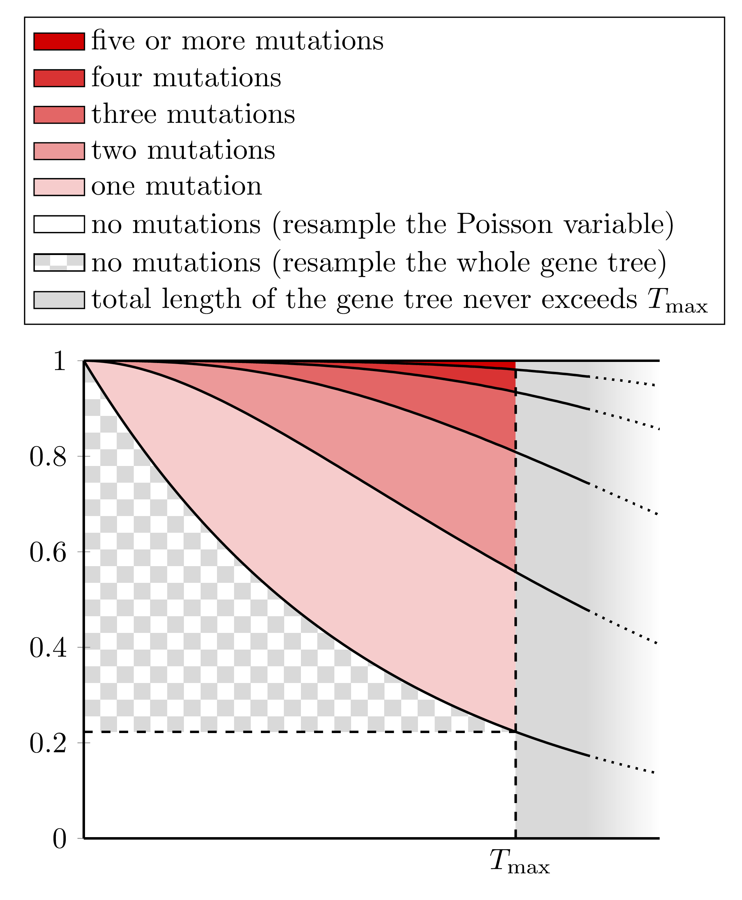

```{r setup, include = FALSE}

knitr::opts_chunk$set(echo = TRUE)
set.seed(0)

```

## Simulation functions

The $D_\text{FOIL}$-method [@pease2015detection] was tested with simulated genetic regions generated with the software *ms* [@hudson2002generating].
We will instead simply simulate independent biallelic sites in a coalescence process.
That is, the time until coalescence between given two lineages in the same randomly mating population approximately follows an exponential distribution with parameter $\lambda$. A unit of time is about $2\lambda N_e$ generations, where $N_e$ is the effective population size.
The number of mutations in the simulated gene tree follows a Poisson distribution with parameter $\mu$, the expected number of mutations per unit of time.
The mutations are placed randomly on the gene tree, creating a biallelic pattern consisting of two letters A and B. The parameters $\lambda$ and $\mu$ are allowed to vary.

This approach is a compromise in the sense that assuming independent loci without simulating recombination doesn't help determining the size of the genomic region necessary for detecting gene flow events. We refer to Pease and Hahn who conclude that $D$-statistics (which include the $D_\text{FOIL}$-statistics and we argue that our $\Delta$-statistics as well) are usable when $N_erL$ is at least 1000, where $r$ is the recombination rate per site per generation and $L$ is the size of the genomic region.

Admixture graphs are coded as a list of branches. A branch is a list consisting of:

+ `lambda`, the (exponential distribution) parameter $\lambda$
+ `mu`, the (poisson distribution) parameter $\mu$
+ `inhabitants`, which lineages are "currently" in the branch --- just initiate with `character(0)` and ignore
+ `samples`, lineages that begin their coalescence process in the branch; a list where keys are lineage labels and values are times when the lineages "appear" (use a value higher than zero to simulate ancient samples)
+ `switches`, moments when lineages can move to other branches; a list where keys are branch labels and values 2-vectors coding the time points and the probability of a lineage moving

(In retrospect it's inconvenient but not limiting that we can't have two separate moments for lineages to be moved from branch $i$ to branch $j$ as the list keys must be unique.)
Now a random gene tree of an admixture graph can be obtained with the function `solve_tree()`.
Further, a random biallelic pattern (coded as a ford of letters A and B) of a gene tree can be obtained with the function `pattern()`. The function samples from the conditional distribution given that the pattern really is biallelic --- in cases with no mutations or several mutations perfectly cancelling each other out it returns `NA`.
To lower the probability of an `NA` result, we employ a resampling procedure visualized in the figure below. Assuming that the total length of the gene tree weighted by the mutation parameter $\mu$ will always be less that $T_\text{max}$ predetermined as the parameter `Tmax`, the case of zero mutations can often be resampled without having to discard the whole gene tree.
As the probability of a mutation in a gene tree is typically quite low, the gains of the resampling scheme can be substantial.

```{r, echo = FALSE, out.width = "50%", fig.align = "center"}



```

For an example of usage of these simulation functions, see [S_big.md](S_big.md).

```{r simulation functions}

# Better documentation of these functions is found in the markdown document tools.md.

solve_branch <- function(branch, gene_tree, start, end) {
  # If there's at most one lineage in the branch during the time period, we only record the time passing.
  if (length(branch$inhabitants) <= 1) {
    for (inhabitant in branch$inhabitants) {
      if (inhabitant %in% names(gene_tree)) {gene_tree[[inhabitant]] <- gene_tree[[inhabitant]] + branch$mu*(end - start)}
      else {gene_tree[[inhabitant]] <- branch$mu*(end - start)}
    }
  }
  # If there's two or more lineages, coalescence events might occur.
  if (length(branch$inhabitants) > 1) {
    minimum_time <- rexp(1, rate = choose(length(branch$inhabitants), 2)*branch$lambda)
    if (minimum_time < end - start) {# If there's at least one coalescence event during the time frame, we record it, record the time passing, and call the function recursively.
      for (inhabitant in branch$inhabitants) {
        if (inhabitant %in% names(gene_tree)) {gene_tree[[inhabitant]] <- gene_tree[[inhabitant]] + branch$mu*minimum_time}
        else {gene_tree[[inhabitant]] <- branch$mu*minimum_time}
      }
      pair <- sample(branch$inhabitants, 2)
      new <- paste(pair[1], pair[2], sep = "")
      branch$inhabitants <- setdiff(c(branch$inhabitants, new), pair)
      inner <- solve_branch(branch, gene_tree, minimum_time + start, end)
      branch <- inner$branch
      gene_tree <- inner$gene_tree
    }
    else { # If there's no coalescence events, we only record the time passing.
      for (inhabitant in branch$inhabitants) {
        if (inhabitant %in% names(gene_tree)) {gene_tree[[inhabitant]] <- gene_tree[[inhabitant]] + branch$mu*(end - start)}
        else {gene_tree[[inhabitant]] <- branch$mu*(end - start)}
      }
    }
  }
  return(list(branch = branch, gene_tree = gene_tree))
}

solve_tree <- function(branches) {
  gene_tree <- list()
  # Compile a vector of pivotal moments (individual sampling times, population divergence and admixture times).
  pivotal <- numeric(0)
  for (branch in branches) {
    for (sample in branch$samples) {pivotal <- c(pivotal, sample)}
    for (switch in branch$switches) {pivotal <- c(pivotal, switch[1])}
  }
  pivotal <- unique(pivotal)
  pivotal <- pivotal[order(pivotal)]
  # Add infinity as the last pivotal moment.
  pivotal[length(pivotal) + 1] <- Inf
  # For all pivotal moments except the infinity:
  for (t in seq(1, length(pivotal) - 1)) {
    now <- pivotal[t]
    soon <- pivotal[t + 1]
    # First perform the special actions of the pivotal moment (samplings, switches).
    for (branch in names(branches)) {
      for (sample in names(branches[[branch]]$samples)) {
        if (branches[[branch]]$samples[[sample]] == now) {
          branches[[branch]]$inhabitants <- c(branches[[branch]]$inhabitants, sample)
        }
      }
      for (switch in names(branches[[branch]]$switches)) {
        if (branches[[branch]]$switches[[switch]][1] == now) {
          # Moving inhabitants from a branch to another, possibly.
          for (inhabitant in branches[[branch]]$inhabitants) {
            if (runif(1) < branches[[branch]]$switches[[switch]][2]) {
              branches[[branch]]$inhabitants <- setdiff(branches[[branch]]$inhabitants, inhabitant)
              branches[[switch]]$inhabitants <- c(branches[[switch]]$inhabitants, inhabitant)
            }
          }
        }
      }
    }
    # Then solve each branch until the next pivotal moment.
    for (branch in names(branches)) {
      solved <- solve_branch(branches[[branch]], gene_tree, now, soon)
      branches[[branch]] <- solved$branch
      gene_tree <- solved$gene_tree
    }
  }
  return(gene_tree)
}

pattern <- function(tree, Tmax = 0) {
  # Adding a number of point mutations somewhere in the gene tree and reporting the ABBABABA-pattern.
  L <- numeric(0)
  for (name in names(tree)) {
    if (tree[[name]] < Inf) {L[length(L) + 1] <- tree[[name]]}
    else {L[length(L) + 1] <- 0}
  }
  # We condition on a pattern being polymorphic, but often there's no mutation at all.
  # We use a resampling scheme that takes to total gene tree length and the possibility of multiple mutations into account.
  # The resampling can be made a bit faster as long as the total gene tree length 'sum(L)' can't exceed a predetermined maximum value 'Tmax'.
  if (Tmax == 0) {
    amount <- 1 # If we don't want to bother with bias correction and recurrent mutations we can just set 'Tmax' to 0 and assume a single mutation.
  }
  else {
    if (sum(L) > Tmax) {stop("The argument 'Tmax' must be chosen to be so big that the overall length of the gene tree virtually never exceeds it.")}
    amount_done <- FALSE
    while (amount_done == FALSE) {
      amount <- rpois(1, sum(L))
      if (amount == 0) {
        if (runif(1) > dpois(0, Tmax)/dpois(0, sum(L))) {amount_done <- TRUE} # In this case we need to randomize a new gene tree.
        # Otherwise we can randomize a new amount within the same gene tree.
      } else {amount_done <- TRUE} # A nonzero 'amount' is accepted.
    }
    if (amount == 0) {return(NA)}
  }
  mutations <- runif(amount)*sum(L)
  changes <- character(0) # The first nodes that are affected by the mutations.
  for (mutation in mutations) {changes[length(changes) + 1] <- names(tree)[sum(mutation > cumsum(L)) + 1]}
  # This will only work if populations are coded 'P1', 'P2', ... and there's less than ten of them.
  changes <- paste(changes, collapse = "")
  leaves <- max(nchar(names(tree)))/2 # Divided by two because of the character 'P'.
  pattern <- rep("A", leaves)
  for (j in seq(1, leaves)) {if (length(regmatches(changes, gregexpr(paste(j), changes))[[1]]) %% 2) {pattern[j] <- "B"}}
  if (length(unique(pattern)) > 1) {
    pattern <- paste(pattern, collapse = "")
    return(pattern)
  } # Returning a polymorphic pattern.
  else {return(NA)} # There was mutations but the resulting pattern was monomorphic.
}

```

## Existing statistics

Here are implementations of the statistics already existing in literature. All the functions take a table of allelic patterns as an input.
No population is assumed to always carry the ancestral allele because no such assumption is necessary --
if the ancestral allele is known the data can be filtered as a pre-processing step when desired, but we don't advice it as it ruins the predicted behavior of some gene flow events involving population 5.

The function `DPA()` is the classic $D$-statistic [@green2010draft].
The functions `DFO()`, `DIL()`, `DFI()` and `DOL()` are the $D_\text{FOIL}$-statistics $D_\text{FO}$, $D_\text{IL}$, $D_\text{FI}$ and $D_\text{OL}$ from [@pease2015detection], respectively.
The functions `D1()`, `D2()` and `D12()` are the partitioned $D$-statistics $D_1$, $D_2$ and $D_{12}$ from [@eaton2013inferring], respectively.

For significance tests, the default values we used were $Z$-score cutoff of &plusmn;3 for the classic $D$-statistic (as it's a popular convention),
the false rejection rate of one percent for the $D_\text{FOIL}$-statistics (as it's the threshold used by Pease and Hahn) and
the false rejection rate of one third of a percent for the partitioned $D$-statistics (as it's the threshold used by Eaton and Ree).

```{r existing statistics}

n <- function(X, x) {
	if (x %in% names(X)) {return(X[x])} else {return(0)}
}

DPA <- function(X, alpha = 0.0027) { # The classic D-statistic.
	L <- n(X, "BABA") + n(X, "ABAB")
	R <- n(X, "ABBA") + n(X, "BAAB")
	value <- as.numeric((L - R)/(L + R))
	zvalue <- (L - R)/sqrt(L + R)
	pvalue <- 2*as.numeric(1 - pnorm(abs(zvalue)))
	if (is.numeric(pvalue) == TRUE && is.nan(pvalue) == FALSE) {
		if (pvalue > alpha) {
			sign <- "0"
		} else {
	    if (value > 0) {sign <- "+"}
	    if (value < 0) {sign <- "-"}		  	
		}
	} else {sign <- "?"}
	return(list(value, zvalue, sign))
}

DFO <- function(X, alpha = 0.01) { # D_FO of Pease & Hahn.
	L <- n(X, "BABAA") + n(X, "ABABB") + n(X, "BBBAA") + n(X, "AAABB") + n(X, "ABABA") + n(X, "BABAB") + n(X, "AAABA") + n(X, "BBBAB")
	R <- n(X, "BAABA") + n(X, "ABBAB") + n(X, "BBABA") + n(X, "AABAB") + n(X, "ABBAA") + n(X, "BAABB") + n(X, "AABAA") + n(X, "BBABB")
	value <- as.numeric((L - R)/(L + R))
	zvalue <- (L - R)/sqrt(L + R)
	pvalue <- 2*as.numeric(1 - pnorm(abs(zvalue)))
	if (is.numeric(pvalue) == TRUE && is.nan(pvalue) == FALSE) {
		if (pvalue > alpha) {
			sign <- "0"
		} else {
	    if (value > 0) {sign <- "+"}
	    if (value < 0) {sign <- "-"}		  	
		}
	} else {sign <- "?"}
	return(list(value, zvalue, sign))
}

DIL <- function(X, alpha = 0.01) { # D_IL of Pease & Hahn.
	L <- n(X, "ABBAA") + n(X, "BAABB") + n(X, "BBBAA") + n(X, "AAABB") + n(X, "BAABA") + n(X, "ABBAB") + n(X, "AAABA") + n(X, "BBBAB")
	R <- n(X, "ABABA") + n(X, "BABAB") + n(X, "BBABA") + n(X, "AABAB") + n(X, "BABAA") + n(X, "ABABB") + n(X, "AABAA") + n(X, "BBABB")
	value <- as.numeric((L - R)/(L + R))
	zvalue <- (L - R)/sqrt(L + R)
	pvalue <- 2*as.numeric(1 - pnorm(abs(zvalue)))
	if (is.numeric(pvalue) == TRUE && is.nan(pvalue) == FALSE) {
		if (pvalue > alpha) {
			sign <- "0"
		} else {
	    if (value > 0) {sign <- "+"}
	    if (value < 0) {sign <- "-"}		  	
		}
	} else {sign <- "?"}
	return(list(value, zvalue, sign))
}

DFI <- function(X, alpha = 0.01) { # D_FI of Pease & Hahn.
	L <- n(X, "BABAA") + n(X, "ABABB") + n(X, "BABBA") + n(X, "ABAAB") + n(X, "ABABA") + n(X, "BABAB") + n(X, "ABAAA") + n(X, "BABBB")
	R <- n(X, "ABBAA") + n(X, "BAABB") + n(X, "ABBBA") + n(X, "BAAAB") + n(X, "BAABA") + n(X, "ABBAB") + n(X, "BAAAA") + n(X, "ABBBB")
	value <- as.numeric((L - R)/(L + R))
	zvalue <- (L - R)/sqrt(L + R)
	pvalue <- 2*as.numeric(1 - pnorm(abs(zvalue)))
	if (is.numeric(pvalue) == TRUE && is.nan(pvalue) == FALSE) {
		if (pvalue > alpha) {
			sign <- "0"
		} else {
	    if (value > 0) {sign <- "+"}
	    if (value < 0) {sign <- "-"}		  	
		}
	} else {sign <- "?"}
	return(list(value, zvalue, sign))
}

DOL <- function(X, alpha = 0.01) { # D_OL of Pease and Hahn.
	L <- n(X, "BAABA") + n(X, "ABBAB") + n(X, "BABBA") + n(X, "ABAAB") + n(X, "ABBAA") + n(X, "BAABB") + n(X, "ABAAA") + n(X, "BABBB")
	R <- n(X, "ABABA") + n(X, "BABAB") + n(X, "ABBBA") + n(X, "BAAAB") + n(X, "BABAA") + n(X, "ABABB") + n(X, "BAAAA") + n(X, "ABBBB")
	value <- as.numeric((L - R)/(L + R))
	zvalue <- (L - R)/sqrt(L + R)
	pvalue <- 2*as.numeric(1 - pnorm(abs(zvalue)))
	if (is.numeric(pvalue) == TRUE && is.nan(pvalue) == FALSE) {
		if (pvalue > alpha) {
			sign <- "0"
		} else {
	    if (value > 0) {sign <- "+"}
	    if (value < 0) {sign <- "-"}		  	
		}
	} else {sign <- "?"}
	return(list(value, zvalue, sign))
}

D1 <- function(X, alpha = 0.00333) { # D_1 of Eaton & Ree.
	L <- n(X, "ABBAA") + n(X, "BAABB")
	R <- n(X, "BABAA") + n(X, "ABABB")
	value <- as.numeric((L - R)/(L + R))
	zvalue <- (L - R)/sqrt(L + R)
	pvalue <- 2*as.numeric(1 - pnorm(abs(zvalue)))
	if (is.numeric(pvalue) == TRUE && is.nan(pvalue) == FALSE) {
		if (pvalue > alpha) {
			sign <- "0"
		} else {
	    if (value > 0) {sign <- "+"}
	    if (value < 0) {sign <- "-"}		  	
		}
	} else {sign <- "?"}
	return(list(value, zvalue, sign))
}

D2 <- function(X, alpha = 0.00333) { # D_2 of Eaton & Ree.
	L <- n(X, "ABABA") + n(X, "BABAB")
	R <- n(X, "BAABA") + n(X, "ABBAB")
	value <- as.numeric((L - R)/(L + R))
	zvalue <- (L - R)/sqrt(L + R)
	pvalue <- 2*as.numeric(1 - pnorm(abs(zvalue)))
	if (is.numeric(pvalue) == TRUE && is.nan(pvalue) == FALSE) {
		if (pvalue > alpha) {
			sign <- "0"
		} else {
	    if (value > 0) {sign <- "+"}
	    if (value < 0) {sign <- "-"}		  	
		}
	} else {sign <- "?"}
	return(list(value, zvalue, sign))
}

D12 <- function(X, alpha = 0.00333) { # D_12 of Eaton & Ree.
	L <- n(X, "BAAAB") + n(X, "ABBBA")
	R <- n(X, "ABAAB") + n(X, "BABBA")
	value <- as.numeric((L - R)/(L + R))
	zvalue <- (L - R)/sqrt(L + R)
	pvalue <- 2*as.numeric(1 - pnorm(abs(zvalue)))
	if (is.numeric(pvalue) == TRUE && is.nan(pvalue) == FALSE) {
		if (pvalue > alpha) {
			sign <- "0"
		} else {
	    if (value > 0) {sign <- "+"}
	    if (value < 0) {sign <- "-"}		  	
		}
	} else {sign <- "?"}
	return(list(value, zvalue, sign))
}

```


## $\Delta$-statistics

Here are implementations of the $\Delta$-statistics introduced in the manuscript at hand. All the functions take a table of allelic patterns as an input.

The functions
`DS1()`, `DS2()`, `DS3()`, `DS4()`, `DS5()`, `DS6()`, `DS7()`, `DS8()`,
`DA1()`, `DA2()`, `DA3()`, `DA4()`,
`DQ1()`, `DQ2()`, `DQ3()`, `DQ4()`, `DQ5()`, `DQ6()`, `DQ7()` and `DQ4()`
are the binomial $\Delta$-statistics
${}_S\Delta_1$, ${}_S\Delta_2$, ${}_S\Delta_3$, ${}_S\Delta_4$, ${}_S\Delta_5$, ${}_S\Delta_6$, ${}_S\Delta_7$, ${}_S\Delta_8$,
${}_A\Delta_1$, ${}_A\Delta_2$, ${}_A\Delta_3$, ${}_A\Delta_4$,
${}_Q\Delta_1$, ${}_Q\Delta_2$, ${}_Q\Delta_3$, ${}_Q\Delta_4$, ${}_Q\Delta_5$, ${}_Q\Delta_6$, ${}_Q\Delta_7$ and ${}_Q\Delta_8$, respectively.

The functions
`DS16()`, `DS26()`, `DS35()`, `DS45()`, `DS57()`, `DS68()`, `DS3457()`, `DS1268()`,
`DA12()`, `DA13()`, `DA23()`, `DA1234()`,
`DQ16()`, `DQ26()`, `DQ35()`, `DQ45()`, `DQ57()`, `DQ68()`, `DQ3457()`, `DQ1268()`,
are the twenty derived $\Delta$-statistics
${}_S\Delta_{1-6}$, ${}_S\Delta_{2-6}$, ${}_S\Delta_{3-5}$, ${}_S\Delta_{4-5}$, ${}_S\Delta_{5+7}$, ${}_S\Delta_{6+8}$, ${}_S\Delta_{3+4-5+7}$, ${}_S\Delta_{1+2-6+8}$,
${}_A\Delta_{1-2}$, ${}_A\Delta_{1-3}$, ${}_A\Delta_{2-3}$, ${}_A\Delta_{1+2-3+4}$,
${}_Q\Delta_{1-6}$, ${}_Q\Delta_{2-6}$, ${}_Q\Delta_{3-5}$, ${}_Q\Delta_{4-5}$, ${}_Q\Delta_{5+7}$, ${}_Q\Delta_{6+8}$, ${}_Q\Delta_{3+4-5+7}$ and ${}_Q\Delta_{1+2-6+8}$, respectively.
In other words, we did not bother with the minus signs when naming the functions.

For significance tests, the default value is the false rejection rate of one percent.

```{r delta-statistics}

n <- function(X, x) {
	if (x %in% names(X)) {return(X[x])} else {return(0)}
}

DS1 <- function(X, alpha = 0.01) {
	L <- n(X, "BABAA") + n(X, "ABABB")
	R <- n(X, "BAABA") + n(X, "ABBAB")
	value <- as.numeric((L - R)/(L + R))
	zvalue <- (L - R)/sqrt(L + R)
	pvalue <- 2*as.numeric(1 - pnorm(abs(zvalue)))
	if (is.numeric(pvalue) == TRUE && is.nan(pvalue) == FALSE) {
		if (pvalue > alpha) {
			sign <- "0"
		} else {
	    if (value > 0) {sign <- "+"}
	    if (value < 0) {sign <- "-"}		  	
		}
	} else {sign <- "?"}
	return(list(value, zvalue, sign))
}

DS2 <- function(X, alpha = 0.01) {
	L <- n(X, "ABBAA") + n(X, "BAABB")
	R <- n(X, "ABABA") + n(X, "BABAB")
	value <- as.numeric((L - R)/(L + R))
	zvalue <- (L - R)/sqrt(L + R)
	pvalue <- 2*as.numeric(1 - pnorm(abs(zvalue)))
	if (is.numeric(pvalue) == TRUE && is.nan(pvalue) == FALSE) {
		if (pvalue > alpha) {
			sign <- "0"
		} else {
	    if (value > 0) {sign <- "+"}
	    if (value < 0) {sign <- "-"}		  	
		}
	} else {sign <- "?"}
	return(list(value, zvalue, sign))
}

DS3 <- function(X, alpha = 0.01) {
	L <- n(X, "BABAA") + n(X, "ABABB")
	R <- n(X, "ABBAA") + n(X, "BAABB")
	value <- as.numeric((L - R)/(L + R))
	zvalue <- (L - R)/sqrt(L + R)
	pvalue <- 2*as.numeric(1 - pnorm(abs(zvalue)))
	if (is.numeric(pvalue) == TRUE && is.nan(pvalue) == FALSE) {
		if (pvalue > alpha) {
			sign <- "0"
		} else {
	    if (value > 0) {sign <- "+"}
	    if (value < 0) {sign <- "-"}		  	
		}
	} else {sign <- "?"}
	return(list(value, zvalue, sign))
}

DS4 <- function(X, alpha = 0.01) {
	L <- n(X, "BAABA") + n(X, "ABBAB")
	R <- n(X, "ABABA") + n(X, "BABAB")
	value <- as.numeric((L - R)/(L + R))
	zvalue <- (L - R)/sqrt(L + R)
	pvalue <- 2*as.numeric(1 - pnorm(abs(zvalue)))
	if (is.numeric(pvalue) == TRUE && is.nan(pvalue) == FALSE) {
		if (pvalue > alpha) {
			sign <- "0"
		} else {
	    if (value > 0) {sign <- "+"}
	    if (value < 0) {sign <- "-"}		  	
		}
	} else {sign <- "?"}
	return(list(value, zvalue, sign))
}

DS5 <- function(X, alpha = 0.01) {
	L <- n(X, "ABBBA") + n(X, "BAAAB")
	R <- n(X, "BABBA") + n(X, "ABAAB")
	value <- as.numeric((L - R)/(L + R))
	zvalue <- (L - R)/sqrt(L + R)
	pvalue <- 2*as.numeric(1 - pnorm(abs(zvalue)))
	if (is.numeric(pvalue) == TRUE && is.nan(pvalue) == FALSE) {
		if (pvalue > alpha) {
			sign <- "0"
		} else {
	    if (value > 0) {sign <- "+"}
	    if (value < 0) {sign <- "-"}		  	
		}
	} else {sign <- "?"}
	return(list(value, zvalue, sign))
}

DS6 <- function(X, alpha = 0.01) {
	L <- n(X, "BBABA") + n(X, "AABAB")
	R <- n(X, "BBBAA") + n(X, "AAABB")
	value <- as.numeric((L - R)/(L + R))
	zvalue <- (L - R)/sqrt(L + R)
	pvalue <- 2*as.numeric(1 - pnorm(abs(zvalue)))
	if (is.numeric(pvalue) == TRUE && is.nan(pvalue) == FALSE) {
		if (pvalue > alpha) {
			sign <- "0"
		} else {
	    if (value > 0) {sign <- "+"}
	    if (value < 0) {sign <- "-"}		  	
		}
	} else {sign <- "?"}
	return(list(value, zvalue, sign))
}

DS7 <- function(X, alpha = 0.01) {
	L <- n(X, "BAAAA") + n(X, "ABBBB")
	R <- n(X, "ABAAA") + n(X, "BABBB")
	value <- as.numeric((L - R)/(L + R))
	zvalue <- (L - R)/sqrt(L + R)
	pvalue <- 2*as.numeric(1 - pnorm(abs(zvalue)))
	if (is.numeric(pvalue) == TRUE && is.nan(pvalue) == FALSE) {
		if (pvalue > alpha) {
			sign <- "0"
		} else {
	    if (value > 0) {sign <- "+"}
	    if (value < 0) {sign <- "-"}		  	
		}
	} else {sign <- "?"}
	return(list(value, zvalue, sign))
}

DS8 <- function(X, alpha = 0.01) {
	L <- n(X, "AABAA") + n(X, "BBABB")
	R <- n(X, "AAABA") + n(X, "BBBAB")
	value <- as.numeric((L - R)/(L + R))
	zvalue <- (L - R)/sqrt(L + R)
	pvalue <- 2*as.numeric(1 - pnorm(abs(zvalue)))
	if (is.numeric(pvalue) == TRUE && is.nan(pvalue) == FALSE) {
		if (pvalue > alpha) {
			sign <- "0"
		} else {
	    if (value > 0) {sign <- "+"}
	    if (value < 0) {sign <- "-"}		  	
		}
	} else {sign <- "?"}
	return(list(value, zvalue, sign))
}

DA1 <- function(X, alpha = 0.01) {
	L <- n(X, "BABAA") + n(X, "ABABB")
	R <- n(X, "ABBAA") + n(X, "BAABB")
	value <- as.numeric((L - R)/(L + R))
	zvalue <- (L - R)/sqrt(L + R)
	pvalue <- 2*as.numeric(1 - pnorm(abs(zvalue)))
	if (is.numeric(pvalue) == TRUE && is.nan(pvalue) == FALSE) {
		if (pvalue > alpha) {
			sign <- "0"
		} else {
	    if (value > 0) {sign <- "+"}
	    if (value < 0) {sign <- "-"}		  	
		}
	} else {sign <- "?"}
	return(list(value, zvalue, sign))
}

DA2 <- function(X, alpha = 0.01) {
	L <- n(X, "BAABA") + n(X, "ABBAB")
	R <- n(X, "ABABA") + n(X, "BABAB")
	value <- as.numeric((L - R)/(L + R))
	zvalue <- (L - R)/sqrt(L + R)
	pvalue <- 2*as.numeric(1 - pnorm(abs(zvalue)))
	if (is.numeric(pvalue) == TRUE && is.nan(pvalue) == FALSE) {
		if (pvalue > alpha) {
			sign <- "0"
		} else {
	    if (value > 0) {sign <- "+"}
	    if (value < 0) {sign <- "-"}		  	
		}
	} else {sign <- "?"}
	return(list(value, zvalue, sign))
}

DA3 <- function(X, alpha = 0.01) {
	L <- n(X, "ABBBA") + n(X, "BAAAB")
	R <- n(X, "BABBA") + n(X, "ABAAB")
	value <- as.numeric((L - R)/(L + R))
	zvalue <- (L - R)/sqrt(L + R)
	pvalue <- 2*as.numeric(1 - pnorm(abs(zvalue)))
	if (is.numeric(pvalue) == TRUE && is.nan(pvalue) == FALSE) {
		if (pvalue > alpha) {
			sign <- "0"
		} else {
	    if (value > 0) {sign <- "+"}
	    if (value < 0) {sign <- "-"}		  	
		}
	} else {sign <- "?"}
	return(list(value, zvalue, sign))
}

DA4 <- function(X, alpha = 0.01) {
	L <- n(X, "BAAAA") + n(X, "ABBBB")
	R <- n(X, "ABAAA") + n(X, "BABBB")
	value <- as.numeric((L - R)/(L + R))
	zvalue <- (L - R)/sqrt(L + R)
	pvalue <- 2*as.numeric(1 - pnorm(abs(zvalue)))
	if (is.numeric(pvalue) == TRUE && is.nan(pvalue) == FALSE) {
		if (pvalue > alpha) {
			sign <- "0"
		} else {
	    if (value > 0) {sign <- "+"}
	    if (value < 0) {sign <- "-"}		  	
		}
	} else {sign <- "?"}
	return(list(value, zvalue, sign))
}

DQ1 <- function(X, alpha = 0.01) {
	L <- n(X, "BAABA") + n(X, "ABBAB")
	R <- n(X, "BAAAB") + n(X, "ABBBA")
	value <- as.numeric((L - R)/(L + R))
	zvalue <- (L - R)/sqrt(L + R)
	pvalue <- 2*as.numeric(1 - pnorm(abs(zvalue)))
	if (is.numeric(pvalue) == TRUE && is.nan(pvalue) == FALSE) {
		if (pvalue > alpha) {
			sign <- "0"
		} else {
	    if (value > 0) {sign <- "+"}
	    if (value < 0) {sign <- "-"}		  	
		}
	} else {sign <- "?"}
	return(list(value, zvalue, sign))
}

DQ2 <- function(X, alpha = 0.01) {
	L <- n(X, "ABABA") + n(X, "BABAB")
	R <- n(X, "ABAAB") + n(X, "BABBA")
	value <- as.numeric((L - R)/(L + R))
	zvalue <- (L - R)/sqrt(L + R)
	pvalue <- 2*as.numeric(1 - pnorm(abs(zvalue)))
	if (is.numeric(pvalue) == TRUE && is.nan(pvalue) == FALSE) {
		if (pvalue > alpha) {
			sign <- "0"
		} else {
	    if (value > 0) {sign <- "+"}
	    if (value < 0) {sign <- "-"}		  	
		}
	} else {sign <- "?"}
	return(list(value, zvalue, sign))
}

DQ3 <- function(X, alpha = 0.01) {
	L <- n(X, "BAABA") + n(X, "ABBAB")
	R <- n(X, "ABABA") + n(X, "BABAB")
	value <- as.numeric((L - R)/(L + R))
	zvalue <- (L - R)/sqrt(L + R)
	pvalue <- 2*as.numeric(1 - pnorm(abs(zvalue)))
	if (is.numeric(pvalue) == TRUE && is.nan(pvalue) == FALSE) {
		if (pvalue > alpha) {
			sign <- "0"
		} else {
	    if (value > 0) {sign <- "+"}
	    if (value < 0) {sign <- "-"}		  	
		}
	} else {sign <- "?"}
	return(list(value, zvalue, sign))
}

DQ4 <- function(X, alpha = 0.01) {
	L <- n(X, "BAAAB") + n(X, "ABBBA")
	R <- n(X, "ABAAB") + n(X, "BABBA")
	value <- as.numeric((L - R)/(L + R))
	zvalue <- (L - R)/sqrt(L + R)
	pvalue <- 2*as.numeric(1 - pnorm(abs(zvalue)))
	if (is.numeric(pvalue) == TRUE && is.nan(pvalue) == FALSE) {
		if (pvalue > alpha) {
			sign <- "0"
		} else {
	    if (value > 0) {sign <- "+"}
	    if (value < 0) {sign <- "-"}		  	
		}
	} else {sign <- "?"}
	return(list(value, zvalue, sign))
}

DQ5 <- function(X, alpha = 0.01) {
	L <- n(X, "BABAA") + n(X, "ABABB")
	R <- n(X, "ABBAA") + n(X, "BAABB")
	value <- as.numeric((L - R)/(L + R))
	zvalue <- (L - R)/sqrt(L + R)
	pvalue <- 2*as.numeric(1 - pnorm(abs(zvalue)))
	if (is.numeric(pvalue) == TRUE && is.nan(pvalue) == FALSE) {
		if (pvalue > alpha) {
			sign <- "0"
		} else {
	    if (value > 0) {sign <- "+"}
	    if (value < 0) {sign <- "-"}		  	
		}
	} else {sign <- "?"}
	return(list(value, zvalue, sign))
}

DQ6 <- function(X, alpha = 0.01) {
	L <- n(X, "AABBA") + n(X, "BBAAB")
	R <- n(X, "AABAB") + n(X, "BBABA")
	value <- as.numeric((L - R)/(L + R))
	zvalue <- (L - R)/sqrt(L + R)
	pvalue <- 2*as.numeric(1 - pnorm(abs(zvalue)))
	if (is.numeric(pvalue) == TRUE && is.nan(pvalue) == FALSE) {
		if (pvalue > alpha) {
			sign <- "0"
		} else {
	    if (value > 0) {sign <- "+"}
	    if (value < 0) {sign <- "-"}		  	
		}
	} else {sign <- "?"}
	return(list(value, zvalue, sign))
}

DQ7 <- function(X, alpha = 0.01) {
	L <- n(X, "BAAAA") + n(X, "ABBBB")
	R <- n(X, "ABAAA") + n(X, "BABBB")
	value <- as.numeric((L - R)/(L + R))
	zvalue <- (L - R)/sqrt(L + R)
	pvalue <- 2*as.numeric(1 - pnorm(abs(zvalue)))
	if (is.numeric(pvalue) == TRUE && is.nan(pvalue) == FALSE) {
		if (pvalue > alpha) {
			sign <- "0"
		} else {
	    if (value > 0) {sign <- "+"}
	    if (value < 0) {sign <- "-"}		  	
		}
	} else {sign <- "?"}
	return(list(value, zvalue, sign))
}

DQ8 <- function(X, alpha = 0.01) {
	L <- n(X, "AAABA") + n(X, "BBBAB")
	R <- n(X, "AAAAB") + n(X, "BBBBA")
	value <- as.numeric((L - R)/(L + R))
	zvalue <- (L - R)/sqrt(L + R)
	pvalue <- 2*as.numeric(1 - pnorm(abs(zvalue)))
	if (is.numeric(pvalue) == TRUE && is.nan(pvalue) == FALSE) {
		if (pvalue > alpha) {
			sign <- "0"
		} else {
	    if (value > 0) {sign <- "+"}
	    if (value < 0) {sign <- "-"}		  	
		}
	} else {sign <- "?"}
	return(list(value, zvalue, sign))
}

DS16 <- function(X, alpha = 0.01) {
	L <- n(X, "BABAA") + n(X, "ABABB") + n(X, "AAABB") + n(X, "BBBAA")
	R <- n(X, "BAABA") + n(X, "ABBAB") + n(X, "AABAB") + n(X, "BBABA")
	value <- as.numeric((L - R)/(L + R))
	zvalue <- (L - R)/sqrt(L + R)
	pvalue <- 2*as.numeric(1 - pnorm(abs(zvalue)))
	if (is.numeric(pvalue) == TRUE && is.nan(pvalue) == FALSE) {
		if (pvalue > alpha) {
			sign <- "0"
		} else {
	    if (value > 0) {sign <- "+"}
	    if (value < 0) {sign <- "-"}		  	
		}
	} else {sign <- "?"}
	return(list(value, zvalue, sign))
}

DS26 <- function(X, alpha = 0.01) {
	L <- n(X, "ABBAA") + n(X, "BAABB") + n(X, "AAABB") + n(X, "BBBAA")
	R <- n(X, "ABABA") + n(X, "BABAB") + n(X, "AABAB") + n(X, "BBABA")
	value <- as.numeric((L - R)/(L + R))
	zvalue <- (L - R)/sqrt(L + R)
	pvalue <- 2*as.numeric(1 - pnorm(abs(zvalue)))
	if (is.numeric(pvalue) == TRUE && is.nan(pvalue) == FALSE) {
		if (pvalue > alpha) {
			sign <- "0"
		} else {
	    if (value > 0) {sign <- "+"}
	    if (value < 0) {sign <- "-"}		  	
		}
	} else {sign <- "?"}
	return(list(value, zvalue, sign))
}

DS35 <- function(X, alpha = 0.01) {
	L <- n(X, "BABAA") + n(X, "ABABB") + n(X, "ABAAB") + n(X, "BABBA")
	R <- n(X, "ABBAA") + n(X, "BAABB") + n(X, "BAAAB") + n(X, "ABBBA")
	value <- as.numeric((L - R)/(L + R))
	zvalue <- (L - R)/sqrt(L + R)
	pvalue <- 2*as.numeric(1 - pnorm(abs(zvalue)))
	if (is.numeric(pvalue) == TRUE && is.nan(pvalue) == FALSE) {
		if (pvalue > alpha) {
			sign <- "0"
		} else {
	    if (value > 0) {sign <- "+"}
	    if (value < 0) {sign <- "-"}		  	
		}
	} else {sign <- "?"}
	return(list(value, zvalue, sign))
}

DS45 <- function(X, alpha = 0.01) {
	L <- n(X, "BAABA") + n(X, "ABBAB") + n(X, "ABAAB") + n(X, "BABBA")
	R <- n(X, "ABABA") + n(X, "BABAB") + n(X, "BAAAB") + n(X, "ABBBA")
	value <- as.numeric((L - R)/(L + R))
	zvalue <- (L - R)/sqrt(L + R)
	pvalue <- 2*as.numeric(1 - pnorm(abs(zvalue)))
	if (is.numeric(pvalue) == TRUE && is.nan(pvalue) == FALSE) {
		if (pvalue > alpha) {
			sign <- "0"
		} else {
	    if (value > 0) {sign <- "+"}
	    if (value < 0) {sign <- "-"}		  	
		}
	} else {sign <- "?"}
	return(list(value, zvalue, sign))
}

DS57 <- function(X, alpha = 0.01) {
	L <- n(X, "BAAAB") + n(X, "ABBBA") + n(X, "BAAAA") + n(X, "ABBBB")
	R <- n(X, "ABAAB") + n(X, "BABBA") + n(X, "ABAAA") + n(X, "BABBB")
	value <- as.numeric((L - R)/(L + R))
	zvalue <- (L - R)/sqrt(L + R)
	pvalue <- 2*as.numeric(1 - pnorm(abs(zvalue)))
	if (is.numeric(pvalue) == TRUE && is.nan(pvalue) == FALSE) {
		if (pvalue > alpha) {
			sign <- "0"
		} else {
	    if (value > 0) {sign <- "+"}
	    if (value < 0) {sign <- "-"}		  	
		}
	} else {sign <- "?"}
	return(list(value, zvalue, sign))
}

DS68 <- function(X, alpha = 0.01) {
	L <- n(X, "AABAB") + n(X, "BBABA") + n(X, "AABAA") + n(X, "BBABB")
	R <- n(X, "AAABB") + n(X, "BBBAA") + n(X, "AAABA") + n(X, "BBBAB")
	value <- as.numeric((L - R)/(L + R))
	zvalue <- (L - R)/sqrt(L + R)
	pvalue <- 2*as.numeric(1 - pnorm(abs(zvalue)))
	if (is.numeric(pvalue) == TRUE && is.nan(pvalue) == FALSE) {
		if (pvalue > alpha) {
			sign <- "0"
		} else {
	    if (value > 0) {sign <- "+"}
	    if (value < 0) {sign <- "-"}		  	
		}
	} else {sign <- "?"}
	return(list(value, zvalue, sign))
}

DS3457 <- function(X, alpha = 0.01) {
	L <- n(X, "BABAA") + n(X, "ABABB") + n(X, "BAABA") + n(X, "ABBAB") + n(X, "ABAAB") + n(X, "BABBA") + n(X, "BAAAA") + n(X, "ABBBB")
	R <- n(X, "ABBAA") + n(X, "BAABB") + n(X, "ABABA") + n(X, "BABAB") + n(X, "BAAAB") + n(X, "ABBBA") + n(X, "ABAAA") + n(X, "BABBB")
	value <- as.numeric((L - R)/(L + R))
	zvalue <- (L - R)/sqrt(L + R)
	pvalue <- 2*as.numeric(1 - pnorm(abs(zvalue)))
	if (is.numeric(pvalue) == TRUE && is.nan(pvalue) == FALSE) {
		if (pvalue > alpha) {
			sign <- "0"
		} else {
	    if (value > 0) {sign <- "+"}
	    if (value < 0) {sign <- "-"}		  	
		}
	} else {sign <- "?"}
	return(list(value, zvalue, sign))
}

DS1268 <- function(X, alpha = 0.01) {
	L <- n(X, "BABAA") + n(X, "ABABB") + n(X, "ABBAA") + n(X, "BAABB") + n(X, "AAABB") + n(X, "BBBAA") + n(X, "AABAA") + n(X, "BBABB")
	R <- n(X, "BAABA") + n(X, "ABBAB") + n(X, "ABABA") + n(X, "BABAB") + n(X, "AABAB") + n(X, "BBABA") + n(X, "AAABA") + n(X, "BBBAB")
	value <- as.numeric((L - R)/(L + R))
	zvalue <- (L - R)/sqrt(L + R)
	pvalue <- 2*as.numeric(1 - pnorm(abs(zvalue)))
	if (is.numeric(pvalue) == TRUE && is.nan(pvalue) == FALSE) {
		if (pvalue > alpha) {
			sign <- "0"
		} else {
	    if (value > 0) {sign <- "+"}
	    if (value < 0) {sign <- "-"}		  	
		}
	} else {sign <- "?"}
	return(list(value, zvalue, sign))
}

DA12 <- function(X, alpha = 0.01) {
	L <- n(X, "BABAA") + n(X, "ABABB") + n(X, "ABABA") + n(X, "BABAB")
	R <- n(X, "ABBAA") + n(X, "BAABB") + n(X, "BAABA") + n(X, "ABBAB")
	value <- as.numeric((L - R)/(L + R))
	zvalue <- (L - R)/sqrt(L + R)
	pvalue <- 2*as.numeric(1 - pnorm(abs(zvalue)))
	if (is.numeric(pvalue) == TRUE && is.nan(pvalue) == FALSE) {
		if (pvalue > alpha) {
			sign <- "0"
		} else {
	    if (value > 0) {sign <- "+"}
	    if (value < 0) {sign <- "-"}		  	
		}
	} else {sign <- "?"}
	return(list(value, zvalue, sign))
}

DA13 <- function(X, alpha = 0.01) {
	L <- n(X, "BABAA") + n(X, "ABABB") + n(X, "ABAAB") + n(X, "BABBA")
	R <- n(X, "ABBAA") + n(X, "BAABB") + n(X, "BAAAB") + n(X, "ABBBA")
	value <- as.numeric((L - R)/(L + R))
	zvalue <- (L - R)/sqrt(L + R)
	pvalue <- 2*as.numeric(1 - pnorm(abs(zvalue)))
	if (is.numeric(pvalue) == TRUE && is.nan(pvalue) == FALSE) {
		if (pvalue > alpha) {
			sign <- "0"
		} else {
	    if (value > 0) {sign <- "+"}
	    if (value < 0) {sign <- "-"}		  	
		}
	} else {sign <- "?"}
	return(list(value, zvalue, sign))
}

DA23 <- function(X, alpha = 0.01) {
	L <- n(X, "BAABA") + n(X, "ABBAB") + n(X, "ABAAB") + n(X, "BABBA")
	R <- n(X, "ABABA") + n(X, "BABAB") + n(X, "BAAAB") + n(X, "ABBBA")
	value <- as.numeric((L - R)/(L + R))
	zvalue <- (L - R)/sqrt(L + R)
	pvalue <- 2*as.numeric(1 - pnorm(abs(zvalue)))
	if (is.numeric(pvalue) == TRUE && is.nan(pvalue) == FALSE) {
		if (pvalue > alpha) {
			sign <- "0"
		} else {
	    if (value > 0) {sign <- "+"}
	    if (value < 0) {sign <- "-"}		  	
		}
	} else {sign <- "?"}
	return(list(value, zvalue, sign))
}

DA1234 <- function(X, alpha = 0.01) {
	L <- n(X, "BABAA") + n(X, "ABABB") + n(X, "BAABA") + n(X, "ABBAB") + n(X, "ABAAB") + n(X, "BABBA") + n(X, "BAAAA") + n(X, "ABBBB")
	R <- n(X, "ABBAA") + n(X, "BAABB") + n(X, "ABABA") + n(X, "BABAB") + n(X, "BAAAB") + n(X, "ABBBA") + n(X, "ABAAA") + n(X, "BABBB")
	value <- as.numeric((L - R)/(L + R))
	zvalue <- (L - R)/sqrt(L + R)
	pvalue <- 2*as.numeric(1 - pnorm(abs(zvalue)))
	if (is.numeric(pvalue) == TRUE && is.nan(pvalue) == FALSE) {
		if (pvalue > alpha) {
			sign <- "0"
		} else {
	    if (value > 0) {sign <- "+"}
	    if (value < 0) {sign <- "-"}		  	
		}
	} else {sign <- "?"}
	return(list(value, zvalue, sign))
}

DQ16 <- function(X, alpha = 0.01) {
	L <- n(X, "BAABA") + n(X, "ABBAB") + n(X, "AABAB") + n(X, "BBABA")
	R <- n(X, "BAAAB") + n(X, "ABBBA") + n(X, "AABBA") + n(X, "BBAAB")
	value <- as.numeric((L - R)/(L + R))
	zvalue <- (L - R)/sqrt(L + R)
	pvalue <- 2*as.numeric(1 - pnorm(abs(zvalue)))
	if (is.numeric(pvalue) == TRUE && is.nan(pvalue) == FALSE) {
		if (pvalue > alpha) {
			sign <- "0"
		} else {
	    if (value > 0) {sign <- "+"}
	    if (value < 0) {sign <- "-"}		  	
		}
	} else {sign <- "?"}
	return(list(value, zvalue, sign))
}

DQ26 <- function(X, alpha = 0.01) {
	L <- n(X, "ABABA") + n(X, "BABAB") + n(X, "AABAB") + n(X, "BBABA")
	R <- n(X, "ABAAB") + n(X, "BABBA") + n(X, "AABBA") + n(X, "BBAAB")
	value <- as.numeric((L - R)/(L + R))
	zvalue <- (L - R)/sqrt(L + R)
	pvalue <- 2*as.numeric(1 - pnorm(abs(zvalue)))
	if (is.numeric(pvalue) == TRUE && is.nan(pvalue) == FALSE) {
		if (pvalue > alpha) {
			sign <- "0"
		} else {
	    if (value > 0) {sign <- "+"}
	    if (value < 0) {sign <- "-"}		  	
		}
	} else {sign <- "?"}
	return(list(value, zvalue, sign))
}

DQ35 <- function(X, alpha = 0.01) {
	L <- n(X, "BAABA") + n(X, "ABBAB") + n(X, "ABBAA") + n(X, "BAABB")
	R <- n(X, "ABABA") + n(X, "BABAB") + n(X, "BABAA") + n(X, "ABABB")
	value <- as.numeric((L - R)/(L + R))
	zvalue <- (L - R)/sqrt(L + R)
	pvalue <- 2*as.numeric(1 - pnorm(abs(zvalue)))
	if (is.numeric(pvalue) == TRUE && is.nan(pvalue) == FALSE) {
		if (pvalue > alpha) {
			sign <- "0"
		} else {
	    if (value > 0) {sign <- "+"}
	    if (value < 0) {sign <- "-"}		  	
		}
	} else {sign <- "?"}
	return(list(value, zvalue, sign))
}

DQ45 <- function(X, alpha = 0.01) {
	L <- n(X, "BAAAB") + n(X, "ABBBA") + n(X, "ABBAA") + n(X, "BAABB")
	R <- n(X, "ABAAB") + n(X, "BABBA") + n(X, "BABAA") + n(X, "ABABB")
	value <- as.numeric((L - R)/(L + R))
	zvalue <- (L - R)/sqrt(L + R)
	pvalue <- 2*as.numeric(1 - pnorm(abs(zvalue)))
	if (is.numeric(pvalue) == TRUE && is.nan(pvalue) == FALSE) {
		if (pvalue > alpha) {
			sign <- "0"
		} else {
	    if (value > 0) {sign <- "+"}
	    if (value < 0) {sign <- "-"}		  	
		}
	} else {sign <- "?"}
	return(list(value, zvalue, sign))
}

DQ57 <- function(X, alpha = 0.01) {
	L <- n(X, "BABAA") + n(X, "ABABB") + n(X, "BAAAA") + n(X, "ABBBB")
	R <- n(X, "ABBAA") + n(X, "BAABB") + n(X, "ABAAA") + n(X, "BABBB")
	value <- as.numeric((L - R)/(L + R))
	zvalue <- (L - R)/sqrt(L + R)
	pvalue <- 2*as.numeric(1 - pnorm(abs(zvalue)))
	if (is.numeric(pvalue) == TRUE && is.nan(pvalue) == FALSE) {
		if (pvalue > alpha) {
			sign <- "0"
		} else {
	    if (value > 0) {sign <- "+"}
	    if (value < 0) {sign <- "-"}		  	
		}
	} else {sign <- "?"}
	return(list(value, zvalue, sign))
}

DQ68 <- function(X, alpha = 0.01) {
	L <- n(X, "AABBA") + n(X, "BBAAB") + n(X, "AAABA") + n(X, "BBBAB")
	R <- n(X, "AABAB") + n(X, "BBABA") + n(X, "AAAAB") + n(X, "BBBBA")
	value <- as.numeric((L - R)/(L + R))
	zvalue <- (L - R)/sqrt(L + R)
	pvalue <- 2*as.numeric(1 - pnorm(abs(zvalue)))
	if (is.numeric(pvalue) == TRUE && is.nan(pvalue) == FALSE) {
		if (pvalue > alpha) {
			sign <- "0"
		} else {
	    if (value > 0) {sign <- "+"}
	    if (value < 0) {sign <- "-"}		  	
		}
	} else {sign <- "?"}
	return(list(value, zvalue, sign))
}

DQ3457 <- function(X, alpha = 0.01) {
	L <- n(X, "BAABA") + n(X, "ABBAB") + n(X, "BAAAB") + n(X, "ABBBA") + n(X, "ABBAA") + n(X, "BAABB") + n(X, "BAAAA") + n(X, "ABBBB")
	R <- n(X, "ABABA") + n(X, "BABAB") + n(X, "ABAAB") + n(X, "BABBA") + n(X, "BABAA") + n(X, "ABABB") + n(X, "ABAAA") + n(X, "BABBB")
	value <- as.numeric((L - R)/(L + R))
	zvalue <- (L - R)/sqrt(L + R)
	pvalue <- 2*as.numeric(1 - pnorm(abs(zvalue)))
	if (is.numeric(pvalue) == TRUE && is.nan(pvalue) == FALSE) {
		if (pvalue > alpha) {
			sign <- "0"
		} else {
	    if (value > 0) {sign <- "+"}
	    if (value < 0) {sign <- "-"}		  	
		}
	} else {sign <- "?"}
	return(list(value, zvalue, sign))
}

DQ1268 <- function(X, alpha = 0.01) {
	L <- n(X, "BAABA") + n(X, "ABBAB") + n(X, "ABABA") + n(X, "BABAB") + n(X, "AABAB") + n(X, "BBABA") + n(X, "AAABA") + n(X, "BBBAB")
	R <- n(X, "BAAAB") + n(X, "ABBBA") + n(X, "ABAAB") + n(X, "BABBA") + n(X, "AABBA") + n(X, "BBAAB") + n(X, "AAAAB") + n(X, "BBBBA")
	value <- as.numeric((L - R)/(L + R))
	zvalue <- (L - R)/sqrt(L + R)
	pvalue <- 2*as.numeric(1 - pnorm(abs(zvalue)))
	if (is.numeric(pvalue) == TRUE && is.nan(pvalue) == FALSE) {
		if (pvalue > alpha) {
			sign <- "0"
		} else {
	    if (value > 0) {sign <- "+"}
	    if (value < 0) {sign <- "-"}		  	
		}
	} else {sign <- "?"}
	return(list(value, zvalue, sign))
}

```

## References